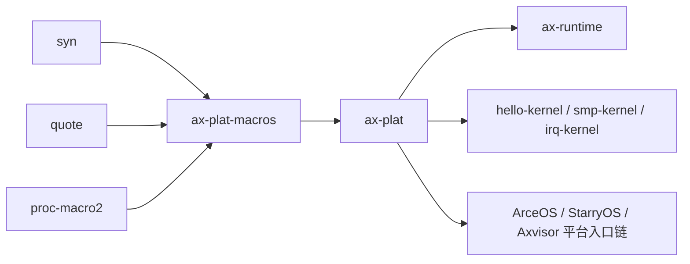

# `ax-plat-macros` 技术文档

> 路径：`components/axplat_crates/axplat-macros`
> 类型：过程宏库
> 分层：组件层 / 可复用基础组件
> 版本：`0.1.0`
> 文档依据：`Cargo.toml`、`README.md`、`src/lib.rs`

`ax-plat-macros` 是 `axplat` 体系的过程宏实现层。它的作用非常集中：一类宏把内核/运行时入口函数导出为固定符号名，另一类宏把 `axplat` 内部的平台 trait 接口转换成 `crate_interface` 风格的可调用分发表。这个 crate 本身几乎没有运行时逻辑，但它决定了平台入口契约和平台接口调用方式的生成语义。

## 1. 架构设计分析
### 1.1 设计定位
这个 crate 的定位不是“给所有人直接使用的宏工具箱”，而是 `axplat` 的内部宏后端：

- `main` / `secondary_main`：把运行时入口绑定到固定导出符号，服务平台早期引导。
- `def_plat_interface`：把平台 trait 接口接到 `crate_interface` 调用机制，服务运行期平台能力分发。
- 它本身不提供 `ax-percpu`、不负责板级初始化，也不包含任何硬件抽象实现。

`README.md` 也明确说明：通常不应直接依赖 `ax-plat-macros`，而应通过 `axplat` 间接使用。

### 1.2 宏入口划分
- `#[ax_plat::main]` 对应的底层过程宏 `main`：导出主核入口符号 `__axplat_main`。
- `#[ax_plat::secondary_main]` 对应的底层过程宏 `secondary_main`：导出从核入口符号 `__axplat_secondary_main`。
- `#[def_plat_interface]`：只在 `axplat` 内部使用，把 trait 变成 `def_interface + call_interface` 组合。

### 1.3 最关键的生成语义
#### `main` / `secondary_main`
这两个宏不会包装函数体，也不会生成额外入口逻辑，它们只做两件事：

1. 校验函数签名。
2. 在原函数上附加 `#[unsafe(export_name = "...")]`。

也就是说，宏的语义是“建立链接级契约”，而不是“建立运行时包装层”。

#### `def_plat_interface`
这个宏的生成结果包括三部分：

- 原始 trait 本身。
- trait 上附着 `crate::__priv::def_interface`。
- 为每个无 `self` 的 trait 方法生成同名自由函数，内部转发到 `crate::__priv::call_interface!(Trait::method, ...)`。

因此，`def_plat_interface` 把“平台 trait 定义”转成了“trait + 全局分发函数”双重接口模型，使 `ax_plat::console::putchar()` 这类调用可以像普通函数一样存在，同时底层仍由唯一的平台注册实现承接。

### 1.4 与 `axplat` 平台入口契约的关系
`axplat` 在运行期暴露 `call_main(cpu_id, arg)` 和可选 `call_secondary_main(cpu_id)`，而这些函数又声明会调用外部 Rust 符号：

- `__axplat_main(cpu_id, arg) -> !`
- `__axplat_secondary_main(cpu_id) -> !`

`ax-plat-macros` 的 `main` / `secondary_main` 正是负责把用户写的 Rust 函数导出成这两个固定符号。因此：

- 平台启动汇编或裸入口只需跳到 `ax_plat::call_main` / `call_secondary_main`。
- 运行时实现只需用 `#[ax_plat::main]` / `#[ax_plat::secondary_main]` 标记自己的入口函数。

这就是平台包与运行时之间的链接级耦合点。

### 1.5 与 `ax-percpu` 的边界
`ax-plat-macros` 不提供 `ax-percpu` 宏能力。`ax_plat::percpu` 使用的是单独的 `ax-percpu` crate。因此在文档中不能把 `ax-percpu` 初始化或 `#[ax_percpu::def_percpu]` 误归为 `ax-plat-macros` 的职责。

## 2. 核心功能说明
### 2.1 主要功能
- 为主核和次核入口建立固定导出符号名。
- 为 `axplat` 内部的平台 trait 接口生成统一的分发函数。
- 在编译期尽早拒绝错误签名或错误 trait 形态。

### 2.2 关键宏与使用场景
- `#[ax_plat::main]`：用于主核运行时入口函数。
- `#[ax_plat::secondary_main]`：用于 SMP 从核入口函数。
- `#[def_plat_interface]`：用于 `axplat` 自己定义 `InitIf`、`ConsoleIf`、`MemIf`、`TimeIf`、`PowerIf`、`IrqIf` 等平台接口。

### 2.3 典型使用方式
正常使用方式应当通过 `axplat` 提供的对外宏入口，而不是直接依赖 `ax-plat-macros`：

```rust
#[ax_plat::main]
fn rust_main(cpu_id: usize, arg: usize) -> ! {
    loop {}
}
```

## 3. 依赖关系图谱


### 3.1 关键直接依赖
- `syn`：解析函数和 trait 语法树。
- `quote`、`proc-macro2`：生成导出属性和分发函数代码。

### 3.2 关键直接消费者
- `axplat`：唯一最核心的直接消费者。对外 re-export `main` / `secondary_main`，对内使用 `def_plat_interface`。

### 3.3 间接消费者
- `ax-runtime`：通过 `#[ax_plat::main]` / `#[ax_plat::secondary_main]` 接入平台入口。
- `components/axplat_crates/examples/*`：最小平台样例。
- 通过 `axplat` 体系间接复用入口契约的 ArceOS、StarryOS 和 Axvisor 路径。

## 4. 开发指南
### 4.1 使用约束
1. `main` 目标函数必须精确符合 `fn(cpu_id: usize, arg: usize) -> !`。
2. `secondary_main` 目标函数必须精确符合 `fn(cpu_id: usize) -> !`。
3. 两者属性参数都必须为空。
4. `def_plat_interface` 只能作用于 trait，且 trait 方法不能带 `self`。

### 4.2 常见误用
- 误以为 `main` / `secondary_main` 会生成包装函数：实际上它们只附加导出符号。
- 在 trait 方法里带 `&self`、`&mut self` 或 receiver：`def_plat_interface` 会直接拒绝。
- 直接依赖 `ax-plat-macros`：虽然可以，但不符合设计意图，也会绕过 `axplat` 的封装边界。
- 写出“类型上等价但字符串不完全一致”的签名：当前实现基于 token 到字符串的比较，存在比真正类型系统更苛刻的签名判定。

### 4.3 开发建议
- 修改 `main` / `secondary_main` 的符号名时，要把它视为平台入口 ABI 级变更。
- 修改 `def_plat_interface` 的展开逻辑时，要同步检查 `ax_plat::__priv` 对 `crate_interface` 的再导出是否仍成立。
- 若未来要支持更复杂的 trait 语义，应先确认是否还适合继续维持“自由函数 + call_interface”模型。

## 5. 测试策略
### 5.1 当前测试形态
该 crate 目前几乎没有显式单元测试，更多依赖 doctest 片段和整个 `axplat` 体系的编译成功来间接验证。

### 5.2 单元测试重点
- 错误签名的 `main` / `secondary_main` 是否在编译期报错。
- `def_plat_interface` 对带 receiver 的 trait 方法是否拒绝。
- 展开后导出符号与 `call_interface` 调用路径是否符合预期。

### 5.3 集成测试重点
- 用 `hello-kernel` / `smp-kernel` 验证 `_start -> ax_plat::call_main -> __axplat_main` 链条。
- 用 `axplat` 内部 trait 接口验证 `def_plat_interface` 与 `impl_plat_interface` 的配合。

### 5.4 覆盖率要求
- 对 `ax-plat-macros`，重点不是运行时覆盖率，而是“宏展开语义覆盖率”。
- 至少要覆盖成功展开、编译期拒绝和链接契约成立三类路径。
- 任何修改导出符号或 trait 展开策略的变更，都应增加 compile-pass / compile-fail 级测试。

## 6. 跨项目定位分析
### 6.1 ArceOS
ArceOS 通过 `ax-runtime` 明确依赖 `#[ax_plat::main]` / `#[ax_plat::secondary_main]`，因此 `ax-plat-macros` 在 ArceOS 中承担的是“平台入口契约的宏实现层”。

### 6.2 StarryOS
StarryOS 并不直接面向 `ax-plat-macros` 编程，但只要复用同一套 `axplat` 平台栈，就会间接复用这层入口契约和平台接口展开逻辑。

### 6.3 Axvisor
Axvisor 同样不是直接依赖 `ax-plat-macros` 的业务代码，但在共享 `axplat` / `ax-hal` 体系时，会间接依赖这层宏生成的链接和接口约定。因此它在 Axvisor 中仍然是基础设施层，而不是业务层。
# `ax-plat-macros` 技术文档

> 路径：`components/axplat_crates/ax-plat-macros`
> 类型：过程宏库
> 分层：组件层 / 可复用基础组件
> 版本：`0.1.0`
> 文档依据：当前仓库源码、`Cargo.toml` 与 `components/axplat_crates/axplat-macros/README.md`

`ax-plat-macros` 的核心定位是：Procedural macros for the `axplat` crate

## 1. 架构设计分析
- 目录角色：可复用基础组件
- crate 形态：过程宏库
- 工作区位置：子工作区 `components/axplat_crates`
- feature 视角：该 crate 没有显式声明额外 Cargo feature，功能边界主要由模块本身决定。
- 关键数据结构：关键“结构”更多体现在编译期语法树节点、宏输入 token 流和展开规则上。
- 设计重心：该 crate 应从宏入口、语法树解析和展开产物理解，运行时模块树通常不长，但编译期接口契约很关键。

### 1.1 内部模块划分
- 当前 crate 未显式声明多个顶层 `mod`，复杂度更可能集中在单文件入口、宏展开或下层子 crate。

### 1.2 核心算法/机制
- 该 crate 的核心机制是过程宏展开、语法树转换或代码生成，重点在编译期接口契约而非运行时数据结构。

## 2. 核心功能说明
- 功能定位：Procedural macros for the `axplat` crate
- 对外接口：从源码可见的主要公开入口包括 `main`、`secondary_main`、`def_plat_interface`。
- 典型使用场景：供上游 crate 以属性宏、函数宏或派生宏形式调用，用来生成配置常量、接口绑定或样板代码。 这类接口往往不是运行时函数调用，而是编译期宏展开点。
- 关键调用链示例：典型调用链发生在编译期：宏入口先解析 token/参数，再生成目标 crate 需要的常量、实现或辅助代码。

## 3. 依赖关系图谱


### 3.1 直接与间接依赖
- `crate_interface`

### 3.2 间接本地依赖
- 未检测到额外的间接本地依赖，或依赖深度主要停留在第一层。

### 3.3 被依赖情况
- `axplat`

### 3.4 间接被依赖情况
- `arceos-affinity`
- `ax-helloworld`
- `ax-helloworld-myplat`
- `ax-httpclient`
- `ax-httpserver`
- `arceos-irq`
- `arceos-memtest`
- `arceos-parallel`
- `arceos-priority`
- `ax-shell`
- `arceos-sleep`
- `arceos-wait-queue`
- 另外还有 `37` 个同类项未在此展开

### 3.5 关键外部依赖
- `proc-macro2`
- `quote`
- `syn`

## 4. 开发指南
### 4.1 依赖配置
```toml
[dependencies]
ax-plat-macros = { workspace = true }

# 如果在仓库外独立验证，也可以显式绑定本地路径：
# ax-plat-macros = { path = "components/axplat_crates/ax-plat-macros" }
```

### 4.2 初始化流程
1. 在上游 crate 的 `Cargo.toml` 中添加该宏 crate 依赖。
2. 在类型定义、trait 接口或 API 注入点上应用宏，并核对输入语法是否满足宏约束。
3. 通过编译结果、展开代码和错误信息验证宏生成逻辑是否正确。

### 4.3 关键 API 使用提示
- 应优先识别宏名、输入语法约束和展开后会生成哪些符号，而不是只看辅助函数名。
- 优先关注函数入口：`main`、`secondary_main`、`def_plat_interface`。

## 5. 测试策略
### 5.1 当前仓库内的测试形态
- 当前 crate 目录中未发现显式 `tests/`/`benches/`/`fuzz/` 入口，更可能依赖上层系统集成测试或跨 crate 回归。

### 5.2 单元测试重点
- 建议覆盖语法树解析、输入约束检查和展开代码生成逻辑。

### 5.3 集成测试重点
- 建议增加 compile-pass / compile-fail 或 UI 测试，验证宏在真实调用 crate 中的展开行为。

### 5.4 覆盖率要求
- 覆盖率建议：宏入口、错误诊断和关键展开分支需要重点覆盖，必要时结合快照测试检查生成代码。

## 6. 跨项目定位分析
### 6.1 ArceOS
`ax-plat-macros` 主要通过 `arceos-affinity`、`ax-helloworld`、`ax-helloworld-myplat`、`ax-httpclient`、`ax-httpserver`、`arceos-irq` 等（另有 26 项） 等上层 crate 被 ArceOS 间接复用，通常处于更底层的公共依赖层。

### 6.2 StarryOS
`ax-plat-macros` 主要通过 `starry-kernel`、`starryos`、`starryos-test` 等上层 crate 被 StarryOS 间接复用，通常处于更底层的公共依赖层。

### 6.3 Axvisor
`ax-plat-macros` 主要通过 `axvisor` 等上层 crate 被 Axvisor 间接复用，通常处于更底层的公共依赖层。
