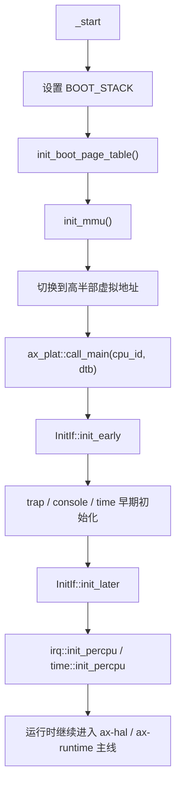
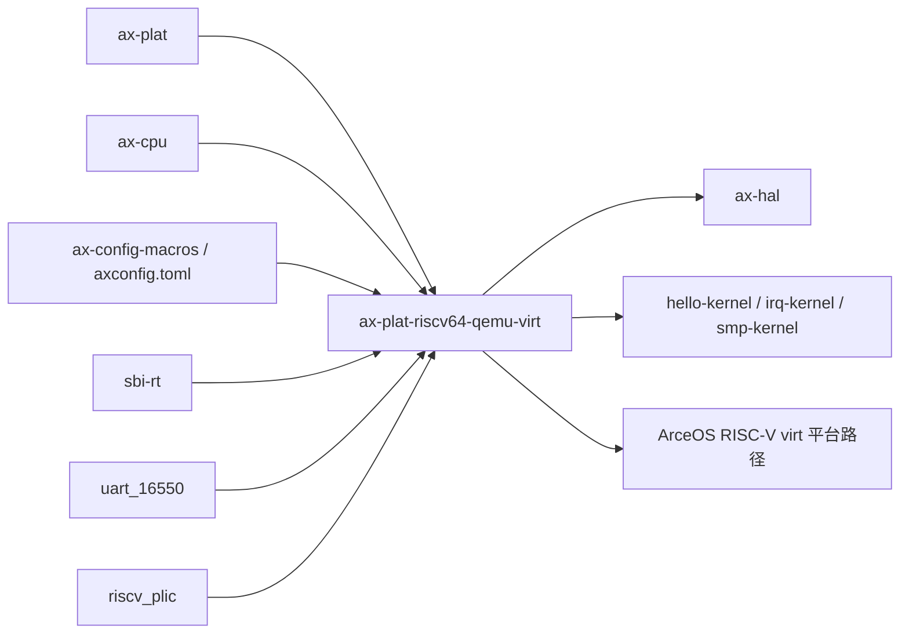
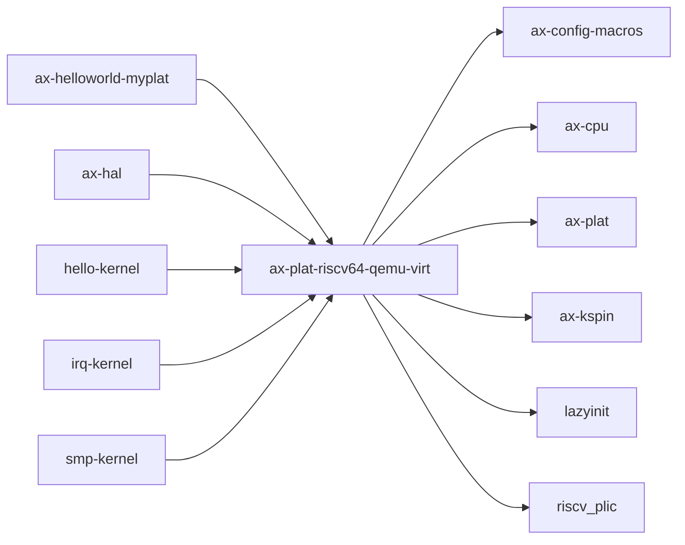

# `ax-plat-riscv64-qemu-virt` 技术文档

> 路径：`components/axplat_crates/platforms/axplat-riscv64-qemu-virt`
> 类型：库 crate
> 分层：组件层 / 可复用基础组件
> 版本：`0.3.1-pre.6`
> 文档依据：`Cargo.toml`、`README.md`、`src/lib.rs`、`src/boot.rs`、`src/init.rs`、`src/mem.rs`、`src/console.rs`、`src/time.rs`、`src/irq.rs`、`src/power.rs`

`ax-plat-riscv64-qemu-virt` 是 `axplat` 在 QEMU RISC-V `virt` 机型上的具体实现。它把 SBI、PLIC、UART、Goldfish RTC、固定物理内存布局以及多 hart 启动这些板级细节，整理成 `axplat` 约定的 `InitIf`、`MemIf`、`ConsoleIf`、`TimeIf`、`PowerIf` 和可选 `IrqIf` 接口，是 RISC-V 平台进入 ArceOS 运行时的第一层板级 glue。

## 1. 架构设计分析
### 1.1 设计定位
这个 crate 的核心职责不是实现通用 HAL，而是把 `virt` 板级假设固化为一套可被 `ax-hal` 和运行时稳定调用的接口：

- 向下，它直接面对 SBI、PLIC、16550 UART、Goldfish RTC 和固定的 MMIO/内存布局。
- 向上，它并不直接服务应用，而是通过 `axplat` trait 接口被 `ax-hal`、`ax-runtime` 和平台示例内核复用。
- 在启动期，它负责最早期页表、栈、MMU 与主核/从核入口桥接；在运行期，它继续承担时间、中断、控制台、电源和内存区间查询。

因此，`ax-plat-riscv64-qemu-virt` 应被理解为“RISC-V virt 板级 bring-up 实现”，而不是“可移植的架构抽象层”。

### 1.2 内部模块划分
- `src/lib.rs`：平台入口总装。定义 `config`、`rust_entry`、`rust_entry_secondary`，并汇总各个 `*IfImpl`。
- `src/boot.rs`：最早期启动路径。定义启动栈、静态 Sv39 页表、`_start` / `_start_secondary` 与 MMU 打开流程。
- `src/init.rs`：实现 `InitIf`，把早期 trap、串口、时间初始化和后期 per-CPU 初始化串接起来。
- `src/mem.rs`：实现 `MemIf`，定义物理内存范围、MMIO 区间、内核地址空间范围以及 `phys_to_virt` / `virt_to_phys`。
- `src/console.rs`：实现 `ConsoleIf`，通过 `uart_16550` 访问 NS16550 MMIO 串口。
- `src/time.rs`：实现 `TimeIf`，提供单调时间、可选墙钟偏移和可选 one-shot timer。
- `src/irq.rs`：在 `irq` feature 下实现 `IrqIf`，负责 PLIC 初始化、`scause` 分发、IPI 和定时器处理。
- `src/power.rs`：实现 `PowerIf`，提供关机、CPU 数查询和可选 HSM 启动从核逻辑。

### 1.3 关键数据结构与全局对象
- `BOOT_STACK`：主核启动栈，位于 `.bss.stack`。
- `BOOT_PT_SV39`：最早期静态页表，用 1GiB 大页把低地址与高半部虚拟地址窗口映射起来。
- `UART`：`LazyInit<SpinNoIrq<MmioSerialPort>>`，早期串口与运行期控制台共用。
- `PLIC`：`irq` 打开时的全局 PLIC 对象。
- `IRQ_HANDLER_TABLE`：按 IRQ 号索引的处理函数表。
- `TIMER_HANDLER` / `IPI_HANDLER`：定时器和 IPI 的注册入口。
- `RTC_EPOCHOFFSET_NANOS`：启用 `rtc` 时，用 Goldfish RTC 标定的墙钟偏移。

### 1.4 启动与初始化主线
主核路径由 `boot.rs` 和 `init.rs` 共同构成：



更具体地说：

1. `_start` 从引导器拿到 `hartid` 与 DTB 指针后，先建立启动栈。
2. `init_boot_page_table()` 构造最早期 Sv39 页表，把内核物理区和高半部虚拟地址窗口都映射出来。
3. `init_mmu()` 写 SATP、刷新 TLB，再把栈指针和入口跳转地址整体平移到高半部虚拟地址。
4. 跳入 `ax_plat::call_main()`，与上层 `#[ax_plat::main]` 标注的运行时入口契约衔接。
5. `InitIf::init_early()` 先做 trap、串口和时间源初始化；`InitIf::init_later()` 再做中断和 per-CPU 时间设施初始化。

### 1.5 中断、时钟、控制台与 SMP 机制
#### 中断
- 设备中断由 PLIC 管理，Supervisor context 按 `hart_id * 2 + 1` 选择。
- `IrqIf::handle()` 按 `scause` 区分 `S_TIMER`、`S_SOFT` 和 `S_EXT`：
  - `S_TIMER` 调定时器处理器。
  - `S_SOFT` 调 IPI 处理器并清 `sip.ssoft`。
  - `S_EXT` 通过 PLIC `claim` / `complete` 走设备 IRQ 分发。
- `set_enable()` 会区分“PLIC 外部中断线”和“本地定时器中断”。

#### 时钟
- 单调时间直接读 `time` CSR，再按 `TIMER_FREQUENCY` 换算。
- 启用 `irq` 时，one-shot timer 通过 `sbi_rt::set_timer()` 驱动。
- 启用 `rtc` 且配置了 `RTC_PADDR` 时，会读 Goldfish RTC 并写入 `RTC_EPOCHOFFSET_NANOS`，之后墙钟由“单调时间 + 偏移”合成。

#### 控制台
- 控制台基于 MMIO UART。
- 写 `\n` 时会展开成 `\r\n`，这是串口兼容性层面的细节，不应被上层重复实现。

#### SMP
- `PowerIf::cpu_boot()` 依赖 SBI HSM `hart_start` 启动从核。
- `_start_secondary` 与主核路径类似，但不再构建主页表，而是复用已有映射并跳到 `ax_plat::call_secondary_main()`。
- `cpu_num()` 不做动态探测，而是直接返回配置中的 `MAX_CPU_NUM`。

### 1.6 内存模型与平台假设
- 物理 RAM 区间主要由配置项定义，并未在当前实现里解析 DTB 来发现所有可用内存。
- `MMIO_RANGES` 中预定义了 UART、PLIC、RTC、VirtIO 和可选 PCI 等窗口。
- `phys_to_virt()` / `virt_to_phys()` 建立在线性 `PHYS_VIRT_OFFSET` 上，这意味着高半部直映关系是平台契约的一部分。

## 2. 核心功能说明
### 2.1 主要功能
- 提供主核/次核最早期入口与 MMU 打开逻辑。
- 向 `axplat` 注册平台初始化、控制台、时间、电源、内存和中断接口。
- 提供基于 PLIC 与 SBI 的中断、IPI 和 timer 支持。
- 提供 `virt` 机型的内存与 MMIO 布局描述。

### 2.2 关键 API 与使用场景
- `InitIfImpl`：供 `ax_plat::init::*` 和 `ax-hal` 启动路径调用。
- `MemIfImpl`：供 `ax-hal::mem` 查询 RAM、MMIO 和地址转换。
- `ConsoleIfImpl`：供日志和控制台输出使用。
- `TimeIfImpl`：供 `ax-hal::time` 与调度器 tick 路径使用。
- `PowerIfImpl`：供关机和 SMP bring-up 使用。
- `IrqIfImpl`：供 `ax-hal::irq` 注册、使能和分发中断。

### 2.3 典型使用方式
对绝大多数上层代码来说，这个 crate 不会被“直接调用”，而是作为所选平台包接入：

```toml
[dependencies]
ax-plat-riscv64-qemu-virt = { workspace = true, features = ["irq", "smp", "rtc"] }
```

在真正的 ArceOS 系统里，它通常进一步经 `ax-hal` 的平台选择或 `components/axplat_crates/examples/*` 的样例工程间接生效。

## 3. 依赖关系图谱


### 3.1 关键直接依赖
- `axplat`：平台 trait 定义与 `call_main` / `call_secondary_main` 契约。
- `ax-cpu`：RISC-V trap、CSR 和架构级辅助。
- `ax-config-macros`：把 `axconfig.toml` 注入为平台常量。
- `sbi-rt`：SBI 定时器、IPI 和 HSM 调用。
- `uart_16550`、`riscv_plic`、`riscv_goldfish`：对应串口、中断控制器和 RTC。

### 3.2 关键直接消费者
- `ax-hal`：在 RISC-V `virt` 平台选择中复用本 crate 的所有 `axplat` 实现。
- `components/axplat_crates/examples/*`：作为最小平台 bring-up 示例的底层平台包。
- ArceOS 栈中的 RISC-V 默认平台路径与 `helloworld-myplat` 等示例。

### 3.3 间接消费者
- 通过 `ax-hal` 间接运行在 RISC-V `virt` 上的 ArceOS 示例和测试。
- StarryOS 在 RISC-V 上的默认平台配置路径。
- Axvisor 依赖图中可能出现该包，但当前主 manifest 并不把它作为 RISC-V 主平台入口使用。

## 4. 开发指南
### 4.1 依赖配置
```toml
[dependencies]
ax-plat-riscv64-qemu-virt = { workspace = true, features = ["irq", "smp"] }
```

### 4.2 初始化与改动约束
1. 修改 `boot.rs` 时要把它视为“板级启动级变更”，特别是静态页表、栈布局和 `call_main` 跳转。
2. 修改 `mem.rs` 时要同步核对 `PHYS_VIRT_OFFSET`、内核虚拟地址窗口和 `MMIO_RANGES` 是否仍然匹配。
3. 修改 `irq.rs` 时要同时验证 PLIC、SBI timer 和 IPI 三条路径，不要只测设备中断。
4. 若准备改成解析 DTB 获取可用内存，应把这视为高风险设计变更，而不是简单重构。

### 4.3 关键开发建议
- 早期 bring-up 代码应尽量保持无分配、无复杂依赖。
- 平台实现里出现的 `PHYS_VIRT_OFFSET`、`MAX_CPU_NUM`、`RTC_PADDR` 等不只是配置值，而是运行时假设。
- 对于使用者，优先通过 `ax-hal` / `axplat` 接口消费该平台能力，而不是直接调用具体实现模块。

## 5. 测试策略
### 5.1 当前测试形态
该 crate 主要依赖交叉编译检查和平台集成运行验证，而不是 crate 内单元测试。

### 5.2 单元测试重点
- 纯函数级逻辑较少，重点在地址换算、配置派生和中断编号/上下文索引这类可静态验证的逻辑。
- 对 `config` 生成结果和 `PACKAGE` 一致性应保留编译期校验。

### 5.3 集成测试重点
- 使用 `hello-kernel`、`irq-kernel`、`smp-kernel` 验证主核 bring-up、中断和多 hart 启动。
- 在启用 `rtc` 时验证 `wall_time` 路径是否正确。
- 在 `irq` + `smp` 组合下验证 IPI、timer 和 PLIC 外部中断是否都能工作。

### 5.4 覆盖率要求
- 对平台 crate，重点不是行覆盖率，而是 bring-up 场景覆盖率。
- 至少要覆盖启动、控制台、时间、中断和多核这五条主线中的对应 feature 组合。
- 任何改动启动页表、SBI 调用或物理内存区间的提交，都应要求真实 QEMU 集成验证。

## 6. 跨项目定位分析
### 6.1 ArceOS
这是 ArceOS 在 RISC-V QEMU `virt` 机型上的关键平台包之一。它通过 `ax-hal` 接到运行时，是 RISC-V 版本 ArceOS 从启动到中断、时间、SMP 的板级基座。

### 6.2 StarryOS
StarryOS 在 RISC-V 默认平台配置里会复用这条 `axplat` 路径。因此它在 StarryOS 中承担的是“RISC-V 板级实现层”，而不是 Linux 兼容语义层。

### 6.3 Axvisor
当前仓库中 Axvisor 的主 manifest 并未把该包作为主平台包直接依赖，因此它在 Axvisor 中更多是“依赖图可见的可选 RISC-V 平台实现”，而不是已经稳定落地的主运行平台。
# `ax-plat-riscv64-qemu-virt` 技术文档

> 路径：`components/axplat_crates/platforms/axplat-riscv64-qemu-virt`
> 类型：库 crate
> 分层：组件层 / 可复用基础组件
> 版本：`0.3.1-pre.6`
> 文档依据：当前仓库源码、`Cargo.toml` 与 `components/axplat_crates/platforms/axplat-riscv64-qemu-virt/README.md`

`ax-plat-riscv64-qemu-virt` 的核心定位是：Implementation of `axplat` hardware abstraction layer for QEMU RISC-V virt board.

## 1. 架构设计分析
- 目录角色：可复用基础组件
- crate 形态：库 crate
- 工作区位置：子工作区 `components/axplat_crates`
- feature 视角：主要通过 `fp-simd`、`irq`、`rtc`、`smp` 控制编译期能力装配。
- 关键数据结构：可直接观察到的关键数据结构/对象包括 `ConsoleIfImpl`、`InitIfImpl`、`IrqIfImpl`、`MemIfImpl`、`PowerImpl`、`TimeIfImpl`、`UART`、`TIMER_HANDLER`、`IPI_HANDLER`。
- 设计重心：该 crate 的重心通常是板级假设、条件编译矩阵和启动时序，阅读时应优先关注架构/平台绑定点。

### 1.1 内部模块划分
- `boot`：早期启动与引导协作逻辑
- `console`：控制台输出与终端交互
- `init`：初始化顺序与全局状态建立
- `irq`：IRQ 注册、屏蔽与派发路径（按 feature: irq 条件启用）
- `mem`：物理/虚拟内存描述与地址转换
- `power`：内部子模块
- `time`：时钟、定时器与时间转换逻辑

### 1.2 核心算法/机制
- 该 crate 以平台初始化、板级寄存器配置和硬件能力接线为主，算法复杂度次于时序与寄存器语义正确性。
- 初始化顺序控制与全局状态建立
- 中断注册、派发和屏蔽控制

## 2. 核心功能说明
- 功能定位：Implementation of `axplat` hardware abstraction layer for QEMU RISC-V virt board.
- 对外接口：从源码可见的主要公开入口包括 `ConsoleIfImpl`、`InitIfImpl`、`IrqIfImpl`、`MemIfImpl`、`PowerImpl`、`TimeIfImpl`。
- 典型使用场景：承担架构/板级适配职责，为上层运行时提供启动、中断、时钟、串口、设备树和内存布局等基础能力。
- 关键调用链示例：按当前源码布局，常见入口/初始化链可概括为 `init_boot_page_table()` -> `init_mmu()` -> `init_early()` -> `init_early_secondary()` -> `init_later()` -> ...。

## 3. 依赖关系图谱


### 3.1 直接与间接依赖
- `ax-config-macros`
- `ax-cpu`
- `axplat`
- `ax-kspin`
- `lazyinit`
- `riscv_plic`

### 3.2 间接本地依赖
- `axbacktrace`
- `ax-config-gen`
- `ax-errno`
- `ax-plat-macros`
- `crate_interface`
- `ax-handler-table`
- `kernel_guard`
- `memory_addr`
- `ax-page-table-entry`
- `ax-page-table-multiarch`
- `ax-percpu`
- `percpu_macros`

### 3.3 被依赖情况
- `ax-helloworld-myplat`
- `ax-hal`
- `hello-kernel`
- `irq-kernel`
- `smp-kernel`

### 3.4 间接被依赖情况
- `arceos-affinity`
- `ax-helloworld`
- `ax-httpclient`
- `ax-httpserver`
- `arceos-irq`
- `arceos-memtest`
- `arceos-parallel`
- `arceos-priority`
- `ax-shell`
- `arceos-sleep`
- `arceos-wait-queue`
- `arceos-yield`
- 另外还有 `22` 个同类项未在此展开

### 3.5 关键外部依赖
- `log`
- `riscv`
- `riscv_goldfish`
- `sbi-rt`
- `uart_16550`

## 4. 开发指南
### 4.1 依赖配置
```toml
[dependencies]
ax-plat-riscv64-qemu-virt = { workspace = true }

# 如果在仓库外独立验证，也可以显式绑定本地路径：
# ax-plat-riscv64-qemu-virt = { path = "components/axplat_crates/platforms/axplat-riscv64-qemu-virt" }
```

### 4.2 初始化流程
1. 先确认目标架构、板型和外设假设，再检查 feature/cfg 是否能选中正确的平台实现。
2. 修改平台代码时优先验证启动、串口、中断、时钟和内存布局这些 bring-up 基线能力。
3. 若涉及设备树或 MMIO 基址变化，需同步验证上层驱动和运行时是否仍能正确接线。

### 4.3 关键 API 使用提示
- 上下文/对象类型通常从 `ConsoleIfImpl`、`InitIfImpl`、`IrqIfImpl`、`MemIfImpl`、`PowerImpl`、`TimeIfImpl` 等结构开始。

## 5. 测试策略
### 5.1 当前仓库内的测试形态
- 当前 crate 目录中未发现显式 `tests/`/`benches/`/`fuzz/` 入口，更可能依赖上层系统集成测试或跨 crate 回归。

### 5.2 单元测试重点
- 若存在纯函数或配置辅助逻辑，可覆盖地址布局计算、设备树解析和平台参数选择分支。

### 5.3 集成测试重点
- 重点验证启动、串口、中断、时钟和内存布局等 bring-up 基线能力，必要时覆盖多板级/多架构。

### 5.4 覆盖率要求
- 覆盖率建议以平台场景覆盖为主：至少确保一条真实启动链贯通，并覆盖关键 cfg/feature 组合。

## 6. 跨项目定位分析
### 6.1 ArceOS
`ax-plat-riscv64-qemu-virt` 不在 ArceOS 目录内部，但被 `ax-helloworld-myplat`、`ax-hal` 等 ArceOS crate 直接依赖，说明它是该系统的共享构件或底层服务。

### 6.2 StarryOS
`ax-plat-riscv64-qemu-virt` 主要通过 `starry-kernel`、`starryos`、`starryos-test` 等上层 crate 被 StarryOS 间接复用，通常处于更底层的公共依赖层。

### 6.3 Axvisor
`ax-plat-riscv64-qemu-virt` 主要通过 `axvisor` 等上层 crate 被 Axvisor 间接复用，通常处于更底层的公共依赖层。
