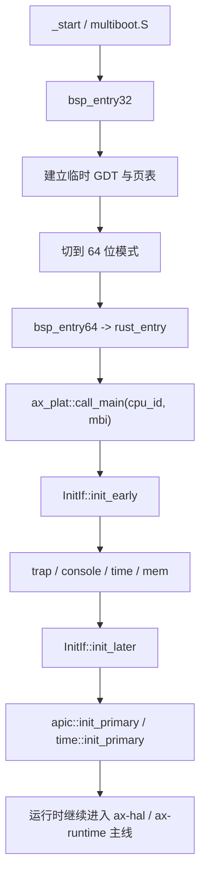
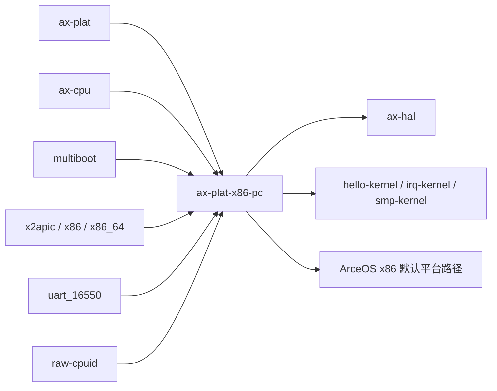
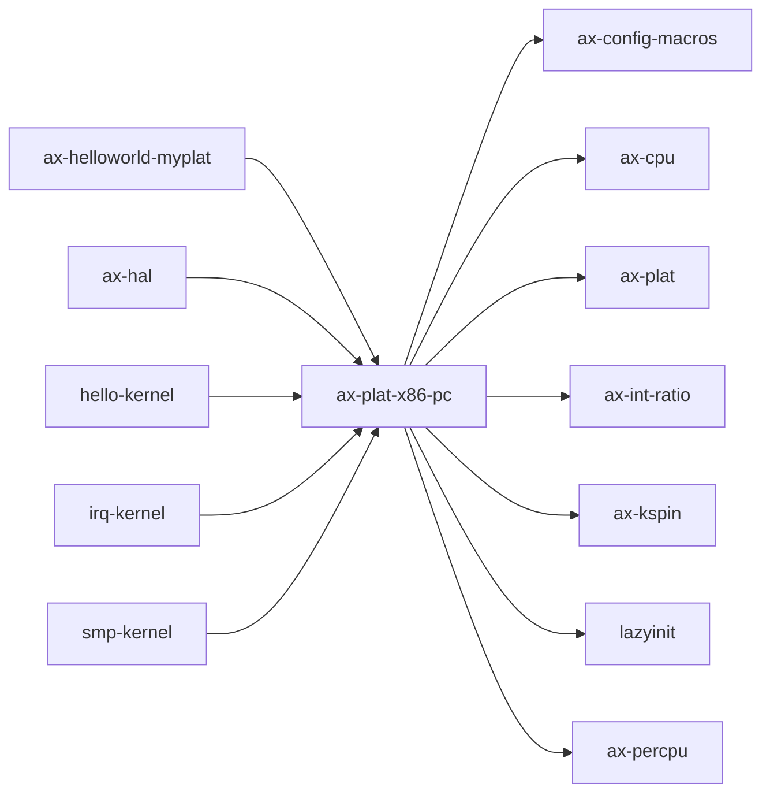

# `ax-plat-x86-pc` 技术文档

> 路径：`components/axplat_crates/platforms/axplat-x86-pc`
> 类型：库 crate
> 分层：组件层 / 可复用基础组件
> 版本：`0.3.1-pre.6`
> 文档依据：`Cargo.toml`、`README.md`、`src/lib.rs`、`src/boot.rs`、`src/init.rs`、`src/mem.rs`、`src/console.rs`、`src/time.rs`、`src/apic.rs`、`src/mp.rs`、`src/power.rs`、`src/multiboot.S`

`ax-plat-x86-pc` 是 `axplat` 在 x86 Standard PC / Multiboot 场景上的平台实现。它把 Multiboot 引导、临时页表、COM1 串口、TSC、LAPIC/IOAPIC、多核启动以及 PC 风格电源控制整合成 `axplat` 约定的接口，是 ArceOS x86 默认平台路径中的经典板级实现。

## 1. 架构设计分析
### 1.1 设计定位
这个 crate 的职责非常聚焦：

- 它是 x86 PC 机型的 `axplat` 实现，而不是通用 x86 抽象层。
- 它负责把 Multiboot 入口、APIC 中断体系、TSC 时间源和 RAM/MMIO 解析组织成上层可调用的接口。
- 它把最早期引导与后续运行期平台服务放在同一 crate 中，使 `ax-hal` 与 `ax-runtime` 可以通过统一接口消费。

因此，`ax-plat-x86-pc` 的价值在于“把经典 PC 平台假设精确定义出来”，而不是“适配所有 x86 机器”。

### 1.2 内部模块划分
- `src/lib.rs`：平台入口总装。定义 `rust_entry` / `rust_entry_secondary`，并汇总各个 `*IfImpl`。
- `src/boot.rs`：Multiboot 常量、启动栈、CR0/CR4/EFER 设置等最早期引导辅助。
- `src/multiboot.S`：真正的 `_start` 汇编入口，从 32 位准备进入 64 位并调用 Rust。
- `src/init.rs`：实现 `InitIf`，组织 trap、console、time、mem 与 APIC 初始化时序。
- `src/console.rs`：实现 `ConsoleIf`，基于 COM1 串口。
- `src/mem.rs`：解析 Multiboot 内存图，构造可用 RAM 区间与 MMIO 区间。
- `src/time.rs`：实现 `TimeIf`，以 TSC 为单调时间源，可选使用 RTC 标定墙钟。
- `src/apic.rs`：LAPIC、IOAPIC 与 `IrqIf` 的核心实现。
- `src/mp.rs`：在 `smp` 下负责 AP 启动页、INIT-SIPI-SIPI 流程与 secondary boot glue。
- `src/power.rs`：实现关机和可选的 AP 启动入口。

### 1.3 关键数据结构与全局对象
- `BOOT_STACK`：BSP 的最早期启动栈。
- `RAM_REGIONS`：通过 Multiboot 解析出的可用物理内存区域。
- `COM1`：`SpinNoIrq<SerialPort>`，平台控制台。
- `LOCAL_APIC`、`IO_APIC`：中断控制核心对象。
- `IRQ_HANDLER_TABLE`：IRQ 分发表。
- `INIT_TICK`、`CPU_FREQ_MHZ`：TSC 单调时间换算基准。
- `RTC_EPOCHOFFSET_NANOS`：启用 `rtc` 时用于墙钟的偏移。
- `NANOS_TO_LAPIC_TICKS_RATIO`：启用 `irq` 时 one-shot 定时器的 tick 比例。

### 1.4 启动与初始化主线
主核启动链横跨 `multiboot.S`、`boot.rs` 与 `init.rs`：



按实现细节看：

1. `_start` 接收 Multiboot 魔数和信息指针，先在 32 位环境下准备 GDT、页表和模式切换。
2. 进入 64 位后，把 BSP 栈切到 `BOOT_STACK` 顶，再调用 `rust_entry`。
3. `rust_entry` 校验 Multiboot 魔数后，通过 `ax_plat::call_main(current_cpu_id(), mbi)` 与上层 `#[ax_plat::main]` 契约衔接。
4. `InitIf::init_early()` 初始化 trap、串口、时间源和内存区。
5. `InitIf::init_later()` 则进一步初始化 APIC 与 per-CPU 时间设施。

### 1.5 中断、时间、控制台与 SMP 机制
#### 中断
- `irq` 打开时，平台会屏蔽 8259 PIC，改由 LAPIC + IOAPIC 接管。
- `IrqIf::handle()` 会通过 `IRQ_HANDLER_TABLE` 分发，并在最后发 EOI。
- 对于 LAPIC 自己的向量（例如定时器），不会走普通 IOAPIC enable/disable 路径。
- IPI 路径通过 LAPIC / x2APIC 完成，支持 self、指定 CPU 和 broadcast。

#### 时间
- 单调时间以 TSC 为核心，通过 `INIT_TICK` 和 `CPU_FREQ_MHZ` 转换为纳秒。
- `irq` 打开时使用 LAPIC one-shot timer 实现定时中断。
- `rtc` 打开时，用 `x86_rtc` 读取墙钟并与 TSC 建立偏移关系。

#### 控制台
- 平台控制台固定为 COM1（0x3f8）。
- 这是 x86 最早期 bring-up 最可靠的调试出口，因此初始化顺序必须非常靠前。

#### SMP
- `mp.rs` 负责构造 AP 启动页，把启动代码复制到固定低地址页，再通过 INIT-SIPI-SIPI 启动 AP。
- AP 进入长模式后会调用 `rust_entry_secondary`，再经 `ax_plat::call_secondary_main()` 衔接运行时。
- `PowerIf::cpu_boot()` 本质上是对这套 AP bring-up 的上层封装。

### 1.6 内存模型与平台假设
- RAM 区间来自 Multiboot 内存图，但会保留低 1MiB，不把它当成普通可用内存。
- MMIO 区间由配置项给出，典型包括 IOAPIC、LAPIC、HPET、PCI 等窗口。
- `phys_to_virt` / `virt_to_phys` 建立在线性 `PHYS_VIRT_OFFSET` 上，因此高半部偏移是平台契约的一部分。
- 当前启动页表使用 1GiB 大页，这对某些宿主虚拟化后端有兼容性注意事项。

## 2. 核心功能说明
### 2.1 主要功能
- 提供 Multiboot 到 `ax_plat::call_main()` 的最早期引导桥接。
- 提供基于 COM1 的平台控制台。
- 提供基于 TSC 和可选 RTC 的时间接口。
- 提供基于 LAPIC / IOAPIC 的中断与 IPI 支持。
- 提供 x86 PC 场景下的 RAM、MMIO、SMP 和电源控制接口。

### 2.2 关键 API 与使用场景
- `InitIfImpl`：被 `ax-hal` / `ax-runtime` 在启动时调用。
- `ConsoleIfImpl`：日志和控制台输出的基础。
- `MemIfImpl`：为内核内存管理提供 RAM/MMIO 描述。
- `TimeIfImpl`：为调度器、sleep 和 wall time 提供时间源。
- `IrqIfImpl`：为 IRQ 注册和分发提供平台落点。
- `PowerIfImpl`：供关机和 AP 启动使用。

### 2.3 典型使用方式
和其他平台包一样，它通常不是“业务代码直接依赖”的对象，而是平台选择的一部分：

```toml
[dependencies]
ax-plat-x86-pc = { workspace = true, features = ["irq", "smp", "rtc"] }
```

在 ArceOS/StarryOS 的常见 x86 构建路径里，这个选择通常由 `ax-hal` 的平台 feature 或 make/xtask 的平台包变量进一步驱动。

## 3. 依赖关系图谱


### 3.1 关键直接依赖
- `axplat`：提供平台 trait 与 `call_main` / `call_secondary_main` 契约。
- `ax-cpu`：trap 和 per-CPU 初始化相关能力。
- `multiboot`：解析引导信息。
- `x2apic`、`x86`、`x86_64`：APIC、寄存器和架构级辅助。
- `uart_16550`、`raw-cpuid`、可选 `x86_rtc`：对应控制台、CPU 频率信息和墙钟。

### 3.2 关键直接消费者
- `ax-hal`：在 x86 PC 场景下复用本 crate 的 `axplat` 实现。
- `components/axplat_crates/examples/*`：最小平台样例。
- ArceOS 和 StarryOS 的 x86 默认平台路径。

### 3.3 间接消费者
- 通过 `ax-hal` 运行在 Standard PC 环境上的 ArceOS 样例与测试。
- StarryOS 的 x86 平台 bring-up。
- Axvisor 的依赖图中可能出现该包，但主 x86 平台更偏向 `axplat-x86-qemu-q35`。

## 4. 开发指南
### 4.1 依赖配置
```toml
[dependencies]
ax-plat-x86-pc = { workspace = true, features = ["irq", "smp"] }
```

### 4.2 初始化与改动约束
1. 修改 `multiboot.S`、`boot.rs` 或页表建立逻辑时，应视为最早期引导级变更。
2. 修改 `mem.rs` 时要同步验证 Multiboot 内存图解析、低 1MiB 保留和 MMIO 配置是否仍一致。
3. 修改 `apic.rs` 时要同时验证 LAPIC、IOAPIC、IPI 与 timer 路径，不要只看普通 IRQ。
4. 修改 `time.rs` 时要注意 TSC 频率来源和 LAPIC tick 比例，避免 wall time 与 timer 路径失配。

### 4.3 关键开发建议
- COM1 初始化必须足够早，否则最早期调试会失去唯一稳定出口。
- `cpu_boot()`、`rust_entry_secondary()` 与 `mp.rs` 的启动页布局是一套强约束组合，不能分开改。
- 对 x86 PC 场景之外的机器，应优先考虑是否应该新建平台包，而不是继续在本 crate 内堆特判。

## 5. 测试策略
### 5.1 当前测试形态
该 crate 主要依赖交叉编译检查和 QEMU/平台示例验证，而不是 crate 内单元测试。

### 5.2 单元测试重点
- 多为配置、地址换算和向量编号这类可静态验证逻辑。
- 对启动路径中的结构布局和符号契约，优先考虑编译期断言和最小样例验证。

### 5.3 集成测试重点
- `hello-kernel`：验证 Multiboot 启动、串口和最小 bring-up。
- `irq-kernel`：验证 IOAPIC/LAPIC 中断路径。
- `smp-kernel`：验证 AP 启动与 secondary path。
- 启用 `rtc` 时验证 wall time 路径。

### 5.4 覆盖率要求
- 对平台 crate，重点是 bring-up 场景覆盖。
- 至少应覆盖启动、串口、中断、时间和 SMP 五条主线对应的 feature 组合。
- 任何涉及启动页表、APIC 配置或 Multiboot 内存解析的改动，都应要求真实平台或 QEMU 集成回归。

## 6. 跨项目定位分析
### 6.1 ArceOS
`ax-plat-x86-pc` 是 ArceOS 在传统 x86 PC / Multiboot 场景上的关键平台包之一。它把 x86 bring-up 的复杂度收束进 `axplat` 接口，是 x86 版本 ArceOS 的板级基座。

### 6.2 StarryOS
StarryOS 在 x86 默认平台路径中也会复用这条 `axplat` 实现。因此它在 StarryOS 中承担的是板级 bring-up 与平台设施角色，而不是 Linux 兼容语义层。

### 6.3 Axvisor
Axvisor 的主 x86 manifest 更明确地偏向 `axplat-x86-qemu-q35`，因此 `ax-plat-x86-pc` 在 Axvisor 中更适合作为“通用 PC / Multiboot 参考实现”来理解，而不是其当前主平台实现。
# `ax-plat-x86-pc` 技术文档

> 路径：`components/axplat_crates/platforms/axplat-x86-pc`
> 类型：库 crate
> 分层：组件层 / 可复用基础组件
> 版本：`0.3.1-pre.6`
> 文档依据：当前仓库源码、`Cargo.toml` 与 `components/axplat_crates/platforms/axplat-x86-pc/README.md`

`ax-plat-x86-pc` 的核心定位是：Implementation of `axplat` hardware abstraction layer for x86 Standard PC machine.

## 1. 架构设计分析
- 目录角色：可复用基础组件
- crate 形态：库 crate
- 工作区位置：子工作区 `components/axplat_crates`
- feature 视角：主要通过 `fp-simd`、`irq`、`reboot-on-system-off`、`rtc`、`smp` 控制编译期能力装配。
- 关键数据结构：可直接观察到的关键数据结构/对象包括 `IrqIfImpl`、`ConsoleIfImpl`、`InitIfImpl`、`MemIfImpl`、`PowerImpl`、`TimeIfImpl`、`APIC_TIMER_VECTOR`、`APIC_SPURIOUS_VECTOR`、`APIC_ERROR_VECTOR`、`IO_APIC_BASE`。
- 设计重心：该 crate 的重心通常是板级假设、条件编译矩阵和启动时序，阅读时应优先关注架构/平台绑定点。

### 1.1 内部模块划分
- `apic`：Advanced Programmable Interrupt Controller (APIC) support
- `boot`：Kernel booting using multiboot header
- `console`：Uart 16550 serial port
- `init`：初始化顺序与全局状态建立
- `mem`：Physical memory information
- `power`：Power management
- `time`：Time management. Currently, the TSC is used as the clock source
- `mp`：Multi-processor booting（按 feature: smp 条件启用）

### 1.2 核心算法/机制
- 该 crate 以平台初始化、板级寄存器配置和硬件能力接线为主，算法复杂度次于时序与寄存器语义正确性。
- 初始化顺序控制与全局状态建立

## 2. 核心功能说明
- 功能定位：Implementation of `axplat` hardware abstraction layer for x86 Standard PC machine.
- 对外接口：从源码可见的主要公开入口包括 `set_enable`、`local_apic`、`raw_apic_id`、`init_primary`、`init_secondary`、`putchar`、`getchar`、`init`、`IrqIfImpl`、`ConsoleIfImpl` 等（另有 4 个公开入口）。
- 典型使用场景：承担架构/板级适配职责，为上层运行时提供启动、中断、时钟、串口、设备树和内存布局等基础能力。
- 关键调用链示例：按当前源码布局，常见入口/初始化链可概括为 `init_primary()` -> `init_secondary()` -> `register()` -> `init()` -> `init_early()` -> ...。

## 3. 依赖关系图谱


### 3.1 直接与间接依赖
- `ax-config-macros`
- `ax-cpu`
- `axplat`
- `ax-int-ratio`
- `ax-kspin`
- `lazyinit`
- `ax-percpu`

### 3.2 间接本地依赖
- `axbacktrace`
- `ax-config-gen`
- `ax-errno`
- `ax-plat-macros`
- `crate_interface`
- `ax-handler-table`
- `kernel_guard`
- `memory_addr`
- `ax-page-table-entry`
- `ax-page-table-multiarch`
- `percpu_macros`

### 3.3 被依赖情况
- `ax-helloworld-myplat`
- `ax-hal`
- `hello-kernel`
- `irq-kernel`
- `smp-kernel`

### 3.4 间接被依赖情况
- `arceos-affinity`
- `ax-helloworld`
- `ax-httpclient`
- `ax-httpserver`
- `arceos-irq`
- `arceos-memtest`
- `arceos-parallel`
- `arceos-priority`
- `ax-shell`
- `arceos-sleep`
- `arceos-wait-queue`
- `arceos-yield`
- 另外还有 `22` 个同类项未在此展开

### 3.5 关键外部依赖
- `bitflags`
- `heapless`
- `log`
- `multiboot`
- `raw-cpuid`
- `uart_16550`
- `x2apic`
- `x86`
- `x86_64`
- `x86_rtc`

## 4. 开发指南
### 4.1 依赖配置
```toml
[dependencies]
ax-plat-x86-pc = { workspace = true }

# 如果在仓库外独立验证，也可以显式绑定本地路径：
# ax-plat-x86-pc = { path = "components/axplat_crates/platforms/axplat-x86-pc" }
```

### 4.2 初始化流程
1. 先确认目标架构、板型和外设假设，再检查 feature/cfg 是否能选中正确的平台实现。
2. 修改平台代码时优先验证启动、串口、中断、时钟和内存布局这些 bring-up 基线能力。
3. 若涉及设备树或 MMIO 基址变化，需同步验证上层驱动和运行时是否仍能正确接线。

### 4.3 关键 API 使用提示
- 优先关注函数入口：`set_enable`、`local_apic`、`raw_apic_id`、`init_primary`、`init_secondary`、`putchar`、`getchar`、`init` 等（另有 2 项）。
- 上下文/对象类型通常从 `IrqIfImpl`、`ConsoleIfImpl`、`InitIfImpl`、`MemIfImpl`、`PowerImpl`、`TimeIfImpl` 等结构开始。

## 5. 测试策略
### 5.1 当前仓库内的测试形态
- 当前 crate 目录中未发现显式 `tests/`/`benches/`/`fuzz/` 入口，更可能依赖上层系统集成测试或跨 crate 回归。

### 5.2 单元测试重点
- 若存在纯函数或配置辅助逻辑，可覆盖地址布局计算、设备树解析和平台参数选择分支。

### 5.3 集成测试重点
- 重点验证启动、串口、中断、时钟和内存布局等 bring-up 基线能力，必要时覆盖多板级/多架构。

### 5.4 覆盖率要求
- 覆盖率建议以平台场景覆盖为主：至少确保一条真实启动链贯通，并覆盖关键 cfg/feature 组合。

## 6. 跨项目定位分析
### 6.1 ArceOS
`ax-plat-x86-pc` 不在 ArceOS 目录内部，但被 `ax-helloworld-myplat`、`ax-hal` 等 ArceOS crate 直接依赖，说明它是该系统的共享构件或底层服务。

### 6.2 StarryOS
`ax-plat-x86-pc` 主要通过 `starry-kernel`、`starryos`、`starryos-test` 等上层 crate 被 StarryOS 间接复用，通常处于更底层的公共依赖层。

### 6.3 Axvisor
`ax-plat-x86-pc` 主要通过 `axvisor` 等上层 crate 被 Axvisor 间接复用，通常处于更底层的公共依赖层。
