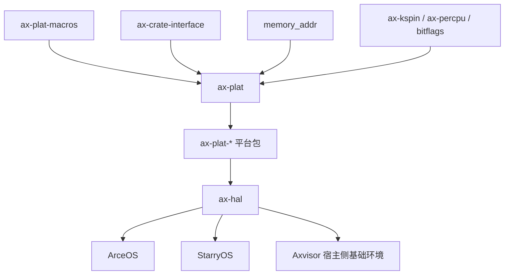

# `ax-plat` 技术文档

> 路径：`components/axplat_crates/axplat`
> 类型：库 crate
> 分层：组件层 / 平台抽象
> 版本：`0.3.1-pre.6`
> 文档依据：当前仓库源码、`Cargo.toml` 与 `components/axplat_crates/axplat/README.md`

`ax-plat` 不是某个具体板级平台的驱动集合，而是 ArceOS 平台层对上层内核暴露的统一契约包。它把“平台初始化、物理内存描述、控制台、时间、中断、电源、每核上下文”等能力拆成稳定接口；具体 `ax-plat-*` 平台包通过 `ax-crate-interface` 机制填充实现，内核只面向 `ax-plat` 编程，而不直接依赖某个 UART、GIC、APIC 或 PSCI/SBI 实现。

## 1. 架构设计分析

### 1.1 设计目标

`ax-plat` 的核心目标是把“平台相关代码”从“内核主体逻辑”中剥离出来，并提供一组足够小、但覆盖启动期关键路径的接口：

- 启动期：把平台引导代码与内核入口解耦，统一收敛到 `ax_plat::call_main()` 与 `#[ax_plat::main]`。
- 运行期：让时钟、串口、中断、电源管理等能力通过统一 trait 访问。
- 构建期：让同一套内核代码可以通过切换 `ax-plat-*` 平台包复用到 QEMU、物理板卡和教学实验平台。
- 演进期：通过 trait 边界保持上层稳定，使新增平台主要表现为“实现接口”而非“修改内核”。

这意味着 `ax-plat` 本身几乎不直接操作硬件寄存器；它真正提供的是“稳定调用面”和“平台实现接入框架”。

### 1.2 模块划分

| 模块 | 作用 | 关键内容 |
| --- | --- | --- |
| `lib.rs` | crate 根与导出层 | `main` / `secondary_main` 宏导出、`call_main()`、`call_secondary_main()`、`impl_plat_interface`、`assert_str_eq!` |
| `init` | 平台初始化契约 | `InitIf`，约束早期/后期、主核/次核初始化顺序 |
| `console` | 统一控制台接口 | `ConsoleIf`、`console_print!`、`CONSOLE_LOCK` |
| `time` | 时间与定时器接口 | `TimeIf`、`monotonic_time()`、`wall_time()`、`busy_wait()` |
| `mem` | 物理内存描述与辅助算法 | `MemIf`、`MemRegionFlags`、`PhysMemRegion`、区间差集与重叠检查 |
| `power` | 电源与 CPU 启停接口 | `PowerIf`，涵盖 `system_off()`、`cpu_boot()`、`cpu_num()` |
| `irq` | 中断控制抽象 | `IrqIf`、`IrqHandler`、`IpiTarget`、`HandlerTable` |
| `ax-percpu` | 每核辅助状态 | `CPU_ID`、`IS_BSP` 以及主核/次核 ax-percpu 初始化 |

这种划分有两个明显特点：

- `ax-plat` 把真正“必须跨平台统一”的部分收敛到几个小 trait，不试图抽象完整驱动栈。
- `ax-percpu`、`mem` 中包含少量公共算法与状态容器，因此它不只是接口定义包，也承担平台层公共工具箱的职责。

### 1.3 关键数据结构与接口契约

#### `InitIf`

`InitIf` 是平台 bring-up 的第一条主线，明确区分：

- `init_early(cpu_id, arg)`：早期初始化，要求在异常向量、早期串口、时间源等最小环境建立后返回。
- `init_later(cpu_id, arg)`：后期初始化，留给中断控制器、定时器使能、其它必要外设。
- `init_early_secondary()` / `init_later_secondary()`：在 `smp` 打开时补充次核路径。

这让平台包与内核对初始化阶段的理解保持一致，避免把所有初始化逻辑塞进一个不可分解的入口函数。

#### `MemIf`

`MemIf` 决定了上层如何理解平台物理内存布局：

- `phys_ram_ranges()` 提供可用 RAM 区间。
- `reserved_phys_ram_ranges()` 提供需要保留但仍需映射的区间。
- `mmio_ranges()` 提供设备寄存器窗口。
- `phys_to_virt()` / `virt_to_phys()` 建立线性映射语义。
- `kernel_aspace()` 提供内核地址空间基址与大小。

配套的数据结构包括：

- `MemRegionFlags`：读/写/执行、设备、不可缓存、保留、可分配等属性位。
- `PhysMemRegion`：带名字、标志和地址区间的物理内存描述。
- `Aligned4K<T>`：页对齐包装器，常被具体平台包用于页表、引导栈等静态对象。

`check_sorted_ranges_overlap()` 与 `ranges_difference()` 是 `mem` 模块最有价值的公共算法：它们让平台包和上层内存在构造区间表时能显式验证“不重叠”和“扣除保留区”的前提。

#### `IrqIf`

`IrqIf` 不仅抽象“开关中断”，还把中断分发策略收敛为统一入口：

- `set_enable()`：平台实现负责映射到 GIC/APIC/PLIC 等控制器。
- `register()` / `unregister()`：约束注册成功时自动开中断、撤销时自动关中断。
- `handle()`：由公共中断入口调用，平台实现负责找出真实 IRQ 并完成 ACK/EOI。
- `send_ipi()`：统一 IPI 发送语义。

`IpiTarget` 明确了 IPI 目标选择：当前核、单核或除当前核外全部 CPU。

#### `ConsoleIf`、`TimeIf`、`PowerIf`、`ax-percpu`

- `ConsoleIf` 用 `write_bytes()` / `read_bytes()` 提供最小串口抽象，必要时通过 `irq_num()` 暴露输入中断号。
- `TimeIf` 同时保留“硬件 tick”与“纳秒时间”两个视角，并额外定义 `epochoffset_nanos()`，把单调时钟与墙钟语义拼接起来。
- `PowerIf` 将系统关机、CPU 启动和 CPU 数量查询放进统一接口，覆盖 PSCI/SBI/APIC SIPI 等不同平台实现。
- `ax-percpu` 模块用 `ax_percpu::def_percpu` 定义 `CPU_ID` 和 `IS_BSP`，为平台初始化和上层调度器提供一致的当前核信息。

### 1.4 核心机制：接口定义、宏导出与动态分发

`ax-plat` 的关键机制不是 Rust trait 对象，而是 `ax-crate-interface` 生成的“接口调用面”：

1. 各模块用 `#[def_plat_interface]` 定义平台 trait。
2. 具体平台包用 `#[impl_plat_interface]` 为本地零大小类型实现该 trait。
3. 上层调用 `ax_plat::init::init_early()`、`ax_plat::time::current_ticks()` 这类函数时，实际会被 `ax-crate-interface` 路由到具体平台实现。

这套设计的优势是：

- 上层调用接口时不需要持有具体平台对象。
- 不引入堆分配、trait object 或运行时注册表。
- 平台包可以在链接期静态接入，符合 `no_std` 启动期约束。

`lib.rs` 中的 `call_main()` / `call_secondary_main()` 则把 boot stub 与内核主函数连接起来。平台包在完成最低限度的汇编或 Rust 引导后，跳入这两个函数；真正的内核主函数通过 `#[ax_plat::main]` 或 `#[ax_plat::secondary_main]` 标注，由 `ax-plat-macros` 生成固定符号导出。

```mermaid
flowchart TD
    A[平台包启动汇编或 Rust 入口] --> B[建立最小执行环境]
    B --> C[ax_plat::call_main 或 call_secondary_main]
    C --> D[#[ax_plat::main] / #[ax_plat::secondary_main] 导出的内核入口]
    D --> E[ax_plat::init::init_early]
    E --> F[内核自身初始化]
    F --> G[ax_plat::init::init_later]
    G --> H[通过 ax_plat::console/time/mem/irq/power 持续访问平台能力]
```

### 1.5 辅助设计与边界

`assert_str_eq!` 是 `ax-plat` 很容易被忽视但非常关键的编译期防错机制。平台包常用它校验 `axconfig` 中的 `PACKAGE` 字符串必须等于 crate 名，从而避免“配置文件写错，但仍勉强编译通过”的错误组合。

同时，`ax-plat` 也明确保持边界克制：

- 不定义完整设备驱动模型。
- 不承担内核页表策略、调度器、线程管理等高层职责。
- 不规定日志系统、文件系统、网络栈如何实现。

它只保证“平台 bring-up 与基本硬件能力”以一致方式向上暴露。

## 2. 核心功能说明

### 2.1 主要功能

- 统一导出内核入口装饰器：`#[ax_plat::main]` 与 `#[ax_plat::secondary_main]`。
- 提供平台初始化阶段划分：早期、后期、主核、次核。
- 提供跨平台控制台输出和最小输入能力。
- 提供单调时间、墙钟、忙等与定时器接口。
- 提供 RAM/MMIO/保留区查询及地址转换接口。
- 提供 IRQ 注册、撤销、分发和 IPI 发送接口。
- 提供系统关机、CPU 启动和 CPU 数量查询接口。
- 提供每核 ID 与 BSP 标识辅助状态。

### 2.2 典型 API 使用方式

对于内核作者，`ax-plat` 的使用方式是“只写统一接口，不碰具体平台类型”：

```rust
#[ax_plat::main]
fn kernel_main(cpu_id: usize, arg: usize) -> ! {
    ax_plat::percpu::init_primary(cpu_id);
    ax_plat::init::init_early(cpu_id, arg);
    ax_plat::console_println!("hello from cpu {}", cpu_id);
    ax_plat::init::init_later(cpu_id, arg);

    let now = ax_plat::time::monotonic_time_nanos();
    let ram = ax_plat::mem::total_ram_size();
    ax_plat::console_println!("time={}ns ram={} bytes", now, ram);

    ax_plat::power::system_off();
}
```

对于平台实现者，关键是提供各 trait 的实现，而不是改动内核：

```rust
use ax_plat::impl_plat_interface;

struct InitIfImpl;

#[impl_plat_interface]
impl ax_plat::init::InitIf for InitIfImpl {
    fn init_early(cpu_id: usize, arg: usize) { /* ... */ }
    fn init_later(cpu_id: usize, arg: usize) { /* ... */ }
}
```

### 2.3 使用场景

- ArceOS 在不同架构与板级平台之间复用同一套上层模块。
- `ax-hal` 需要一个稳定的平台调用面，而不希望把平台判断散落到各模块。
- 示例内核和实验内核希望用最少样板代码完成 bring-up。
- 第三方平台包希望以“新增 crate”的方式接入，而不是修改核心内核仓库。

## 3. 依赖关系图谱

### 3.1 直接依赖

| 依赖 | 作用 |
| --- | --- |
| `ax-plat-macros` | 提供 `main`、`secondary_main` 以及平台接口相关宏的过程宏实现 |
| `ax-crate-interface` | 生成接口定义与实现绑定代码，是平台抽象的核心连接层 |
| `memory_addr` | 提供 `PhysAddr`、`VirtAddr`、地址转换辅助类型 |
| `bitflags` | 定义 `MemRegionFlags` |
| `handler_table` | 在 `irq` feature 下提供 IRQ 处理函数表 |
| `ax-kspin` | 控制台锁与 SMP 自旋场景 |
| `ax-percpu` | CPU 本地变量定义与寄存器初始化 |

### 3.2 被谁依赖

- 所有具体平台包：如 `ax-plat-aarch64-qemu-virt`、`ax-plat-x86-pc`、`ax-plat-riscv64-qemu-virt`。
- `ax-hal`：通过选择某个 `ax-plat-*` 平台包把平台实现纳入构建。
- `components/axplat_crates/examples/*`：示例内核直接使用 `ax-plat` 接口与平台包。
- 上层 ArceOS/StarryOS/Axvisor 宿主侧内核：通常通过 `ax-hal` 间接消费，而不是直接依赖 `ax-plat`。

### 3.3 依赖关系示意



需要注意，`ax-plat` 的“被依赖关系”更多体现为“抽象层被实现并向上传递”，而不是传统意义上直接暴露大量业务 API。

## 4. 开发指南

### 4.1 为新平台实现 `ax-plat`

1. 新建一个 `ax-plat-*` 平台 crate，并静态链接到内核镜像。
2. 在平台 crate 中实现 `InitIf`、`ConsoleIf`、`MemIf`、`TimeIf`、`PowerIf`，如有中断则实现 `IrqIf`。
3. 使用 `#[impl_plat_interface]` 挂接每个实现。
4. 编写板级启动代码，在建立最小页表、栈、异常上下文后调用 `ax_plat::call_main()`。
5. 若支持 SMP，则为次核入口调用 `ax_plat::call_secondary_main()`，并在 `ax-percpu` 中完成次核注册。
6. 用 `assert_str_eq!` 校验平台包名与配置名一致，避免 `axconfig` 与 crate 错绑。

### 4.2 在内核中使用

依赖侧通常不需要关心具体平台类型：

```toml
[dependencies]
ax-plat = { workspace = true, features = ["irq", "smp"] }
```

构建时由上层选择合适的平台包，例如：

```bash
cargo build -p ax-plat --all-features
```

真正的整机验证一般在平台包或 `ax-hal` 所在工程中完成，例如为某个内核选择 `aarch64-qemu-virt`、`x86-pc` 等目标平台。

### 4.3 常见注意事项

- `ax_percpu::init_primary()` / `init_secondary()` 应尽早调用，因为后续初始化可能依赖当前 CPU ID。
- `MemIf::virt_to_phys()` 只保证对 `phys_to_virt()` 生成的线性映射地址可逆，不能用来翻译任意虚拟地址。
- `busy_wait()` 使用墙钟时间，平台若未正确设置 `epochoffset_nanos()`，墙钟语义可能不准确。
- `irq` 与 `smp` 是显式 feature，平台包与上层 crate 的 feature 需要一致传播。

## 5. 测试策略

### 5.1 当前源码中的可验证点

- `mem` 模块已经包含区间重叠检测与差集算法的单元测试，是 `ax-plat` 当前最稳定、最适合主机侧验证的部分。
- `docs.rs` 配置为 `all-features = true`，意味着文档构建默认覆盖 `irq`/`smp` 等接口可见性。
- 真实的平台契约验证主要依赖各 `ax-plat-*` 平台包及示例内核的交叉构建与启动冒烟。

### 5.2 建议的测试分层

- 单元测试：继续覆盖 `mem` 模块边界条件，如完全覆盖、相邻区间、空保留区等。
- 契约测试：为每个接口提供最小 mock 平台实现，验证 `ax-crate-interface` 分发语义没有回归。
- 集成测试：在示例内核中验证 `call_main()`、`init_early()`、`console_println!()`、`system_off()` 能贯通。
- 多核测试：在启用 `smp` 的平台上验证 `call_secondary_main()` 和 `ax-percpu` 状态一致性。

### 5.3 重点关注的风险

- 接口签名变更会影响所有 `ax-plat-*` 平台包，属于高传播面修改。
- `irq` 和 `smp` feature 的不一致传播容易造成“接口存在但实现未编译”或“实现存在但上层未启用”的构建问题。
- 若平台包错误实现 `phys_to_virt()`/`virt_to_phys()`，上层内存管理和设备映射会出现隐蔽错误。

## 6. 跨项目定位分析

| 项目 | 位置 | 角色 | 核心作用 |
| --- | --- | --- | --- |
| ArceOS | 平台抽象基座 | `ax-hal` 下层的统一硬件契约 | 把具体板级差异隔离在 `ax-plat-*` 中，使 ArceOS 模块围绕统一接口开发 |
| StarryOS | 通过 ArceOS 组件间接使用 | 宿主平台抽象层 | StarryOS 通常不直接依赖 `ax-plat`，而是复用 `ax-hal`/ArceOS 平台基础设施 |
| Axvisor | 宿主环境侧的板级抽象基础 | 宿主 bring-up 支撑层 | Axvisor 的虚拟化核心不在 `ax-plat` 中，但 hypervisor 若运行在 ArceOS/ax-hal 栈之上，底层平台启动与控制台/时间/中断仍依赖 `ax-plat` 系列实现 |

## 7. 总结

`ax-plat` 的价值不在“直接驱动了多少硬件”，而在它把平台依赖压缩成一套足够小且稳定的契约面：上层只看统一接口，平台侧只管实现接口，二者通过静态宏和链接期绑定组合在一起。对 ArceOS 生态而言，它是从“单个平台内核”走向“多平台复用内核”的关键分层；对后续平台扩展、示例内核维护以及 Axvisor/StarryOS 的宿主环境复用，都具有基础设施级意义。
