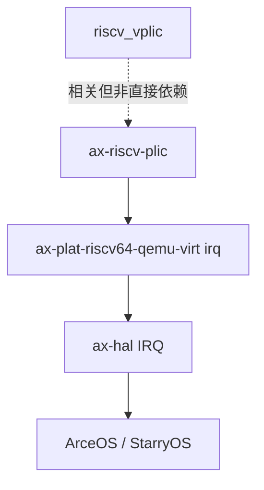

# `ax-riscv-plic` 技术文档

> 路径：`components/riscv_plic`
> 类型：库 crate
> 分层：组件层 / RISC-V 物理中断控制器封装层
> 版本：`0.4.0`
> 文档依据：当前仓库源码、`Cargo.toml`、`README.md`、`src/lib.rs` 以及 `ax-plat-riscv64-qemu-virt` 的集成代码

`ax-riscv-plic` 是针对 RISC-V PLIC 的 typed MMIO 封装库。它把平台级中断控制器的寄存器布局、优先级、使能位图、threshold 和 claim/complete 等操作建模成一套安全边界明确的 Rust API。它不是完整的中断子系统，也不是虚拟 PLIC；它只负责“给定一个物理 PLIC MMIO 基址，如何按规范读写它”。

## 1. 架构设计分析

### 1.1 设计定位

这个 crate 的边界非常明确：

- 它负责物理 PLIC 寄存器布局与基本操作
- 它不负责中断分发策略
- 它不负责 handler 表
- 它不负责虚拟化 guest 侧 PLIC 行为

因此它应被理解为“物理控制器寄存器封装层”。

### 1.2 模块结构

`ax-riscv-plic` 只有一个 `src/lib.rs`，没有进一步拆分子模块。这说明作者将其定位为：

- 结构简单
- 接口集中
- 直接映射硬件规范

对外最核心的几个对象是：

- `Plic`
- `PLICRegs`
- `ContextLocal`

### 1.3 寄存器布局建模

该 crate 使用 `tock-registers` 的 `register_structs!` 与寄存器字段访问器来描述完整 PLIC 内存布局。核心区域包括：

- interrupt priority
- interrupt pending
- interrupt enable
- context local 区域

其中 context local 再包含：

- `priority_threshold`
- `interrupt_claim_complete`

这与 RISC-V PLIC 规范的分区完全一致。

### 1.4 数据规模建模

源码中采用的是规范级上限：

- `SOURCE_NUM = 1024`
- `CONTEXT_NUM = 15872`

这说明它在类型层面按“最大布局”建模，实际平台通常只用其中一小部分。这样做的好处是：

- 结构表达简单直接
- 不需要为不同芯片做不同结构体定义

代价则是：

- 类型表示比实际硬件更大
- 调用方必须自己知道哪些 source/context 真正有效

### 1.5 `Plic`：唯一运行时入口

`Plic` 内部持有 `NonNull<PLICRegs>`，因此所有访问都围绕“一个已经映射好的物理 PLIC MMIO 基址”展开。

这意味着：

- 它不负责地址探测
- 不负责虚实地址转换
- 不负责锁

这些都由平台/HAL 层保证。

### 1.6 关键操作主线

#### priority

- `set_priority`
- `get_priority`
- `probe_priority_bits`

#### pending

- `is_pending`

#### enable

- `enable`
- `disable`
- `is_enabled`

#### context local

- `get_threshold`
- `set_threshold`
- `probe_threshold_bits`
- `claim`
- `complete`

这条主线几乎就是 PLIC 规范的软件使用面本身。

### 1.7 一个重要边界：不是 `riscv_vplic`

需要特别强调：

- `ax-riscv-plic`：物理 PLIC 寄存器封装
- `riscv_vplic`：Hypervisor 中对 guest 暴露的虚拟 PLIC 模型

两者可能共享同一套寄存器语义背景，但不是一回事，也不是当前仓库里的直接 crate 依赖关系。

## 2. 核心功能说明

### 2.1 主要能力

- 以 typed MMIO 方式访问 PLIC
- 设置中断源优先级
- 控制某个 context 的中断使能
- 读取 pending 状态
- 管理 context 的 threshold
- 执行 claim/complete 流程

### 2.2 典型使用场景

最典型的集成点是 RISC-V 平台的 IRQ 实现，例如：

1. 平台代码根据物理基址构造 `Plic`
2. 选择当前 hart 对应的 context
3. 对设备 IRQ 设置优先级并 enable
4. 外部中断到来时调用 `claim`
5. 分发 handler
6. 结束后 `complete`

这正是 `ax-plat-riscv64-qemu-virt` 当前的使用模式。

### 2.3 `unsafe` 边界

`Plic::new()` 是 `unsafe`，因为它假设：

- 传入指针确实指向有效的 PLIC MMIO
- 调用方已经保证映射合法
- 调用方能够处理并发访问

一旦构造完成，后续寄存器访问才由 `tock-registers` 提供更安全的读写抽象。

## 3. 依赖关系图谱

### 3.1 直接依赖

| 依赖 | 作用 |
| --- | --- |
| `tock-registers` | 建模寄存器块和字段访问 |

### 3.2 主要消费者

当前仓库中最直接的物理消费者是：

- `ax-plat-riscv64-qemu-virt` 的 IRQ 实现

与它关系紧密但非直接依赖的组件包括：

- `riscv_vplic`
- `ax-hal` / `axplat` RISC-V 中断路径

### 3.3 关系示意

## 4. 开发指南

### 4.1 集成到新平台时的步骤

1. 确认 PLIC 物理基址已映射
2. 用 `NonNull<PLICRegs>` 构造 `Plic`
3. 确认 hart 到 context 的映射规则
4. 初始化 threshold
5. 为需要的设备 IRQ 设置 priority 和 enable
6. 在外部中断入口执行 claim/dispatch/complete

### 4.2 修改时的关键注意事项

- `claim` 与 `complete` 必须成对出现
- 不同平台对 context 编号的约定可能不同，不能把 QEMU `virt` 的映射关系当成通用规律
- `SOURCE_NUM` 和 `CONTEXT_NUM` 是规范级建模，不代表硬件实际实现规模

### 4.3 与平台层的职责分工

- `ax-riscv-plic`：只负责寄存器访问
- `axplat-*`：负责基址、context 选择和 IRQ 接线
- `ax-hal`：负责更高层 IRQ 入口和 handler 分发

## 5. 测试策略

### 5.1 当前状况

从仓库看，本 crate 没有大规模单元测试，更多依赖：

- 构建通过
- 平台集成验证

这很常见，因为硬件 MMIO 封装库往往最终要在真实平台或 QEMU 上验证。

### 5.2 推荐测试方向

- 基于模拟 MMIO 内存块的单元测试
- `enable/disable/is_enabled` 位图逻辑测试
- `claim/complete` 流程测试
- QEMU `virt` 平台上的外部中断集成测试

### 5.3 风险点

- 它太接近硬件规范，任何偏移或位图错误都会直接破坏 IRQ 路径
- `unsafe new()` 若传入错误基址，后果不会被类型系统捕获
- 容易被误认为虚拟 PLIC 实现，文档里必须明确区分

## 6. 跨项目定位分析

| 项目 | 位置 | 角色 | 核心作用 |
| --- | --- | --- | --- |
| ArceOS | RISC-V 平台 IRQ 底层件 | 物理 PLIC 封装库 | 为平台级 IRQ 初始化和 claim/complete 路径提供 typed MMIO 接口 |
| StarryOS | 通过 ArceOS 平台链间接使用 | 物理中断控制器底层件 | 在复用 RISC-V 平台/HAL 时，间接获得物理 PLIC 控制能力 |
| Axvisor | 物理宿主 IRQ 可能相关，虚拟 IRQ 不直接使用它 | 宿主物理 PLIC 支撑件 | 若 Hypervisor 宿主运行在 RISC-V 平台上，可用于宿主物理中断接线；guest 侧虚拟 PLIC 则由 `riscv_vplic` 负责 |

## 7. 总结

`ax-riscv-plic` 的价值在于，它把一块容易被写成散乱裸指针访问的 MMIO 控制器，整理成了清晰、接近规范章节结构的 Rust API。它不大，但它处在 RISC-V 中断链的物理入口位置；一旦没有这层稳定封装，平台 IRQ 代码就会快速退化成难维护的寄存器偏移和位运算集合。
