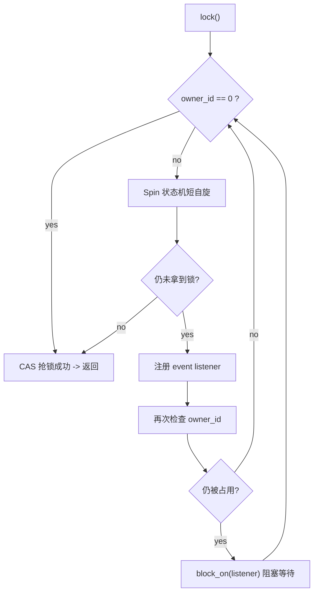
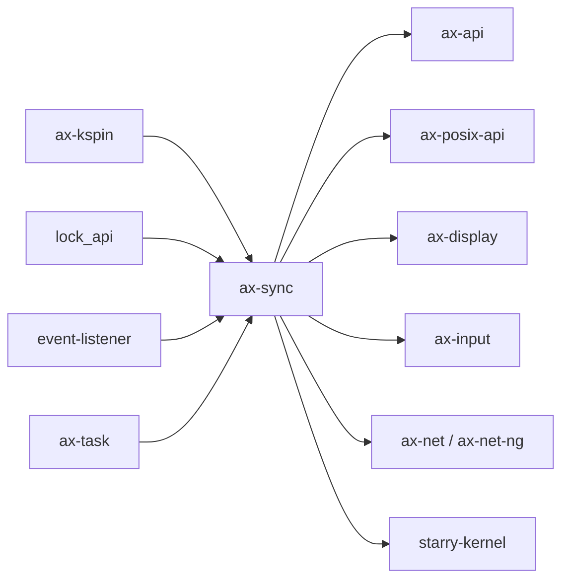

# `ax-sync` 技术文档

> 路径：`os/arceos/modules/axsync`
> 类型：库 crate
> 分层：ArceOS 层 / ArceOS 内核模块
> 版本：`0.3.0-preview.3`
> 文档依据：`Cargo.toml`、`README.md`、`src/lib.rs`、`src/mutex.rs`

`ax-sync` 是 ArceOS 提供统一同步原语的模块。它的设计很克制：不是实现一整套锁家族，而是把“阻塞互斥锁”和“自旋锁”统一收敛到一个稳定的 `Mutex` 名称上，并通过 feature 决定当前系统拿到的到底是哪一种语义。

## 1. 架构设计分析
### 1.1 设计定位
`ax-sync` 的目标不是做一个庞大的同步库，而是解决两个现实问题：

- 对大多数上层模块来说，只需要一个统一的 `Mutex` 名字，不想在代码里到处分辨当前是“多任务可阻塞锁”还是“无调度环境自旋锁”。
- 对需要显式控制抢占/中断语义的低层代码来说，仍然要能直接访问 `ax-kspin` 提供的自旋锁家族。

因此，`ax-sync` 的职责边界是：

- 向上提供统一的 `Mutex` / `MutexGuard` / 可选 `RawMutex`。
- 向下复用 `ax-kspin`、`lock_api`、`event-listener` 和 `ax-task`，而不是重复造轮子。

### 1.2 模块划分
- `src/lib.rs`：feature 分流入口。决定 `Mutex` 是 `ax_kspin::SpinNoIrq` 的别名，还是本 crate 自己的阻塞 mutex。
- `src/mutex.rs`：只在 `multitask` 开启时编译，定义 `RawMutex`、`Mutex<T>` 和 `MutexGuard`。
- `README.md`：说明 `multitask` feature 的语义与使用方式。

### 1.3 关键类型与锁语义
- `ax-sync::spin`：直接再导出 `ax-kspin` crate，供调用者显式使用自旋锁。
- `Mutex` / `MutexGuard`：
  - 未启用 `multitask` 时：别名到 `SpinNoIrq` 与其 guard。
  - 启用 `multitask` 时：别名到 `lock_api::Mutex<RawMutex, T>`。
- `RawMutex`：`multitask` 路径中的底层锁实现，内部维护：
  - `owner_id: AtomicU64`：锁拥有者任务 ID，`0` 表示未持有。
  - `event: Event`：等待与唤醒队列。

### 1.4 阻塞 mutex 的主线
`RawMutex::lock()` 的实现路径很值得单独说明：



这条路径体现了三个层次：

- 先尝试快速 CAS 抢锁。
- 若失败，先做一小段指数退避式自旋与 `yield_now()`。
- 再进一步进入 `event-listener` + `ax-task::future::block_on()` 的阻塞等待。

因此 `ax-sync` 的阻塞 mutex 不是纯 parking lock，也不是纯自旋锁，而是“短自旋 + 让出 + 阻塞”的混合策略。

### 1.5 解锁与非重入约束
- `unlock()` 通过 `swap(0, Release)` 清空 `owner_id`，然后调用 `event.notify(1)` 唤醒等待者。
- `lock()` 中显式断言当前任务不能重复获取自己已持有的锁，因此 `RawMutex` 是 **非重入 mutex**。
- `GuardMarker = GuardSend`，表明 guard 的发送语义遵循 `lock_api` 的该类约定。

### 1.6 `multitask` feature 的决定性作用
这是 `ax-sync` 最关键的 feature：

- 打开 `multitask`：
  - 编译 `src/mutex.rs`
  - 导出 `RawMutex`
  - `Mutex` 变为真正可阻塞的互斥锁
  - 同时要求 `ax-task/multitask`
- 关闭 `multitask`：
  - `RawMutex` 不存在
  - `Mutex` 只是 `SpinNoIrq` 的别名

需要注意的是，源码注释里曾有“`multitask` 默认启用”的描述，但 `Cargo.toml` 实际以 `default = []` 为准。也就是说，当前仓库中应以 manifest 为真，而不是以旧注释为真。

## 2. 核心功能说明
### 2.1 主要功能
- 在多任务环境中提供阻塞式互斥锁。
- 在无多任务环境中把同名 `Mutex` 退化为关中断自旋锁。
- 通过 `ax-sync::spin` 暴露完整的 `ax-kspin` 自旋锁家族。

### 2.2 关键 API 与使用场景
- `Mutex<T>`：上层模块最常用的统一互斥抽象。
- `MutexGuard`：保护临界区访问。
- `RawMutex`：在需要和 `lock_api` 深度集成时使用，但只在 `multitask` 下存在。
- `ax-sync::spin::*`：需要显式使用自旋锁或中断屏蔽语义时使用。

### 2.3 典型使用方式
最典型的调用方式是把它当成统一互斥抽象：

```rust
use ax-sync::Mutex;

static COUNTER: Mutex<u64> = Mutex::new(0);

let mut guard = COUNTER.lock();
*guard += 1;
```

同一段代码在 `multitask` 打开与关闭时可以保持相同接口，但底层语义会分别落到阻塞 mutex 或 `SpinNoIrq`。

## 3. 依赖关系图谱


### 3.1 关键直接依赖
- `ax-kspin`：提供自旋锁实现，并通过 `spin` 再导出。
- `lock_api`：提供 `RawMutex` trait 与泛型 `Mutex<T>` 框架。
- `event-listener`：提供等待/唤醒事件机制。
- `ax-task`：提供当前任务 ID、`yield_now()` 与 `block_on()`，使阻塞 mutex 真正能与调度器协作。

### 3.2 关键直接消费者
- `ax-api`：在 `multitask` 路径下把 `RawMutex` 作为公开类型再导出。
- `ax-posix-api`：用于 pipe、fs、net、pthread mutex 等路径。
- `ax-net` / `ax-net-ng`、`ax-input`、`ax-display`、`ax-fs-ng`：用 `Mutex` 保护全局状态或共享对象。
- `starry-kernel`：大量复用 `ax-sync::Mutex`，同时与 `spin::SpinNoIrq` 并存。

### 3.3 间接消费者
- 通过 `ax-std` / `ax-api` 共享多任务同步路径的上层应用。
- Axvisor，经 `ax-std` 和 `ax-api` 间接复用统一同步原语栈。

## 4. 开发指南
### 4.1 依赖配置
```toml
[dependencies]
ax-sync = { workspace = true, features = ["multitask"] }
```

若不打开 `multitask`，则 `Mutex` 会退化为 `SpinNoIrq`，这是语义级变化，不只是性能差异。

### 4.2 使用与修改约束
1. 若代码需要“可睡眠、可让出 CPU 的锁”，必须确保依赖链上启用了 `multitask`。
2. 若代码运行在中断上下文、早期启动期或调度器尚未建立的路径，应优先考虑 `ax-sync::spin::*`。
3. 修改 `RawMutex` 时，要同时考虑自旋阶段、阻塞阶段和唤醒阶段是否仍保持一致语义。
4. 任何改动都必须保留“非重入”这一约束，否则会改变上层大量代码的错误模型。

### 4.3 开发建议
- 对上层模块，优先直接写 `Mutex<T>`，把 feature 差异留给 `ax-sync` 内部处理。
- 对极低层路径，不要滥用 `Mutex`，而应显式选择 `spin::SpinNoIrq` 等自旋锁。
- 若要扩展更多同步原语，应先确认是否真的属于 `ax-sync` 的职责，而不是应由更专门的 crate 承担。

## 5. 测试策略
### 5.1 当前测试形态
`ax-sync` 当前最重要的测试位于 `src/mutex.rs`，即 `lots_and_lots` 压力测试。它会初始化调度器、spawn 多任务并发更新一个静态 `Mutex<u32>`，验证阻塞 mutex 在激烈竞争下的正确性。

### 5.2 单元测试重点
- `RawMutex::try_lock()` 与 `lock()` 的所有权状态转换。
- 非重入断言。
- `unlock()` 后的唤醒行为。
- `Spin` 辅助状态机从短自旋到 `yield_now()` 的切换。

### 5.3 集成测试重点
- 在 `multitask` 打开时验证真实调度环境下的互斥行为。
- 在 `multitask` 关闭时验证 `Mutex` 退化为 `SpinNoIrq` 后的代码仍能编译并保持预期语义。
- 覆盖 StarryOS 和 POSIX API 层对 `Mutex` 的高频使用场景。

### 5.4 覆盖率要求
- 对 `ax-sync`，重点是并发行为覆盖而不是普通路径覆盖。
- 至少应覆盖抢锁成功、短自旋失败后阻塞、被唤醒重试、重复加锁失败这几条主线。
- 若改动唤醒策略或 `event-listener` 交互方式，应补系统级压力测试。

## 6. 跨项目定位分析
### 6.1 ArceOS
`ax-sync` 是 ArceOS 内核模块共享的统一同步层。它通过 `multitask` feature 与 `ax-task`、`ax-runtime`、`ax-feat` 联动，确保“调度器语义”和“锁语义”一起切换。

### 6.2 StarryOS
StarryOS 大量复用 `ax-sync::Mutex` 作为内核内部同步原语之一。因此在 StarryOS 中，`ax-sync` 扮演的是“兼容内核与 ArceOS 模块共享的基础锁层”。

### 6.3 Axvisor
Axvisor 不直接实现自己的 `ax-sync`，而是通过 `ax-std` / `ax-api` 间接共享同一套同步原语栈。因此 `ax-sync` 在 Axvisor 中属于宿主侧统一基础设施，而不是 hypervisor 专用锁库。
