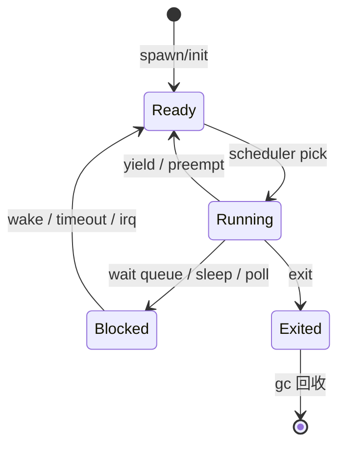
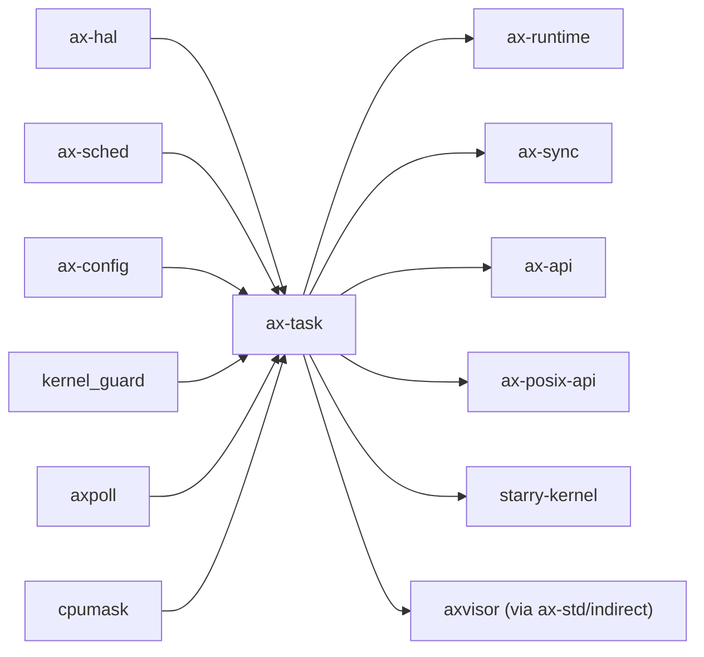

# `ax-task` 技术文档

> 路径：`os/arceos/modules/axtask`
> 类型：库 crate
> 分层：ArceOS 层 / ArceOS 内核模块
> 版本：`0.3.0-preview.3`
> 文档依据：`Cargo.toml`、`README.md`、`src/lib.rs`、`src/api.rs`、`src/task.rs`、`src/run_queue.rs`、`src/wait_queue.rs`、`src/timers.rs`、`src/future/*`

`ax-task` 是 ArceOS 的任务管理核心模块。它既承担线程/任务对象的创建、阻塞、退出与回收，又通过 `axsched` 抽象把 FIFO、RR、CFS 等调度策略统一到同一个运行队列框架下，并进一步向 StarryOS 和 Axvisor 输出可复用的调度基础设施。

## 1. 架构设计分析
### 1.1 总体设计
`ax-task` 的设计目标不是提供“单一线程库”，而是构造一个可裁剪的内核任务运行时：

- 通过 `multitask` feature 在“真正多任务调度器”和“单任务桩实现”之间切换。
- 通过 `sched-fifo`、`sched-rr`、`sched-cfs` 在同一套 API 下选择不同调度策略。
- 通过 `irq`、`preempt`、`smp`、`tls`、`task-ext` 决定任务系统究竟具备多少内核能力。

因此，`ax-task` 是一个强 feature 驱动的状态机模块，而不是简单的 API 封装。

### 1.2 模块划分
- `src/lib.rs`：顶层 feature 门控。决定编译 `run_queue`、`task`、`api`、`wait_queue`、`future`、`timers` 还是退回 `api_s` 单任务实现。
- `src/task.rs`：任务实体定义与状态机，包含 `TaskInner`、`TaskState`、`CurrentTask`、栈对象、退出码、join 与可选 TLS/TaskExt 字段。
- `src/run_queue.rs`：每 CPU 运行队列、调度切换、GC 任务、SMP 下多队列初始化与迁移逻辑。
- `src/api.rs`：多任务模式下的公开 API，如 `spawn()`、`yield_now()`、`sleep()`、`exit()`、`set_priority()`、`set_current_affinity()` 等。
- `src/api_s.rs`：单任务模式下的桩实现，很多“阻塞”行为会退化为 busy-wait 或等待 IRQ。
- `src/wait_queue.rs`：基于 `event-listener` 的等待队列封装。
- `src/timers.rs`：IRQ 打开时的定时事件回调与每核计时事件检查。
- `src/future/mod.rs`：内核态 `block_on`、waker、阻塞/唤醒桥接。
- `src/future/time.rs`：截止时间驱动的 sleep/timeout future 与每核 `TimerRuntime`。
- `src/future/poll.rs`：I/O poll 异步适配，与 `axpoll` 协作。
- `src/tests.rs`：FIFO、浮点状态切换、`WaitQueue`、`join` 等单元测试。

### 1.3 关键数据结构
- `TaskState`：`Running`、`Ready`、`Blocked`、`Exited`，是任务生命周期分析的核心。
- `TaskInner`：任务内部主体，包含任务名、entry 闭包、上下文、栈、退出码、等待退出事件、CPU 亲和、可选 TLS、可选 `TaskExt` 等。
- `CurrentTask`：当前任务句柄，是 API 层访问当前任务状态、优先级、亲和性和扩展对象的主要入口。
- `AxTaskRef` / `WeakAxTaskRef`：调度器持有的任务引用类型。
- `AxRunQueue`：每 CPU 运行队列包装，内部持有具体 `Scheduler` 实例并负责上下文切换。
- `WaitQueue`：内核阻塞/唤醒的基础同步原语。
- `TimerRuntime`：基于截止时间和 waker 的软件定时运行时，仅在 `irq` 路径启用。
- `AxTaskExt` / `TaskExt`：供上层系统附加任务私有语义的扩展接口，是 StarryOS 线程对象与 Axvisor vCPU 任务集成的关键点。

### 1.4 调度器抽象与算法实现
`ax-task` 并不自己实现完整调度算法，而是通过 `api.rs` 中的类型别名把 `TaskInner` 适配到 `axsched`：

- `sched-fifo`：`FifoScheduler` + `FifoTask`，协作式调度。
- `sched-rr`：`RRScheduler` + `RRTask`，带时间片，依赖 `preempt`。
- `sched-cfs`：`CFScheduler` + `CFSTask`，公平调度，同样依赖 `preempt`。

这层设计的关键好处是：

- `TaskInner` 始终保持稳定。
- 上层 API 如 `spawn`、`yield_now`、`sleep` 无需感知底层采用 FIFO、RR 还是 CFS。
- StarryOS、Axvisor 可以在不重写任务核心对象的前提下复用调度机制。

### 1.5 任务生命周期主线
典型生命周期可概括为：



更具体的初始化主线如下：

1. `init_scheduler()` 调用 `run_queue::init()`。
2. 主 CPU 创建 idle 任务、当前 init 任务和 GC 任务。
3. `spawn_task()` / `spawn()` 把新任务加入选中的运行队列。
4. `yield_current()`、`blocked_resched()`、`scheduler_timer_tick()` 驱动状态在 `Running/Ready/Blocked` 间转换。
5. `exit_current()` 把任务移入退出队列，由 GC 任务清理最终资源。

## 2. 核心功能说明
### 2.1 主要功能
- 任务创建：`spawn_task()`、`spawn_raw()`、`spawn_with_name()`、`spawn()`。
- 任务调度：`yield_now()`、调度器 tick、优先级调整、CPU 亲和迁移。
- 阻塞与等待：`WaitQueue`、`block_on()`、sleep/timeout。
- 退出与回收：`exit()`、`join()`、GC 任务。
- 扩展语义：通过 `TaskExt` 把上层系统数据挂到任务对象上。

### 2.2 关键 API
最常用的 API 入口在 `src/api.rs`：

- `current()` / `current_may_uninit()`
- `init_scheduler()` / `init_scheduler_secondary()`
- `spawn()` / `spawn_task()`
- `yield_now()`
- `sleep()` / `sleep_until()`
- `exit()`
- `set_priority()`
- `set_current_affinity()`
- `on_timer_tick()`（`irq` 打开时）

### 2.3 典型使用示例
```rust
use core::time::Duration;

let worker = ax-task::spawn(|| {
    // do work
});

ax-task::yield_now();
ax-task::sleep(Duration::from_millis(10));

let _exit_code = worker.join();
```

若需要等待条件成立，通常走 `WaitQueue`：

```rust
let wq = ax-task::WaitQueue::new();
// 条件不满足时 wait，条件满足后 wake
```

## 3. 依赖关系图谱


### 3.1 关键直接依赖
- `ax-hal`：任务上下文、当前 CPU、时间、IRQ、TLS 与上下文切换能力来源。
- `axsched`：具体调度算法实现。
- `axconfig`：任务栈大小、CPU 数量上限等静态配置来源。
- `kernel_guard`：抢占关闭/恢复的接口桥接。
- `axpoll`：异步 poll 与 I/O 等待适配。
- `cpumask`、`ax-percpu`、`ax-kspin`：SMP 与每核运行队列支持。

### 3.2 关键直接消费者
- `ax-runtime`：在启动链中初始化调度器，并在 timer tick 中调用 `on_timer_tick()`。
- `ax-sync`：基于 `ax-task` 的阻塞/唤醒机制构建锁和同步原语。
- `ax-api`、`ax-posix-api`：把任务、睡眠、等待队列等能力对外暴露。
- `starry-kernel`：在 Linux 兼容线程模型上直接复用 `ax-task`。
- `ax-net`、`ax-net-ng`：在网络栈阻塞/异步路径上复用调度与等待能力。

## 4. 开发指南
### 4.1 依赖配置
```toml
[dependencies]
ax-task = { workspace = true }
```

常见 feature 组合：

- `multitask`：启用完整任务管理。
- `sched-fifo` / `sched-rr` / `sched-cfs`：选择调度器。
- `preempt`：允许基于 timer tick 的抢占。
- `irq`：启用 sleep/timeout 等基于中断的时间能力。
- `smp`：启用多核运行队列与任务迁移。
- `tls`：启用任务 TLS。
- `task-ext`：允许外部系统挂接扩展任务对象。

### 4.2 初始化与接入顺序
1. 先确保上层运行时已完成 `ax-hal` 初始化。
2. 主 CPU 调 `init_scheduler()`，从 CPU 调 `init_scheduler_secondary()`。
3. 再通过 `spawn()` 等 API 投递任务。
4. 若启用 `irq` 与 `preempt`，需要保证 timer tick 能够进入 `on_timer_tick()`。

### 4.3 关键开发注意事项
- 修改 `TaskInner` 时，要同时检查调度器包装类型、`TaskExt`、TLS、join 和 GC 回收路径是否仍一致。
- 修改 `run_queue.rs` 时，要同时检查 FIFO/RR/CFS 三种调度器行为是否都成立。
- 修改 `WaitQueue`、`future`、`timers` 时，要区分 `irq` 开启与关闭两条实现路径。
- 修改 `smp` 相关逻辑时，要同时验证 CPU 亲和、迁移任务和每核队列初始化。

## 5. 测试策略
### 5.1 单元测试
`src/tests.rs` 已经覆盖了几类关键路径：

- FIFO 调度顺序。
- 浮点状态切换。
- `WaitQueue` 行为。
- 任务 `join` 路径。

后续新增功能时，应优先补这几类单元测试：

- 状态转换与退出码传播。
- 多调度器策略的一致性。
- `task-ext`、TLS、CPU 亲和与迁移路径。
- `irq` 与非 `irq` 两种 sleep/timeout 语义。

### 5.2 集成测试
系统级验证更重要：

- `test-suit/arceos/task/*` 是最直接的回归入口。
- `ax-helloworld` 可验证最小 bring-up。
- StarryOS 线程/进程路径能验证 `task-ext` 和复杂阻塞语义。
- Axvisor 的 vCPU 任务路径能验证 `TaskExt` 与 `WaitQueue` 的复用场景。

### 5.3 覆盖率要求
- API 层、状态机分支和错误路径应保持高覆盖。
- 调度器切换、阻塞/唤醒、GC 回收和多核迁移必须有专门覆盖。
- 涉及 `preempt`、`irq`、`smp`、`task-ext` 的修改必须做系统级回归。

## 6. 跨项目定位分析
### 6.1 ArceOS
`ax-task` 是 ArceOS 的标准任务运行时。它为 `ax-runtime`、`ax-sync`、`ax-api` 和各种示例/测试提供统一的任务抽象，是系统从“单核顺序执行”迈向“可调度 OS”的关键模块。

### 6.2 StarryOS
StarryOS 直接复用 `ax-task` 作为线程调度基础，并借助 `TaskExt` 把 Linux 兼容线程对象挂接到任务实体上。因此，`ax-task` 在 StarryOS 中承担的是“底层线程调度内核”，而不是外围帮助库。

### 6.3 Axvisor
Axvisor 并不直接依赖 `ax-task` 包名，但它通过 `ax-std` 启用的任务能力，把每个 vCPU 组织成可调度任务，并利用 `TaskExt`、`WaitQueue` 和运行队列复用 Hypervisor 并发模型。因此，`ax-task` 是 Axvisor 把“vCPU”转化成“宿主调度实体”的关键基础设施。
