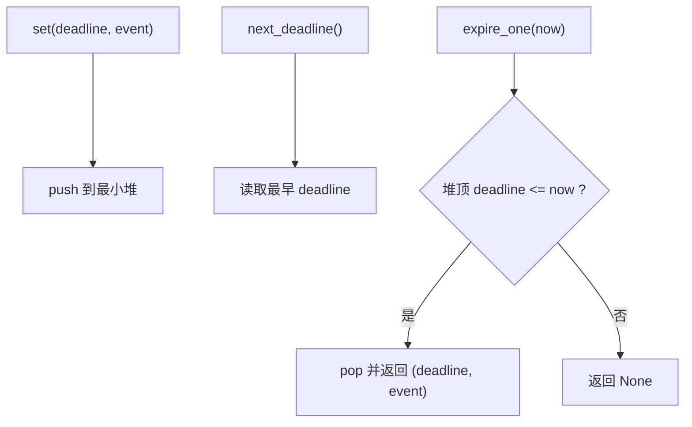
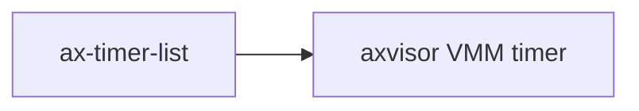

# `ax-timer-list` 技术文档

> 路径：`components/timer_list`
> 类型：库 crate
> 分层：组件层 / 定时事件队列基础件
> 版本：`0.1.0`
> 文档依据：`Cargo.toml`、`README.md`、`src/lib.rs`、`os/axvisor/src/vmm/timer.rs`

`ax-timer-list` 提供一个按截止时间排序的定时事件容器。它内部用 `BinaryHeap` 实现最小堆语义，向上暴露“插入事件、取消事件、取出最早到期事件”的接口。它是容器型叶子基础件：不是硬件定时器驱动、不是中断时钟源，也不是完整的定时器子系统。

## 1. 架构设计分析
### 1.1 设计定位
这个 crate 解决的是“怎样保存一组带截止时间的事件，并按到期顺序逐个取出来”。它刻意把职责压得很窄：

- 不负责获取当前时间。
- 不负责设置下一次硬件中断。
- 不负责自动执行回调。

因此它更像“超时队列”而不是“定时器框架”。

### 1.2 核心类型
- `TimeValue = core::time::Duration`：当前时间值别名。
- `TimerEvent`：事件 trait，只要求实现 `callback(self, now)`。
- `TimerList<E>`：存放事件的主体结构。
- `TimerEventFn`：把 `FnOnce(TimeValue)` 封装成一个 `TimerEvent`。

### 1.3 内部实现
`TimerList` 内部实际保存的是：

- `BinaryHeap<TimerEventWrapper<E>>`

而 `TimerEventWrapper` 通过反转 `Ord` / `PartialOrd` 的比较结果，把标准库的大顶堆改造成“最早 deadline 优先”的最小堆语义。也就是说，`peek()` 看到的其实是“最先到期的事件”。

### 1.4 触发主线
它的典型使用模式如下：



注意最后一步只是“返回事件”，不是“自动执行事件”。真正调用 `event.callback(now)` 的是上层运行时。

## 2. 核心功能说明
### 2.1 主要功能
- 向队列插入一个带绝对截止时间的事件。
- 查询当前最早的截止时间。
- 删除满足条件的一批事件。
- 逐个弹出已经到期的事件。

### 2.2 关键 API 与真实使用位置
- `TimerList::set()`：`os/axvisor/src/vmm/timer.rs` 在注册 VMM timer 时调用。
- `cancel()`：Axvisor 按 token 取消已登记的事件。
- `expire_one()`：Axvisor 的 `check_events()` 循环不断取出已到期事件，再由上层显式执行回调。
- `TimerEventFn::new()`：本 crate 测试里用于快速包装闭包事件。

### 2.3 使用边界
- `ax-timer-list` 不保证线程安全，真实系统里需要像 Axvisor 那样再包一层 `SpinNoIrq` 或其他锁。
- `ax-timer-list` 不负责重复定时器、周期性重装或硬件编程。
- `ax-timer-list` 也不是高性能 timer wheel；当前取消实现甚至直接使用 `BinaryHeap::retain()`，源码里明确写了 `TODO: performance optimization`。

## 3. 依赖关系图谱


### 3.1 关键直接依赖
`ax-timer-list` 没有本地 crate 依赖，保持了纯容器实现。

### 3.2 关键直接消费者
- `axvisor`：在 `vmm/timer.rs` 中以 `LazyInit<SpinNoIrq<TimerList<VmmTimerEvent>>>` 的形式使用。

## 4. 开发指南
### 4.1 依赖配置
```toml
[dependencies]
ax-timer-list = { workspace = true }
```

### 4.2 修改时的关键约束
1. `Ord` 的反转实现决定了最小堆语义，任何改动都要重新验证 `next_deadline()` / `expire_one()` 是否仍返回最早事件。
2. `expire_one()` 当前只弹一个事件，批量到期场景要由外层循环处理；不要悄悄改成“一次清空所有到期事件”。
3. `cancel()` 的性能目前是线性保留，若做优化，要保持“按谓词删除多个事件”的语义。
4. `TimerEventFn` 使用 `FnOnce`，意味着事件天然是一次性的；不要误改成可重复调用而破坏消费语义。

### 4.3 开发建议
- 需要线程安全时，在外层包锁，不要把锁策略硬塞进 `ax-timer-list`。
- 需要周期定时器时，在回调里重新插入新事件，或由上层另建策略层。
- 若要接入硬件时钟源，应让平台时间层决定何时唤醒，再由 `ax-timer-list` 只负责维护软件队列。

## 5. 测试策略
### 5.1 当前测试形态
`ax-timer-list` 的测试位于 `src/lib.rs`：

- `test_timer_list()`：覆盖排序、取消和按顺序到期。
- `test_timer_list_fn()`：覆盖 `TimerEventFn` 闭包包装。

### 5.2 单元测试重点
- deadline 顺序是否正确。
- `cancel()` 是否只删除命中事件。
- `expire_one()` 在未到期和已到期场景下的行为。

### 5.3 集成测试重点
- Axvisor 定时器注册、取消、轮询处理链路。
- 在多事件同一时刻到期时，上层循环是否能逐个取尽。

### 5.4 覆盖率要求
- 对 `ax-timer-list`，顺序语义和取消语义是核心。
- 如果调整堆排序或取消算法，必须补覆盖同 deadline、多次 cancel、空队列等边界测试。

## 6. 跨项目定位分析
### 6.1 ArceOS
当前 ArceOS 主线模块没有直接把 `ax-timer-list` 作为公共运行时定时器使用。若未来接入，它也应仍然只是一个定时事件容器。

### 6.2 StarryOS
当前仓库里 StarryOS 没有直接依赖 `ax-timer-list`。即便后续复用，它也只适合作为低层延时队列，而不是完整定时框架。

### 6.3 Axvisor
在 Axvisor 中，`ax-timer-list` 承担的是 VMM 软件定时事件队列角色。真正的当前时间获取、轮询时机和回调执行仍由 Axvisor 自己负责。
