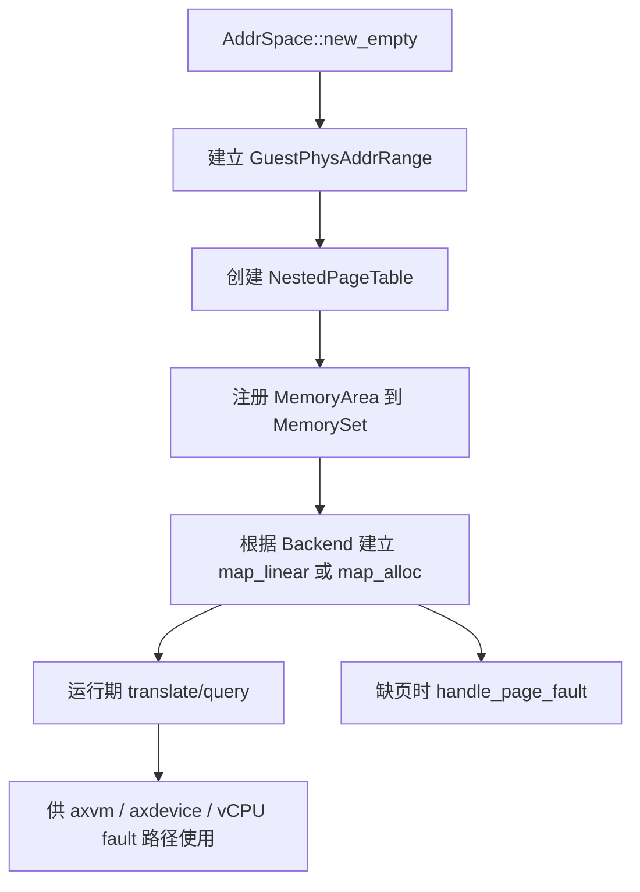
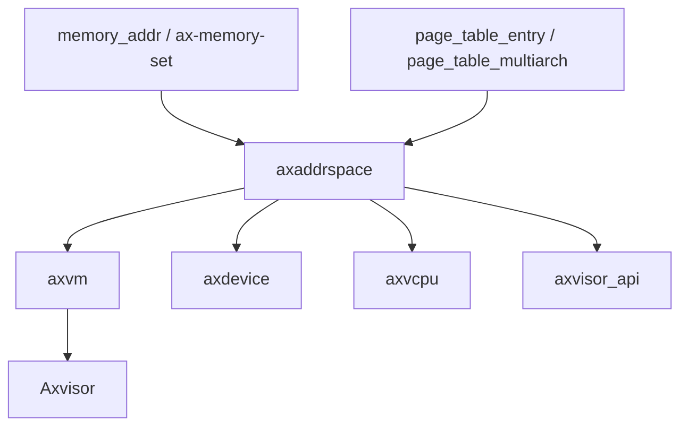

# `axaddrspace` 技术文档

> 路径：`components/axaddrspace`
> 类型：库 crate
> 分层：组件层 / 客户机地址空间与嵌套页表
> 版本：`0.3.0`
> 文档依据：当前仓库源码、`Cargo.toml`、`README.md`、`src/address_space/mod.rs`、`src/npt/mod.rs` 及其在 `axvm` / `axdevice` 中的使用关系

`axaddrspace` 是 Axvisor 虚拟化栈中的 guest 地址空间管理核心件。它最容易被误读成“普通虚拟地址空间库”，但从当前源码看，它的主线语义实际上是：以 `GuestPhysAddr` 为输入侧地址，维护一套面向嵌套页表的地址空间模型，把 GPA/IPA 映射到宿主物理页帧，并向设备仿真、vCPU fault 处理和宿主 API 暴露统一的地址类型与访问边界。

## 1. 架构设计分析

### 1.1 设计定位

`axaddrspace` 有三层职责同时存在：

- 地址与范围类型层：提供 `GuestPhysAddr`、`GuestVirtAddr`、`HostPhysAddr`、`HostVirtAddr` 以及系统寄存器、端口等设备地址类型。
- 地址空间管理层：通过 `AddrSpace<H>` 维护一组内存区域及其页表映射。
- 嵌套页表适配层：通过 `npt` 模块把 `page_table_multiarch` 组合成面向 Stage-2/NPT/EPT 语义的统一封装。

最关键的一点是：`AddrSpace` 内部的“虚拟地址侧”并不是一般 OS 语义下的 GVA，而是 **GPA/IPA**。这点从源码可以直接看出：

- `AddrSpace` 的范围字段是 `GuestPhysAddrRange`
- `map_linear()` / `map_alloc()` 的地址参数是 `GuestPhysAddr`
- `NestedPageFaultInfo` 记录的是 `fault_guest_paddr`

因此，本 crate 更准确的定位应是“guest physical address space manager”，而不是通用进程虚拟地址空间库。

### 1.2 模块划分

| 模块 | 作用 | 关键内容 |
| --- | --- | --- |
| `addr` | 地址与范围类型 | `GuestVirtAddr`、`GuestPhysAddr`、`HostPhysAddr`、`HostVirtAddr` 及各种 range |
| `address_space` | 地址空间主逻辑 | `AddrSpace<H>`、`Backend`、映射/撤销/翻译/缺页处理 |
| `npt` | 嵌套页表封装 | `NestedPageTable<H>`、L3/L4 选择、map/query/protect |
| `device` | 设备地址抽象 | `DeviceAddrRange`、`AccessWidth`、`Port`、`SysRegAddr` |
| `memory_accessor` | guest 内存访问接口 | `GuestMemoryAccessor` |
| `hal` | 页帧与地址转换抽象 | `AxMmHal` |
| `frame` | 物理页帧 RAII | `PhysFrame<H>` |
| `lib.rs` | 重导出与错误转换 | `NestedPageFaultInfo`、`mapping_err_to_ax_err()` |

这套划分说明 `axaddrspace` 既是“地址空间管理器”，也是“虚拟化公共地址语义库”。

### 1.3 关键类型体系

#### 地址类型

`addr.rs` 定义了四类核心地址：

- `HostVirtAddr`
- `HostPhysAddr`
- `GuestVirtAddr`
- `GuestPhysAddr`

其中真正贯穿主线的是 `GuestPhysAddr`。`GuestVirtAddr` 虽然存在，但在当前 crate 中更多承担类型区分和个别架构适配用途，而不是 `AddrSpace` 的主要索引类型。

#### `AddrSpace<H>`

`AddrSpace` 是本 crate 的核心结构，内部由三部分组成：

- `va_range: GuestPhysAddrRange`
- `areas: MemorySet<Backend<H>>`
- `pt: NestedPageTable<H>`

它把“可见 GPA 范围”“内存区域集合”“底层嵌套页表”绑定在一起，成为 VM GPA 空间的统一描述体。

#### `Backend<H>`

后端映射策略当前分为两类：

- `Linear`：GPA 与 HPA 之间是固定偏移映射
- `Alloc`：由 hypervisor 分配宿主物理页帧，可选择预填充或懒分配

这对应虚拟化场景中最常见的两条路径：

- 直通或恒等型内存区
- 由 hypervisor 独立托管的 guest RAM

#### `NestedPageTable<H>`

`npt` 模块把底层页表实现封装成统一枚举：

- 非 x86_64 平台可支持 `L3` 或 `L4`
- x86_64 仅支持 `L4`

并提供统一的：

- `new(level)`
- `map()`
- `unmap()`
- `map_region()`
- `unmap_region()`
- `protect_region()`
- `query()`

从调用方角度看，它屏蔽了各架构具体 EPT/Stage-2 页表的类型差异。

### 1.4 GPA 地址空间建模主线

`AddrSpace` 的生命周期可以概括为：

其建模思想非常清晰：

- `MemorySet` 负责管理区域级语义和 `Backend`
- `NestedPageTable` 负责真正的页表映射
- `AddrSpace` 负责把两者合成为对外统一 API

### 1.5 映射与撤销路径

#### `map_linear()`

`map_linear()` 用于建立线性映射：

- 检查范围是否落在 `va_range`
- 检查 GPA、HPA 和大小是否 4K 对齐
- 计算固定 offset
- 创建 `Backend::new_linear(offset)`
- 通过 `MemorySet::map()` 更新区域与页表

这条路径适合 MMIO、预留内存或直通区。

#### `map_alloc()`

`map_alloc()` 用于建立由 hypervisor 托管的普通 guest RAM：

- 同样检查范围和对齐
- 构造 `Backend::new_alloc(populate)`
- `populate=true` 时立刻分配并填充页表
- `populate=false` 时建立惰性区域，等待缺页时补帧

这条路径是普通 VM RAM 的主流模式。

#### `unmap()` / `clear()`

- `unmap()` 撤销某一段 GPA 区域
- `clear()` 清空全部区域
- `Drop` 自动调用 `clear()`

这说明 `AddrSpace` 对内存生命周期采用显式释放 + 析构兜底的双重策略。

### 1.6 缺页处理

`handle_page_fault()` 是另一个关键入口。它的语义不是“像普通 OS 一样处理用户态页错误”，而是：

1. 检查 fault GPA 是否在地址空间范围内
2. 查找该 GPA 所属 `MemoryArea`
3. 检查访问权限是否被原区域 flags 覆盖
4. 将处理下发给对应 `Backend`

这意味着：

- `AddrSpace` 自己不决定如何补页，它只做区域查找和权限前置判断。
- 真正的懒分配逻辑在 `Backend::Alloc` 中。
- 若区域不存在或权限不匹配，则返回 `false`，由更上层把它视为真正的 nested page fault。

### 1.7 地址翻译与访存辅助

#### `translate()`

`translate()` 把 GPA 转成宿主 `PhysAddr`，前提是：

- 地址在 `va_range` 内
- 页表中有有效映射

#### `translate_and_get_limit()`

这一步在虚拟化里尤其重要：它不仅返回 HPA，还返回所在 `MemoryArea` 的长度。这样上层可以知道一次访问在当前 area 内的安全边界。

#### `translated_byte_buffer()`

该接口会沿页表把一段 GPA 范围映射为宿主侧可写切片列表，内部通过：

- 查询页表项
- 用 `H::phys_to_virt()` 获取宿主虚拟地址
- 按页或大页边界切分返回

这条路径是 DMA 缓冲、设备仿真或镜像加载时非常实用的工具。

### 1.8 设备地址抽象

`device` 模块并不管理内存区域，而是为设备访问路径提供统一地址语义：

- `GuestPhysAddrRange`：MMIO
- `SysRegAddrRange`：系统寄存器
- `PortRange`：x86 端口 I/O
- `AccessWidth`：访问宽度

这使 `axdevice` 和各类设备实现可以直接复用本 crate 的地址与范围建模，而不需要各自再定义一套 MMIO/port/sysreg 类型。

### 1.9 `GuestMemoryAccessor` 与 `AxMmHal`

`GuestMemoryAccessor` 定义了对 guest 地址空间做对象/缓冲区读写的统一接口，是设备仿真、镜像装载和调试路径的良好抽象。

`AxMmHal` 则定义：

- 分配宿主物理页帧
- 释放宿主物理页帧
- 宿主物理地址到宿主虚拟地址的转换

`PhysFrame<H>` 基于它实现 RAII 物理页帧生命周期管理。这样 `axaddrspace` 既不直接依赖某个宿主分配器，也不把页帧管理硬编码到地址空间逻辑中。

## 2. 核心功能说明

### 2.1 主要能力

- 建立和维护 guest GPA 视角的地址空间
- 管理线性映射与分配型映射
- 处理惰性分配缺页
- 提供嵌套页表统一封装
- 暴露 MMIO / port / sysreg 等统一设备地址类型
- 为上层提供 HPA 查询、访问边界和 guest 内存读写辅助

### 2.2 典型使用场景

- `axvm` 为新建 VM 初始化 GPA 地址空间
- `axdevice` 用本 crate 的地址类型定义 MMIO/port/sysreg 设备范围
- `riscv_vcpu` / `arm_vcpu` 等在处理 guest fault 或设备访问时，以 GPA 为核心地址语义与上层交互
- `axvisor_api::memory::PhysFrame` 通过 `AxMmHal` 兼容本 crate 的页帧抽象

## 3. 依赖关系图谱

### 3.1 直接依赖

| 依赖 | 作用 |
| --- | --- |
| `memory_addr` | 地址类型、对齐和范围基础设施 |
| `ax-memory-set` | 区域集合与后端映射框架 |
| `page_table_entry` | `MappingFlags` 与各架构页表项定义 |
| `page_table_multiarch` | 底层页表引擎与 `PagingHandler` trait |
| `ax-errno` | 错误模型 |
| `bitflags` / `bit_field` / `numeric-enum-macro` | 辅助标志与枚举操作 |
| `lazyinit` / `log` | 初始化与日志 |

### 3.2 主要消费者

- `axvm`
- `axdevice`
- `axdevice_base`
- `axvcpu`
- `arm_vcpu`
- `arm_vgic`
- `riscv_vcpu`
- `riscv_vplic`
- `axvisor_api`
- `os/axvisor`

### 3.3 关系示意

## 4. 开发指南

### 4.1 初始化地址空间

典型初始化流程是：

1. 选择页表层级，调用 `AddrSpace::new_empty(level, base, size)`
2. 对 RAM 区调用 `map_alloc()`
3. 对 MMIO 或直通区调用 `map_linear()`
4. 把 `page_table_root()` 交给 vCPU 或 VM 初始化链路

若目标是 x86_64，需要注意当前 `NestedPageTable::new(3)` 会返回错误，必须使用 L4。

### 4.2 选择 `map_linear` 还是 `map_alloc`

- `map_linear`：适合 MMIO、预保留区、直通区或恒等映射区
- `map_alloc(populate=true)`：适合启动前就要完整装载的普通内存区
- `map_alloc(populate=false)`：适合惰性分配和按需补页的 guest RAM

### 4.3 常见注意事项

- `AddrSpace` 的“地址空间基址”是 guest 物理地址，不是 guest 虚拟地址。
- `translate_and_get_limit()` 比单纯 `translate()` 更适合设备和 DMA 路径，因为它能提供边界信息。
- `GuestMemoryAccessor` 是 trait，本 crate 并未在根模块里直接完成所有实现；调用者需要根据具体对象补齐实现。
- `arm-el2` 是默认 feature，会把 `page_table_entry/arm-el2` 透传下去。

## 5. 测试策略

### 5.1 当前已有测试

源码已经覆盖了相当扎实的单元测试，包括：

- `AddrSpace::new_empty()`
- 范围判断
- `map_linear()` / `map_alloc()`
- `translate()` / `translated_byte_buffer()`
- `clear()` 与页帧释放计数
- `GuestMemoryAccessor` 的读写路径

这说明该 crate 的基础逻辑已经具备较好的主机侧回归基础。

### 5.2 推荐补充的测试

- 不同页表层级下的集成测试，尤其是 x86_64 L4-only 约束
- 大页映射与 `allow_huge` 行为测试
- `translate_and_get_limit()` 的区域边界测试
- `device` 模块下 port/sysreg range 的语义测试
- 与 `axvm` 的端到端 guest page fault 衔接测试

### 5.3 风险点

- 名称上“address space”容易误导读者把它当成 guest 虚拟地址空间，而当前主线其实是 GPA 空间。
- 它同时承担地址类型库和地址空间管理器双重职责，修改公共地址类型会影响设备、vCPU 和宿主 API 多条链路。
- `NestedPageTable` 是跨架构统一封装，任何分页层级或 flags 处理改动都会有较大波及面。

## 6. 跨项目定位分析

| 项目 | 位置 | 角色 | 核心作用 |
| --- | --- | --- | --- |
| ArceOS | 宿主虚拟化生态组件 | GPA/嵌套页表基础设施 | ArceOS 通用内核不会直接把它当进程地址空间管理器使用，但在 Axvisor 运行于 ArceOS 宿主环境时，它提供 guest 内存虚拟化基础 |
| StarryOS | 当前仓库未见直接主线接入 | 非核心路径 | 现有仓库中 StarryOS 没有直接围绕 `axaddrspace` 构建内存主线 |
| Axvisor | 虚拟化内存主线核心 | guest 地址空间与嵌套页表中枢 | 为 VM 内存映射、MMIO 地址建模、nested page fault 处理和设备访问边界提供统一抽象 |

## 7. 总结

`axaddrspace` 的关键价值，在于把虚拟化场景里最容易分散的几件事收敛到了一起：GPA 地址类型、嵌套页表、映射后端、缺页处理和设备访问地址语义。它不是单纯的“页表封装”，也不是单纯的“地址类型库”，而是 Axvisor 内存虚拟化栈的交汇点。
