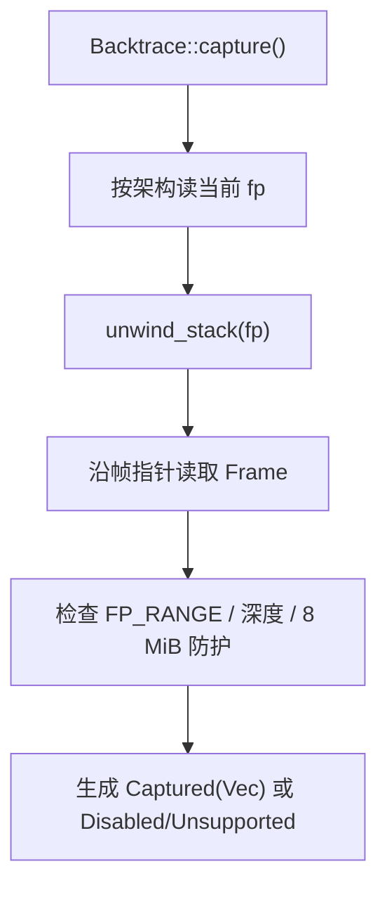
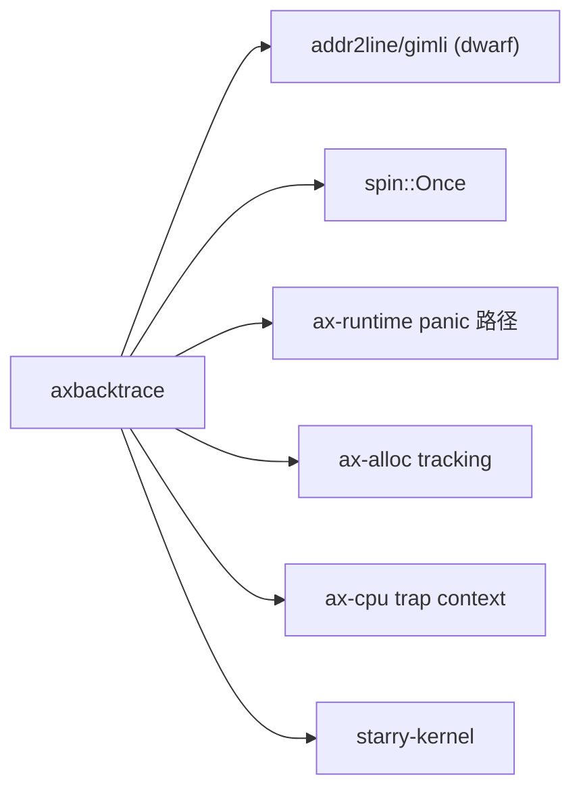

# `axbacktrace` 技术文档

> 路径：`components/axbacktrace`
> 类型：库 crate
> 分层：组件层 / 调试与回溯基础件
> 版本：`0.1.2`
> 文档依据：`Cargo.toml`、`src/lib.rs`、`src/dwarf.rs`

`axbacktrace` 为 ArceOS 体系提供栈回溯能力。它负责从当前上下文或 trap 上下文收集栈帧，并在启用 `dwarf` 时利用调试段做符号化输出。它属于调试叶子基础件：既不是 panic 处理器，也不是异常分发框架，更不是通用 DWARF 装载服务。

## 1. 架构设计分析
### 1.1 设计定位
`axbacktrace` 的职责非常聚焦：

- 向下，它依赖架构相关的帧指针读取和可选的 DWARF 调试段。
- 向上，它向 `ax-runtime` 的 panic 路径、`ax-alloc` 的 tracking 路径、`ax-cpu` 的 trap context 提供统一的 `Backtrace` 对象。
- 横向，它把“捕获栈帧”和“解析符号”拆成两个层次：不开 `dwarf` 仍可存在 `Backtrace`，但会退化为不可解析或禁用状态。

所以 `axbacktrace` 解决的是“如何得到并展示回溯”，而不是“何时触发 panic”“如何恢复异常”。

### 1.2 模块划分
- `src/lib.rs`：回溯入口、栈展开逻辑、`Backtrace` 状态机与架构相关帧指针读取。
- `src/dwarf.rs`：`dwarf` feature 下的符号化支持，负责从链接器暴露的 `.debug_*` 段初始化 `addr2line::Context`。

### 1.3 关键对象
- `Frame`：一帧的原始表示，包含 `fp` 与 `ip`。
- `Backtrace`：对外暴露的回溯对象。
- `Inner`：`Backtrace` 内部状态，区分 `Unsupported`、`Disabled` 与 `Captured(Vec<Frame>)`。
- `FrameIter`：只在 `dwarf` 下可用的符号化帧迭代器。
- `IP_RANGE` / `FP_RANGE`：初始化后保存合法代码区和合法帧指针区间。
- `MAX_DEPTH`：限制展开深度，默认 `32`。

### 1.4 栈展开主线
常规捕获路径如下：



源码里有几个重要细节：

- `Frame::OFFSET` 会因架构不同而变化，`x86_64`/`aarch64` 为 `0`，其他架构为 `1`。
- `unwind_stack()` 必须先看到 `FP_RANGE`，否则不会 panic，而是记日志并返回空向量。
- 为避免坏栈或损坏的帧指针无限追链，代码同时检查最大深度和“单步跳跃是否超过 8 MiB”。

### 1.5 trap 回溯与 DWARF 解析
- `capture_trap(fp, ip, ra)`：给 trap/异常上下文使用。`ax-cpu` 在 `x86_64`、`aarch64`、`riscv`、`loongarch64` 的 trap context 中都直接调用它。
- `dwarf::init()`：通过 `__start_debug_*` / `__stop_debug_*` 链接符号抓取 DWARF 段，并建立 `addr2line::Context`。
- `frames()`：只在 `dwarf` 打开时可用，返回的是“原始帧 + 解析后符号帧”的组合迭代器。

如果不开 `dwarf`，`Backtrace::capture()` 仍然可以返回 `Backtrace`，但其内部状态会是 `Disabled`，不会进行符号化。

## 2. 核心功能说明
### 2.1 主要功能
- 初始化可回溯的指令区/帧区。
- 从当前执行流捕获栈回溯。
- 从 trap 上下文捕获栈回溯。
- 在开启 `dwarf` 时把原始栈帧解析成函数名和源码位置。

### 2.2 关键 API 与真实使用位置
- `init(ip_range, fp_range)`：由 `ax-runtime/src/lib.rs` 在启动期调用。
- `Backtrace::capture()`：被 `ax-runtime/src/lang_items.rs` 的 panic 输出路径和 `ax-alloc/src/tracking.rs` 的分配跟踪路径直接调用。
- `Backtrace::capture_trap()`：被 `components/axcpu/src/*/context.rs` 的 trap context 直接调用。
- `frames()`：适合更精细的调试输出场景，但必须依赖 `dwarf` feature。

### 2.3 使用边界
- `axbacktrace` 不负责决定何时打印回溯；调用时机在 `ax-runtime`、`ax-cpu` 或其他上层模块。
- 它依赖帧指针链可用。若编译配置或架构路径不保留帧链，结果会受影响。
- 它不会替你解决符号段装载问题；`dwarf` 相关段必须真实存在于最终镜像里。

## 3. 依赖关系图谱


### 3.1 关键直接依赖
- `spin`：保存一次初始化的地址范围与 DWARF 上下文。
- `log`：初始化失败或未初始化时输出错误信息。
- `addr2line`、`gimli`、`paste`：只在 `dwarf` 下启用。

### 3.2 关键直接消费者
- `ax-runtime`：panic 和启动期初始化。
- `ax-alloc`：分配跟踪记录回溯。
- `ax-cpu`：trap 上下文回溯入口。
- `starry-kernel`：通过共享基础栈复用回溯能力。

## 4. 开发指南
### 4.1 依赖配置
```toml
[dependencies]
axbacktrace = { workspace = true, features = ["dwarf"] }
```

如果只需要保持接口存在而不做符号化，可不打开 `dwarf`。

### 4.2 修改时的关键约束
1. 修改架构相关帧指针读取逻辑时，必须同步检查 `capture()` 和 `capture_trap()` 两条路径。
2. 若调整 `Frame::OFFSET` 或 `adjust_ip()` 语义，需要一起核对 `addr2line` 解析结果是否仍正确。
3. 若扩展 `dwarf::init()` 支持的段集合，应确认链接脚本确实暴露了相应 `__start_*/__stop_*` 符号。
4. 不要把 panic、异常恢复或日志策略直接塞进 `axbacktrace`；这层只负责回溯对象本身。

### 4.3 开发建议
- 新增架构支持时，先确认该架构 trap context 能提供 `fp/ip/ra` 的合理来源。
- 需要更长回溯时优先调整 `set_max_depth()`，不要直接去掉边界检查。
- 如果只做 memtrack，不必强制依赖 `frames()`；原始 `Backtrace` 已足够做归档和打印。

## 5. 测试策略
### 5.1 当前测试形态
`axbacktrace` 本体没有独立单元测试，当前验证主要依赖真实运行路径：

- `ax-runtime` 的 panic 输出；
- `ax-cpu` 的 trap backtrace；
- `ax-alloc` tracking 对 `Backtrace::capture()` 的调用。

### 5.2 单元测试重点
- `Frame::read()` 与 `adjust_ip()` 的边界行为。
- `MAX_DEPTH` 限制和 8 MiB 防护。
- `capture_trap()` 在首帧 `ip` 不落在 `IP_RANGE` 时回退到 `ra` 的分支。

### 5.3 集成测试重点
- 打开 `dwarf` 后 panic 输出能解析出函数名和源码位置。
- trap 路径下四种已支持架构都能产出合理回溯。
- tracking 模式下大量分配不会因回溯记录导致递归崩溃。

### 5.4 覆盖率要求
- 对 `axbacktrace`，系统级可用性比局部行覆盖率更重要。
- 涉及新架构或 `dwarf` 初始化逻辑的改动，都应至少覆盖一条 panic 路径和一条 trap 路径。

## 6. 跨项目定位分析
### 6.1 ArceOS
在 ArceOS 中，`axbacktrace` 是 panic 输出和调试诊断的重要底层件。它自己不决定系统行为，但决定了出错时能不能看清调用链。

### 6.2 StarryOS
StarryOS 通过共享基础栈直接复用 `axbacktrace`。因此它在 StarryOS 中也是调试叶子件，而不是异常处理主控层。

### 6.3 Axvisor
当前仓库里 Axvisor 没有直接把 `axbacktrace` 作为顶层依赖暴露出来，但只要复用 `ax-cpu` 或共享 runtime 调试栈，这套回溯能力就会间接影响 hypervisor 侧的诊断体验。
