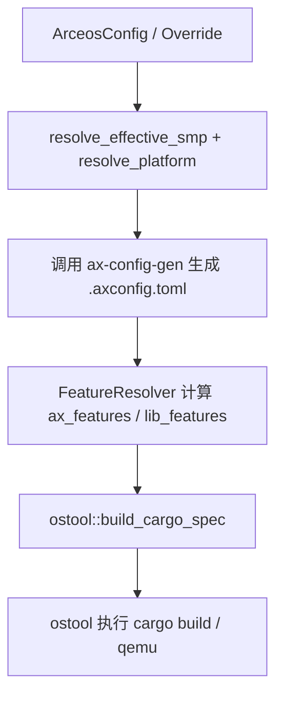
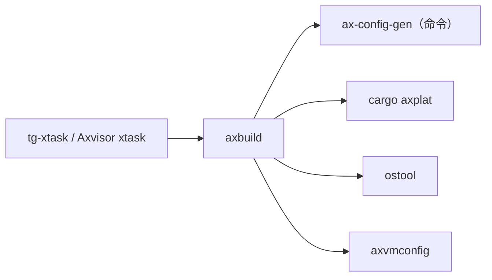

# `axbuild` 技术文档

> 路径：`scripts/axbuild`
> 类型：库 crate
> 分层：工具层 / 宿主侧构建与测试基础库
> 版本：`0.3.0-preview.3`
> 文档依据：`Cargo.toml`、`src/lib.rs`、`src/arceos/mod.rs`、`src/arceos/build.rs`、`src/arceos/ostool.rs`、`src/arceos/config.rs`、`src/arceos/features.rs`、`src/axvisor/image/mod.rs`、`src/axvisor/xtest/mod.rs`

`axbuild` 是当前工作区里承上启下的宿主侧构建基础库。它不属于目标镜像，也不参与内核热路径；它负责把“应用配置、平台配置、feature 装配、QEMU 参数、产物路径”这些宿主机侧信息整理成可执行的构建/运行计划，并将底层执行委托给 `ostool`、`ax-config-gen`、`cargo axplat` 等工具。

## 1. 架构设计分析
### 1.1 设计定位
`axbuild` 的最上层接口很简洁：

- `lib.rs` 只暴露两个子域：`arceos` 和 `axvisor`
- `arceos::AxBuild` 提供 `build()`、`run_qemu()`、`test()` 这组高层宿主侧动作
- `axvisor` 子模块提供镜像管理、QEMU 测试、开发空间与 VM 配置相关工具

这说明 `axbuild` 不是“一个 CLI”，而是“多个 CLI 共享的构建库”。当前根工作区 `tg-xtask`、以及 `os/axvisor` 的宿主侧命令，都是建立在它之上的。

### 1.2 ArceOS 构建链路
`arceos::build.rs` 展现了当前最关键的构建流程：

其中几个实现细节非常关键：

- `prepare_artifacts()` 会先解析架构、平台、SMP、内存、feature 等信息。
- `generate_config()` 会调用宿主机上的 `ax-config-gen` 命令，把 defconfig、平台配置和命令行覆写合成为 `.axconfig.toml`。
- `resolve_platform_config_path()` 会调用 `cargo axplat info` 找到平台配置文件。
- `is_c_app()` 会读取应用 `Cargo.toml`，通过是否出现 `ax-libc` 判断这是 C 应用还是 Rust 应用。

因此，`axbuild` 是把配置链、feature 链和实际构建链连接起来的中枢。

### 1.3 feature 装配的真实策略
`src/arceos/features.rs` 说明 `axbuild` 并不是简单把用户输入的 feature 原样透传给 Cargo，而是做了分层解析：

- `resolve_ax_features()` 只保留模块级 feature，例如 `defplat`、`myplat`、`plat-dyn`
- `resolve_lib_features()` 只保留库级 feature，例如 `fs`、`net`、`multitask`
- `build_features()` 在 `ostool.rs` 中再根据应用实际直接依赖的是 `ax-std` 还是 `ax-feat`，决定拼接前缀：
  - `ax-std/<feature>`
  - `ax-feat/<feature>`
  - `ax-libc/<feature>`

`detect_ax_feature_prefix_family()` 甚至会通过 `cargo metadata` 检查应用是否直接依赖 `ax-std` 或 `ax-feat`。这一步体现了 `axbuild` 对真实调用关系的感知，而不是纯字符串拼接。

### 1.4 宿主环境与目标环境的边界
`src/arceos/ostool.rs` 显式构造了目标构建所需的宿主环境变量：

- `AX_ARCH`
- `AX_PLATFORM`
- `AX_LOG`
- `AX_IP`
- `AX_GW`
- `AX_CONFIG_PATH`

同时还会按 `plat-dyn` 与否选择不同链接脚本参数。由此可以看到：

- `axbuild` 本身始终运行在宿主机
- 它只负责告诉 Cargo 和下游工具“该怎样构建目标”
- 它并不进入最终镜像，也不会在目标机上运行

### 1.5 Axvisor 工具子系统
`axbuild::axvisor` 不是简单附带模块，而是一套较完整的宿主侧工具集：

- `image`：镜像列表、下载、校验、解压、删除、同步
- `xtest`：根据架构和 VM 配置自动准备镜像并跑 QEMU 测试
- 其他模块：构建目录、VM 配置、命令分发、开发空间管理等

这使得 `axbuild` 同时服务 ArceOS/StarryOS 的统一构建和 Axvisor 的专用宿主工具链。

## 2. 核心功能说明
### 2.1 主要功能
- 解析和合并 ArceOS 构建配置。
- 生成 `.axconfig.toml`、必要的 `.qemu.toml` 等中间产物。
- 计算模块 feature 与库 feature 的正确装配方式。
- 调用 `ostool` 完成 `cargo build` 或 QEMU 运行。
- 为 Axvisor 提供镜像管理和 QEMU 测试辅助。

### 2.2 高层 API
在 ArceOS 侧，最核心的高层接口是：

- `AxBuild::from_overrides(...)`
- `AxBuild::build()`
- `AxBuild::run_qemu()`
- `AxBuild::test()`

这些接口都不直接执行复杂逻辑，而是进一步委托给：

- `Builder`
- `QemuRunner`
- `FeatureResolver`
- `PlatformResolver`
- `ostool` 桥接模块

### 2.3 与 `tg-xtask` 的关系
`tg-xtask` 负责用户交互和命令分派，`axbuild` 负责真正的构建编排。也就是说：

- `tg-xtask` 是前台 CLI
- `axbuild` 是后台构建库

两者经常一起出现，但职责边界非常明确。

## 3. 依赖关系图谱

### 3.1 关键直接依赖
- `ostool`：真正执行 cargo 构建和 QEMU 运行的底层桥接。
- `cargo_metadata`：用于解析工作区和依赖关系。
- `toml`、`serde`、`serde_json`、`schemars`：配置读写和结构化数据处理。
- `axvmconfig`：Axvisor VM 配置相关工具链依赖。
- `reqwest`、`flate2`、`tar`、`sha2`：Axvisor 镜像下载、解压和校验能力。

### 3.2 关键直接消费者
- 根工作区 `tg-xtask`
- `os/axvisor` 宿主侧命令

### 3.3 间接消费者
- ArceOS Rust 应用和 C 应用的构建流程
- StarryOS 构建/运行流程（通过根 `tg-xtask` 和 ArceOS 构建能力复用）
- Axvisor 的镜像测试流程

## 4. 开发指南
### 4.1 适合在这里修改的内容
- 宿主侧配置格式与覆写规则
- feature 计算与平台解析
- 中间产物生成逻辑
- QEMU 配置拼装
- Axvisor 宿主侧镜像与测试工具

### 4.2 修改时的关键约束
1. 不要把目标机运行时代码放进 `axbuild`，它必须保持宿主侧纯工具属性。
2. 改 feature 逻辑时，要同时检查 `FeatureResolver` 与 `ostool::build_features()`。
3. 改平台解析逻辑时，要一起检查 `cargo axplat info` 和链接脚本参数生成。
4. 改 `.axconfig.toml` 生成路径时，要确保 `AX_CONFIG_PATH` 环境变量同步更新。
5. C 应用与 Rust 应用的分流依赖 `is_c_app()`，相关逻辑改动要谨慎。

### 4.3 推荐验证路径
- 先跑单元测试，确认 feature、QEMU 参数和配置推导逻辑不回归。
- 再做一次最小 ArceOS 构建，确认 `.axconfig.toml` 能正确生成。
- 涉及 QEMU 行为时，再做一次宿主侧运行验证。
- 改 Axvisor 相关模块时，还应验证镜像下载或 xtest 流程。

## 5. 测试策略
### 5.1 当前测试形态
`axbuild` 已有较多宿主侧单元测试，主要分布在：

- `src/arceos/build.rs`
- `src/arceos/features.rs`
- `src/arceos/ostool.rs`
- `src/axvisor/image/spec.rs`

### 5.2 已覆盖的重点
- feature 解析与合并
- `plat-dyn`、SMP、默认平台等配置推导
- QEMU 默认参数构造
- `.qemu.toml` 生成条件
- Axvisor 镜像规格解析

### 5.3 建议继续加强的点
- `ax-config-gen` 调用失败时的错误路径
- `cargo axplat info` 失败时的诊断信息
- `is_c_app()` 对不同应用布局的识别
- Axvisor 镜像下载和解压的更细粒度测试

### 5.4 高风险改动
- feature 前缀探测逻辑
- 平台配置路径探测
- 构建环境变量与链接参数生成
- QEMU 测试自动化链路

## 6. 跨项目定位分析
### 6.1 ArceOS
对 ArceOS 来说，`axbuild` 是宿主侧构建总控：它把配置文件、平台选择、feature 装配、产物输出和 QEMU 运行串成一条一致的工具链。

### 6.2 StarryOS
StarryOS 通过根工作区的命令系统复用 `axbuild` 的 ArceOS 构建能力，因此它在 StarryOS 中承担的是“共享构建后端”角色，而不是 StarryOS 私有逻辑。

### 6.3 Axvisor
对 Axvisor 来说，`axbuild` 不只是通用构建库，还包含镜像下载和 xtest 等专用宿主工具模块。因此它在 Axvisor 侧既是公共基础设施，也是专用开发工具库，但始终停留在宿主机边界之外。
