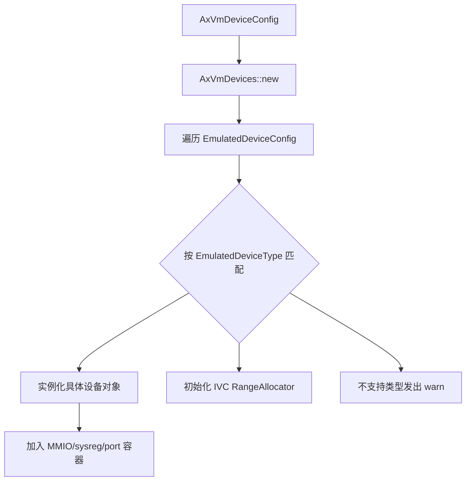
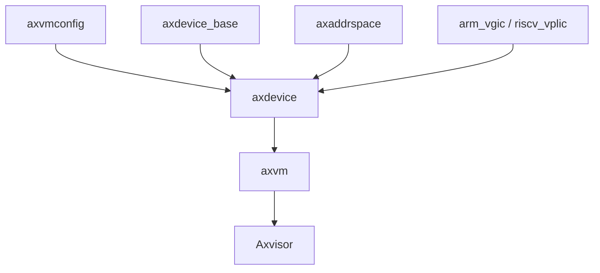

# `axdevice` 技术文档

> 路径：`components/axdevice`
> 类型：库 crate
> 分层：组件层 / 虚拟化设备分发层
> 版本：`0.2.1`
> 文档依据：当前仓库源码、`Cargo.toml`、`README.md`、`tests/test.rs` 及其在 `axvm` 中的调用关系

`axdevice` 是 Axvisor 虚拟化栈中的设备聚合与分发层。它不直接负责客户机地址空间映射，也不试图内建完整的模拟设备世界；它的核心职责是把 `axvmconfig` 描述的设备配置转化为一组 `BaseDeviceOps` 对象，并在运行期根据 MMIO、系统寄存器或端口访问地址，将 VM exit 精确转发给对应设备。

## 1. 架构设计分析

### 1.1 设计定位

`axdevice` 解决的是虚拟机设备栈中的两个问题：

- 配置侧：如何把“某个 VM 应该挂哪些模拟设备”从配置对象变成运行时设备集合。
- 运行侧：当 vCPU 因 MMIO、系统寄存器或端口访问退出时，如何快速将访问派发给正确的设备对象。

因此它处在一个很清晰的中间层位置：

- 向上承接 `axvm` 的 VM 生命周期和 VM exit 处理。
- 向下依赖 `axdevice_base` 的统一设备 trait，以及 `arm_vgic`、`riscv_vplic` 这类具体设备实现。
- 旁路与 `axaddrspace`、`axvmconfig` 协同，但不接管它们的职责。

特别要强调的是：**`axdevice` 不负责把 GPA 映射到 HPA，也不负责建立 Stage-2/EPT 映射。** 这些工作属于 `axvm` 和地址空间层。`axdevice` 只关心“某个地址落在哪个设备对象上，然后调它的 `handle_read/handle_write`”。

### 1.2 模块划分

| 模块 | 作用 | 关键内容 |
| --- | --- | --- |
| `config.rs` | 设备配置包装层 | `AxVmDeviceConfig`，内部持有 `Vec<EmulatedDeviceConfig>` |
| `device.rs` | 设备容器与运行时分发 | `AxEmuDevices<R>`、`AxVmDevices`、设备初始化、MMIO/sysreg/port 分发、IVC 区间分配 |
| `lib.rs` | 对外导出 | 仅导出 `AxVmDeviceConfig` 和 `AxVmDevices` |

这种结构有意保持极简：配置对象与运行时对象分离，但都不携带多余策略。

### 1.3 关键数据结构

#### `AxVmDeviceConfig`

`AxVmDeviceConfig` 是一个极薄的包装层，内部只有：

- `emu_configs: Vec<EmulatedDeviceConfig>`

它本身不解析 TOML，也不扩展配置语义，作用只是把 `axvmconfig` 提供的配置对象整理成 `AxVmDevices::new()` 的输入。

#### `AxEmuDevices<R>`

`AxEmuDevices<R>` 是 `axdevice` 的基础抽象，核心设计有三点：

- 使用 `Vec<Arc<dyn BaseDeviceOps<R>>>` 保存设备对象。
- 通过 `R: DeviceAddrRange` 泛化地址空间类型。
- 以 `find_dev()` 做线性查找，判断访问地址是否落在某设备的 `address_range()` 中。

这意味着：

- MMIO、系统寄存器、端口三类设备可以共用同一聚合逻辑。
- 设备查找是“按地址区间匹配的 first hit”，若区间重叠，顺序将影响行为。

#### `AxVmDevices`

`AxVmDevices` 表示某个 VM 私有的设备总表，内部包含：

- `emu_mmio_devices`
- `emu_sys_reg_devices`
- `emu_port_devices`
- `ivc_channel: Option<Mutex<RangeAllocator<usize>>>`

前三者决定地址访问分发，最后一个则是 Inter-VM Communication 区间分配器，用于在配置的 IVC GPA 范围内按 4K 对齐切片。

### 1.4 设备装配机制

`AxVmDevices::new()` 的核心流程是：



当前源码内建支持的类型主要集中在虚拟中断和 IVC：

| `EmulatedDeviceType` | 架构 | 行为 |
| --- | --- | --- |
| `InterruptController` | AArch64 | 实例化 `arm_vgic::Vgic` |
| `GPPTRedistributor` | AArch64 | 按 `cfg_list` 生成多个 `VGicR` |
| `GPPTDistributor` | AArch64 | 实例化 `VGicD` |
| `GPPTITS` | AArch64 | 实例化 `Gits` |
| `PPPTGlobal` | RISC-V | 实例化 `riscv_vplic::VPlicGlobal` |
| `IVCChannel` | 通用 | 初始化 GPA 区间分配器 |
| 其他类型 | 视情况 | 当前仅 `warn!`，不会自动生成设备对象 |

可以看到，`axdevice` 并不试图覆盖所有 `EmulatedDeviceType`，而是优先支撑当前虚拟化栈真正用到的设备类型。

### 1.5 运行时分发机制

运行期真正的关键路径在 `handle_*()` 族函数：

- `handle_mmio_read()` / `handle_mmio_write()`
- `handle_sys_reg_read()` / `handle_sys_reg_write()`
- `handle_port_read()` / `handle_port_write()`

每条路径都遵循同样的模式：

1. 根据访问地址调用 `find_*_dev()`。
2. 若命中设备，打印 trace 日志并转发到 `BaseDeviceOps::handle_read/handle_write()`。
3. 若未命中，调用 `panic_device_not_found()`，记录 error 后直接 panic。

这种策略有明确的工程取舍：

- 优点：错误暴露直接、实现简单、调试信号强。
- 代价：错误配置或地址重叠不会被温和兜底，而是以崩溃方式暴露。

### 1.6 与 `axvm`、`axdevice_base`、具体设备实现的边界

#### 与 `axdevice_base`

`axdevice` 不定义设备抽象协议本身，而是复用：

- `BaseMmioDeviceOps`
- `BaseSysRegDeviceOps`
- `BasePortDeviceOps`

也就是说，具体设备语义仍然属于下游设备 crate，`axdevice` 只是容器和路由层。

#### 与 `axvmconfig`

设备配置源自 `axvmconfig::EmulatedDeviceConfig` 与 `EmulatedDeviceType`。`axdevice` 只读取：

- `name`
- `emu_type`
- `base_gpa`
- `length`
- `cfg_list`

但不会负责配置来源解析或模式校验策略。

#### 与 `axvm`

`axvm` 才是 `axdevice` 的主要上层：

- `axvm` 负责构建客户机地址空间，建立线性映射和 Stage-2/EPT。
- `axvm` 负责在 vCPU 退出循环中把 `AxVCpuExitReason` 变成对 `AxVmDevices::handle_*()` 的调用。
- 某些附加设备（如系统寄存器设备）也可能在 `axvm` 层再通过 `add_sys_reg_dev()` 注入。

换言之，`axdevice` 是 per-VM device table，而 `axvm` 是把这个 table 纳入 VM 执行模型的调度者。

## 2. 核心功能说明

### 2.1 主要功能

- 以统一 API 构造某个 VM 的设备集合。
- 为 MMIO、系统寄存器、端口 IO 提供地址到设备对象的分发。
- 为 AArch64 自动接入 vGIC/GPPT 设备。
- 为 RISC-V 自动接入 `VPlicGlobal`。
- 管理 IVC GPA 区间的分配和释放。
- 提供设备遍历、附加注册和按地址查询接口，方便上层做后处理。

### 2.2 关键 API

最常用的对外 API 包括：

- `AxVmDeviceConfig::new()`
- `AxVmDevices::new()`
- `add_mmio_dev()` / `add_sys_reg_dev()` / `add_port_dev()`
- `find_mmio_dev()` / `find_sys_reg_dev()` / `find_port_dev()`
- `handle_mmio_read()` / `handle_mmio_write()`
- `handle_sys_reg_read()` / `handle_sys_reg_write()`
- `handle_port_read()` / `handle_port_write()`
- `alloc_ivc_channel()` / `release_ivc_channel()`

一个最小使用示意如下：

```rust
use axdevice::{AxVmDeviceConfig, AxVmDevices};

let config = AxVmDeviceConfig::new(vec![]);
let mut devices = AxVmDevices::new(config);

// 需要时手动注入额外 MMIO 设备
// devices.add_mmio_dev(my_dev);

// 在 VM exit 路径中分发
// let value = devices.handle_mmio_read(addr, width)?;
```

### 2.3 IVC 通道管理

`IVCChannel` 在本 crate 中不是一个 MMIO 设备对象，而是一个 GPA 区间分配器：

- 初始化时只建立 `RangeAllocator`。
- 分配和释放必须满足 4K 对齐。
- 重复声明多个 IVCChannel 配置时，仅首次生效，后续配置会被忽略并打印告警。

这说明 IVC 在 `axdevice` 眼中不是“模拟寄存器设备”，而是“被 VM 和管理程序共同使用的共享地址空间资源”。

## 3. 依赖关系图谱

### 3.1 直接依赖

| 依赖 | 作用 |
| --- | --- |
| `axdevice_base` | 统一设备 trait 定义 |
| `axvmconfig` | 设备配置和设备类型枚举 |
| `axaddrspace` | GPA、端口、系统寄存器地址类型与访问宽度 |
| `range-alloc-arceos` | IVC 区间分配 |
| `memory_addr` | 4K 对齐检查等辅助能力 |
| `ax-errno` | 统一错误类型 |
| `spin` | IVC 分配器锁 |
| `arm_vgic` | AArch64 虚拟 GIC 设备实现 |
| `riscv_vplic` | RISC-V 虚拟 PLIC 设备实现 |

### 3.2 主要消费者

- `components/axvm`：直接持有 `AxVmDevices` 并在 VM exit 中调用分发接口。
- `os/axvisor`：通过 `axvm` 间接消费，是当前仓库中的核心落地点。
- 测试代码：`tests/test.rs` 直接用 mock MMIO 设备验证分发语义。

### 3.3 关系示意



## 4. 开发指南

### 4.1 基本接入流程

1. 上层从配置源构造 `Vec<EmulatedDeviceConfig>`。
2. 用它创建 `AxVmDeviceConfig`，再创建 `AxVmDevices`。
3. 若某些设备不能由 `init()` 自动实例化，可在创建后调用 `add_mmio_dev()`、`add_sys_reg_dev()` 或 `add_port_dev()` 手工追加。
4. 在 vCPU 退出处理路径中，根据退出类型调用相应的 `handle_*()`。
5. 若需要共享内存式 IVC，再使用 `alloc_ivc_channel()` / `release_ivc_channel()` 管理地址段。

### 4.2 新增设备类型时的建议

若要扩展新的 `EmulatedDeviceType`，通常有两种方式：

- 在 `AxVmDevices::init()` 中增加 `match` 分支，让配置自动实例化。
- 保持 `axdevice` 不变，由上层在创建后手工 `add_*_dev()` 注入。

前者适合“该设备已成为体系内标准设备”；后者适合实验设备或只在单一产品中使用的设备。

### 4.3 维护注意事项

- `find_dev()` 是线性扫描，设备区间不应重叠，否则先注册者优先生效。
- 未命中的访问会 panic，因此配置必须与客户机设备树、页表映射和 exit 处理路径保持一致。
- `cfg_list` 语义完全由具体设备类型约定，例如 `GPPTRedistributor` 需要 `(cpu_num, stride, pcpu_id)`，`GPPTITS` 需要 `host_gits_base`。
- `x86_64` 目前没有本 crate 内建的自动实例化设备类型，若扩展 x86 设备，应明确是配置驱动还是手工注入。

### 4.4 构建与测试入口

可以直接执行：

```bash
cargo test -p axdevice
```

当前测试主要覆盖 MMIO 分发逻辑；更完整的验证仍需在 `axvm`/`Axvisor` 整机路径中完成。

## 5. 测试策略

### 5.1 当前已有测试

`tests/test.rs` 已覆盖两个关键场景：

- 注册 mock MMIO 设备后，验证 `handle_mmio_write()` 能把地址和数据正确转发到设备。
- 访问未注册地址时，验证 `handle_mmio_read()` 会触发预期 panic。

这两项测试虽然简单，但准确验证了 `axdevice` 最核心的职责：命中时分发，未命中时立即暴露错误。

### 5.2 建议补充的测试

- 地址重叠测试：验证重叠区间下 first-hit 语义，并决定是否需要显式拒绝重叠配置。
- IVC 分配测试：验证 4K 对齐约束、分配失败、重复释放等边界条件。
- 架构特定实例化测试：对 AArch64 的 GPPT 路径和 RISC-V 的 `PPPTGlobal` 路径做配置驱动初始化测试。
- 端口和系统寄存器分发测试：当前现有测试只覆盖了 MMIO。

### 5.3 风险点

- 自动实例化设备类型有限，若配置中出现大量未支持类型，系统可能“构建成功但设备未真正挂载”。
- 分发失败采用 panic 策略，虽然适合早期暴露问题，但在生产场景中需要更加严谨的配置回归。
- IVC 只做区间分配，不验证上层是否真的把该共享区映射给正确的 VM。

## 6. 跨项目定位分析

| 项目 | 位置 | 角色 | 核心作用 |
| --- | --- | --- | --- |
| ArceOS | 非内核通用模块 | 生态内虚拟化支撑组件 | ArceOS 本体并不直接依赖 `axdevice`，但在以 ArceOS 为宿主环境承载 Axvisor 时，它属于 hypervisor 侧关键组件 |
| StarryOS | 当前仓库内未见直接依赖 | 非核心路径 | StarryOS 在本仓库中没有直接消费 `axdevice` 的迹象，不宜把它描述为 StarryOS 常规组件 |
| Axvisor | 虚拟化主线核心部件 | 每 VM 设备表与 IO 分发中心 | 把配置、设备对象和 VM exit 处理连接起来，是 Axvisor 设备仿真路径的调度枢纽 |

## 7. 总结

`axdevice` 的价值在于“薄而关键”：它不负责所有事，但虚拟化设备链路里最关键的那一步恰恰由它完成，即把配置生成的设备集合转成可运行的 per-VM device table，并把各种 IO 退出精准分发到具体设备对象。对 Axvisor 来说，它是连接 `axvmconfig`、`axvm`、`arm_vgic`、`riscv_vplic` 和 IVC 机制的中枢层。
