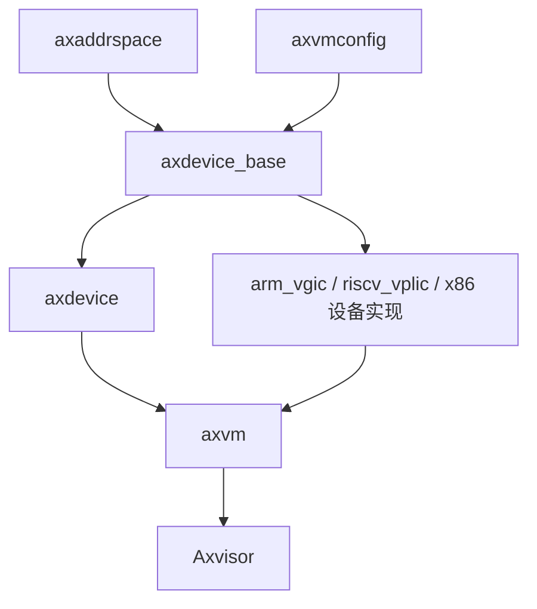

# `axdevice_base` 技术文档

> 路径：`components/axdevice_base`
> 类型：库 crate
> 分层：组件层 / 虚拟设备契约层
> 版本：`0.2.1`
> 文档依据：当前仓库源码、`Cargo.toml`、`README.md`、`src/lib.rs`、`src/test.rs` 及其在 `axdevice` / `axvm` / 设备 crate 中的引用关系

`axdevice_base` 是 Axvisor 设备栈中最薄、但边界最关键的基础库。它不创建设备、不维护设备表、不处理 VM exit，也不直接解释配置文件；它所做的事情是把“一个虚拟设备应当暴露什么接口”抽象成统一 trait，并按照 MMIO、系统寄存器、端口 I/O 三类地址访问路径提供稳定契约。

## 1. 架构设计分析

### 1.1 设计定位

在 Axvisor 设备链路中，各层职责可以粗略分为：

- `axvmconfig`：描述要挂哪些设备
- `axdevice`：根据配置构建设备集合并按地址分发
- `arm_vgic` / `riscv_vplic` / 其它具体设备 crate：实现设备语义
- `axdevice_base`：定义这些设备必须遵守的最小接口

因此，`axdevice_base` 的定位更接近“设备 ABI/trait 契约层”，而不是“设备管理框架”。

### 1.2 模块划分

该 crate 结构极简，几乎所有逻辑都集中在 `src/lib.rs`：

| 单元 | 作用 |
| --- | --- |
| `lib.rs` | 定义 `BaseDeviceOps`、地址类型别名、`EmulatedDeviceConfig`、`map_device_of_type()` |
| `test.rs` | 验证 trait object 上的类型识别与映射行为 |

没有复杂子模块树，符合其“薄契约层”的设计目标。

### 1.3 核心 trait：`BaseDeviceOps<R>`

`BaseDeviceOps<R>` 是本 crate 的核心，参数 `R` 由 `axaddrspace::device::DeviceAddrRange` 约束。它定义了所有设备共有的最小行为：

- `emu_type()`：返回设备类型
- `address_range()`：返回设备占用地址范围
- `handle_read()`：处理访客读访问
- `handle_write()`：处理访客写访问

这四个方法已经覆盖了大多数设备仿真路径的共性需求：

- 设备管理器需要知道设备是什么类型
- 分发层需要知道这个设备覆盖哪段地址
- VM exit 处理层需要在落到该设备后转发读写请求

值得注意的是，trait 还要求实现者可视为 `Any`，从而支持后续运行时 downcast。

### 1.4 三类地址路径与 trait alias

该 crate 并不重新定义地址模型，而是复用 `axaddrspace` 的设备地址类型，然后通过 trait alias 把三类设备路径固定下来：

- `BaseMmioDeviceOps = BaseDeviceOps<GuestPhysAddrRange>`
- `BaseSysRegDeviceOps = BaseDeviceOps<SysRegAddrRange>`
- `BasePortDeviceOps = BaseDeviceOps<PortRange>`

这意味着：

- MMIO 设备天然以 GPA 区间建模
- AArch64 系统寄存器类设备可以直接用 `SysRegAddrRange`
- x86 端口 I/O 设备可以直接用 `PortRange`

从设计上看，这让 `axdevice` 可以统一持有不同地址语义的设备对象，而不必为每种总线再重新发明接口。

### 1.5 `map_device_of_type()`：薄层中的“类型逃逸口”

`map_device_of_type()` 提供了一个非常关键的辅助能力：在只持有 `Arc<dyn BaseDeviceOps<R>>` 的前提下，尝试 downcast 到具体设备类型，再执行闭包。

这在抽象层与具体实现之间提供了一条受控的“类型逃逸口”：

- 正常分发仍使用 trait object
- 当上层必须访问设备特有能力时，可显式 downcast

仓库内最典型的用法之一，是 `axvm` 在特定路径上识别具体 `VGicD` 设备并做额外配置。

### 1.6 自带 `EmulatedDeviceConfig` 的边界问题

`axdevice_base` 还定义了一个自己的 `EmulatedDeviceConfig`：

- `base_ipa`
- `length`
- `irq_id`
- `emu_type: usize`
- `cfg_list`

但需要特别指出：**这并不是当前主配置链路中的那份设备配置结构。**

当前仓库里真正贯穿 `axvmconfig -> axdevice` 主线的，是 `axvmconfig::EmulatedDeviceConfig`，其字段语义和类型并不完全相同：

- 地址字段叫 `base_gpa`
- `emu_type` 是强类型枚举，而不是 `usize`

因此：

- `axdevice_base::EmulatedDeviceConfig` 更像对外发布或历史兼容残留的基础结构
- 当前主流水线主要消费的是 `axvmconfig` 版本

这点在写文档和实现新功能时都必须明确，否则很容易出现“看见两个同名配置结构但混用”的问题。

### 1.7 编译特性与工具链要求

该 crate 没有 Cargo feature，但启用了多个 nightly 能力：

- `trait_alias`
- `trait_upcasting`
- `generic_const_exprs`

其中 trait alias 直接用于定义三种设备接口别名，说明它虽然代码简单，但仍依赖较新的 Rust 语言特性。

## 2. 核心功能说明

### 2.1 主要功能

- 为虚拟设备定义统一读写接口
- 按 MMIO / sysreg / port 三类访问路径固化地址模型
- 重导出 `axvmconfig::EmulatedDeviceType` 作为统一设备类型枚举
- 提供 trait object 到具体设备类型的运行时映射工具

### 2.2 典型使用方式

具体设备实现者通常只需要实现对应的 `BaseDeviceOps<R>`：

```rust
impl BaseDeviceOps<GuestPhysAddrRange> for MyDevice {
    fn emu_type(&self) -> EmuDeviceType { EmuDeviceType::Dummy }
    fn address_range(&self) -> GuestPhysAddrRange { /* ... */ }
    fn handle_read(&self, addr: GuestPhysAddr, width: AccessWidth) -> AxResult<usize> { /* ... */ }
    fn handle_write(&self, addr: GuestPhysAddr, width: AccessWidth, val: usize) -> AxResult { /* ... */ }
}
```

而设备管理器或 VM 层则通常只保存 `Arc<dyn BaseMmioDeviceOps>` 等 trait object。

### 2.3 适用场景

- `arm_vgic`、`riscv_vplic` 等设备 crate 需要一个统一、轻量、`no_std` 的设备接口基类
- `axdevice` 需要用统一类型托管不同设备并按地址分发
- `axvm` 偶尔需要对特定设备类型做额外操作，但不希望把所有设备都暴露为具体类型

## 3. 依赖关系图谱

### 3.1 直接依赖

| 依赖 | 作用 |
| --- | --- |
| `axaddrspace` | 提供 `GuestPhysAddrRange`、`PortRange`、`SysRegAddrRange` 和 `AccessWidth` |
| `ax-errno` | 统一返回值类型 `AxResult` |
| `axvmconfig` | 重导出 `EmulatedDeviceType` |
| `serde` | 为本 crate 自带的 `EmulatedDeviceConfig` 提供序列化能力 |
| `memory_addr` | 地址生态依赖的一部分 |

### 3.2 主要消费者

- `axdevice`
- `axvm`
- `arm_vgic`
- `riscv_vplic`
- `x86_vcpu`
- `os/axvisor`

### 3.3 关系示意



## 4. 开发指南

### 4.1 新增设备时的建议

1. 根据访问路径选择实现 `BaseMmioDeviceOps`、`BaseSysRegDeviceOps` 或 `BasePortDeviceOps`。
2. 保证 `address_range()` 语义准确且不与其它设备重叠。
3. 在 `handle_read()` / `handle_write()` 中严格遵守 `AccessWidth` 语义。
4. 若上层后续需要访问设备的具体扩展接口，再考虑是否暴露给 `map_device_of_type()` 使用。

### 4.2 使用注意事项

- `BaseDeviceOps` 本身不解决并发问题，若设备可能被多 vCPU 同时访问，应由具体实现自行保证同步。
- `map_device_of_type()` 只是受控 downcast，不应被滥用为“绕过抽象层”的常规路径。
- 当前主配置链路优先使用 `axvmconfig::EmulatedDeviceConfig`，不要把本 crate 自带的同名结构误当成主输入格式。

### 4.3 何时修改本 crate，何时修改 `axdevice`

- 如果问题是“设备应该实现什么接口”，改 `axdevice_base`
- 如果问题是“设备如何被注册、查找、分发”，改 `axdevice`
- 如果问题是“某设备本身如何响应读写”，改具体设备 crate

## 5. 测试策略

### 5.1 当前已有测试

当前测试重点覆盖：

- 多个设备对象放入列表后的遍历逻辑
- `map_device_of_type()` 的成功 downcast 路径

虽然简单，但对这种薄契约库来说已经覆盖了最关键的自有逻辑。

### 5.2 推荐补充的测试

- `map_device_of_type()` 的失败路径测试
- 针对三种 trait alias 的编译期或最小运行期验证
- 配置文档一致性测试，明确 `axdevice_base::EmulatedDeviceConfig` 与 `axvmconfig::EmulatedDeviceConfig` 的边界

### 5.3 风险点

- 该 crate 很薄，因此任何小改动都会直接波及所有设备实现和设备管理路径。
- 双份 `EmulatedDeviceConfig` 语义容易造成理解偏差，是当前最值得在文档中高亮的风险之一。

## 6. 跨项目定位分析

| 项目 | 位置 | 角色 | 核心作用 |
| --- | --- | --- | --- |
| ArceOS | 宿主虚拟化生态组件 | 虚拟设备公共契约 | 普通 ArceOS 内核主线并不直接围绕它构建，但 Axvisor 运行在 ArceOS 宿主环境上时会依赖这层设备契约 |
| StarryOS | 当前仓库未见主线依赖 | 非核心路径 | 当前仓库中没有证据表明 StarryOS 直接围绕 `axdevice_base` 组织设备模型 |
| Axvisor | 设备栈底座 | 所有虚拟设备实现的统一接口层 | 为 `axdevice`、设备实现 crate 和 VM 管理层提供共同语言，是虚拟设备子系统的最底层契约 |

## 7. 总结

`axdevice_base` 的代码不多，但在架构上非常重要：它定义了虚拟设备世界里“最小公倍数”的接口，并让不同架构、不同总线语义的设备都能被统一托管和分发。对 Axvisor 来说，它就是设备栈最底下那层稳定接口面。
