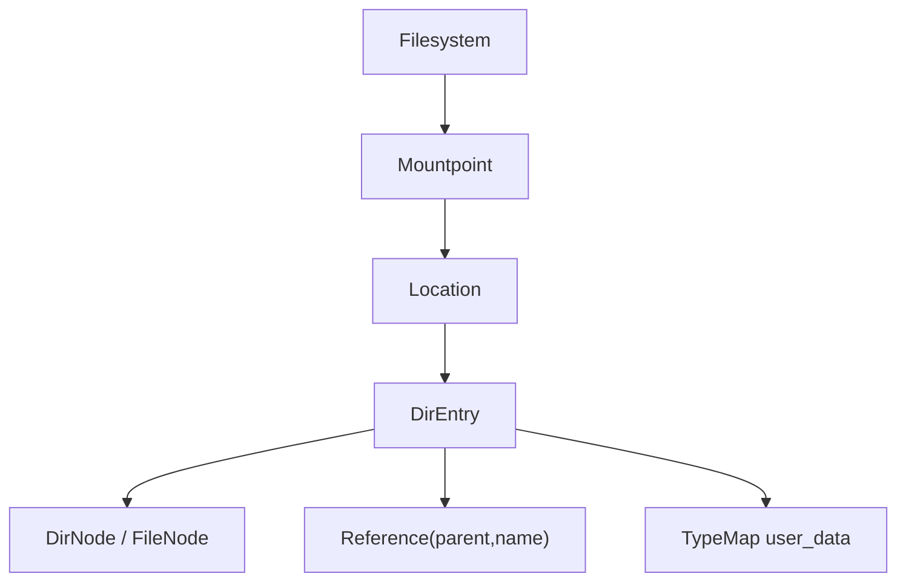
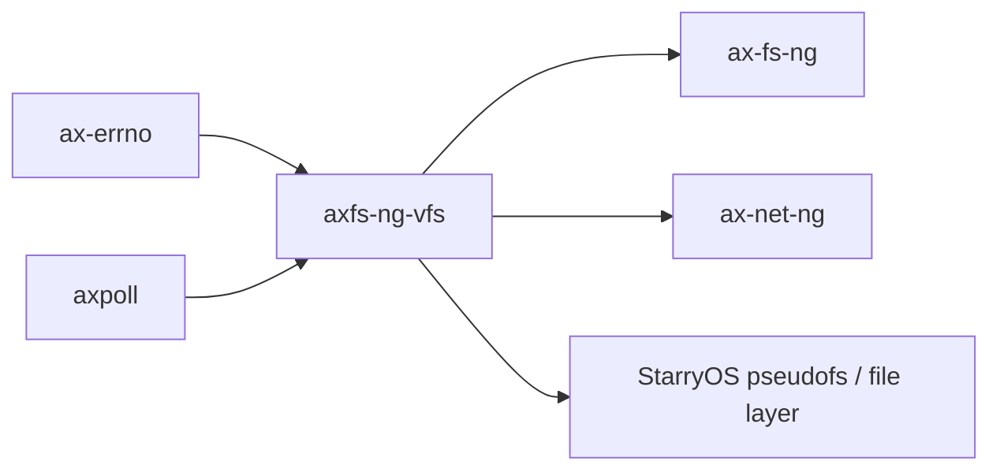

# `axfs-ng-vfs` 技术文档

> 路径：`components/axfs-ng-vfs`
> 类型：库 crate
> 分层：组件层 / 可复用基础组件
> 版本：`0.1.1`
> 文档依据：`Cargo.toml`、`src/lib.rs`、`src/fs.rs`、`src/mount.rs`、`src/node/mod.rs`、`src/node/dir.rs`、`src/node/file.rs`、`src/path.rs`、`src/types.rs`、`os/arceos/modules/axfs-ng/src/highlevel/file.rs`、`os/arceos/modules/axnet-ng/src/unix/mod.rs`、`os/StarryOS/kernel/src/pseudofs/mod.rs`

`axfs-ng-vfs` 是新文件系统栈真正的核心抽象层。它不是老 `axfs_vfs` 那种“只有一组 trait 的薄接口”，而是完整拥有 `Filesystem`、`Mountpoint`、`Location`、`DirEntry`、元数据模型、目录项缓存、挂载图与路径语义的对象模型库。

## 1. 架构设计分析
### 1.1 设计定位
`axfs-ng-vfs` 解决的是新栈里“怎样表达一个可挂载、可缓存、可携带元数据、可跨项目复用的 VFS 对象模型”。

它的定位可以分成三层理解：

- 对具体文件系统实现者：提供 `FilesystemOps`、`DirNodeOps`、`FileNodeOps` 三组 trait，作为 ext4、FAT、tmpfs、devfs、procfs 等后端的落点。
- 对高层文件接口：提供 `Location`、`Mountpoint`、`Metadata`、`NodeFlags`、`Path`/`PathBuf` 等“有状态对象”，让上层不必自己重新维护挂载树或路径解析。
- 对跨项目消费者：ArceOS 的 `ax-fs-ng`、`ax-net-ng` 的 Unix socket、StarryOS 的 pseudofs 都可以在同一套节点语义上工作。

### 1.2 模块划分
- `src/fs.rs`：定义 `FilesystemOps`、`Filesystem` 和 `StatFs`。这是“一个文件系统实例”的外部门面。
- `src/node/mod.rs`：定义 `NodeOps`、`DirEntry`、`Reference`、`TypeMap`、`NodeFlags` 等共用对象，是节点对象图的核心。
- `src/node/dir.rs`：定义 `DirNodeOps`、目录项缓存、挂载点引用与目录操作。
- `src/node/file.rs`：定义 `FileNodeOps` 与文件节点统一接口。
- `src/mount.rs`：定义 `Mountpoint`、`Location`、挂载/卸载/跨设备校验，是整套系统最关键的“名字空间层”。
- `src/path.rs`：提供 UTF-8 路径对象、组件迭代、规范化逻辑。
- `src/types.rs`：定义 `NodeType`、`NodePermission`、`Metadata`、`MetadataUpdate`、`DeviceId`。

### 1.3 核心对象关系
`axfs-ng-vfs` 的对象关系不是树上挂字符串，而是“对象图 + 引用”：



这里最重要的几个点是：

1. `Filesystem` 只代表“某个文件系统实例”，不包含它挂在全局什么位置。
2. `Mountpoint` 表示“某个文件系统挂载到名字空间后的实例”，同一文件系统理论上可以被挂到多个位置。
3. `Location` 才是上层真正拿来操作的“当前节点 + 当前挂载点”组合对象。
4. `DirEntry` 持有 `Reference(parent, name)`，因此能恢复绝对路径、父子关系和缓存 key。

### 1.4 关键机制
#### 挂载图与覆盖语义
`Location::mount()` 会在目录节点的 `mountpoint` 槽位里挂上新的 `Mountpoint`。`Location::resolve_mountpoint()` 则保证一旦走到某个挂载点根目录，就自动切入新的挂载树。`Mountpoint::effective_mountpoint()` 还能处理“同一路径被再次挂载覆盖”的情况。

#### 目录项缓存
`DirNode` 内部有 `cache: HashMap<String, DirEntry>`。如果后端 `is_cacheable()` 返回 `true`，重复 `lookup()` 会优先命中缓存；如果返回 `false`，每次都会打到后端实现。这正是动态 pseudofs 与稳定磁盘文件系统最重要的行为分界之一。

#### 跨设备约束
`Location::link()` 和 `Location::rename()` 都会检查源与目标是否位于同一 `Mountpoint`。因此“跨挂载点 hard link / rename”会被显式拒绝，而不是悄悄做成复制或半成功状态。

#### 每节点用户数据
`DirEntry::user_data()`/`Location::user_data()` 暴露了一个 `TypeMap`。这不是装饰性接口：

- `ax_fs_ng::CachedFile` 会把共享页缓存状态挂在这里。
- `ax-net-ng` 的 Unix socket 会把 `BindSlot` 挂在 socket 节点上。

也就是说，它是新栈跨层协作的重要扩展点。

### 1.5 与 `axfs_vfs` 的差异澄清
- `axfs_vfs` 只有 trait 和基础属性结构，不维护挂载图、路径上下文或元数据更新语义。
- `axfs-ng-vfs` 则显式拥有 `Mountpoint`、`Location`、`MetadataUpdate`、`NodeFlags`、`Pollable` 等一整套对象模型。
- `axfs_vfs` 更像“旧栈的 ABI 契约”，`axfs-ng-vfs` 更像“新栈的 VFS 运行时对象层”。

## 2. 核心功能说明
### 2.1 主要功能
- 表达文件系统实例与挂载点。
- 表达目录节点、文件节点和目录项引用。
- 提供跨挂载点路径解析、挂载与卸载。
- 提供完整的 Unix 风格元数据结构。
- 为上层缓存、轮询、socket 路径命名空间等场景预留节点级扩展点。

### 2.2 关键 API 语义
- `FilesystemOps`：后端文件系统需要实现的最小集合，包括 `name()`、`root_dir()`、`stat()`、可选 `flush()`。
- `DirNodeOps`：目录级操作，除 `lookup`/`create`/`unlink`/`rename` 外，还定义了 `is_cacheable()`。
- `FileNodeOps`：文件级操作，包括 `read_at`、`write_at`、`append`、`set_len`、`set_symlink`、`ioctl`。
- `Location`：高层统一入口，负责 `metadata()`、`absolute_path()`、`lookup_no_follow()`、`mount()`、`unmount()`、`read_dir()` 等。

### 2.3 实现层面的真实约束
- 路径类型是 UTF-8 的 `Path`/`PathBuf`，不是任意字节序列。
- `DirNodeOps::read_dir()` 的回调式 `DirEntrySink` 设计要求实现者避免在回调里再次递归访问同一目录，以免死锁。
- `unmount()` 只能作用在挂载点根节点；如果还有子挂载点，必须先清理，或者改用 `unmount_all()`。

### 2.4 真实使用场景
- `ax-fs-ng` 用它组织 ext4/FAT 根文件系统、任务局部 cwd 与页缓存共享。
- `ax-net-ng` 用它把 Unix socket 地址映射到文件节点。
- StarryOS 用它实现 `tmpfs`、`devfs`、`procfs`、`sysfs` 一类 pseudofs，并支撑文件系统调用层。

## 3. 依赖关系图谱


### 3.1 关键直接依赖
- `ax-errno`：统一错误类型。
- `axpoll`：文件/节点轮询接口。
- `spin`、`hashbrown`、`smallvec`：为目录项缓存、挂载点管理与轻量集合提供支撑。

### 3.2 关键直接消费者
- `ax-fs-ng`：最主要的高层消费者。
- `ax-net-ng`：把 socket 地址空间接到文件系统对象模型里。
- StarryOS：在 pseudofs、文件描述符层和设备节点模型中大量使用。

### 3.3 关键边界关系
- 具体文件系统实现依赖 `axfs-ng-vfs`，但不必了解更高层 `FsContext` 或页缓存。
- `axfs-ng-vfs` 自身不负责“块设备选择”或“默认根文件系统初始化”；那是 `ax-fs-ng` 的职责。

## 4. 开发指南
### 4.1 接入方式
```toml
[dependencies]
axfs-ng-vfs = { workspace = true }
```

### 4.2 设计与改动约束
1. 新文件系统后端至少应完整实现 `FilesystemOps` 与对应的 `DirNodeOps`/`FileNodeOps`。
2. `Reference(parent, name)` 必须保持正确，否则绝对路径、缓存 key 与挂载点父链都会出问题。
3. 动态目录若不希望缓存，请显式返回 `is_cacheable() -> false`。
4. 如果节点语义涉及流式读写、禁止页缓存或强制缓存，请用 `NodeFlags` 表达，不要让上层猜测。

### 4.3 开发建议
- 如果你的文件系统需要让多个高层对象共享状态，优先考虑 `user_data()`，不要额外维护全局表。
- 实现 `rename()` 时务必考虑目录替换、非空目录、祖先关系与跨设备限制。
- 实现 `read_dir()` 时要明确 offset 语义，因为高层迭代器会依赖它继续遍历。

## 5. 测试策略
### 5.1 当前测试形态
当前 crate 自带的显式测试主要集中在 `src/path.rs`，用于验证路径组件前后向遍历与 `file_name()` 语义。

### 5.2 建议的单元测试
- `Location::mount()`/`unmount()`/`unmount_all()`。
- 目录项缓存命中与失效。
- `rename()` 的跨设备拒绝与祖先目录保护。
- `user_data()` 在共享缓存与节点扩展中的生命周期。

### 5.3 建议的集成测试
- `ax-fs-ng` 的页缓存共享状态是否正确挂在 `user_data()` 上。
- Unix socket 路径绑定与 `BindSlot` 复用。
- StarryOS pseudofs 在多挂载点、多层目录和动态目录项下的行为。

### 5.4 高风险回归点
- 同一路径重复挂载后的覆盖语义。
- 子挂载点存在时的卸载。
- `is_cacheable()` 与目录项缓存的一致性。
- `absolute_path()` 在多层挂载链下的恢复结果。

## 6. 跨项目定位分析
### 6.1 ArceOS
`axfs-ng-vfs` 是 ArceOS 新文件系统栈的底层对象模型。`ax-fs-ng` 之所以能拥有更完整的路径、元数据和挂载语义，根基就在这里。

### 6.2 StarryOS
在 StarryOS 中，它的地位更接近“文件系统内核框架”。`tmpfs`、`devfs`、`procfs`、socket 路径命名空间、文件描述符层都直接建立在这套对象模型之上。

### 6.3 Axvisor
当前仓库里的 `os/axvisor` 没有直接使用 `axfs-ng-vfs`。因此它在这棵树中的跨项目定位主要是 ArceOS/StarryOS 共享的 VFS 核心，而不是 Axvisor 的公共基础层。
