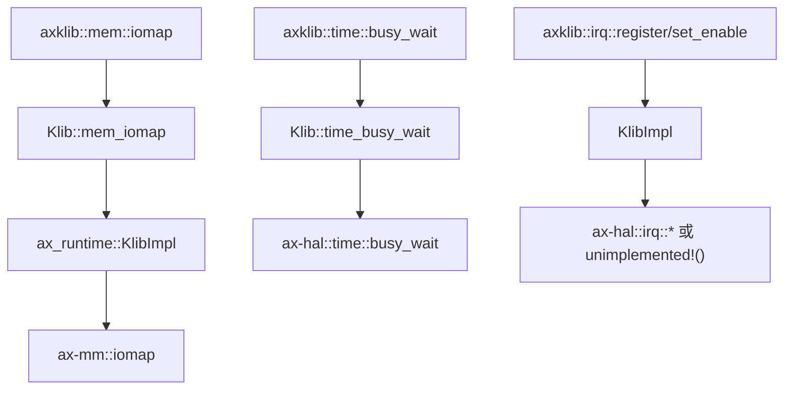
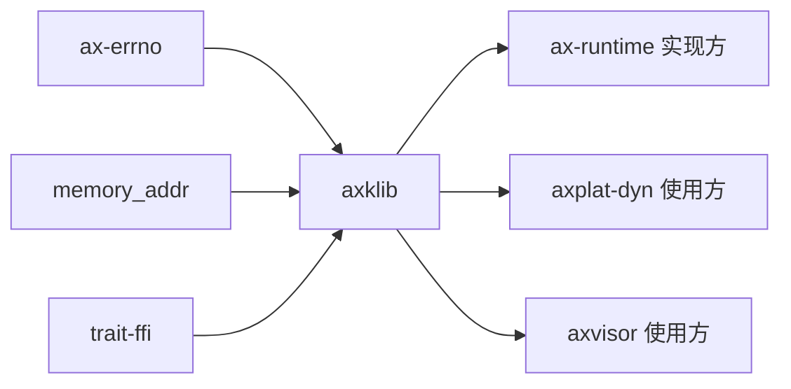

# `axklib` 技术文档

> 路径：`components/axklib`
> 类型：库 crate
> 分层：组件层 / 内核辅助 ABI 层
> 版本：`0.3.0`
> 文档依据：`Cargo.toml`、`README.md`、`src/lib.rs`

`axklib` 提供一组极小的内核辅助抽象：物理地址映射、busy-wait、IRQ 注册与开关。它通过 `trait-ffi` 把这些能力定义成稳定的小接口，再由不同运行时或平台层去实现。它是叶子基础件：不是驱动框架、不是内存管理器、也不是中断子系统，只是把少量“内核里反复会用到的 helper”抽出来形成 ABI。

## 1. 架构设计分析
### 1.1 设计定位
这个 crate 的设计重点不在“算法”，而在“接口尺度”：

- 能力必须足够小，方便不同运行时实现。
- 调用点必须足够直白，便于平台代码或驱动代码直接复用。
- ABI 必须尽量稳定，避免每个项目都重新发明一套 helper trait。

在当前仓库里，`ax-runtime/src/klib.rs` 就是 `axklib::Klib` 的一个真实实现方；`platform/axplat-dyn` 和 `os/axvisor` 的驱动代码则是典型使用方。

### 1.2 核心接口
`axklib` 只有一个核心 trait：

- `Klib`：
  - `mem_iomap(addr, size) -> AxResult<VirtAddr>`
  - `time_busy_wait(dur)`
  - `irq_set_enable(irq, enabled)`
  - `irq_register(irq, handler) -> bool`

同时它再导出三个 convenience 模块：

- `mem::iomap`
- `time::busy_wait`
- `irq::{register, set_enable}`

这意味着调用方通常不会显式操作 trait 对象，而是直接调用这些短名字函数。

### 1.3 类型与桥接方式
- `PhysAddr` / `VirtAddr`：直接复用 `memory_addr` 的地址类型。
- `AxResult`：复用 `ax-errno` 的错误结果类型。
- `IrqHandler`：简单的 `fn()` 函数指针。
- `#[def_extern_trait]`：由 `trait-ffi` 生成跨 crate 调用所需的桥接层。

因此，`axklib` 的本质更接近“trait ABI 定义”，而不是“helper 函数具体实现集合”。

### 1.4 真实实现主线
以 `ax-runtime/src/klib.rs` 为例，当前仓库里的实现关系是：



其中一个很重要的细节是：在 `ax-runtime` 当前实现里，如果没有打开 `irq` feature，`irq_set_enable()` 和 `irq_register()` 会直接 `unimplemented!()`。所以 `axklib` 本身提供的是接口承诺，不保证所有实现方在所有 feature 组合下都完整可用。

## 2. 核心功能说明
### 2.1 主要功能
- 为平台/运行时实现方定义最小 helper ABI。
- 为调用方提供简洁的 `mem`、`time`、`irq` 入口。
- 让 ArceOS 与 Axvisor 等项目共享一套极小的 helper 抽象。

### 2.2 关键 API 与真实使用位置
- `mem::iomap()`：被 `platform/axplat-dyn` 和 `os/axvisor/src/driver/*` 的驱动代码直接使用。
- `time::busy_wait()`：被 Axvisor 驱动中的短延时场景直接使用。
- `irq::register()` / `irq::set_enable()`：由具体运行时实现映射到 HAL。
- `Klib` trait：由 `os/arceos/modules/axruntime/src/klib.rs` 真实实现。

### 2.3 使用边界
- `axklib` 不是 `ax-mm` 的替代品；它只暴露 `iomap` 能力，不管理地址空间对象。
- `axklib` 不是 IRQ 框架；它只暴露最小 IRQ helper。
- `axklib` 也不是驱动模型；它只是给驱动/平台层提供几项共同 helper。

## 3. 依赖关系图谱


### 3.1 关键直接依赖
- `ax-errno`：统一错误结果类型。
- `memory_addr`：统一地址类型。
- `trait-ffi`：生成 trait 调用桥接。

### 3.2 关键直接消费者
- `ax-runtime`：当前 ArceOS 侧的主要实现方。
- `axplat-dyn`：动态平台与设备接入路径的调用方。
- `axvisor`：若干驱动直接通过 `axklib` 访问 iomap 与 busy-wait。

## 4. 开发指南
### 4.1 依赖配置
```toml
[dependencies]
axklib = { workspace = true }
```

### 4.2 修改时的关键约束
1. 修改 `Klib` trait 就是在改 ABI，必须同步检查全部实现方和调用方。
2. 新增 helper 前要先判断它是否真的足够“跨项目通用”；否则应放回具体项目内部。
3. `iomap` 的生命周期、是否需要释放、是否要求页对齐，都是实现方语义，调用方不能盲目假设完全一致。
4. IRQ 相关接口在不同 feature 组合下可能不可用，文档和调用方都要显式处理这件事。

### 4.3 开发建议
- 保持 trait 小而稳，避免把一堆高层策略接口塞进 `Klib`。
- 对驱动代码来说，优先依赖 `axklib::mem/time/irq` 入口，而不是硬编码某个具体运行时实现。
- 如果某项 helper 只服务单一项目，优先留在项目私有模块，而不是上升到 `axklib`。

## 5. 测试策略
### 5.1 当前测试形态
`axklib` 本体没有独立测试；当前验证主要依赖实现方和调用方：

- `ax-runtime` 对 `Klib` 的实现是否与 `ax-mm` / `ax-hal` 对齐；
- `axplat-dyn` 和 Axvisor 驱动是否能通过 `iomap`、`busy_wait` 正常工作。

### 5.2 单元测试重点
- trait 桥接代码的签名稳定性。
- `iomap`、`busy_wait`、IRQ helper 的参数与返回值契约。

### 5.3 集成测试重点
- ArceOS 运行时实现能否满足驱动和动态平台代码的需求。
- 在没有 `irq` feature 的组合下，调用方是否避免误用 IRQ helper。

### 5.4 覆盖率要求
- 对 `axklib`，接口兼容性覆盖比单纯行覆盖更重要。
- 凡是改动 `Klib` trait 或 convenience 模块导出的提交，都应补实现方与调用方的联动验证。

## 6. 跨项目定位分析
### 6.1 ArceOS
在 ArceOS 中，`axklib` 是 `ax-runtime` 对外提供的小型 helper ABI。它把 `ax-mm`、`ax-hal` 这些真实子系统收束成更容易复用的接口。

### 6.2 StarryOS
当前仓库里 StarryOS 没有把 `axklib` 作为直接主路径依赖来扩展自己的子系统，因此它在 StarryOS 侧更多是潜在共享基件，而不是现有系统层。

### 6.3 Axvisor
Axvisor 直接使用 `axklib` 访问 `iomap` 和短延时 helper。这里的 `axklib` 承担的是宿主侧通用 helper ABI，而不是 Hypervisor 驱动框架本体。
