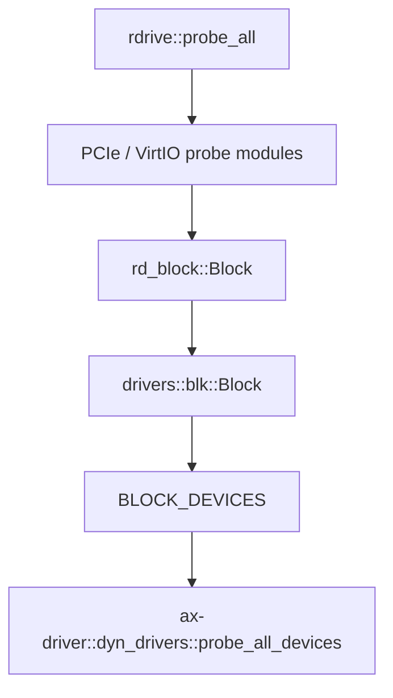
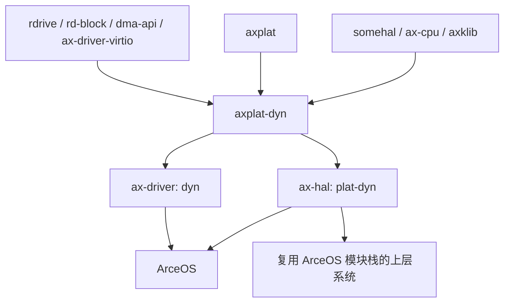

# `axplat-dyn` 技术文档

> 路径：`platform/axplat-dyn`
> 类型：库 crate
> 分层：平台层 / 动态平台桥接层
> 版本：`0.3.0-preview.3`
> 文档依据：当前仓库源码、`Cargo.toml`、`build.rs`、`link.ld` 及 `os/arceos/modules/axhal`/`ax-driver` 的接入路径

`axplat-dyn` 不是 `cargo-axplat` 生成的那类“用 `axconfig.toml` 固化板级常量”的常规 `axplat-*` 平台包。它更像一层桥接适配器：把 `somehal` 已经建立好的启动入口、FDT 地址、内存图、时钟、IRQ、电源与 SMP 元数据转译成 `axplat` 的统一契约；同时再补上一条 `ax-driver` 动态设备模型所需的设备探测与 DMA glue。这里的 `dyn` 真正表示“平台事实来自运行时抽象层和探测结果”，而不是“把平台包当作运行时可装卸模块加载”。

## 1. 架构设计分析

### 1.1 设计定位

`axplat-dyn` 在当前仓库里的位置可以概括为：

- 向下：依赖 `somehal` 提供的入口宏、内存映射、控制台、时钟、中断、电源和 CPU 元数据。
- 向上：实现 `InitIf`、`ConsoleIf`、`MemIf`、`TimeIf`、`PowerIf` 以及可选 `IrqIf`，并通过 `ax_plat::call_main()` / `call_secondary_main()` 把控制权交给内核入口。
- 向旁：公开 `drivers` 模块，为 `ax-driver` 的 `dyn` 设备模型提供基于 `rdrive` 的设备探测与块设备封装。
- 向链接层：通过 `build.rs` 生成 `axplat.x`，把 `linkme` 段、异常表和若干 ArceOS 约定符号补进最终镜像。

这决定了它与普通板级包的一个根本差异：

- 普通 `axplat-*` 平台包主要把编译期 `axconfig.toml` 变成板级常量，再围绕这些常量实现 `axplat` 接口。
- `axplat-dyn` 则把 `somehal` 暴露的运行时事实直接转成 `axplat` 接口，不以 `axconfig.toml` 为主线。

### 1.2 模块划分

| 模块 | 作用 | 关键内容 |
| --- | --- | --- |
| `lib.rs` | crate 根与装配层 | 裸机目标限定、模块导入、无 `irq` 时的空中断入口 |
| `boot` | 启动 glue | `#[somehal::entry(Kernel)]`、`#[somehal::secondary_entry]`、`Kernel` 的 `MmioOp` 实现 |
| `init` | `InitIf` 实现 | trap 初始化、计时器打开、`post_paging()`、后期 IRQ 打开 |
| `console` | `ConsoleIf` 实现 | 控制台读写、`\n` 到 `\r\n` 的串口兼容转换 |
| `mem` | `MemIf` 实现 | 从 `somehal::mem::memory_map()` 生成 RAM/保留区/MMIO 视图，导出 `_percpu_base_ptr` |
| `generic_timer` | `TimeIf` 实现 | tick/nanos 转换、定时器 IRQ 编号、one-shot 定时器 |
| `irq` | `IrqIf` 实现 | `HandlerTable<1024>`、启停 IRQ、注册/撤销、公共分发入口 |
| `power` | `PowerIf` 实现 | `cpu_boot()`、`system_off()`、`cpu_num()` |
| `drivers` | 动态设备探测 glue | `probe_all_devices()`、动态块设备注册表、DMA 适配、PCIe/VirtIO block 探测 |

### 1.3 平台实现装配方式

`axplat-dyn` 的实现不是单点完成的，而是由四层 glue 组合出来：

| 装配层 | 依赖来源 | 本 crate 的落点 | 作用 |
| --- | --- | --- | --- |
| 启动 glue | `somehal` | `boot.rs` | 把主核/次核入口收敛到 `ax_plat::call_main()` / `call_secondary_main()` |
| 平台契约 glue | `axplat` | `init.rs`、`console.rs`、`mem.rs`、`generic_timer.rs`、`irq.rs`、`power.rs` | 用 `#[impl_plat_interface]` 把 `somehal` 能力接到 `axplat` trait |
| 设备 glue | `rdrive`、`rd-block`、`ax-driver-virtio` | `drivers/*` | 把 FDT/PCIe/VirtIO 探测结果转成 `ax-driver` 可消费的动态块设备 |
| 链接 glue | `build.rs`、`link.ld` | crate 根目录 | 生成 `axplat.x`，插入所需段和符号，适配 ArceOS 链接约定 |

这套装配方式说明它承担的是“桥接与接线”职责，而不是“重新定义平台抽象”。

### 1.4 启动与初始化主线

`boot.rs` 给出的启动链很短，但责任很明确：

1. `#[somehal::entry(Kernel)]` 标记的 `main()` 作为主核入口。
2. 入口尝试从 `somehal::fdt_addr_phys()` 取得 FDT 物理地址，作为 `arg` 传给内核。
3. 主核统一跳到 `ax_plat::call_main(0, arg)`。
4. 若启用 `smp`，`#[somehal::secondary_entry]` 标记的次核入口会继续调用 `ax_plat::call_secondary_main(cpu_id)`。

```mermaid
flowchart TD
    A[somehal 主核入口] --> B[读取 FDT 物理地址]
    B --> C[ax_plat::call_main cpu0 arg]
    C --> D[#[ax_plat::main] 内核入口]
    D --> E[ax_plat::init::init_early]
    E --> F[内核前半初始化]
    F --> G[ax_plat::init::init_later]

    H[somehal 次核入口] --> I[ax_plat::call_secondary_main cpu_id]
```

`init.rs` 则把 `somehal` 已经具备的基础能力重新编排成 `axplat` 生命周期：

- `init_early()` / `init_early_secondary()`：初始化 trap，并打开基础计时器。
- `init_later()`：在分页建立更完整后调用 `somehal::post_paging()`，随后使能定时器 IRQ。
- `init_later_secondary()`：次核路径上只补做定时器 IRQ 使能。

这里有一个重要前提：`axplat-dyn` 默认假设“更早的架构级 bring-up 已经由 `somehal` 完成”，它不自己构造早期页表，也不自己处理最底层的 CPU 模式切换。

### 1.5 内存、时间、中断与电源 glue

#### 内存视图

`mem.rs` 直接遍历 `somehal::mem::memory_map()`，按 `MemoryType` 过滤出三类区间：

- `Free` -> `phys_ram_ranges()`
- `Reserved` / `KImage` / `PerCpuData` -> `reserved_phys_ram_ranges()`
- `Mmio` -> `mmio_ranges()`

这些结果被缓存到 `spin::Once<Vec<...>>` 中，说明该 crate 采用“首次查询时冻结运行时内存图”的策略，而不是每次重新探测。

地址转换和地址空间范围也完全委托给 `somehal`：

- `phys_to_virt()` / `virt_to_phys()` 直接转发到 `somehal::mem`
- `kernel_aspace()` 来自 `somehal::mem::kernel_space()`

此外，`_percpu_base_ptr()` 通过 `somehal::smp::percpu_data_ptr()` 向 `ax-percpu` crate 提供每核数据基址。这也解释了为什么 `ax-hal::mem` 在 `plat-dyn` 模式下不再额外注入一套传统平台包的内核保留区逻辑：此路径默认信任 `somehal` 给出的内存事实已经包含 `KImage` 和 `PerCpuData`。

#### 时间、中断与电源

`generic_timer.rs` 把 `somehal::timer` 接成 `ax_plat::time::TimeIf`：

- `current_ticks()` / `ticks_to_nanos()` / `nanos_to_ticks()`：直接围绕 `ticks()` 和 `freq()` 换算。
- `irq_num()`：取 `somehal::irq::systick_irq()`。
- `set_oneshot_timer()`：把绝对纳秒截止时间换成剩余 tick，再调用 `set_next_event_in_ticks()`。
- `epochoffset_nanos()`：当前固定返回 `0`，说明这里只提供单调计时语义，不额外注入墙钟偏移。

`irq.rs` 把 `HandlerTable<1024>` 和 `somehal` 的中断入口拼在一起：

- `register()` / `unregister()` 负责维护处理函数表并同步开关 IRQ。
- `handle()` 只负责报告当前正在处理的原始 IRQ 编号。
- 真正的公共中断入口是 `#[somehal::irq_handler] fn somehal_handle_irq(...)`，它再调用 `IRQ_HANDLER_TABLE.handle(...)` 进行分发。

也就是说，这里的 `IrqIf` 只接上了“注册表 + 分发桥”，底层 ACK/EOI 语义仍然由 `somehal` 负责。

`power.rs` 则相对直接：

- `cpu_boot()` 调用 `somehal::power::cpu_on(cpu_id)` 拉起次核。
- `system_off()` 调用 `somehal::power::shutdown()`。
- `cpu_num()` 通过 `somehal::smp::cpu_meta_list()` 统计 CPU 数。

这里还暴露出一个细节：`cpu_boot()` 当前忽略了 `stack_top_paddr` 参数，说明次核启动栈安排不是由 `axplat-dyn` 独立决定，而是纳入了 `somehal` 的启动协议。

### 1.6 动态设备探测路径

`drivers` 模块是 `axplat-dyn` 与普通平台包最不一样的部分之一。它不是简单地“列出 MMIO 区间”，而是主动承担一部分动态设备发现职责：

1. `probe_all_devices()` 先清空本地块设备注册表。
2. 调用 `rdrive::probe_all(true)` 触发探测。
3. `drivers/pci.rs` 通过 `module_driver!` 注册通用 PCIe ECAM 控制器探测器。
4. `drivers/blk/virtio.rs` 通过 `module_driver!` 注册 `virtio,mmio` block 设备探测器。
5. 探测出的 `rd_block::Block` 被包成实现 `ax_driver_block::BlockDriverOps` 的 `Block`，最终进入 `BLOCK_DEVICES`。
6. `os/arceos/modules/axdriver/src/dyn_drivers/mod.rs` 再通过 `take_block_devices()` 把它们取走，转成 `ax-driver` 的动态设备集合。



这一层的关键价值在于：

- `axplat-dyn` 不只是“平台初始化 glue”，还是 `ax-driver` 动态设备模型的探测前端。
- 当前有效覆盖面主要是块设备；网络、显示等类别并没有在本 crate 中提供同等级的动态探测路径。
- `VirtIO` block 路径里的 `enable_irq()` / `disable_irq()` 仍是 `todo!()`，说明它更偏向当前可用的基础探测和阻塞 I/O 路径，而非完整中断驱动栈。

### 1.7 与 `axplat`、`ax-plat-macros` 和工具链的边界

`axplat-dyn` 的边界必须明确区分：

- 与 `axplat` 的边界：`axplat` 定义的是稳定平台契约和入口调用面；`axplat-dyn` 只是其中一个实现者，并不改变接口定义。
- 与 `ax-plat-macros` 的边界：本 crate 不直接依赖 `ax-plat-macros`，只通过 `axplat` 重新导出的 `#[impl_plat_interface]` 和入口宏参与体系。
- 与 `somehal` 的边界：真正的“平台事实来源”在 `somehal`，包括入口、内存图、时钟、IRQ、电源与 CPU 元数据；`axplat-dyn` 负责转译，而不是重新探测 CPU 模式或自己管理整套启动环境。
- 与 `cargo-axplat` / `ax-config-gen` 的边界：当前源码中保留了一段被注释掉的 `config` 模块草稿，但现行实现并没有启用 `axconfig.toml -> AX_CONFIG_PATH -> include_configs!` 这条常规平台包主线，因此它不属于典型 `axplat-*` 配置化平台生态。

## 2. 核心功能说明

### 2.1 主要能力

- 作为 `somehal` 到 `axplat` 的桥接层，提供统一的启动、内存、时间、中断和电源接口实现。
- 通过 `build.rs + link.ld` 生成适配当前内核镜像的 `axplat.x` 链接脚本扩展。
- 让 `ax-hal` 可通过 `plat-dyn` feature 接入这一动态平台路径。
- 让 `ax-driver` 可通过 `dyn` feature 复用其设备探测与动态块设备封装。
- 通过 `hv`、`uspace`、`smp`、`irq` feature 把能力向 `somehal` 和 `axplat` 两侧传播。

### 2.2 feature 行为

| Feature | 作用 |
| --- | --- |
| `smp` | 透传到 `ax-plat/smp`，启用次核入口、次核初始化和 `cpu_boot()` 路径 |
| `irq` | 透传到 `ax-plat/irq`，编译 `irq.rs` 并启用 timer IRQ 相关接口 |
| `uspace` | 透传到 `somehal/uspace`，说明该路径允许 `somehal` 切换到含用户态支持的构建 |
| `hv` | 透传到 `somehal/hv` 与 `ax-cpu/arm-el2`，为 hypervisor 场景准备 CPU 模式支持 |

需要注意，默认 feature 就是 `["smp", "irq"]`，这意味着该 crate 被设计成优先服务多核且可中断的平台路径，而不是最小单核裸机包。

### 2.3 典型使用场景

- 需要把 `somehal` 管理的运行时平台事实快速挂接到 ArceOS `axplat`/`ax-hal` 栈。
- 需要配合 `ax-driver` 的 `dyn` 模型，在运行时探测并收集多实例块设备。
- 需要实验性地复用一套更“运行时驱动”的平台 bring-up 路径，而不是重新写一个静态 `axplat-*` 板级包。

## 3. 依赖关系图谱

### 3.1 直接依赖

| 依赖 | 作用 |
| --- | --- |
| `axplat` | 提供平台契约与 `call_main()` / `call_secondary_main()` |
| `somehal` | 提供真实平台事实与入口宏，是本 crate 的核心下层 |
| `ax-cpu` | 在 `hv` 等场景提供 CPU 模式支持 |
| `axklib` | 提供 `iomap()` 等内核内存映射辅助 |
| `ax-alloc` | 为 `VirtIO` DMA 路径提供页分配 |
| `rdrive`、`rd-block` | 提供运行时设备探测与块设备抽象 |
| `axdriver_block`、`ax-driver-virtio`、`ax-driver-base` | 将探测结果转接为 ArceOS 驱动接口 |
| `dma-api` | 为设备 DMA 提供抽象接口 |
| `heapless`、`spin` | 用于固定容量缓存与锁/一次初始化结构 |

### 3.2 主要消费者

- `os/arceos/modules/axhal`：通过 `plat-dyn` feature 选择该平台路径。
- `os/arceos/modules/axdriver`：通过 `dyn` feature 调用其动态设备探测入口。
- 进一步依赖上述模块的 ArceOS 系统镜像，以及复用同一模块栈的其它内核工程。

### 3.3 依赖关系示意



## 4. 开发指南

### 4.1 何时应使用这条路径

适合使用 `axplat-dyn` 的情况是：

- 你已经有 `somehal` 这层更底部的平台抽象，希望把它接进 `axplat`/`ax-hal`。
- 你需要的是“运行时探测 + 动态设备模型”，而不是“固定板级参数 + 静态平台包”。

不适合直接套用它的情况是：

- 你要新做一个常规 `axplat-*` 板级包，并希望走 `axconfig.toml` 配置化主线。
- 你需要一个完整的、已覆盖多类别设备的动态驱动模型。本 crate 当前主要只补齐了块设备路径。

### 4.2 接入主线

1. 在上层内核构建中启用 `ax-hal` 的 `plat-dyn` feature；若需要动态设备探测，再启用 `ax-driver` 的 `dyn` 相关 feature。
2. 确保目标是裸机环境，而不是 `unix`/`windows` 宿主机构建路径。
3. 让 `somehal` 提供入口、FDT、内存图、控制台、时钟、中断和电源实现。
4. 由 `boot.rs` 把控制流统一转到 `ax_plat::call_main()`，随后上层只通过 `axplat` 接口使用平台能力。
5. 若需要动态块设备，在适当阶段调用 `ax-driver::init_drivers()`，其内部会落到 `axplat_dyn::drivers::probe_all_devices()`。

### 4.3 维护注意事项

- `send_ipi()` 仍是 `todo!()`，因此不要把它误判为一条已经完成的 SMP IPI 路径。
- `VirtIO` block 的 IRQ enable/disable/handle 仍未完成，中断驱动块 I/O 不是当前实现重点。
- `build.rs` 生成的 `axplat.x` 会把 `__SMP` 固定替换成 `16`；若下层假设变化，需要同步检查链接脚本和启动约定。
- 当前 crate 根部有 `#![cfg(not(any(windows, unix)))]`，说明主机侧 `cargo test`/`cargo check` 不是它的主要验证面。
- 源码中虽保留了被注释掉的 `config` 模块草稿，但现行代码并不实际消费 `AX_CONFIG_PATH` 或 `axconfig.toml`。

## 5. 测试策略

### 5.1 当前有效验证面

- 裸机目标上的完整启动冒烟：确认 `somehal` 入口能贯通到 `ax_plat::call_main()`。
- 内存图验证：检查 `somehal::mem::memory_map()` 过滤出的 RAM、保留区和 MMIO 是否与上层预期一致。
- 计时器与 IRQ 验证：确认 `init_later()` 后 timer IRQ 真正可触发。
- 动态设备验证：确认 `ax-driver` 的 `dyn` 路径能从本 crate 获取块设备。

### 5.2 推荐测试分层

- 启动测试：验证主核、次核入口都能正确进入 `axplat` 入口函数。
- 契约测试：对 `InitIf`、`MemIf`、`TimeIf`、`PowerIf` 的桥接语义做最小集成回归。
- 设备测试：在含 `virtio,mmio` 或 PCIe ECAM 的环境下验证 `probe_all_devices()` 至少能发现块设备。
- 多核测试：在 `smp` 打开时验证 `cpu_boot()`、`_percpu_base_ptr()` 和 CPU 计数一致性。

### 5.3 重点风险

- 一旦 `somehal` 的内存图语义变化，`axplat-dyn` 的 RAM/保留区/MMIO 划分会整体漂移。
- 该 crate 同时承担“平台契约 glue”和“设备探测 glue”两类职责，回归面比普通平台包更宽。
- 当前动态设备路径主要覆盖块设备，若上层以为 `dyn` 模式天然涵盖所有设备类型，容易产生错误预期。

## 6. 跨项目定位分析

| 项目 | 位置 | 角色 | 核心作用 |
| --- | --- | --- | --- |
| ArceOS | `ax-hal`/`ax-driver` 的实验性平台路径 | 动态平台桥接层 | 把 `somehal` 与 `rdrive` 驱动式能力接到 ArceOS 标准平台/驱动抽象上 |
| StarryOS | 仅在复用同一模块栈时才可能间接接入 | 非默认平台包路径 | 它不是 `axplat_crates/platforms` 中那类标准发行平台包，只有在共享 ArceOS 底层模块时才会发挥作用 |
| Axvisor | 宿主侧若共享 `ax-hal`/`ax-driver` 路径时可复用 | 宿主 bring-up 桥接层 | 可为基于 ArceOS 模块栈的宿主环境提供动态平台 glue，但虚拟化核心并不在本 crate 中 |

## 7. 总结

`axplat-dyn` 的价值不在“又实现了一套新的板级常量配置”，而在它把 `somehal` 的运行时平台事实和 `rdrive` 的设备探测能力拼成了 `axplat`/`ax-driver` 能消费的标准形态。它既不是常规 `axplat-*` 平台包，也不是运行时装卸模块，而是一条面向动态平台事实和动态驱动模型的桥接路径。理解这一点，是读懂它与 `axplat`、`ax-plat-macros`、`cargo-axplat` 及上层构建系统边界的关键。
