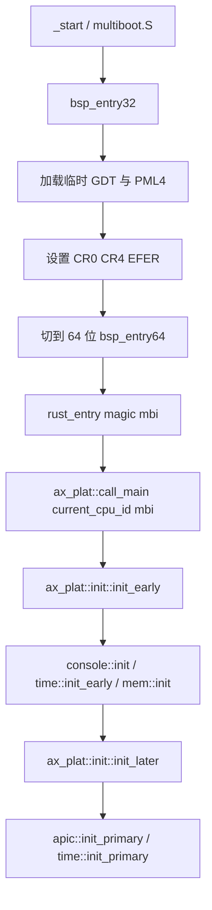
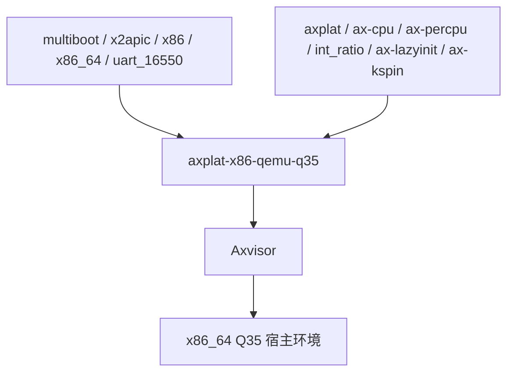

# `axplat-x86-qemu-q35` 技术文档

> 路径：`platform/x86-qemu-q35`
> 类型：库 crate
> 分层：平台层 / x86_64 Q35 板级平台包
> 版本：`0.2.0`
> 文档依据：当前仓库源码、`Cargo.toml`、`README.md`、`build.rs`、`linker.lds.S`、`src/lib.rs`、`src/boot.rs`、`src/multiboot.S`、`src/init.rs`、`src/mem.rs`、`src/console.rs`、`src/time.rs`、`src/apic.rs`、`src/mp.rs`、`src/power.rs`

`axplat-x86-qemu-q35` 是面向 QEMU Q35 机型的 x86_64 `axplat` 平台实现，当前主要服务于 Axvisor 的宿主侧启动路径。它把 Multiboot 引导、临时 GDT/页表、COM1 控制台、TSC/LAPIC/IOAPIC、AP 启动页、Q35 MMIO 窗口和关机/重启策略收敛成 `axplat` 契约。它不是通用 x86 PC 平台抽象，也不是虚拟化核心本身；它解决的是“Axvisor 在 Q35 这台机器上怎样把宿主环境带起来”的问题。

## 1. 架构设计分析

### 1.1 真实定位

这个 crate 和仓库里另一个 `ax-plat-x86-pc` 很容易被混淆，但它们的定位并不相同：

- `ax-plat-x86-pc` 位于 `components/axplat_crates`，更偏 ArceOS 侧的标准 PC 参考平台。
- `axplat-x86-qemu-q35` 位于根目录 `platform/`，是 Axvisor 当前 x86_64 宿主平台依赖。
- 前者走 `axplat_crates` 的常规平台组织方式；后者把 Q35 和 Axvisor 的构建约束直接内嵌进自己的 `build.rs` 与链接脚本。

它在平台栈中的职责可以概括为：

- 向下依赖 x86 架构库和 Multiboot 解析库。
- 向上实现 `ConsoleIf`、`InitIf`、`MemIf`、`TimeIf`、`IrqIf`、`PowerIf`。
- 通过 `build.rs` 和 `linker.lds.S` 在构建期注入内核基址与 CPU 数。
- 为 Axvisor 提供宿主侧最小板级环境，但不介入 VMX/EPT、VM exit 或虚拟设备模拟。

### 1.2 模块划分

| 模块 | 作用 | 关键内容 |
| --- | --- | --- |
| `boot` | 启动配置汇总 | Multiboot 常量、CR0/CR4/EFER 参数、启动栈和 `multiboot.S` 组合 |
| `multiboot.S` | 最早期入口 | 32 位到 64 位切换、临时 GDT/页表、主核/次核入口汇编 |
| `console` | `ConsoleIf` 实现 | COM1 串口收发 |
| `mem` | `MemIf` 实现 | Multiboot 内存图解析、MMIO 窗口、线性映射 |
| `time` | `TimeIf` 实现 | TSC 单调时间、可选 RTC、LAPIC one-shot timer |
| `apic` | `IrqIf` 实现核心 | LAPIC/x2APIC、IOAPIC、向量分发、IPI |
| `mp` | SMP bring-up | AP 启动页、INIT-SIPI-SIPI、栈与入口灌入 |
| `init` | `InitIf` 实现 | trap、串口、时间、内存、APIC 初始化顺序 |
| `power` | `PowerIf` 实现 | QEMU 关机/重启策略、次核启动封装 |

### 1.3 构建期配置与启动主线

这个平台包有一个和 `axplat_crates` 平台明显不同的地方：**它不是基于 `axconfig.toml` 生成配置，而是基于 `build.rs + linker.lds.S + 环境变量` 决定构建结果。**

构建期主要有两项关键配置：

- `BASE_ADDRESS`：由 `build.rs` 固定写入链接脚本，当前为 `0xffff800000200000`。
- `SMP`：由环境变量 `AXVISOR_SMP` 写入链接脚本，随后通过绝对符号 `SMP` 成为运行期 CPU 数。

`cpu_count()` 之所以能返回 CPU 数，正是因为它读取的是链接脚本中绝对符号 `SMP` 的地址值，而不是做运行时枚举。

启动主线如下：



这条链路里有几个实现事实需要特别注意：

- 临时页表使用 1 GiB huge page 同时建立低地址和高半区映射。
- `multiboot.S` 已经同时准备了 BSP 和 AP 的进入长模式路径。
- BSP 的第二个参数是 Multiboot 信息指针，不是设备树或 ACPI 句柄。
- 次核路径复用同一套高半区映射，只是在 `ap_start.S` 中先从低地址启动页进入。

### 1.4 内存与设备模型

`mem.rs` 的平台模型分为三层：

1. `mem::init(mbi)` 从 Multiboot 内存图提取 RAM 区间。
2. `reserved_phys_ram_ranges()` 固定保留低 `0x200000`，防止启动页、boot info 等低地址内容被拿去分配。
3. `MMIO_RANGES` 用常量写死 Q35 所需的关键窗口：
   - PCI config space
   - PCI devices window
   - IO APIC
   - HPET
   - Local APIC
   - 额外高地址 PCI 窗口

需要明确的是：

- 本 crate 只负责暴露这些窗口，不做 ACPI 解析。
- 它也不在本层完成 PCI 枚举或驱动装载。
- `phys_to_virt()` / `virt_to_phys()` 完全建立在固定 `PHYS_VIRT_OFFSET` 上。

### 1.5 与相邻层的边界

| 层 | 负责内容 | 不负责内容 |
| --- | --- | --- |
| `ax-cpu` | trap 初始化、停机等 CPU 原语 | Q35 MMIO 窗口、Multiboot 内存图解析、APIC/TSC/串口接线 |
| `axplat-x86-qemu-q35` | Multiboot 启动、COM1、TSC/LAPIC/IOAPIC、RAM/MMIO 描述、AP 启动 | VMX/EPT、虚拟设备、客户机管理、通用 HAL 聚合 |
| `axplat` | 统一平台契约与 `call_main()` / `call_secondary_main()` | Q35 板级实现细节 |
| `ax-hal` | 当前仓库里不是它的主要消费者 | 板级启动与 Q35 宿主环境 bring-up |
| Axvisor 虚拟化核心 | VCPU、VM exit、EPT、设备虚拟化 | 宿主侧 COM1/APIC/TSC/Multiboot 平台初始化 |

这里最重要的边界澄清是：**这个 crate 是 Axvisor 的宿主板级平台，而不是 Axvisor 的虚拟化核心。** 它负责把 x86_64 Q35 宿主机带起来，但不会负责任何客户机运行时语义。

### 1.6 与 `ax-plat-x86-pc` 的差异

| 维度 | `ax-plat-x86-pc` | `axplat-x86-qemu-q35` |
| --- | --- | --- |
| 代码位置 | `components/axplat_crates/platforms` | 根目录 `platform/` |
| 主要消费者 | ArceOS `ax-hal` 默认 x86 平台 | Axvisor x86_64 宿主平台 |
| 配置来源 | `axconfig` 体系 | `build.rs` + `linker.lds.S` + `AXVISOR_SMP` |
| 目标机型 | 标准 PC / Multiboot 参考实现 | QEMU Q35 明确机型 |

理解这点非常关键，否则很容易把两者都写成“又一个 x86 平台包”，从而写不出真实边界。

## 2. 核心功能说明

### 2.1 主要能力

- 通过 Multiboot 从 32 位进入 64 位长模式。
- 提供基于 COM1 的最小控制台。
- 从 Multiboot 信息解析 RAM 区间。
- 通过 LAPIC / IOAPIC 提供中断与 IPI。
- 通过 TSC 提供单调时间，通过可选 RTC 提供墙钟偏移。
- 通过低地址 AP 启动页和 INIT-SIPI-SIPI 实现次核 bring-up。
- 通过 QEMU 关机端口或键盘控制器重启实现电源语义。

### 2.2 feature 行为

| Feature | 作用 | 主要落点 |
| --- | --- | --- |
| `irq` | 编译 APIC/IOAPIC 中断路径和 LAPIC timer | `apic.rs`、`time.rs` |
| `smp` | 编译 AP 启动页和次核启动逻辑 | `multiboot.S`、`mp.rs`、`power.rs` |
| `rtc` | 通过 `x86_rtc` 生成墙钟偏移 | `time.rs` |
| `fp-simd` | 启动时在 CR4 中打开相关位 | `boot.rs`、`multiboot.S` |
| `reboot-on-system-off` | 让 `system_off()` 走“按键确认后重启”而不是 QEMU 关机端口 | `power.rs` |

当前默认 feature 已打开 `irq`、`smp` 和 `reboot-on-system-off`，这说明它默认假设自己服务的是一个需要多核和可恢复测试循环的 Axvisor 开发环境。

### 2.3 最关键的边界澄清

这个 crate 有几个看起来像“系统能力”、但其实只是“板级实现”的点：

- `cpu_count()` 是链接期常量，不是运行时 CPU 拓扑探测。
- `ConsoleIf::irq_num()` 返回 `None`，说明 COM1 输入不是通过中断语义暴露给 `axplat`。
- `TimeIf` 虽然提供 LAPIC one-shot timer，但源代码里还留有“需要用 HPET 校准”的 TODO，当前更偏工程可用而非精确校准完成态。
- `mem.rs` 只消费 Multiboot 内存图，不解析 ACPI，不发现 NUMA，也不接管 PCI 总线。

## 3. 依赖关系图谱

### 3.1 直接依赖

| 依赖 | 作用 |
| --- | --- |
| `axplat` | 平台抽象接口与统一入口契约 |
| `ax-cpu` | trap 初始化、停机等底层 CPU 原语 |
| `multiboot` | 解析 Multiboot 信息结构 |
| `uart_16550` | COM1 串口驱动 |
| `x2apic` | LAPIC / IOAPIC 访问 |
| `x86` / `x86_64` | 控制寄存器、MSR、端口和架构辅助 |
| `raw-cpuid` | 读取 APIC 与频率信息 |
| `x86_rtc` | `rtc` 打开时提供墙钟 |
| `ax-percpu` | 多核与局部状态配合 |
| `int_ratio` / `ax-lazyinit` / `ax-kspin` | 时间换算、全局对象初始化与锁 |
| `log` | 启动和调试日志 |

### 3.2 主要消费者

- `os/axvisor/Cargo.toml`：当前仓库内的直接依赖者。
- 任何以 Axvisor 为宿主、目标为 x86_64 Q35 的构建路径。

### 3.3 依赖关系示意



## 4. 开发指南

### 4.1 接入方式

当前仓库里的主要接入方式来自 Axvisor：

```toml
[target.'cfg(target_arch = "x86_64")'.dependencies]
axplat-x86-qemu-q35 = { version = "0.2.0", default-features = false, features = [
    "reboot-on-system-off",
    "irq",
    "smp",
] }
```

若单独验证平台包，可在构建前设置：

```bash
AXVISOR_SMP=4 cargo build -p axplat-x86-qemu-q35 --target x86_64-unknown-none
```

### 4.2 修改时需要成组验证的点

- 改 `build.rs` 或 `linker.lds.S`，就必须把它当成“启动链级变更”，至少回归内核基址、每 CPU 区和 `SMP` 绝对符号。
- 改 `multiboot.S` 时，必须同时验证 BSP 和 AP 入口；两者共享很多早期假设。
- 改 `mem.rs` 时，既要看 Multiboot 内存图解析，也要看低 2 MiB 保留和 MMIO 常量窗口。
- 改 `apic.rs` / `time.rs` 时，不能只测普通外部 IRQ；还要测 LAPIC timer 和 IPI。

### 4.3 特别需要注意的现实约束

- `time.rs` 里的 LAPIC timer 仍依赖经验值，真正高精度使用前最好补校准。
- `multiboot.S` 里使用 1 GiB huge page，源码已经注明某些宿主后端可能不支持。
- `reboot-on-system-off` 默认开启，意味着很多“关机测试”实际得到的是重启行为而非掉电。

## 5. 测试策略

### 5.1 当前有效验证面

- Axvisor x86_64 构建与 bring-up 是最直接的集成验证。
- Q35 + Multiboot 启动链可覆盖最早期引导、串口和内存解析。
- `AXVISOR_SMP` 提供了不同 CPU 数配置下的快速回归入口。

### 5.2 推荐测试矩阵

- 启动冒烟：验证 `_start -> ax_plat::call_main()`。
- 串口验证：确认 COM1 在最早期即可输出。
- 内存验证：确认 Multiboot RAM 解析和低 2 MiB 保留语义。
- IRQ 验证：确认 IOAPIC 外部中断、LAPIC timer 和 IPI 三条路径。
- SMP 验证：在不同 `AXVISOR_SMP` 值下验证 AP 启动。
- 电源验证：分别测试 `reboot-on-system-off` 开/关时的行为。
- RTC 验证：启用 `rtc` 后验证墙钟偏移。

### 5.3 高风险点

- `cpu_count()` 是链接期常量，若构建脚本与实际运行假设不一致，会导致非常隐蔽的多核错误。
- 1 GiB huge page 对某些宿主虚拟化后端兼容性有限。
- APIC timer 还未完成精确校准，时间相关测试不能过度依赖绝对精度。

## 6. 跨项目定位分析

| 项目 | 位置 | 角色 | 核心作用 |
| --- | --- | --- | --- |
| ArceOS | 当前无仓库内直接接入 | 潜在 x86 平台包 | 若未来要接入 ArceOS，需要额外完成 `ax-hal` 平台链路整合；当前并不是默认 x86 平台 |
| StarryOS | 当前无仓库内直接接入 | 潜在宿主平台基础 | 目前仓库中没有直接依赖，也不是 StarryOS 默认平台路径 |
| Axvisor | x86_64 宿主默认平台之一 | 宿主板级平台包 | 直接承担 Multiboot、串口、内存、APIC、时间和多核 bring-up，但不承担 VMX/EPT 等虚拟化核心职责 |

## 7. 总结

`axplat-x86-qemu-q35` 的真正价值，在于它把 Axvisor 在 x86_64 Q35 上的宿主 bring-up 路径压缩成了一份独立而清晰的 `axplat` 实现：配置从哪里来、CPU 数如何注入、Multiboot 怎样切到长模式、APIC 和 TSC 怎样接、Q35 的关键 MMIO 窗口有哪些。它不是通用 PC 平台的重复实现，更不是虚拟化核心，而是 Axvisor 宿主环境最底层的板级基座。
