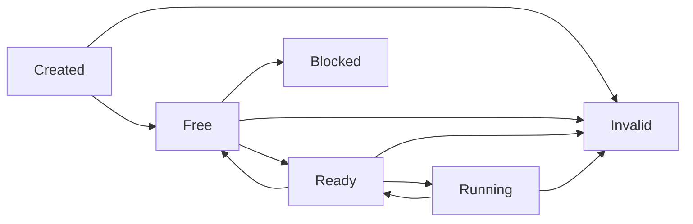
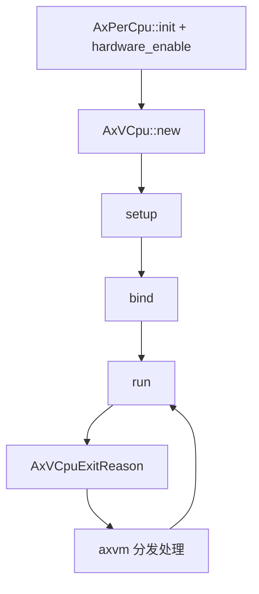
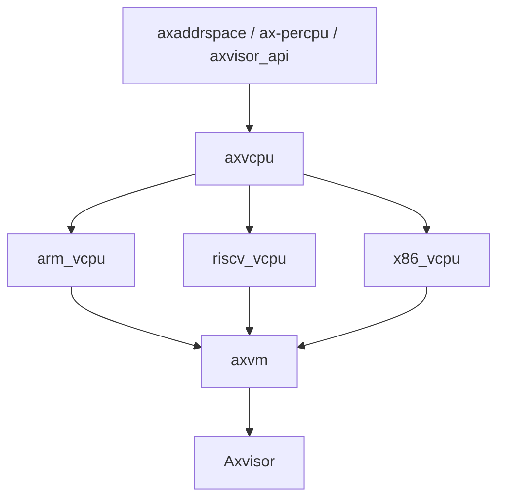

# `axvcpu` 技术文档

> 路径：`components/axvcpu`
> 类型：库 crate
> 分层：组件层 / 通用 vCPU 抽象
> 版本：`0.2.2`
> 文档依据：当前仓库源码、`Cargo.toml`、`README.md`、`src/vcpu.rs`、`src/arch_vcpu.rs`、`src/exit.rs`、`src/percpu.rs`、`src/hal.rs`

`axvcpu` 是 Axvisor 虚拟 CPU 子系统的架构无关抽象层。它并不直接实现 VMCS、EL2 寄存器切换或 RISC-V H 扩展细节，而是把这些架构相关逻辑收敛进 `AxArchVCpu` / `AxArchPerCpu` 两组 trait，由 `arm_vcpu`、`riscv_vcpu`、`x86_vcpu` 等后端实现；同时，它自己负责提供统一的 vCPU 生命周期、状态机、per-CPU 当前 vCPU 绑定、HAL 边界和统一 VM exit 枚举。

## 1. 架构设计分析

### 1.1 设计定位

如果把 Axvisor 的 vCPU 栈拆分，可以得到这样一条层次：

- `axvcpu`：定义“一个 vCPU 需要具备哪些行为”
- `arm_vcpu` / `riscv_vcpu` / `x86_vcpu`：实现这些行为
- `axvm`：组合具体架构实现，并把退出原因接入 VM 管理逻辑

这意味着 `axvcpu` 的核心价值不在于“控制硬件”，而在于：

- 把不同架构的 vCPU 后端抽象成统一接口
- 让 `axvm` 和更上层逻辑不必为不同架构写多套状态机和调度骨架
- 定义跨架构共用的 VM exit 语义

### 1.2 模块划分

| 模块 | 作用 | 关键内容 |
| --- | --- | --- |
| `vcpu.rs` | vCPU 外壳与状态机 | `AxVCpu<A>`、`VCpuState`、当前 vCPU 绑定、`bind/run/unbind` 主流程 |
| `arch_vcpu.rs` | 架构后端契约 | `AxArchVCpu` |
| `exit.rs` | 统一 VM exit 枚举 | `AxVCpuExitReason` |
| `hal.rs` | 宿主侧辅助契约 | `AxVCpuHal` |
| `percpu.rs` | 每核虚拟化状态抽象 | `AxArchPerCpu`、`AxPerCpu<A>` |
| `test.rs` | 单元测试 | Mock `AxArchVCpu` 与状态转移测试 |

这种划分很合理：`vcpu.rs` 负责 orchestration，`arch_vcpu.rs` 和 `percpu.rs` 负责抽象边界，`exit.rs` 负责跨层通信协议。

### 1.3 `AxArchVCpu`：架构后端的最小契约

`AxArchVCpu` 是本 crate 的第一核心 trait，要求各架构至少实现：

- `new()`
- `set_entry()`
- `set_ept_root()`
- `setup()`
- `run()`
- `bind()`
- `unbind()`
- `set_gpr()`
- `inject_interrupt()`
- `set_return_value()`

它故意把“创建”“安装入口”“安装二级页表根”“执行前准备”“绑定/解绑”“执行一次”“注入中断”拆成独立阶段，而不是只留一个 `run()`。这让不同架构即使内部机制差异巨大，也能用统一生命周期接入上层。

需要特别注意的是，`set_ept_root()` 这个名称是抽象层沿用的统一叫法，不代表所有架构都真的在操作 x86 EPT。例如 RISC-V 后端实际写的是 `hgatp`，但仍通过该名字接入统一接口。

### 1.4 `AxVCpu<A>`：架构无关外壳

`AxVCpu<A>` 是整个 crate 的第二核心对象，由三部分构成：

- `inner_const`：VM ID、vCPU ID、偏好物理 CPU、允许运行的 CPU mask 等不可变信息
- `inner_mut`：运行时状态机
- `arch_vcpu: UnsafeCell<A>`：架构后端实例

这里使用 `UnsafeCell<A>` 而不是 `RefCell<A>` 的原因很关键：进入 guest 执行后，不能依赖 Rust 守卫在预期时机释放，因此需要更贴近底层的可变性封装。

### 1.5 状态机设计

`VCpuState` 定义了显式状态：

- `Created`
- `Free`
- `Ready`
- `Running`
- `Blocked`
- `Invalid`

主状态转换路径是：

从源码看：

- `setup()`：`Created -> Free`
- `bind()`：`Free -> Ready`
- `run()`：`Ready -> Running -> Ready`
- `unbind()`：`Ready -> Free`

若状态不符合预期或操作失败，`with_state_transition()` 会把状态设置为 `Invalid`。这是一种非常直接的失败可见性策略，适合 hypervisor 早期实现阶段。

### 1.6 当前 vCPU 绑定机制

`vcpu.rs` 里使用 `ax_percpu::def_percpu` 定义：

- `CURRENT_VCPU: Option<*mut u8>`

并提供：

- `get_current_vcpu()`
- `get_current_vcpu_mut()`

在调用架构后端前，`AxVCpu` 会通过 `with_current_cpu_set()` 先把自己登记为当前物理 CPU 上的 current vCPU；架构后端因此可以在需要时反查外层 `AxVCpu`。

这个设计有两个好处：

- 架构后端实现无需在 trait 方法参数中额外传入外壳对象
- 对于“当前正在运行的是哪一个 vCPU”这种语义，可以统一通过 ax-percpu 状态查询

同时，源码显式禁止嵌套 `with_current_cpu_set()`，否则会 panic。这说明当前模型默认一个物理 CPU 在任意时刻只处理一个 vCPU 上下文。

### 1.7 `AxArchPerCpu` 与 `AxPerCpu`

除了 vCPU 实例本身，`axvcpu` 还定义了 per-CPU 级虚拟化状态抽象。

`AxArchPerCpu` 要求各架构实现：

- `new(cpu_id)`
- `is_enabled()`
- `hardware_enable()`
- `hardware_disable()`
- `max_guest_page_table_levels()`

`AxPerCpu<A>` 则是其通用包装层，提供：

- `new_uninit()`
- `init()`
- `arch_checked()`
- `hardware_enable()` / `hardware_disable()`

这说明 `axvcpu` 将“虚拟 CPU 执行状态”和“物理 CPU 上的虚拟化开关状态”明确拆开处理，而不是把后者隐式塞进 vCPU 对象里。

### 1.8 `AxVCpuExitReason`：统一 VM exit 语义

`exit.rs` 中的 `AxVCpuExitReason` 是连接架构后端和 `axvm` 的关键协议。当前枚举覆盖了几类主流退出原因：

- Hypercall：`Hypercall`
- 设备访问：`MmioRead`、`MmioWrite`、`SysRegRead`、`SysRegWrite`
- x86 端口 I/O：`IoRead`、`IoWrite`
- 中断与异常：`ExternalInterrupt`、`NestedPageFault`
- 电源与多核：`CpuUp`、`CpuDown`、`SystemDown`、`SendIPI`
- 执行控制：`Halt`、`Nothing`、`FailEntry`

它的重要性在于：

- 把各架构五花八门的 trap/exit 原因转换成统一的上层事件集
- 让 `axvm` 可以不关心 trap 来源，只关心该如何分发处理
- 为未来增加架构后端提供稳定接口面

值得一提的是，当前 README/历史示例里有些旧名字可能与源码不同，例如当前源码已经显式区分 `IoRead` / `IoWrite`，文档应以 `exit.rs` 为准。

### 1.9 `AxVCpuHal`：宿主侧辅助边界

`AxVCpuHal` 的职责比较窄，但很关键：

- 关联 `type MmHal: axaddrspace::AxMmHal`
- 提供 `irq_fetch()`
- 提供 `irq_hanlder()`

这里需要如实记录一个源码细节：方法名当前拼写为 `irq_hanlder`，而不是更自然的 `irq_handler`。这不影响接口使用，但对阅读和实现都应明确说明。

## 2. 核心功能说明

### 2.1 主要能力

- 为不同架构提供统一的 vCPU 生命周期外壳
- 维护显式的 vCPU 状态机
- 统一管理当前物理 CPU 上的 current vCPU 指针
- 定义跨架构统一 VM exit 语义
- 为每核虚拟化启停提供通用包装
- 为宿主 IRQ 和内存 HAL 提供统一注入口

### 2.2 典型执行流程

一个标准的 vCPU 生命周期通常是：

1. `AxVCpu::new()`
2. `setup(entry, ept_root, arch_setup_cfg)`
3. `bind()`
4. `run()`，得到 `AxVCpuExitReason`
5. 上层处理退出原因
6. 需要迁移或暂停时 `unbind()`

如果从更完整的系统角度看，则是：

### 2.3 典型使用场景

- `axvm` 在编译期根据目标架构选择具体 `AxArchVCpuImpl`
- `os/axvisor` 在物理 CPU 初始化阶段创建并启用 `AxPerCpu`
- 各架构后端通过 `AxVCpuExitReason` 把硬件 trap 语义翻译给 `axvm`

## 3. 依赖关系图谱

### 3.1 直接依赖

| 依赖 | 作用 |
| --- | --- |
| `ax-errno` | 错误模型 |
| `axaddrspace` | `GuestPhysAddr`、`HostPhysAddr` 与 `AxMmHal` |
| `axvisor_api` | `VMId`、`VCpuId` 等基础 ID 类型 |
| `ax-percpu` | current vCPU 与 per-CPU 虚拟化状态 |
| `memory_addr` | 地址相关基础类型 |

### 3.2 主要消费者

- `axvm`
- `arm_vcpu`
- `riscv_vcpu`
- `x86_vcpu`
- `os/axvisor`

### 3.3 关系示意

## 4. 开发指南

### 4.1 新增架构后端时的接入步骤

1. 实现 `AxArchVCpu`
2. 实现 `AxArchPerCpu`
3. 把架构 trap/exit 映射成 `AxVCpuExitReason`
4. 在 `axvm` 中通过 `cfg_if!` 把新后端接入 `AxArchVCpuImpl`
5. 在 `os/axvisor` 侧补齐 `AxVCpuHal` 或架构所需 HAL 绑定

### 4.2 使用注意事项

- `AxVCpu` 本身不是线程安全对象，调用者需要保证并发安全。
- `get_arch_vcpu()` 暴露的是底层可变引用，应优先通过外壳状态机方法访问，避免绕过状态管理。
- `set_entry()`、`set_ept_root()` 等名字来自通用抽象，阅读各架构实现时应结合实际硬件语义理解。
- 架构后端若在 `inject_interrupt()` 中需要排队缓冲，应自行实现，不要假定调用时 guest 一定正在运行。

### 4.3 测试与调试入口

单独验证该 crate 时，可以从其状态机和 mock 后端测试入手；整机验证则应关注：

- `setup -> bind -> run -> unbind` 是否按状态机推进
- `AxVCpuExitReason` 是否完整覆盖架构后端返回语义
- `CURRENT_VCPU` 是否在架构后端执行期间正确可见

## 5. 测试策略

### 5.1 当前已有测试

源码中已包含基于 mock `AxArchVCpu` 的单元测试，主要覆盖：

- 状态值和状态转移
- `AxVCpuExitReason` 的基本可用性
- 通用外壳逻辑

这对于验证架构无关层已经足够有代表性。

### 5.2 推荐补充的测试

- `with_current_cpu_set()` 的嵌套调用失败路径
- `bind/run/unbind` 与 current vCPU 指针联动测试
- `AxPerCpu` 的初始化、重复初始化和自动 `hardware_disable()` 行为
- 各架构后端到 `AxVCpuExitReason` 的映射一致性测试

### 5.3 风险点

- `AxVCpu` 是多层抽象的交汇点，若状态机语义变更，会同时波及所有架构后端和 `axvm`。
- `CURRENT_VCPU` 通过原始指针维护，虽然高效，但必须严格遵守调用约束。
- 抽象名称与具体架构实现之间存在语义差，例如 `set_ept_root()` 在非 x86 上只是统一接口名。

## 6. 跨项目定位分析

| 项目 | 位置 | 角色 | 核心作用 |
| --- | --- | --- | --- |
| ArceOS | 宿主虚拟化生态组件 | vCPU 抽象基础层 | 普通 ArceOS 内核主线不直接把它作为常规组件使用，但在 ArceOS 承载 Axvisor 时，它提供通用 vCPU 抽象 |
| StarryOS | 当前仓库未见直接主线接入 | 非核心路径 | 当前仓库中没有证据表明 StarryOS 直接围绕 `axvcpu` 组织运行时 |
| Axvisor | vCPU 主线核心基础件 | 架构无关 vCPU 外壳与退出协议 | 是 `arm_vcpu`、`riscv_vcpu`、`x86_vcpu` 与 `axvm` 之间的中间层，决定 vCPU 生命周期和 VM exit 协议长什么样 |

## 7. 总结

`axvcpu` 的核心贡献，是把各架构高度异构的 vCPU 执行后端压缩到一套统一抽象里：`AxArchVCpu` 负责硬件相关细节，`AxVCpu` 负责状态机和外壳语义，`AxVCpuExitReason` 负责向上沟通。对 Axvisor 来说，它就是“不同 CPU 架构的 vCPU 后端之上，统一的那一层”。
