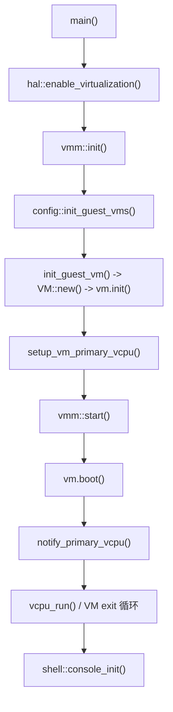
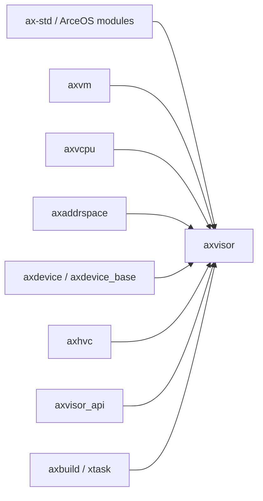

# `axvisor` 技术文档

> 路径：`os/axvisor`
> 类型：二进制 crate
> 分层：Axvisor 层 / Axvisor Hypervisor 运行时
> 版本：`0.3.0-preview.2`
> 文档依据：`Cargo.toml`、`README.md`、`src/main.rs`、`src/hal/*`、`src/vmm/*`、`src/task.rs`、`build.rs`、`xtask/*`、`configs/board/*`、`configs/vms/*`

`axvisor` 是本仓库中的 Type-I Hypervisor 主程序。它建立在 ArceOS 宿主运行时之上，通过 `axvm`、`axvcpu`、`axaddrspace`、`axdevice` 等组件实现客户机管理，并通过分层配置系统把“编译什么”和“运行哪个 guest”两件事统一到一套工作流中。

## 1. 架构设计分析
### 1.1 包结构与角色
`os/axvisor` 这个包同时承载两类实体：

- `src/main.rs` 对应的 **no_std Hypervisor 内核二进制**。
- `xtask/src/main.rs` 对应的 **宿主侧构建与运行工具**，通过 `[[bin]] name = "xtask"` 暴露。

真正的 Hypervisor 运行时逻辑集中在 `src/` 下，而 `xtask/` 负责构建配置、镜像准备、QEMU 启动与开发流程自动化。写文档时必须把这两层区分开，否则容易误把宿主 CLI 逻辑当成内核主线。

### 1.2 运行时模块划分
- `src/main.rs`：Hypervisor 主入口，按顺序执行 Logo 输出、虚拟化使能、VMM 初始化、VM 启动和控制台 shell。
- `src/hal/`：宿主 HAL 实现层，提供 `AxVMHalImpl`、`AxVCpuHalImpl`、`AxMmHalImpl`，并用 `axvisor_api::api_mod_impl` 注入 memory/time/vmm/host 能力。
- `src/vmm/`：VMM 核心，包括 VM 配置加载、镜像加载、VM 列表、vCPU 任务管理、hypercall、定时器、FDT 处理等。
- `src/task.rs`：定义 `VCpuTask`，把当前任务与 VM/vCPU 对象绑定，是 Hypervisor 并发模型与 `ax-task` 的结合点。
- `src/shell/`：交互式控制台与 VM 管理命令。
- `src/driver/`：宿主侧硬件驱动接入。

### 1.3 VMM 子模块划分
- `src/vmm/config.rs`：把 TOML 配置转成 `AxVMConfig`，分配内存、加载镜像并注册 VM。
- `src/vmm/vm_list.rs`：全局 VM 列表管理。
- `src/vmm/vcpus.rs`：为每个 VM 创建 vCPU 任务，维护等待队列并实现 `vcpu_run` 主循环。
- `src/vmm/images/`：镜像加载器，负责 kernel/DTB/initrd 等镜像装载。
- `src/vmm/fdt/`：AArch64 路径上的 FDT 解析与生成。
- `src/vmm/hvc.rs`、`src/vmm/ivc.rs`：hypercall 与 VM 间通信路径。
- `src/vmm/timer.rs`：虚拟机计时与时间服务桥接。

### 1.4 关键数据结构
- `VM` / `VMRef` / `VCpuRef`：在 `src/vmm/mod.rs` 中把 `axvm::AxVM<AxVMHalImpl, AxVCpuHalImpl>` 固定为工程内使用的 VM 类型。
- `VMStatus`：来自 `axvm`，在 Axvisor 中被作为控制台管理和生命周期判断的状态基础。
- `VCpuTask`：`TaskExt` 的实现，承载 VM 和 vCPU 引用，使当前任务能够识别自己属于哪个客户机。
- `VMM`：并非单独结构体，而是以模块级状态 + 等待队列 + VM 列表的形式实现的全局管理器。
- `AxVMCrateConfig` / `AxVMConfig`：前者贴近 VM TOML，后者是运行时 VM 创建的配置对象。
- `.build.toml` 与 `vm_configs`：不是 Rust 类型，但却是 Axvisor 行为的关键“外部数据结构”。

### 1.5 从 `main` 到 VM 启动的主线
Axvisor 的主线很短，但层次很深：



这条主线说明：

- `main()` 本身几乎不包含复杂业务。
- 复杂度集中在 `hal`、`vmm/config.rs`、`vmm/vcpus.rs` 和配置/镜像协同逻辑。

### 1.6 配置驱动机制
Axvisor 使用两层 TOML：

- `configs/board/*.toml`：板级/构建配置，决定目标架构、feature、日志级别、默认 `vm_configs` 等。
- `configs/vms/*.toml`：客户机配置，决定 VM id、CPU 数、内存区域、镜像路径、设备列表等。

对应的协同关系是：

1. `cargo xtask defconfig <board>` 把板级配置复制为 `.build.toml`。
2. `xtask` 把 `.build.toml` 中的 `vm_configs` 写入环境变量 `AXVISOR_VM_CONFIGS`。
3. `build.rs` 读取该变量，把 VM TOML 以静态字符串形式嵌入构建产物。
4. 运行时 `config::init_guest_vms()` 优先尝试文件系统中的 `/guest/vm_default/*.toml`，否则退回静态嵌入配置。

因此，Axvisor 的关键不是“只有代码”，而是“代码 + board config + vm config + 镜像资源”共同决定行为。

## 2. 核心功能说明
### 2.1 主要功能
- 宿主虚拟化能力初始化。
- 基于 TOML 配置创建和注册多个 VM。
- 为 VM 分配内存、加载 kernel/DTB/initrd/磁盘等镜像。
- 把每个 vCPU 映射为宿主任务并驱动其运行。
- 处理 VM exit、hypercall、外部中断、CPU up/down 等事件。
- 提供运行时控制台 shell。

### 2.2 关键 API / 主入口
- `main()`：运行时入口。
- `hal::enable_virtualization()`：每核虚拟化能力使能与宿主 HAL 建立。
- `vmm::init()`：加载 VM 配置并为 primary vCPU 建立任务。
- `config::init_guest_vms()`：VM 配置装载入口。
- `vmm::start()`：启动所有 VM 并等待运行中 VM 结束。
- `setup_vm_primary_vcpu()` / `notify_primary_vcpu()`：vCPU 任务建立与唤醒。
- `vcpu_run()`：Hypervisor 热路径。

### 2.3 典型使用场景
Axvisor 的典型场景不是“被别的 crate 调用”，而是：

- 作为宿主 Hypervisor 启动一个或多个 guest。
- 在开发流程中通过 `xtask` 切换板级配置、准备镜像并运行 QEMU。
- 在运行中通过 shell 查询与控制 VM 状态。

## 3. 依赖关系图谱


### 3.1 关键直接依赖
- `ax-std`：为 Hypervisor 提供宿主侧运行时，包括任务、内存、时间、SMP 和虚拟化 feature。
- `axvm`：VM 资源层。
- `axvcpu`：vCPU 抽象与执行路径。
- `axaddrspace`：客户机地址空间与映射。
- `axdevice`、`axdevice_base`：设备模型与设备访问。
- `axvisor_api`：底层虚拟化组件访问宿主能力的统一 API。
- `axbuild`：主要服务 `xtask` 路径，是构建工作流的重要依赖。

### 3.2 关键间接依赖
- `ax-hal`、`ax-task`、`ax-alloc`、`ax-mm` 等 ArceOS 模块会通过 `ax-std` 与 `hal` 注入路径间接参与 Hypervisor 运行。
- `arm_vcpu`、`arm_vgic`、`x86_vcpu`、`riscv_vcpu` 等底层组件会通过 `axvm`/`axvcpu` 间接进入虚拟化主线。

### 3.3 被依赖情况
`axvisor` 作为最终二进制包，当前仓库中没有其他 crate 再把它作为库依赖。它是虚拟化栈的终端产品，而不是中间层库。

## 4. 开发指南
### 4.1 接入方式
`axvisor` 不是普通库，一般不通过 `[dependencies]` 接入，而是通过它自己的构建工具链使用：

```bash
cd os/axvisor
cargo xtask defconfig qemu-aarch64
cargo xtask build
```

### 4.2 典型运行流程
```bash
cd os/axvisor
./scripts/setup_qemu.sh arceos

cargo xtask qemu \
  --build-config configs/board/qemu-aarch64.toml \
  --qemu-config .github/workflows/qemu-aarch64.toml \
  --vmconfigs tmp/vmconfigs/arceos-aarch64-qemu-smp1.generated.toml
```

### 4.3 开发重点建议
- 修改 `src/hal/*` 时，要同步检查 `axvisor_api` 注入接口和 `AxVMHalImpl` 是否仍满足 `axvm` / `axvcpu` 契约。
- 修改 `src/vmm/config.rs` 时，要同时检查配置解析、内存分配和镜像加载三条链。
- 修改 `src/vmm/vcpus.rs` 时，要把它视为 Hypervisor 热路径，重点关注等待队列、状态切换和 VM exit 处理。
- 修改 `build.rs` 或 `xtask` 时，要同步验证 `.build.toml`、`AXVISOR_VM_CONFIGS` 和静态嵌入配置的协同关系。

## 5. 测试策略
### 5.1 单元测试
Axvisor 本体更依赖系统级验证，但仍建议对以下逻辑补足可独立测试的部分：

- 配置解析与校验。
- 状态转换与错误恢复。
- `build.rs` 生成逻辑。
- `xtask` 命令参数与环境变量生成。

### 5.2 集成测试
Axvisor 的核心质量指标来自完整运行路径：

- 多架构构建。
- QEMU 启动与 guest 镜像装载。
- VM 创建、启动、停止和异常退出。
- 不同 board/vm config 组合。

仓库内已有 `.github/workflows/test-qemu.yml` 等 CI，可作为实际验证基线。

### 5.3 覆盖率要求
- 配置解析、镜像路径、VM 状态切换应保持高覆盖。
- `vcpu_run()` 涉及的高频退出原因必须由集成测试覆盖。
- 涉及板级配置、build.rs 或 HAL 的修改，必须至少跑一条完整 guest 启动路径。

## 6. 跨项目定位分析
### 6.1 ArceOS
Axvisor 构建在 ArceOS 之上。它并不替代 ArceOS，而是把 ArceOS 的任务、内存、时间、IRQ 和平台抽象作为宿主机基础设施来复用，因此它在 ArceOS 生态中的定位是“Hypervisor 产品层”。

### 6.2 StarryOS
当前仓库中 `axvisor` 不直接依赖 `starry-kernel`。二者的关系主要体现在生态层面：StarryOS 可以作为受支持的 guest 系统之一，而不是作为 Hypervisor 本体的内核组件。

### 6.3 Axvisor
这里的 `axvisor` 就是 Axvisor 工程本体本身。它把 `axvm` 等组件组织成可运行的 Hypervisor 产品，是整个虚拟化子系统的最终集成层、配置层和运行控制层。
