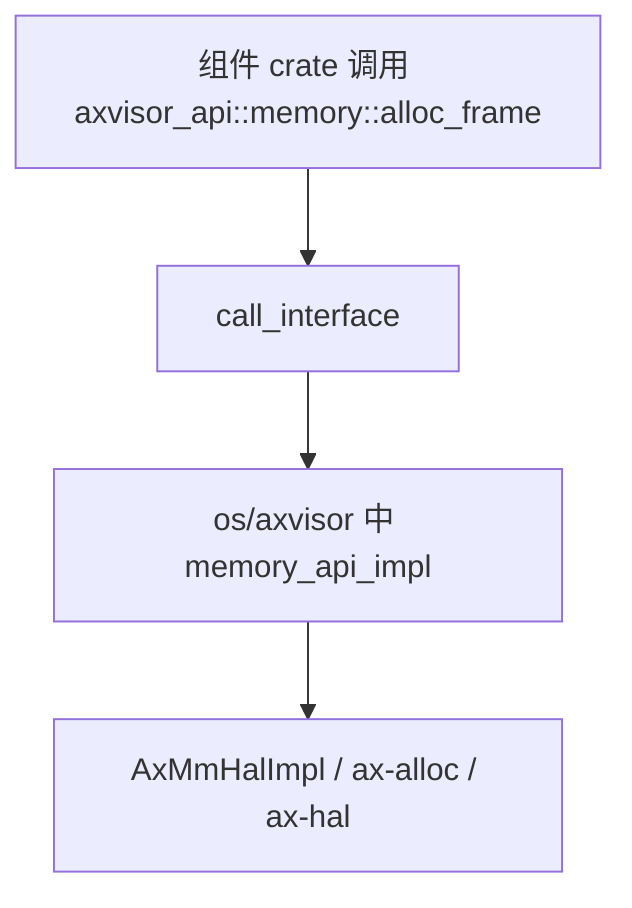
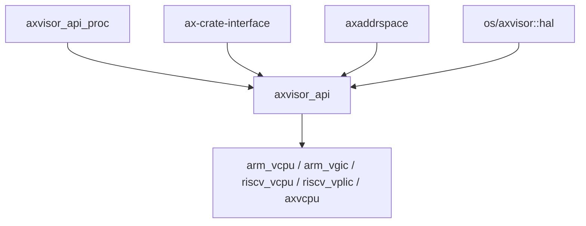

# `axvisor_api` 技术文档

> 路径：`components/axvisor_api`
> 类型：库 crate
> 分层：组件层 / Hypervisor 公共 API 契约层
> 版本：`0.1.0`
> 文档依据：当前仓库源码、`Cargo.toml`、`README.md`、`README.zh-cn.md`、`src/lib.rs`、`axvisor_api_proc` 与 `os/axvisor/src/hal/mod.rs`

`axvisor_api` 是 Axvisor 多 crate 架构中的“窄腰层”。它试图解决的问题不是页表、设备或 vCPU 本身，而是：在不把每个组件都做成泛型 HAL trait 大杂烩的前提下，如何把宿主 hypervisor 必须提供的能力统一暴露给 `arm_vcpu`、`riscv_vcpu`、`arm_vgic`、`axvcpu` 等组件。

## 1. 架构设计分析

### 1.1 设计定位

从源码和 README 看，`axvisor_api` 的设计目标非常明确：

- 定义一组所有 hypervisor 组件都能直接调用的普通 Rust API
- 这些 API 本身不由组件实现，而由最终的 hypervisor 或宿主侧 glue 层统一实现
- API 定义与实现通过 `ax-crate-interface` 连接，而不是通过泛型参数层层向上传播

这使它在架构上更接近“组件公共服务总线”，而不是传统意义上的 HAL trait 集合。

### 1.2 模块划分

`axvisor_api` 本体的模块划分很清晰：

| 模块 | 作用 | 关键内容 |
| --- | --- | --- |
| `memory` | 宿主内存能力 | 页帧分配/释放、连续页分配、PA/VA 转换、`AxMmHalApiImpl`、`PhysFrame` |
| `time` | 时间与定时器 | tick/nanos/time 转换、定时器注册与取消 |
| `vmm` | VM 管理 API | 当前 VM/vCPU ID、vCPU 数量、向 vCPU 注入中断 |
| `host` | 宿主全局信息 | CPU 数量 |
| `arch` | 架构相关扩展 | 当前仅 AArch64 的虚拟中断注入与 host GIC 信息 |
| `__priv` | 宏展开私有支撑 | `ax-crate-interface` 的内部重导出 |

除此之外，还有独立的过程宏 crate：

| 模块 | 作用 |
| --- | --- |
| `axvisor_api_proc` | 实现 `api_mod` 与 `api_mod_impl`，把模块中的 `extern fn` 转换成定义/调用/实现代码 |

### 1.3 `api_mod` / `api_mod_impl` 机制

这是本 crate 的核心创新点。

#### 定义侧：`#[api_mod]`

例如：

```rust
#[api_mod]
pub mod memory {
    extern fn alloc_frame() -> Option<PhysAddr>;
}
```

过程宏会把它转换成：

- 可直接调用的普通 `pub fn`
- 一组基于 `ax-crate-interface` 的 `def_interface` trait
- 对应的 `call_interface!` 调用桥

调用方因此只需要像调用普通函数那样使用 `axvisor_api::memory::alloc_frame()`。

#### 实现侧：`#[api_mod_impl(...)]`

实现方在 `os/axvisor` 中使用：

```rust
#[axvisor_api::api_mod_impl(axvisor_api::memory)]
mod memory_api_impl {
    extern fn alloc_frame() -> Option<HostPhysAddr> { /* ... */ }
}
```

过程宏会把它转成对相应 `ax-crate-interface` trait 的唯一实现。

这种机制的意义在于：

- 组件方只依赖 `axvisor_api`
- 实现方只需要在最终宿主环境注册一次
- 避免在每个 crate 上携带层层泛型 HAL 参数

### 1.4 与 `ax-crate-interface` 的关系

`axvisor_api` 不是从零实现这套动态绑定能力，而是在 `ax-crate-interface` 之上做了更友好的语法包装。

因此可以把它理解为：

- `ax-crate-interface`：底层机制
- `axvisor_api_proc`：面向 Axvisor 场景的语法糖
- `axvisor_api`：具体公共 API 的定义集合

### 1.5 当前 API 面的真实边界

从当前源码看，已经稳定暴露出的 API 主要是五组：

#### `memory`

- `alloc_frame()`
- `alloc_contiguous_frames()`
- `dealloc_frame()`
- `dealloc_contiguous_frames()`
- `phys_to_virt()`
- `virt_to_phys()`

此外还在模块内部定义了：

- `AxMmHalApiImpl`
- `PhysFrame = axaddrspace::PhysFrame<AxMmHalApiImpl>`

也就是说，`memory` 模块不仅暴露函数，还顺手把这套 API 接成了 `axaddrspace::AxMmHal` 可直接消费的形式。

#### `time`

- `current_ticks()`
- `ticks_to_nanos()`
- `nanos_to_ticks()`
- `register_timer()`
- `cancel_timer()`

以及几个纯函数包装：

- `current_time_nanos()`
- `current_time()`
- `ticks_to_time()`
- `time_to_ticks()`

#### `vmm`

- `current_vm_id()`
- `current_vcpu_id()`
- `vcpu_num()`
- `active_vcpus()`
- `inject_interrupt()`
- `notify_vcpu_timer_expired()`

需要注意的是，当前 `os/axvisor` 的实现中：

- `active_vcpus()` 仍是 `todo!()`
- `notify_vcpu_timer_expired()` 仍是 `todo!()`

因此这两个接口当前在契约层存在，但实现层尚未闭环。

#### `host`

- `get_host_cpu_num()`

#### `arch`

当前只在 `aarch64` 下暴露：

- `hardware_inject_virtual_interrupt()`
- `read_vgicd_typer()`
- `read_vgicd_iidr()`
- `get_host_gicd_base()`
- `get_host_gicr_base()`

这意味着 `arch` 是真正的架构扩展面，而不是“所有平台统一 API”。

### 1.6 与任务/调度边界

一个容易误解的点是：虽然很多 hypervisor 组件确实需要“当前 VM / 当前 vCPU / 当前任务”等上下文信息，但当前 `axvisor_api` 并 **没有** 单独的 `task` 模块。

现有设计中：

- 当前 VM/vCPU 查询经 `vmm` 模块提供
- 真正如何从宿主任务上下文中提取这些信息，则由 `os/axvisor` 的 HAL 实现层完成

这说明 `axvisor_api` 故意把接口面收得较窄，只暴露跨组件真正稳定的那部分能力。

## 2. 核心功能说明

### 2.1 主要能力

- 为 Axvisor 各组件提供统一内存 API
- 提供时间、定时器和 VMM 上下文 API
- 提供 AArch64 架构专用 API 扩展
- 通过过程宏把 API 定义和实现包装成普通函数风格
- 把宿主环境能力桥接进 `axaddrspace`、`arm_vcpu`、`riscv_vcpu`、`arm_vgic` 等组件

### 2.2 典型调用主线

一个典型的数据流是：



类似地：

- `riscv_vcpu`、`riscv_vplic` 使用 `memory::phys_to_virt()` 做宿主侧 MMIO 访问
- `arm_vcpu` 使用 `arch::hardware_inject_virtual_interrupt()` 走 AArch64 快速注入路径
- `axvcpu` 和其它组件通过 `vmm::current_vm_id()` / `current_vcpu_id()` 获取上下文

### 2.3 适用场景

- 组件需要访问宿主内存分配器，但不希望直接依赖 ArceOS 内核模块
- 组件需要读宿主时间或注册定时器
- vCPU/设备代码需要知道当前 VM/vCPU 或向其它 vCPU 注入中断
- AArch64 组件需要拿到 host GIC 信息或直接进行硬件虚拟中断注入

## 3. 依赖关系图谱

### 3.1 直接依赖

| 依赖 | 作用 |
| --- | --- |
| `axvisor_api_proc` | `api_mod` / `api_mod_impl` 过程宏 |
| `ax-crate-interface` | 定义和调用接口的底层机制 |
| `memory_addr` | 基础地址类型 |
| `axaddrspace` | `AxMmHal` 与 `PhysFrame` 桥接 |

### 3.2 主要消费者

- `arm_vcpu`
- `arm_vgic`
- `riscv_vcpu`
- `riscv_vplic`
- `x86_vcpu`
- `axvcpu`
- `os/axvisor` 同时也是实现方

### 3.3 关系示意



## 4. 开发指南

### 4.1 新增 API 的步骤

1. 在 `axvisor_api/src/lib.rs` 中新建或扩展一个 `#[api_mod]` 模块
2. 用 `extern fn` 形式声明 API
3. 在 `os/axvisor/src/hal/mod.rs` 或相应架构实现文件中添加 `#[api_mod_impl(...)]` 模块
4. 在消费该 API 的组件中直接调用模块函数
5. 若该 API 面向特定架构，应显式加上 `#[cfg(target_arch = ...)]`

### 4.2 设计注意事项

- 若某个能力只在最终宿主环境中有意义，但调用方很多，适合放进 `axvisor_api`
- 若某个能力是单个 crate 的内部细节，则不应轻易抬升到公共 API 层
- `api_mod` 的定义本质上依赖链接期唯一实现，因此新增 API 时必须同步补实现

### 4.3 当前实现上的注意事项

- `vmm::active_vcpus()` 和 `notify_vcpu_timer_expired()` 在实现侧尚未完成
- `arch` 模块当前只覆盖 AArch64，不应误认为是通用架构接口
- `axvisor_api` 在仓库中是独立 workspace 维护的，而不是普通主 workspace 成员

## 5. 测试策略

### 5.1 当前已有测试

本 crate 自带测试主要验证：

- 过程宏定义/实现链条能工作
- `memory` API 可以驱动 `PhysFrame` 的基础分配与释放逻辑

对这样一个“接口层”来说，这是最重要的基本面验证。

### 5.2 推荐补充的测试

- 每个 `api_mod` 至少应有一条从调用侧到实现侧的最小闭环测试
- `arch` 模块应在对应目标架构下做条件编译验证
- 与 `os/axvisor` 的集成测试应确认所有公开 API 都真正被实现，而不是只停留在定义层

### 5.3 风险点

- 这种设计把很多错误从编译期 trait 约束推迟到了链接/集成期，因此漏实现 API 的发现时机会更晚。
- 一旦 `axvisor_api` 接口面设计过宽，就容易沦为“万物都往里塞”的公共杂物层。
- 实现与定义分离在不同 crate 中，文档和代码审查都需要同时核对两侧。

## 6. 跨项目定位分析

| 项目 | 位置 | 角色 | 核心作用 |
| --- | --- | --- | --- |
| ArceOS | 宿主能力提供侧 | 不是直接消费者，而是能力来源 | `axvisor_api` 最终很多实现都转发到 ArceOS 的 `ax-hal`、`ax-alloc`、时间与中断设施 |
| StarryOS | 当前仓库未见直接依赖 | 非核心路径 | 当前仓库中 StarryOS 没有直接依赖 `axvisor_api` |
| Axvisor | 多 crate 生态的公共接口中枢 | Hypervisor 组件窄腰层 | 把宿主实现细节与组件调用面隔开，是 `arm_vcpu`、`riscv_vcpu`、`axvcpu`、`arm_vgic` 等组件共享的统一服务面 |

## 7. 总结

`axvisor_api` 的真正价值，不在于它提供了多少 API，而在于它用一套统一机制把“组件调用宿主能力”这件事做成了稳定的公共层。它既减少了跨 crate 的泛型参数污染，也把 ArceOS 宿主实现细节隔离在最终实现层之外，是 Axvisor 多 crate 架构能保持清晰分层的关键基础设施之一。
