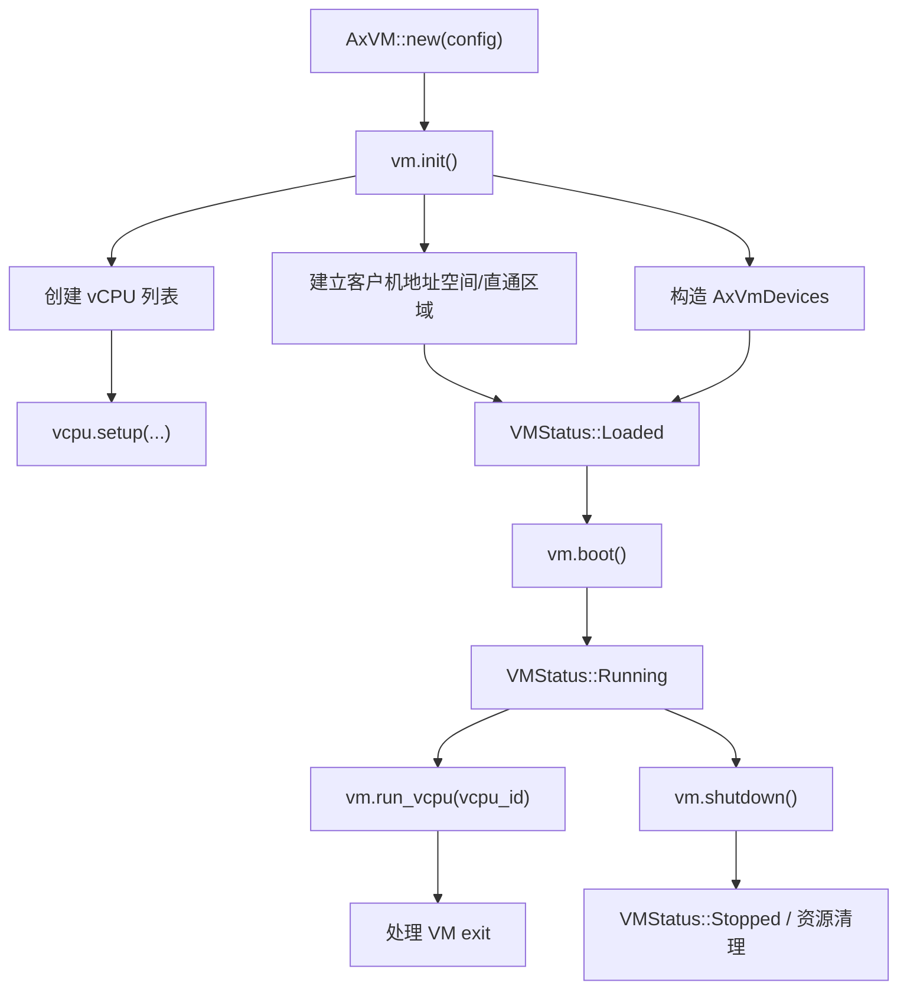
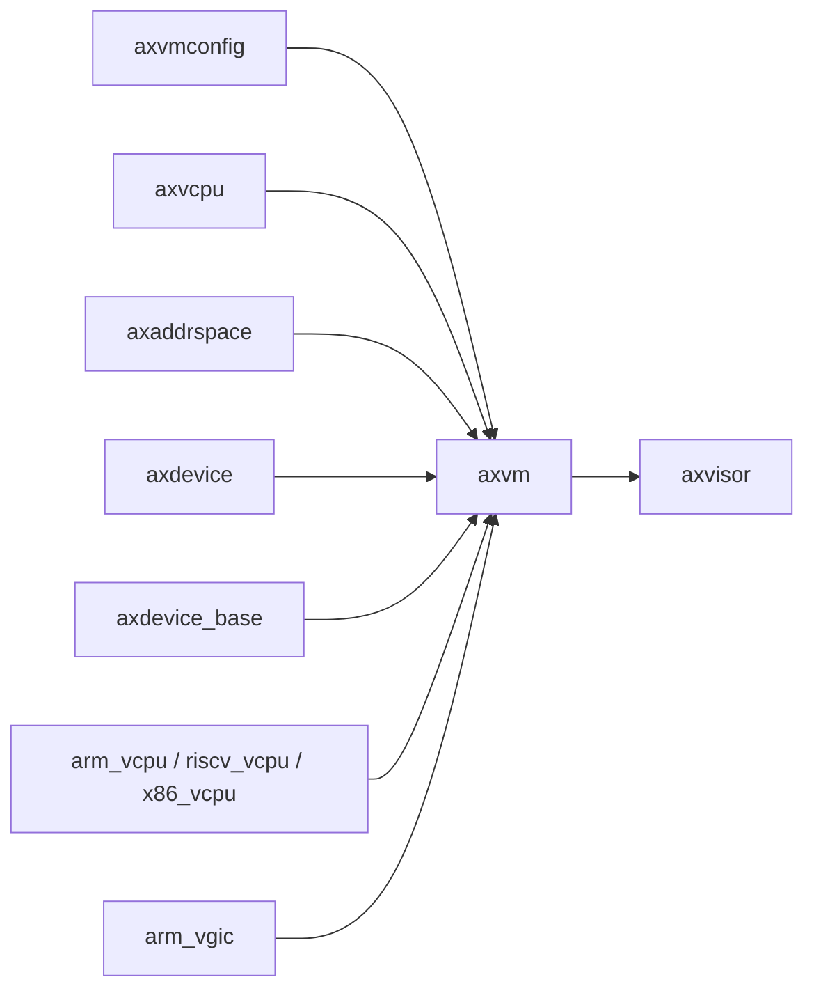

# `axvm` 技术文档

> 路径：`components/axvm`
> 类型：库 crate
> 分层：组件层 / 可复用基础组件
> 版本：`0.2.3`
> 文档依据：`Cargo.toml`、`README.md`、`src/lib.rs`、`src/vm.rs`、`src/vcpu.rs`、`src/hal.rs`、`src/config.rs`

`axvm` 是 Axvisor 虚拟化软件栈中的“VM 资源管理层”。它不负责 Hypervisor 顶层编排，也不直接实现所有架构相关虚拟化细节，而是把虚拟机对象、vCPU 列表、客户机地址空间、设备集合和生命周期状态封装成一个统一的 `AxVM` 抽象，供上层 VMM 直接使用。

## 1. 架构设计分析
### 1.1 设计定位
从职责上看，`axvm` 位于三类组件的交汇处：

- 向下依赖 `axvcpu`、`axaddrspace`、`axdevice` 等组件，承接 vCPU、地址空间和设备模型。
- 向外通过 `AxVMHal` 把宿主能力注入进来，例如地址翻译、时间、当前 VM/vCPU/pCPU 信息和中断注入。
- 向上被 Axvisor 的 `vmm` 层直接调用，作为真正的 VM 实例与生命周期实体。

可以把 `axvm` 理解为“可被 Hypervisor 编排的 VM 对象层”，而不是顶层 Hypervisor 程序。

### 1.2 模块划分
- `src/lib.rs`：crate 入口，导出 `AxVM`、`AxVMRef`、`AxVCpuRef`、`VMMemoryRegion`、`VMStatus`、`config`、`AxVMHal` 与 `has_hardware_support()`。
- `src/vm.rs`：核心实现文件，定义 `AxVM`、内部可变/不可变状态、内存区管理、状态切换、`init()`、`boot()`、`shutdown()`、`run_vcpu()` 等。
- `src/vcpu.rs`：架构适配层，按 `x86_64`、`riscv64`、`aarch64` 选择具体的 vCPU 实现与建模配置。
- `src/hal.rs`：定义 `AxVMHal` trait，规定宿主必须提供的能力边界。
- `src/config.rs`：把 `axvmconfig` 的 TOML 侧配置转成运行时 `AxVMConfig`、`AxVCpuConfig`、`VMImageConfig`、`PhysCpuList` 等结构。

### 1.3 关键数据结构
- `AxVM<H, U>`：虚拟机主对象，其中 `H: AxVMHal`、`U: AxVCpuHal`。
- `AxVMInnerConst<U>`：初始化后不再变化的部分，主要是 `phys_cpu_ls`、`vcpu_list` 和 `devices`。
- `AxVMInnerMut<H>`：可变状态，包含 `address_space`、`memory_regions`、`config` 和 `vm_status`。
- `VMMemoryRegion`：记录客户机物理地址、宿主虚拟地址、布局信息和是否需要回收。
- `VMStatus`：`Loading`、`Loaded`、`Running`、`Suspended`、`Stopping`、`Stopped`，描述 VM 生命周期。
- `AxVCpuRef<U>`：统一的 vCPU 引用类型，是上层调度与 VM exit 处理的基本单元。
- `AxVMConfig` / `AxVMCrateConfig`：前者用于运行时 VM 创建，后者更贴近 TOML 配置源。

### 1.4 VM 生命周期与主线
`axvm` 的主要执行路径如下：



对应到源码：

1. `AxVM::new(config)` 创建空的客户机地址空间，并把状态初始化为 `Loading`。
2. `init()` 负责真正完成 VM 组装：创建 vCPU、合并直通地址区间、建立设备、设置页表根与 vCPU 初始入口。
3. `boot()` 把状态切换到 `Running`，但不直接执行客户机代码。
4. 真正执行路径在 `run_vcpu(vcpu_id)`，它循环处理 `AxVCpuExitReason`。
5. `shutdown()` 把 VM 推入停止状态；`Drop` 中会触发资源清理。

当前源码表明：

- `suspend` / `resume` 语义尚未完整实现，`Suspended` 更偏状态预留。
- `boot()` 后不意味着所有资源自动启动，上层 VMM 仍需调度相应的 vCPU 任务。

### 1.5 架构相关分层
`axvm` 自身不把所有架构细节写死，而是通过 `src/vcpu.rs` 做一层统一绑定：

- `x86_64`：主要对接 `x86_vcpu` 与 VMX 路径。
- `riscv64`：对接 `riscv_vcpu`。
- `aarch64`：对接 `arm_vcpu`，并与 `arm_vgic` 协作处理中断控制器与虚拟定时设备。

同时，宿主相关能力全部通过 `AxVMHal` 提供，因此 `axvm` 可以保持“虚拟机对象层”而不是“宿主特定实现层”。

## 2. 核心功能说明
### 2.1 主要功能
- 管理虚拟机对象生命周期：创建、初始化、启动、停止。
- 管理 vCPU 列表与物理 CPU 亲和信息。
- 管理客户机地址空间和内存区域。
- 管理直通设备与仿真设备配置。
- 统一处理 VM exit，并把硬件相关能力通过 HAL 向上层隔离。

### 2.2 关键 API
- `AxVM::new(config)`：创建 VM 对象。
- `AxVM::init()`：构造 vCPU、设备和地址空间，是最关键的初始化步骤。
- `AxVM::boot()`：切到 `Running` 状态。
- `AxVM::shutdown()`：进入停止流程。
- `AxVM::run_vcpu(vcpu_id)`：执行并处理一次或一轮 vCPU 运行/退出。
- `set_vm_status()` / `vm_status()`：状态管理接口。
- `has_hardware_support()`：检查底层虚拟化支持是否可用。

### 2.3 使用场景
`axvm` 最典型的消费方不是应用程序，而是 VMM：

- 根据 TOML 配置创建一个 VM。
- 准备内存映射、内核镜像和设备配置。
- 在上层任务系统中为每个 vCPU 分配执行实体。
- 在 VM exit 循环中调用 `run_vcpu()` 并处理 hypercall、MMIO、外部中断等事件。

### 2.4 使用示意
```rust
// 伪代码：宿主需要提供 AxVMHal/AxVCpuHal 的具体实现
let vm = AxVM::<MyVmHal, MyVCpuHal>::new(config)?;
vm.init()?;
vm.boot()?;

let exit_reason = vm.run_vcpu(0)?;
```

在实际仓库中，这套流程由 `os/axvisor/src/vmm/*` 完成，而不是由普通库使用者直接手写。

## 3. 依赖关系图谱


### 3.1 关键直接依赖
- `axvcpu`：提供统一的 vCPU 抽象和 VM exit 原因。
- `axaddrspace`：提供客户机地址空间管理与 GPA 映射能力。
- `axdevice`、`axdevice_base`：提供虚拟设备与直通设备建模。
- `axvmconfig`：提供从配置文件到运行时结构的配置来源。
- 架构相关 vCPU crate：`x86_vcpu`、`riscv_vcpu`、`arm_vcpu`。
- `arm_vgic`：在 AArch64 路径上参与虚拟中断控制器与定时设备支持。

### 3.2 关键间接依赖
- `ax-page-table-multiarch`、`ax-page-table-entry`：通过地址空间和页表路径参与 VM 内存管理。
- `ax-memory-set`、`range-alloc-arceos` 等：在地址空间和内存建模路径上间接提供支撑。
- `axvisor_api` 生态：更多出现在消费者侧，但会影响 `axvm` 的宿主接入方式。

### 3.3 关键直接消费者
当前仓库内最重要、也是几乎唯一的直接消费者是 `os/axvisor`。它把 `AxVM<AxVMHalImpl, AxVCpuHalImpl>` 固化为 VMM 内使用的 `VM` 类型，并围绕它组织 vCPU 任务、配置加载与控制台命令。

## 4. 开发指南
### 4.1 依赖配置
```toml
[dependencies]
axvm = { workspace = true }
```

常见 feature：

- `vmx`：x86 VMX 相关默认路径。
- `4-level-ept`：控制 EPT 层级相关支持。

### 4.2 初始化顺序
1. 先从 `axvmconfig` 或其他来源构造 `AxVMConfig`。
2. 调 `AxVM::new()` 创建空 VM 对象。
3. 调 `init()` 绑定 vCPU、设备和地址空间。
4. 由上层 VMM 负责在适当时机调用 `boot()`。
5. 在宿主调度框架中反复调用 `run_vcpu()` 处理执行与退出原因。

### 4.3 开发注意事项
- 修改 `init()` 时，要同时验证 vCPU 创建、设备初始化和地址空间映射三条路径。
- 修改 `VMStatus` 时，要同步检查上层 VMM 的状态机是否仍匹配。
- 修改 `run_vcpu()` 时，要把这类改动视为 Hypervisor 热路径改动，优先关注 VM exit 分类和错误恢复。
- 修改 `AxVMHal` trait 时，要同步更新 Axvisor 的 `hal` 实现，否则整个虚拟化栈会失配。

## 5. 测试策略
### 5.1 单元测试
当前 crate 内没有完整的 `tests/` 目录，说明 `axvm` 的主要验证方式不是普通 host 单元测试，而是与真实 VMM 路径集成验证。后续若补充单元测试，优先覆盖：

- `VMStatus` 状态转换。
- 内存区域合并、对齐和回收。
- 配置解析到运行时结构的转换边界。
- 错误输入下的失败路径。

### 5.2 集成测试
更重要的是系统级验证：

- Axvisor 的 VM 创建、启动、停止路径。
- AArch64、x86_64、RISC-V 三种架构相关适配。
- 直通设备与仿真设备场景。
- Guest 镜像可正常加载与启动。

### 5.3 覆盖率要求
- 生命周期主线必须覆盖：`new -> init -> boot -> run_vcpu -> shutdown`。
- 至少要覆盖一种地址空间映射场景和一种设备处理场景。
- VM exit 热路径应通过集成测试覆盖成功与异常分支。

## 6. 跨项目定位分析
### 6.1 ArceOS
`axvm` 与 ArceOS 的关系不是“标准模块依赖”，而是“运行在 ArceOS 宿主之上的虚拟化资源层”。它属于 ArceOS Hypervisor 生态的一部分，复用了 ArceOS 风格的组件化设计，但并不直接参与普通 ArceOS unikernel 的默认运行路径。

### 6.2 StarryOS
当前仓库中没有发现 StarryOS 对 `axvm` 的直接依赖。若 StarryOS 参与虚拟化场景，更常见的是作为 Axvisor 的 guest，而不是把 `axvm` 直接链接进 `starry-kernel`。

### 6.3 Axvisor
`axvm` 是 Axvisor VMM 的核心依赖之一。Axvisor 负责 VM 配置解析、镜像加载、vCPU 任务调度和控制台命令，而 `axvm` 负责真正承载 VM 对象、状态与底层资源。这种分层使得 Axvisor 可以专注于“编排”，而把“VM 资源生命周期”交给 `axvm` 处理。
