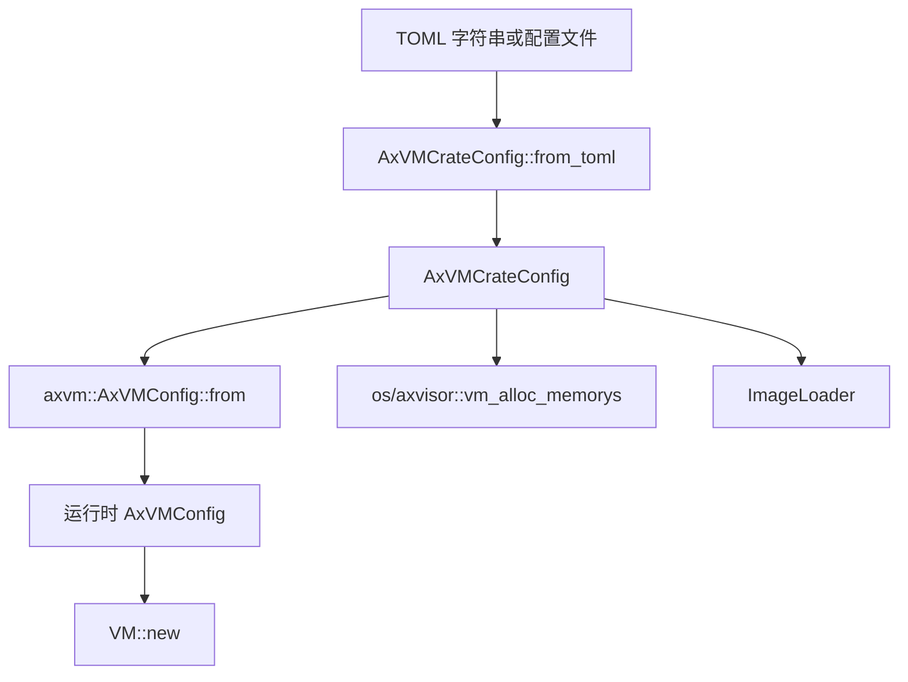
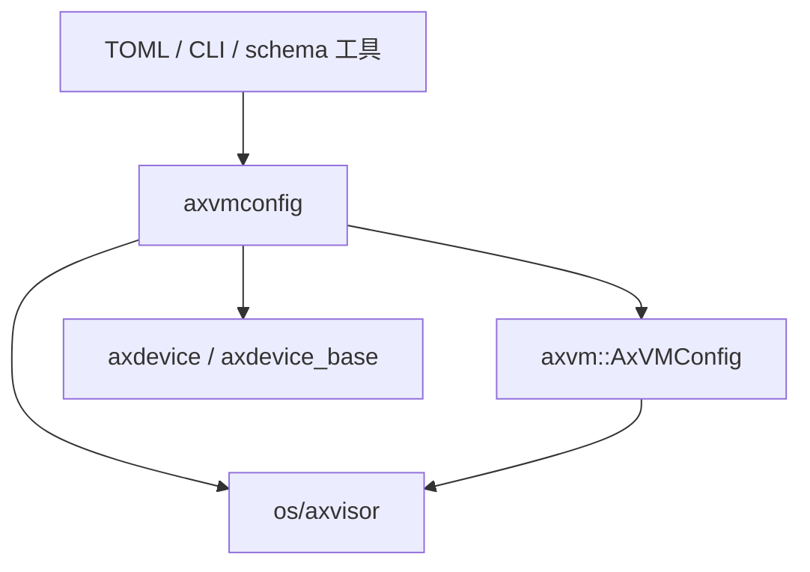

# `axvmconfig` 技术文档

> 路径：`components/axvmconfig`
> 类型：库 + 二进制混合 crate
> 分层：组件层 / 虚拟机配置模型
> 版本：`0.2.2`
> 文档依据：当前仓库源码、`Cargo.toml`、`README.md`、`src/lib.rs`、`src/tool.rs`、`components/axvm/src/config.rs` 与 `os/axvisor/src/vmm/config.rs`

`axvmconfig` 是 Axvisor 虚拟机配置链路的静态模型层。它的职责不是直接创建 VM，也不是直接操作页表或设备，而是把 TOML 中描述的 VM 元信息、镜像布局、内存区域、模拟设备、直通设备和中断模式转换成一组稳定的数据结构；这些结构随后被 `axvm` 转成运行时 `AxVMConfig`，再由 `os/axvisor` 继续执行内存分配、镜像加载、FDT 处理和 VM 实例化。

## 1. 架构设计分析

### 1.1 设计定位

`axvmconfig` 兼具两个身份：

- 作为库 crate，它提供一组 `serde` 数据模型，供 hypervisor 内部解析和传递 VM 配置。
- 作为宿主侧工具，它在开启默认 `std` feature 时提供 `check` / `generate` CLI，用于校验配置文件和生成模板。

这决定了它的设计有两个显著特征：

- 核心模型保持 `no_std` 兼容，便于 `axvm`、`axdevice` 等运行时 crate 以 `default-features = false` 方式依赖。
- 与文件系统、命令行、JSON Schema 生成相关的能力全部通过 `std` feature 外挂。

### 1.2 模块划分

| 模块 | 作用 | 关键内容 |
| --- | --- | --- |
| `lib.rs` | 配置模型主体 | `AxVMCrateConfig`、`VMBaseConfig`、`VMKernelConfig`、`VMDevicesConfig`、`VmMemConfig`、`EmulatedDeviceType`、`VMInterruptMode`、`from_toml()` |
| `tool.rs` | CLI 入口逻辑 | `check`、`generate`、`parse_usize()` |
| `templates.rs` | 模板构造 | `VmTemplateParams`、`get_vm_config_template()` |
| `main.rs` | 可执行入口 | 初始化 `env_logger`，调用工具子命令 |
| `templates/*.toml` | 静态样例 | 宿主侧示例模板资源 |

虽然库的代码量不小，但主要语义都集中在 `lib.rs` 里，整体更像“配置模型仓库”而不是多模块运行时系统。

### 1.3 配置结构体系

`AxVMCrateConfig` 是最上层根结构，拆分为三大部分：

- `base: VMBaseConfig`
- `kernel: VMKernelConfig`
- `devices: VMDevicesConfig`

这三个部分分别对应“VM 身份与 CPU 资源”“镜像与内存布局”“设备与中断策略”。

#### `VMBaseConfig`

该结构描述 VM 的基本属性和宿主 CPU 绑定信息：

- `id`、`name`
- `vm_type`
- `cpu_num`
- `phys_cpu_ids`
- `phys_cpu_sets`

值得注意的是，`vm_type` 在此层仍是 `usize`，而不是 `VMType` 枚举。这说明解析层刻意保持输入宽容，后续再由 `AxVMConfig::from()` 转换成枚举语义。

#### `VMKernelConfig`

这一层描述镜像装载与内存布局：

- `entry_point`
- `kernel_path` / `kernel_load_addr`
- `bios_path` / `bios_load_addr`
- `dtb_path` / `dtb_load_addr`
- `ramdisk_path` / `ramdisk_load_addr`
- `image_location`
- `cmdline`
- `disk_path`
- `memory_regions: Vec<VmMemConfig>`

`VmMemConfig` 则把每段 guest 物理内存刻画为：

- `gpa`
- `size`
- `flags`
- `map_type`

其中 `map_type` 是 `VmMemMappingType`，当前有三类：

- `MapAlloc`
- `MapIdentical`
- `MapReserved`

#### `VMDevicesConfig`

设备配置层包含：

- `emu_devices`
- `passthrough_devices`
- `interrupt_mode`
- `excluded_devices`
- `passthrough_addresses`

这使 `axvmconfig` 不只是“镜像配置文件”，而是完整的 VM 资源声明格式。

### 1.4 枚举设计与可扩展性

#### `VMType`

`VMType` 用于区分 HostVM、RTOS 和 Linux 三类 VM，并提供 `From<usize>`。遇到未知值时会打印警告并回退到 `VMTRTOS`，体现出解析层的容错取向。

#### `VMInterruptMode`

该枚举支持多种 `serde` 别名，例如：

- `no_irq`
- `no`
- `none`
- `pt`

说明其 TOML 设计已经考虑到人工维护体验，而不仅是内部代码的枚举名。

#### `EmulatedDeviceType`

这是整个 crate 中最有体系性的枚举之一。源码按数值区间组织类型：

- `0x00 - 0x1F`：抽象设备或特殊设备
- `0x20 - 0x2F`：ARM GPPT 相关中断控制器设备
- `0x30`：RISC-V PPPT vPLIC
- `0xE0 - 0xEF`：Virtio 设备

当前已落地的类型包括：

- `InterruptController`
- `Console`
- `IVCChannel`
- `GPPTRedistributor`
- `GPPTDistributor`
- `GPPTITS`
- `PPPTGlobal`
- `VirtioBlk`
- `VirtioNet`
- `VirtioConsole`

同时它还提供：

- `Display`
- `from_usize()`
- `removable()`

这使该枚举同时服务于配置解析、设备构造和管理平面展示。

### 1.5 从静态配置到运行时配置的数据流

`axvmconfig` 的真正价值，不在于能把 TOML parse 成 Rust 结构体，而在于它是后续 VM 创建流程的第一站。



关键细节在于：

- `AxVMConfig::from()` 只提取 VM 创建真正需要的运行时字段，例如 `id`、`name`、`cpu_config`、`image_config`、设备表和中断模式。
- `kernel.memory_regions` 并没有被搬运进 `AxVMConfig` 的字段，而是保留在 `AxVMCrateConfig` 中，供 `os/axvisor::vm_alloc_memorys()` 直接遍历处理。
- 镜像路径、`image_location`、命令行等更偏“装载器视角”的信息也主要留在 crate 配置侧，再由 `ImageLoader` 消费。

这是一种很清晰的分层策略：**`axvmconfig` 持有完整静态声明，`axvm::AxVMConfig` 持有精炼的运行时子集。**

### 1.6 与 `axvm` 和 `os/axvisor` 的分工

`components/axvm/src/config.rs` 中的 `AxVMConfig::from()` 做了几件关键转换：

- `base.vm_type: usize` 转为 `VMType`
- `entry_point` 转为 BSP/AP 两个 GPA 入口
- 各类镜像 load addr 转为 `GuestPhysAddr`
- 设备配置整体搬运进运行时配置

而 `os/axvisor/src/vmm/config.rs` 则负责：

- 调 `AxVMCrateConfig::from_toml()` 解析原始配置
- 在 AArch64 上做 FDT 相关调整
- 用 `AxVMConfig::from()` 创建运行时 VM 配置
- 根据 `kernel.memory_regions` 实际分配或映射内存
- 根据镜像路径和 `image_location` 加载 kernel/BIOS/DTB/initrd

这说明 `axvmconfig` 本身是“配置语义源头”，但 VM 资源真正落地仍由 `axvm` 和 `os/axvisor` 分段完成。

## 2. 核心功能说明

### 2.1 主要功能

- 解析 VM TOML 配置并生成 `AxVMCrateConfig`
- 为 VM 基本属性、镜像布局、内存区域和设备资源提供统一建模
- 定义跨多个 crate 共用的设备类型枚举和中断模式枚举
- 提供宿主侧 `check` / `generate` 工具
- 在开启 `std` 时支持 `schemars::JsonSchema` 推导，便于外部工具链生成 schema

### 2.2 CLI 能力

CLI 是 `std` feature 下的附加能力，当前主命令分为两类：

- `check`：读取 TOML 文件并调用 `from_toml()` 做合法性检查
- `generate`：根据目标架构和参数生成默认 VM 配置模板

此外，`parse_usize()` 支持十进制、`0x` 十六进制和 `0b` 二进制输入，便于直接在命令行里处理地址和掩码。

### 2.3 典型使用场景

作为库使用：

```rust
let cfg = axvmconfig::AxVMCrateConfig::from_toml(raw_toml)?;
```

作为工具使用：

```bash
cargo run -p axvmconfig -- check vm.toml
cargo run -p axvmconfig -- generate --arch aarch64 --output vm.toml
```

需要注意，静态 `templates/*.toml` 与当前 `AxVMCrateConfig` 的 `[base]` / `[kernel]` / `[devices]` 分段结构并不完全同构；实际使用时更应以 `generate` 输出和 `README` 示例为准，而不是把模板文件视作始终可直接反序列化的权威格式。

## 3. 依赖关系图谱

### 3.1 直接依赖

| 依赖 | 作用 |
| --- | --- |
| `serde` / `serde_repr` | 配置结构与枚举的序列化/反序列化 |
| `toml` | TOML 解析与序列化 |
| `ax-errno` | 统一错误返回类型 |
| `log` | 解析和容错路径中的告警 |
| `enumerable` | `EmulatedDeviceType` 枚举遍历 |
| `clap` | `std` 模式下的 CLI |
| `env_logger` | CLI 日志初始化 |
| `schemars` | `std` 模式下导出 JSON Schema |

### 3.2 主要消费者

- `components/axvm`：通过 `AxVMConfig::from()` 把静态配置转成运行时配置
- `components/axdevice` / `axdevice_base`：复用 `EmulatedDeviceType` 和设备配置模型
- `os/axvisor`：直接解析 TOML、分配内存、创建 VM、加载镜像
- `scripts/axbuild`：生成 `AxVMCrateConfig` 的 JSON Schema

### 3.3 关系示意



## 4. 开发指南

### 4.1 新增配置字段时的建议

若要为 VM 增加新配置项，推荐沿以下顺序推进：

1. 在 `AxVMCrateConfig` 相关结构中添加字段，并补齐 `serde` 与文档注释。
2. 如果该字段需要进入运行时，则同步更新 `components/axvm/src/config.rs` 中的 `From<AxVMCrateConfig> for AxVMConfig`。
3. 如果该字段只在装载或管理阶段使用，则保留在 crate 配置层，并在 `os/axvisor` 的创建链路中消费。
4. 若宿主工具需要暴露该字段，再同步更新 `tool.rs` 和 `templates.rs`。

### 4.2 配置设计边界

有三类字段应分清归属：

- “静态声明层”：镜像路径、磁盘路径、模板参数、保留内存布局
- “运行时 VM 层”：vCPU 入口、设备表、中断模式、CPU 亲和
- “执行期推导层”：AArch64 FDT 调整、实际内存分配结果、镜像重定位结果

`axvmconfig` 只负责前两类中的静态部分，不负责执行期状态。

### 4.3 使用注意事项

- `vm_type` 在配置层是数值，在运行时才映射到 `VMType`，因此文档和工具应明确推荐合法数值范围。
- `memory_regions` 当前不会自动进入 `AxVMConfig`，而是由 `os/axvisor` 额外遍历并分配。
- `phys_cpu_ids` 和 `phys_cpu_sets` 的解释会受到目标架构影响，特别是 RISC-V 分支会补充 `pcpu_mask_flag` 逻辑。
- `EmulatedDeviceType` 的值域具有体系化含义，新增设备类型时应遵守源码里既定的数值分配区间。

## 5. 测试策略

### 5.1 当前已有测试

源码中的测试已覆盖：

- `from_toml()` 成功/失败路径
- `VMInterruptMode` 的 `serde` 别名解析
- `EmulatedDeviceType::from_usize()`
- 默认值与枚举可遍历性

这使配置解析层具备了最基本的稳定性保障。

### 5.2 推荐补充的测试

- `AxVMCrateConfig -> AxVMConfig` 映射测试，确保新增字段不会在转换过程中丢失或误译。
- CLI 集成测试，覆盖 `check` 与 `generate`。
- 模板一致性测试，确保 `generate` 输出始终能被 `from_toml()` 接受。
- 与 `os/axvisor` 的端到端配置测试，覆盖 `memory_regions`、镜像路径和设备表的真实消费链。

### 5.3 风险点

- 当前模板资源与根配置结构存在一定脱节，若只维护一侧，很容易出现“模板看似存在但无法直接驱动完整创建”的问题。
- `memory_regions` 保持在 crate 配置层是合理分层，但也意味着修改者若只盯 `AxVMConfig`，可能误以为该字段未被使用。
- 设备类型枚举被多个 crate 共同依赖，一旦编号变化，影响面会扩散到设备构造、管理平面和文档层。

## 6. 跨项目定位分析

| 项目 | 位置 | 角色 | 核心作用 |
| --- | --- | --- | --- |
| ArceOS | 宿主虚拟化生态的一部分 | Hypervisor 配置模型 | ArceOS 通用内核本体不依赖它，但在 ArceOS 承载 Axvisor 时，它是 VM 声明格式的源头 |
| StarryOS | 当前仓库未见直接依赖 | 非核心路径 | 现有仓库内 StarryOS 主线不直接消费 `axvmconfig` |
| Axvisor | 配置链路核心 | VM 静态配置语言与工具入口 | 从 TOML 到 VM 创建、内存分配、镜像装载的第一层抽象，属于 Axvisor 管理平面的基础设施 |

## 7. 总结

`axvmconfig` 的价值在于把“虚拟机应该长什么样”稳定地表达出来。它既不是纯工具，也不是纯运行时库，而是连接宿主工具链、运行时 VM 配置、设备建模和镜像装载的配置语义中心。对 Axvisor 而言，很多复杂逻辑真正开始发生之前，首先都要经过 `axvmconfig` 这道配置建模关口。
