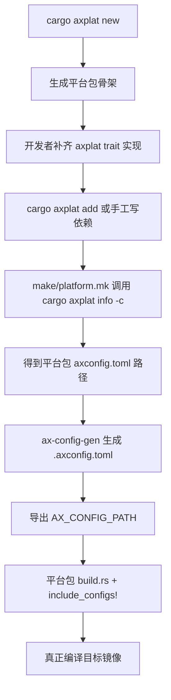
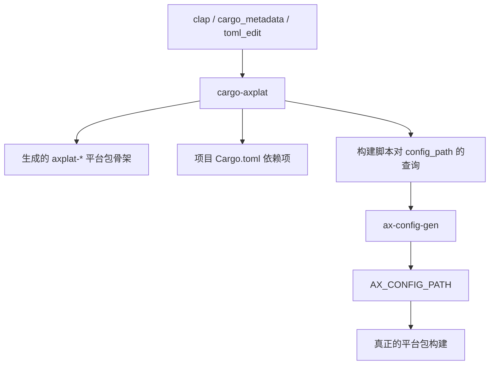

# `cargo-axplat` 技术文档

> 路径：`components/axplat_crates/cargo-axplat`
> 类型：二进制 crate
> 分层：组件层 / 宿主机工具链组件
> 版本：`0.2.5`
> 文档依据：当前仓库源码、`Cargo.toml`、`README.md`、`template/*` 及 `os/arceos`/`os/StarryOS` 中的实际调用路径

`cargo-axplat` 是一个宿主机侧 `cargo` 子命令，用来管理 `axplat` 平台包的三件事：生成平台包脚手架、把平台包依赖写入项目清单、在构建前定位平台包自带的 `axconfig.toml`。它本身不参与目标镜像运行，也不直接实现任何 `axplat` trait；真正的运行时平台实现仍在被创建或被查询的 `axplat-*` crate 中。

## 1. 架构设计分析

### 1.1 设计定位

`cargo-axplat` 在 `axplat` 体系中的职责可以概括为：

- 向下：调用宿主机 `cargo new`、`cargo add`，并用 `cargo_metadata`、`toml_edit` 解析工程与配置文件。
- 向上：为平台包开发者和上层构建脚本提供统一的 CLI。
- 向旁：把模板目录 `template/` 中的骨架 crate 与下游的 `ax-config-gen`、`AX_CONFIG_PATH` 构建链对接起来。

因此它不是“平台运行时的一部分”，而是“平台包生命周期管理工具”的一部分：

- `new` 负责搭脚手架；
- `add` 负责清单注入；
- `info` 负责配置定位与元信息查询。

### 1.2 模块划分

| 模块 | 作用 | 关键内容 |
| --- | --- | --- |
| `main.rs` | CLI 总入口 | `cargo` 风格参数解析、子命令分派、`run_cargo_command()` |
| `new.rs` | 平台包脚手架生成 | 调用 `cargo new --lib`，再应用模板目录内容 |
| `add.rs` | 依赖注入 | 基本等价于一层 `cargo add` 包装 |
| `info.rs` | 平台包信息查询 | 通过 `cargo_metadata` 找包，再解析 `axconfig.toml` |
| `build.rs` | 模板嵌入 | 递归读取 `template/`，在编译期生成 `template.rs` |
| `template/` | 平台包骨架 | `_Cargo.toml`、`axconfig.toml`、`build.rs` 和 `src/*` 接口模板 |

### 1.3 命令分派与宿主机行为

`cargo-axplat` 的入口非常薄：

1. 用 `clap` 按 `cargo axplat <subcommand>` 的风格解析参数。
2. 进入 `New`、`Add` 或 `Info` 三条分支。
3. `new` 和 `add` 最终都会落到 `run_cargo_command()`，由它执行外部 `cargo` 命令。

`run_cargo_command()` 的行为很值得注意：

- 始终调用宿主机 `cargo`，并追加 `--color always`。
- 把子进程 `stderr` 原样转发出来。
- 若子进程失败，直接用相同退出码退出当前进程。

这说明 `cargo-axplat` 更像一个“标准化外壳”，而不是重新实现了一套 Cargo 功能。

还有一个容易忽略的细节：

- 安装后使用方式是 `cargo axplat ...`
- 若在源码树里直接执行，则应写成 `cargo run -p cargo-axplat -- axplat ...`

也就是说，源码内运行时 `axplat` 这个字面子命令仍然必须保留。

### 1.4 模板生成与平台实现装配

`cargo-axplat` 最有价值的内部资产是 `template/`。它并不直接“实现平台”，而是把一个普通 `axplat-*` 平台包的骨架拼装出来：

| 模板文件 | 作用 | 生成后的意义 |
| --- | --- | --- |
| `_Cargo.toml` | 依赖和 feature 骨架 | 为生成 crate 注入 `axplat`、`ax-config-macros` 依赖，以及 `irq`/`smp` feature |
| `axconfig.toml` | 平台配置骨架 | 预留 `arch`、`platform`、`package` 以及 `plat`/`devices` 配置项 |
| `build.rs` | 配置变更监听 | 监听 `AX_CONFIG_PATH`，为后续编译期配置注入做准备 |
| `src/lib.rs` | 平台包根模块 | 引入 `config`、校验 `PACKAGE`、提供 `_start` 占位入口 |
| `src/init.rs` 等 trait 文件 | `axplat` 契约骨架 | 为 `InitIf`、`MemIf`、`TimeIf`、`ConsoleIf`、`PowerIf`、`IrqIf` 提供 `todo!()` 模板 |

`build.rs` 会递归扫描 `template/` 并生成 `template.rs`，再由 `main.rs` 里的 `include!` 嵌入到最终二进制中。这里还专门把 `_Cargo.toml` 重命名映射成 `Cargo.toml`，因为 Cargo package 内不能直接把 `Cargo.toml` 当普通模板资源分发。

`new.rs` 的装配策略也很明确：

- 先运行 `cargo new --lib`，让 Cargo 正常创建包目录和基础 package 段。
- 再只替换生成 crate 的 `[dependencies]` 和 `[features]`。
- `axconfig.toml` 里自动填入 `<ARCH>` 和 `<PACKAGE>`。
- 其它模板文件按原样覆盖到新目录。

这意味着：

- 包名、版本、edition 等 package 基本属性来自 `cargo new`。
- 模板负责注入平台实现所需的接口布局。
- 新 crate 仍然只是“骨架”，真正的平台实现要靠开发者补齐 `todo!()`。

还需要特别说明一点：当前实现只替换了 `axconfig.toml` 中的 `<ARCH>` 与 `<PACKAGE>`，`platform = "<PLATFORM>"` 这个占位符会保留下来，必须由开发者手工改成真实平台标识。

### 1.5 真实构建流程中的位置

`cargo-axplat` 真正被上层项目使用的，不只是 `new` 和 `add`，还有 `info` 这一条宿主机构建链：



以 `os/arceos` 和 `os/StarryOS` 的 Make 逻辑为例：

1. 先根据 `ARCH` 或 `MYPLAT` 决定 `PLAT_PACKAGE`。
2. 若用户没有直接给 `PLAT_CONFIG` 路径，就执行 `cargo axplat info -C <manifest_dir> -c <PLAT_PACKAGE>`。
3. 该命令只输出平台包的 `axconfig.toml` 路径。
4. 随后真正的配置合并由 `ax-config-gen` 完成，再写出 `.axconfig.toml`。
5. 构建阶段通过 `AX_CONFIG_PATH` 把这个结果喂给平台包自身的 `build.rs` 与 `ax_config_macros::include_configs!`。

因此 `cargo-axplat` 在构建流程中的角色是“定位配置来源”，而不是“生成最终配置”或“参与交叉编译”。

### 1.6 与 `axplat`、`ax-plat-macros` 和工具链的边界

`cargo-axplat` 的边界要分三层看：

- 与 `axplat` 的边界：`cargo-axplat` 本身没有直接依赖 `axplat` 作为运行时库；它只是为将来依赖 `axplat` 的平台包写模板和清单。
- 与 `ax-plat-macros` 的边界：生成模板只依赖 `axplat`，并通过 `axplat` 间接使用重导出的宏；工具自身从不直接链接 `ax-plat-macros`。
- 与宿主机工具链的边界：它会调用 `cargo new`、`cargo add`、`cargo metadata`，但不会替你运行 `ax-config-gen`、`rustc` 交叉编译、QEMU 或其它镜像工具。

还有一个非常关键的边界是：

- `add` 不验证目标包是否真的实现了 `axplat`。
- `info` 只验证“这个包能否在当前 Cargo metadata 图中找到，并且是否存在可解析的 `axconfig.toml`”。

它管理的是平台包生命周期中的“元信息与脚手架”，不是平台语义完整性。

## 2. 核心功能说明

### 2.1 三个子命令的真实职责

| 子命令 | 实际行为 | 关键限制 |
| --- | --- | --- |
| `new` | `cargo new --lib` 后应用模板，生成一个 `axplat` 平台包骨架 | 只生成骨架，不自动加入 workspace，也不自动补全真实平台逻辑 |
| `add` | 把传入参数透传给 `cargo add` | 只改 `Cargo.toml`，不修改源代码，不验证平台实现正确性 |
| `info` | 用 `cargo_metadata` 找到包，再读取其 `axconfig.toml` 的 `platform`/`arch` 等信息 | 只有包已在 metadata 图中可见且配置文件存在时才有效 |

### 2.2 典型使用方式

创建平台包：

```bash
cargo axplat new axplat-aarch64-my-plat --arch aarch64
```

把平台包加到项目依赖：

```bash
cargo axplat add axplat-aarch64-my-plat --path ../axplat-aarch64-my-plat
```

仅查询配置路径，供构建系统使用：

```bash
cargo axplat info axplat-aarch64-my-plat -c
```

若在仓库源码里直接跑该工具，则应写成：

```bash
cd "components/axplat_crates" && cargo run -p cargo-axplat -- axplat new /tmp/axplat-test --axplat-path "/path/to/axplat"
```

这里的隐藏参数 `--axplat-path` 主要用于本地开发或 CI，让新生成的模板依赖工作区内的 `axplat` 路径版，而不是 crates.io 版本。

### 2.3 `info` 输出与限制

`info` 的默认输出是五项：

- `platform`
- `arch`
- `version`
- `source`
- `config_path`

而 `-p`、`-a`、`-v`、`-s`、`-c` 只是把输出裁剪成单字段。ArceOS/StarryOS 的 Makefile 之所以使用 `-c`，正是因为它们只需要拿到平台配置文件路径。

需要注意，`info` 当前只从 `axconfig.toml` 的顶层键里读取 `platform` 与 `arch`，它不会继续分析：

- 该平台包是否真的把所有 `todo!()` 都补完了；
- 该平台包是否适合当前目标架构之外的 feature 组合；
- `axconfig.toml` 中的其它字段是否满足更上层内核的全部需求。

## 3. 依赖关系图谱

### 3.1 直接依赖

| 依赖 | 作用 |
| --- | --- |
| `clap`、`clap-cargo` | 实现 `cargo` 风格 CLI 解析与帮助输出 |
| `cargo_metadata` | 解析当前工程的 Cargo metadata，定位平台包和其 manifest |
| `toml_edit` | 读写 `Cargo.toml` 与 `axconfig.toml` |
| `thiserror` | 定义 `info` 路径上的错误类型 |

### 3.2 主要消费者

- 平台包开发者：用 `new` 和 `add` 创建与接入平台包。
- `os/arceos`、`os/StarryOS` 的 Make 构建脚本：用 `info -c` 解析平台配置路径。
- `components/axplat_crates` 的 CI：用它生成模板工程并执行 `cargo check`。

### 3.3 依赖关系示意



## 4. 开发指南

### 4.1 创建并接入一个新平台包

1. 运行 `cargo axplat new <path> --arch <arch>` 创建骨架。
2. 立即手工检查生成的 `axconfig.toml`，尤其要把 `platform = "<PLATFORM>"` 改成真实值。
3. 在 `src/lib.rs` 中补齐真实启动入口，在各 trait 模块中实现 `InitIf`、`MemIf`、`TimeIf` 等契约。
4. 用 `cargo axplat add ...` 或手工修改 `Cargo.toml`，把该平台包纳入项目依赖。
5. 再由上层 Make/构建脚本通过 `cargo axplat info -c` 找回该平台包的配置文件路径。

### 4.2 维护模板时应关注什么

- 真正的模板源在 `template/` 目录；修改生成骨架时，应改这里而不是运行时生成物。
- `build.rs` 会递归打包整个 `template/`，因此新增文件通常不需要改额外注册表逻辑。
- 若 `axplat` 接口发生变化，必须同步修改 `template/src/*.rs`，否则 `new` 生成的骨架会立刻过时。
- 若希望本地模板直接引用工作区里的 `axplat`，可在开发或 CI 中使用隐藏的 `--axplat-path`。

### 4.3 常见注意事项

- `cargo axplat add` 只改清单，不会自动修改应用源码来“强制链接”平台包。
- `cargo axplat info` 只有在目标包已被当前工程看到时才有效，通常意味着它已经是 workspace 成员或依赖之一。
- `new` 不会自动把新包加入现有 workspace。
- 当前模板会自动填入 `arch` 和 `package`，但不会自动填入 `platform` 名称。

## 5. 测试策略

### 5.1 当前仓库里的实际验证面

当前 `axplat_crates` 子工作区已经对 `cargo-axplat` 做了三类有效验证：

- `cargo clippy -p cargo-axplat`
- `cargo build -p cargo-axplat`
- 用 `cargo run -p cargo-axplat -- axplat new ... --axplat-path ...` 生成模板工程，再对生成结果执行 `cargo check`

这说明仓库真正关心的不是“命令输出长什么样”，而是“模板能否成功生成且至少能编译检查通过”。

### 5.2 推荐补充测试

- CLI 金丝雀测试：覆盖 `new`、`add`、`info` 的成功路径和典型错误路径。
- 模板快照测试：验证 `_Cargo.toml`、`axconfig.toml` 和 `src/*.rs` 是否被正确嵌入并写出。
- `info` 失败测试：覆盖包不存在、`axconfig.toml` 缺失、配置文件格式错误等情况。
- 端到端测试：模拟 `cargo axplat add` 后再执行 `cargo axplat info -c`，确认构建脚本可消费其输出。

### 5.3 重点风险

- 模板与真实 `axplat` 契约漂移后，`new` 生成的代码会“看上去合理但实际上过时”。
- `platform` 占位符不会自动填充，若开发者忘记修改，后续 `info` 与构建链会出现语义错误。
- `add` 基于宿主机 `cargo add`，其行为受本地 Cargo 能力与版本影响。

## 6. 跨项目定位分析

| 项目 | 位置 | 角色 | 核心作用 |
| --- | --- | --- | --- |
| ArceOS | 宿主机构建工具链的一部分 | 平台包管理与配置定位工具 | README、依赖检查脚本和 `make/platform.mk` 都把它当作平台配置解析入口之一 |
| StarryOS | 复用同一套 Make 逻辑 | 平台配置查询工具 | 与 ArceOS 基本同构，主要使用 `info -c` 找平台包配置路径 |
| Axvisor | 当前仓库中无同级直接依赖 | 可选宿主机辅助工具 | 若未来复用同样的 `axplat` 平台包管理流程，可以沿用，但它不属于运行时虚拟化组件 |

## 7. 总结

`cargo-axplat` 的真正价值不在“帮你写了几个命令别名”，而在它把 `axplat` 平台包的宿主机生命周期标准化了：先用模板生成一个结构正确的骨架，再把这个平台包接到项目依赖里，最后在构建前准确找回它的 `axconfig.toml`。它不实现平台、不参与运行时，也不替代 `ax-config-gen`；它负责的是平台包开发和构建链之间那段最容易散乱的 glue。
