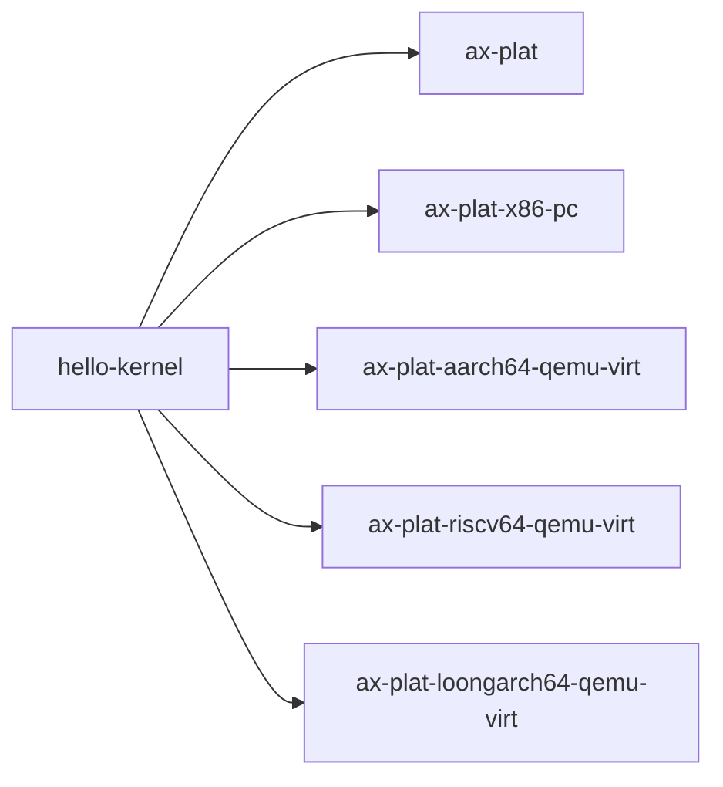

# `hello-kernel` 技术文档

> 路径：`components/axplat_crates/examples/hello-kernel`
> 类型：平台样例内核 crate
> 分层：组件层 / `axplat` 最小 bring-up 示例
> 版本：`0.1.0`
> 文档依据：`Cargo.toml`、`src/main.rs`、`Makefile`、`README.md`

`hello-kernel` 是 `axplat` 工作区里最短的“能真正跑起来”的内核样例。它显式链接一个目标平台包，调用 `ax_plat::percpu::init_primary()`、`ax_plat::init::init_early()` 和 `init_later()`，然后打印启动信息、忙等 5 秒并关机。

因此它最重要的边界是：**它不是可复用内核框架，也不是上层系统应该直接继承的骨架；它只是验证 `axplat` 最小启动链是否成立的样例入口。**

## 1. 架构设计分析
### 1.1 最小内核主线
源码只有一个文件，但结构非常清晰：

1. 通过 `cfg_if!` 选择当前架构对应的平台 crate。
2. `init_kernel(cpu_id, arg)` 完成 per-CPU 与平台初始化。
3. `#[ax_plat::main] fn main(...) -> !` 打印信息、忙等、关机。
4. `panic_handler` 在 panic 时走控制台输出并关机。

它几乎把“基于 `axplat` 写最小内核”压缩到了最短。

### 1.2 真实调用链


这个顺序非常重要，因为它展示了 `axplat` 使用者最基本的职责分工：

- 平台 crate 提供启动入口与板级实现
- 示例内核负责在进入主逻辑前按顺序完成平台抽象要求的初始化

### 1.3 为什么要显式 `extern crate` 平台包
这里没有默认平台自动选择逻辑，而是按架构显式链接：

- `ax-plat-x86-pc`
- `ax-plat-aarch64-qemu-virt`
- `ax-plat-riscv64-qemu-virt`
- `ax-plat-loongarch64-qemu-virt`

这说明它本质上是 `axplat` 平台包的最小消费者，用来证明平台包已经具备最小 bring-up 能力。

## 2. 核心功能说明
### 2.1 实际演示的能力链
这个样例实际覆盖的是：

- 启动入口成功跳到 `#[ax_plat::main]`
- BSP 的 per-CPU 状态已建立
- 控制台与时间源可用
- `busy_wait` 可以推进时间
- 关机路径 `system_off()` 可用

### 2.2 为什么只做 `busy_wait`
这里不用调度器、不用文件系统、不用中断，是刻意缩短故障面。只要这份样例都跑不通，就说明问题还在更底层：

- 平台启动入口
- 串口
- 时间源
- 电源关机路径

### 2.3 边界澄清
这份样例不是：

- ArceOS 的应用入口
- `ax-runtime` 的替代品
- 可直接扩展成完整内核的通用骨架

它只是 `axplat` 平台包的最小消费者。

## 3. 依赖关系图谱


### 3.1 直接依赖
- `axplat`：对外暴露统一的平台抽象接口。
- `cfg-if`：按架构切换平台 crate。
- 各平台包：提供真正的板级实现。

### 3.2 关键间接依赖
- `ax-plat-macros`：支撑 `#[ax_plat::main]`。
- `ax-cpu`、串口/时钟相关底层组件：由平台包继续下接。

### 3.3 主要消费者
- `axplat` 平台包的 bring-up 验证。
- 新平台接入时的第一条最短运行路径。
- `irq-kernel`、`smp-kernel` 之前的基础烟雾测试。

## 4. 开发指南
### 4.1 推荐运行方式
```bash
cd components/axplat_crates/examples/hello-kernel
make ARCH=<x86_64|aarch64|riscv64|loongarch64> run
```

`Makefile` 会根据架构选择 target triple，并在必要时把 ELF 转成 bin 后交给 QEMU。

### 4.2 修改时的注意点
1. 保持这个样例足够小，不要把更高层能力堆进来。
2. 如果新增某个平台支持，要同时更新 `Cargo.toml`、`cfg_if!` 分支和 `Makefile` 运行路径。
3. `panic_handler` 和正常退出都应走最短控制台/关机链，便于定位问题。

### 4.3 什么时候该换别的样例
- 要测中断：换 `irq-kernel`
- 要测多核：换 `smp-kernel`
- 要测上层 OS bring-up：换 ArceOS 的 `ax-helloworld`

## 5. 测试策略
### 5.1 当前测试形态
这是手工和联调型样例，不是 `test-suit` 自动回归包。README 给出了预期输出，重点观察：

- `Hello, ArceOS!`
- `cpu_id = ...`
- 每秒一次的 `elapsed`
- 最终 `All done, shutting down!`

### 5.2 成功标准
- 能成功进入 `main()`
- 控制台与时间输出正常
- 5 次忙等后顺利关机

### 5.3 风险点
- 如果时间源没有初始化，`elapsed` 输出会异常。
- 如果平台关机路径有问题，最后一步会卡住。

## 6. 跨项目定位分析
### 6.1 ArceOS
ArceOS 不直接依赖这个样例，但会复用同一批平台包。它对 ArceOS 的价值在于：平台层有问题时，先用这条最小路径定位，再进入 `ax-runtime` 和更高层。

### 6.2 StarryOS
StarryOS 同样不会直接运行它。这个样例只是帮助验证其下方共享的 `axplat` 平台栈是否最起码可启动。

### 6.3 Axvisor
Axvisor 也不直接消费它。不过对平台 bring-up 来说，先跑 `hello-kernel` 往往比直接调 Hypervisor 更容易分辨问题在平台层还是上层逻辑。
