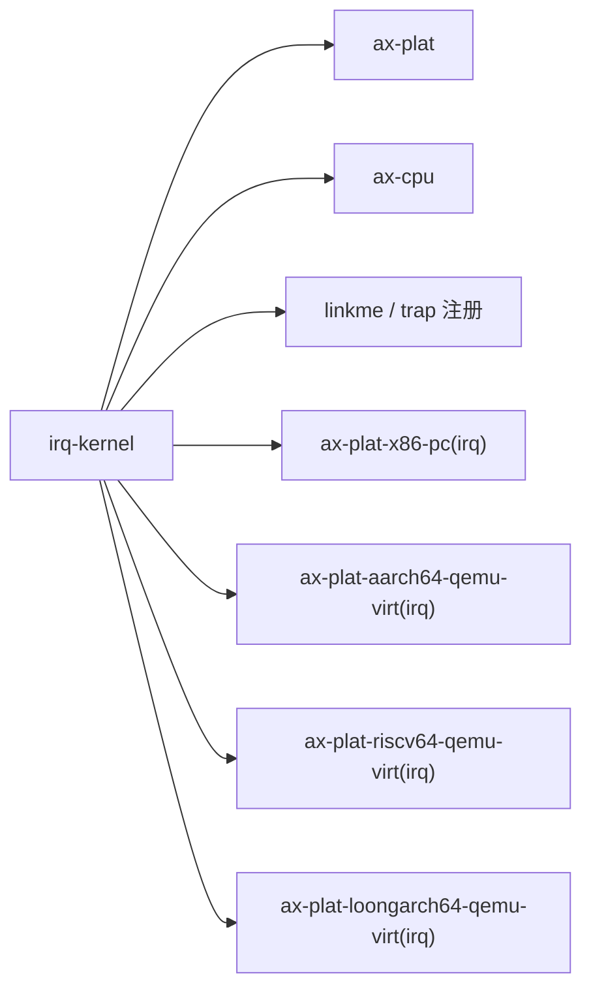

# `irq-kernel` 技术文档

> 路径：`components/axplat_crates/examples/irq-kernel`
> 类型：平台样例内核 crate
> 分层：组件层 / `axplat` 中断链路示例
> 版本：`0.1.0`
> 文档依据：`Cargo.toml`、`src/main.rs`、`src/irq.rs`、`Makefile`、`README.md`

`irq-kernel` 在 `hello-kernel` 的最小 bring-up 基础上，再往前走一步：它注册 trap handler、挂接平台定时器 IRQ、按 one-shot 方式重装下一次中断，并在 5 秒内统计中断触发次数。这条路径可以非常直接地证明“平台中断控制器 + trap 分发 + 定时器重装”是否工作。

因此必须明确：**它不是通用 IRQ 框架，也不是驱动层抽象库；它只是 `axplat` 平台中断能力的最小验证入口。**

## 1. 架构设计分析
### 1.1 与 `hello-kernel` 的差异
`main.rs` 的总体结构与 `hello-kernel` 很像，但多了两步：

- `init_irq()`
- `test_irq()`

真正的核心逻辑集中在 `src/irq.rs`。

### 1.2 中断处理主线
`src/irq.rs` 里有三块关键内容：

1. `#[register_trap_handler(IRQ)] fn irq_handler(vector)`  
   把平台收到的 IRQ 交给 `ax_plat::irq::handle(vector)` 分发。
2. `init_irq()`  
   注册定时器处理函数并开中断。
3. `test_irq()`  
   每秒观察一次累计中断次数，并在 5 秒后检查数量下限。

可以把它的真实链路概括为：


### 1.3 为什么使用 one-shot timer
`update_timer()` 并不是简单假设“平台会自动周期触发”。它自己维护 `NEXT_DEADLINE`，每次中断后重新设置下一次到期时间。这样可以同时验证：

- 中断真的被分发到了处理函数
- 定时器重新装载接口可用
- 时间推进与中断数量大致匹配

## 2. 核心功能说明
### 2.1 `init_irq()`
这个函数做了三件事：

1. 注册平台定时器 IRQ 对应的回调。
2. 打印 `Timer IRQ handler registered.` 作为观测点。
3. 调用 `ax-cpu::asm::enable_irqs()` 真正打开中断。

也就是说，它验证的不只是 handler 注册，还有 IRQ 使能本身。

### 2.2 `test_irq()`
该测试在 5 秒内每秒打印一次：

- 已过时间
- 已处理 IRQ 数

最后要求：

- `irq_count >= TICKS_PER_SEC * interval`

这里的断言不是追求绝对精确，而是要求“至少达到了预期的最低触发次数”，这更适合 QEMU 和多架构平台环境。

### 2.3 边界澄清
它不负责：

- 多设备 IRQ 共存验证
- 中断嵌套复杂场景
- OS 级抢占调度

它只聚焦“最小内核 + 定时器 IRQ”这条链。

## 3. 依赖关系图谱


### 3.1 直接依赖
- `axplat`：平台抽象与 `irq`/`time` 接口。
- `ax-cpu`：trap handler 注册与开中断辅助。
- `linkme`：支撑 `register_trap_handler` 这类分布式注册。
- 各平台包的 `irq` feature：真正接入板级中断控制器与定时器。

### 3.2 关键间接依赖
- `ax_plat::irq::register`
- `ax_plat::irq::handle`
- `ax_plat::time::set_oneshot_timer`
- 平台配置中的 `config::devices::TIMER_IRQ`

### 3.3 主要消费者
- 平台中断能力 bring-up 的第一条最小路径。
- `smp-kernel` 之前的单核 IRQ smoke test。

## 4. 开发指南
### 4.1 推荐运行方式
```bash
cd components/axplat_crates/examples/irq-kernel
make ARCH=<x86_64|aarch64|riscv64|loongarch64> run
```

### 4.2 修改时的注意点
1. 处理函数应尽量短，只做计数和重装定时器。
2. 若修改 `TICKS_PER_SEC`，要同步检查 README 和期望计数下限。
3. 不要在这里引入复杂调度逻辑，否则会把“IRQ 问题”与“上层任务问题”混在一起。

### 4.3 适合补充的方向
- 平台特定 IRQ 源验证
- 更长时间窗口下的统计稳定性
- 与 SMP 结合的多核中断路径，但那通常应放到 `smp-kernel`

## 5. 测试策略
### 5.1 当前测试形态
这是 README 驱动的运行样例，典型输出会显示：

- handler 注册成功
- 每秒累计中断数上升
- 最终 `Timer IRQ test passed.`

### 5.2 成功标准
- IRQ handler 能被触发
- 中断计数持续增长
- one-shot timer 能不断被重装
- 最后计数达到最低阈值并通过断言

### 5.3 风险点
- 如果平台 timer IRQ 号配置错了，计数会停在 0。
- 如果 trap 分发没接通，`irq_handler` 根本不会执行。
- 如果 one-shot 重装有 bug，计数通常只增长一次或几次。

## 6. 跨项目定位分析
### 6.1 ArceOS
ArceOS 不直接依赖这个样例，但会复用相同的 `axplat` 平台包和 IRQ 底座。因此它对 ArceOS 的意义是“先确认平台 IRQ 最小链路成立，再进入 `ax-runtime` 和 `ax-task` 的更复杂场景”。

### 6.2 StarryOS
StarryOS 也不会直接运行它。这个样例只是帮助确认共享平台包的 trap/IRQ 基础能力仍然健全。

### 6.3 Axvisor
Axvisor 同样不直接消费它，不过对任何依赖平台中断的系统来说，先用这条最小路径验证 timer IRQ，通常比直接调完整系统更高效。
