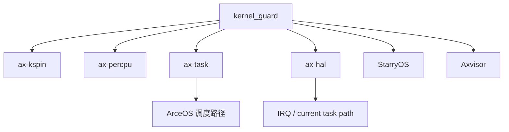

# `kernel_guard` 技术文档

> 路径：`components/kernel_guard`
> 类型：库 crate
> 分层：组件层 / 临界区策略与 guard 层
> 版本：`0.1.3`
> 文档依据：当前仓库源码、`Cargo.toml`、`README.md`、`src/lib.rs`、`src/arch/*`

`kernel_guard` 是内核态临界区管理的基础件。它通过 RAII guard 把“进入临界区时需要做什么、离开时如何恢复”抽象成统一模型，用于表达本地关中断、关抢占或两者组合的策略。它本身不是锁，也不做调度；它提供的是“锁和调度器都要依赖的临界区原语”。

## 1. 架构设计分析

### 1.1 设计定位

`kernel_guard` 解决的是内核同步里一个非常基础的问题：

- 进入某段关键代码前，需要先关本地 IRQ 或关抢占
- 离开时必须按正确顺序恢复

如果把这套逻辑散落在锁、调度器、per-CPU 访问和 IRQ 路径里，系统会非常脆弱。因此它把临界区策略抽成了独立库。

### 1.2 顶层模块划分

| 模块 | 作用 |
| --- | --- |
| `lib.rs` | 对外 guard 模型与 trait |
| `arch/mod.rs` | 按架构选择本地 IRQ save/restore 实现 |
| `arch/*` | x86/RISC-V/AArch64/ARM/LoongArch 的具体中断屏蔽实现 |

### 1.3 核心抽象：`BaseGuard`

`BaseGuard` 是该 crate 的统一模型。它只要求实现两件事：

- `acquire()`
- `release(state)`

其中 `State` 用于保存进入临界区前的硬件或运行时状态，例如：

- 原先 IRQ 开关状态
- 或者无状态 `()`

这个设计使上层锁可以完全参数化“临界区策略”，而不必知道细节。

### 1.4 关键 guard 类型

#### `NoOp`

什么都不做，适合调用方已经保证当前上下文足够安全的场景。

#### `IrqSave`

进入时保存并关闭本地中断，离开时恢复原状态。这对应“传统 irqsave 临界区”。

#### `NoPreempt`

进入时关闭抢占，离开时恢复抢占。它本身不实现抢占逻辑，而是通过 `ax-crate-interface` 调用外部 `KernelGuardIf` 接口。

#### `NoPreemptIrqSave`

先关抢占，再关中断；退出时先恢复中断，再恢复抢占。它是多数组合型自旋锁和关键调度路径最常用的 guard。

### 1.5 架构后端

本 crate 直接在 `arch/*` 中实现本地中断屏蔽与恢复：

- x86：基于 IF 位与 `cli/sti`
- RISC-V：基于 `sstatus.SIE`
- AArch64：基于 `DAIF`
- ARM：基于 `CPSR`
- LoongArch：基于对应 CSR 的 IE 位

这说明它的“关中断”不是通过 HAL 间接实现，而是直接贴 ISA 写的。

### 1.6 与 `ax-crate-interface` 的关系

抢占开关不是本 crate 自己决定的。它只定义：

- `KernelGuardIf`

具体由谁来实现、如何实现，交给其他 crate。例如 `ax-task` 会把它接到任务抢占计数或调度状态上。这样 `kernel_guard` 可以保持足够小，而不依赖调度器本身。

### 1.7 一个容易混淆的点

本 crate 里没有名为 `NoIrq` 的真实类型。语义上与“关中断”最接近的是：

- `IrqSave`

而 `ax_kspin::SpinNoIrq` 之类上层命名，通常是把更复杂的 guard 组合映射成更直观的锁名。

## 2. 核心功能说明

### 2.1 主要能力

- 提供 RAII 临界区 guard
- 提供统一的 `BaseGuard` 抽象
- 实现本地 IRQ save/restore
- 通过外部接口支持关抢占
- 让锁、per-CPU 访问和调度路径共享同一套临界区语义

### 2.2 典型使用场景

| 场景 | 使用方式 |
| --- | --- |
| 自旋锁 | 用 `BaseGuard` 参数化锁的临界区策略 |
| per-CPU 访问 | 在访问当前 CPU 数据前临时关抢占 |
| IRQ 入口 | 在中断处理期间保持合适的抢占/IRQ 状态 |
| 调度路径 | 在 run queue、任务切换和当前任务查询中保护关键状态 |

### 2.3 运行时主线

最典型的一条链路是：

1. 构造某种 guard
2. `acquire()` 执行硬件或运行时状态切换
3. 关键代码运行
4. guard drop 时自动 `release()`

这正是 RAII 模式在内核同步场景的直接应用。

## 3. 依赖关系图谱

### 3.1 直接依赖

| 依赖 | 作用 |
| --- | --- |
| `cfg-if` | 条件编译架构后端 |
| `ax-crate-interface` | 定义和调用 `KernelGuardIf` |

### 3.2 主要消费者

仓库内关键消费者包括：

- `ax-kspin`
- `ax-percpu`
- `ax-task`
- `ax-hal`
- `os/StarryOS/kernel`
- `os/axvisor`

### 3.3 关系示意

## 4. 开发指南

### 4.1 新增一种 guard 策略

如果需要新增临界区策略，标准方式是：

1. 实现 `BaseGuard`
2. 定义所需 `State`
3. 在 `acquire()` 中切换状态
4. 在 `release()` 中恢复状态

这样就能被 `ax-kspin`、`ax-task` 等通用框架复用。

### 4.2 修改现有 guard 时的关注点

- `NoPreemptIrqSave` 的进入/退出顺序不能随意改动
- host 上 `target_os != none` 时 guard 会退化成 `NoOp`，修改时要同时考虑裸机和主机测试语义
- 若 `KernelGuardIf` 契约变化，要同步检查 `ax-task` 等实现方

### 4.3 与锁的职责边界

- `kernel_guard`：描述临界区策略
- `ax-kspin`：真正持有锁状态并组合 guard

不要把锁行为写进 `kernel_guard`，否则这层会失去通用性。

## 5. 测试策略

### 5.1 当前测试面

从仓库结构看，本 crate 本体的独立测试不多，更多依赖：

- 多架构构建检查
- 上层 `ax-kspin`、`ax-percpu`、`ax-task` 的间接使用

这符合它的定位，因为很多关键语义要在目标架构和真实运行时上下文中才成立。

### 5.2 推荐重点测试

- 裸机目标上的 IRQ save/restore 正确性
- `preempt` 开关前后的 `NoPreempt` / `NoPreemptIrqSave` 行为
- 与 `ax-kspin` 组合时的嵌套和 drop 顺序
- 与 `ax-task` 调度路径配合时的抢占计数一致性

### 5.3 风险点

- 这是同步与调度路径共享的基础设施，问题会同时影响锁、IRQ 和任务切换
- host 测试往往只能覆盖退化语义，不能代替裸机验证
- 一旦进入/退出顺序写错，问题会非常隐蔽

## 6. 跨项目定位分析

| 项目 | 位置 | 角色 | 核心作用 |
| --- | --- | --- | --- |
| ArceOS | 同步、调度、HAL 共用基础件 | 临界区策略库 | 为自旋锁、per-CPU 访问、IRQ 入口和调度器提供统一 guard 语义 |
| StarryOS | 通过共享基础栈直接使用 | 内核临界区基础件 | 为用户内存访问、任务路径和同步原语提供底层保护机制 |
| Axvisor | Hypervisor 调度/访问路径基础件 | VMM 临界区策略层 | 为当前 vCPU 访问、关键 VMM 路径和局部锁提供统一 guard 抽象 |

## 7. 总结

`kernel_guard` 虽然很小，但它处在同步、调度和中断三条主线的交汇处。它把“如何进入临界区”从锁和调度器中剥离出来，使整个系统可以围绕统一的 guard 语义组织关键路径。这种分层对 ArceOS、StarryOS 和 Axvisor 都是基础设施级的价值。
