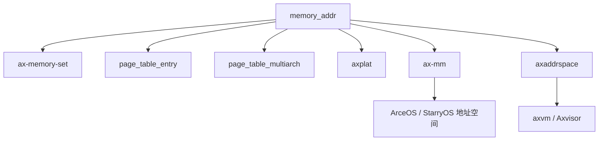

# `memory_addr` 技术文档

> 路径：`components/axmm_crates/memory_addr`
> 类型：库 crate
> 分层：组件层 / 地址建模基础库
> 版本：`0.4.1`
> 文档依据：当前仓库源码、`Cargo.toml`、`README.md`、`src/lib.rs`、`src/addr.rs`、`src/range.rs`、`src/iter.rs`

`memory_addr` 是整个仓库内存子系统最底层的语义基石之一。它不做页表，不做映射策略，也不做物理页分配；它只做一件事：用类型化方式表达“地址”和“地址区间”，并提供对齐、算术和分页遍历等最基础但最容易出错的操作。`axplat`、`ax-mm`、`page_table_multiarch`、`axaddrspace`、虚拟化栈以及 StarryOS 的内存路径都把它当作共同语言层。

## 1. 架构设计分析

### 1.1 设计定位

该 crate 的设计原则非常克制：

- 不依赖平台和架构特性
- 不依赖页表实现
- 不依赖分配器
- 不绑定宿主还是访客地址空间

因此它适合作为所有内存相关组件的公共底座。

### 1.2 模块划分

| 模块 | 作用 | 关键内容 |
| --- | --- | --- |
| `lib.rs` | 顶层导出与通用对齐函数 | `PAGE_SIZE_*`、`align_*`、`is_aligned_*`、页迭代器别名 |
| `addr.rs` | 地址类型与地址 trait | `MemoryAddr`、`PhysAddr`、`VirtAddr`、`def_usize_addr!` |
| `range.rs` | 区间建模 | `AddrRange<A>`、`PhysAddrRange`、`VirtAddrRange` |
| `iter.rs` | 页级遍历 | `PageIter<const PAGE_SIZE, A>`、`DynPageIter<A>` |

### 1.3 地址建模核心：`MemoryAddr`

`MemoryAddr` trait 是本 crate 的抽象中心。它面向所有“本质是地址”的类型，而不是只面向 `PhysAddr` 和 `VirtAddr`。这意味着：

- 它可以建模普通物理地址
- 可以建模虚拟地址
- 也可以被上层复用于 GPA/GVA 等访客地址类型

这正是 `axaddrspace` 能基于它继续定义 `GuestPhysAddr`、`GuestVirtAddr` 的原因。

### 1.4 两个内建地址类型

#### `PhysAddr`

表示物理地址，适合：

- 页表项物理页帧地址
- 设备 MMIO 物理区间
- 物理内存布局描述

#### `VirtAddr`

表示虚拟地址，除了普通地址操作外，还额外支持：

- 裸指针转换
- 与 `*const T` / `*mut T` 互转
- 便于内核早期或 host-side 低层代码桥接指针语义

### 1.5 宏驱动扩展：`def_usize_addr!`

这是本 crate 最重要的工程化能力之一。`def_usize_addr!` 允许上层快速定义新的透明地址类型，并自动获得：

- `From<usize>` / `Into<usize>`
- `Add` / `Sub`
- `Debug` / 十六进制格式化
- `MemoryAddr` trait 能力

这使仓库可以自然扩展出：

- `GuestPhysAddr`
- `GuestVirtAddr`
- 其他特化地址类型

而不必复制整套地址运算逻辑。

### 1.6 区间模型：`AddrRange<A>`

`AddrRange<A>` 用半开区间 `[start, end)` 表示一段地址范围。它承担三个关键职责：

- 统一表达地址空间中的连续区段
- 提供包含、重叠、子区间等关系判断
- 为更高层的 `MemoryArea` / `MemorySet` 提供底层区间语义

这个设计直接决定了 `ax-memory-set`、`ax-mm`、`axaddrspace` 等上层都能围绕同一套区间语义组织逻辑。

### 1.7 对齐与遍历

`memory_addr` 在最常见、也最容易写错的两个问题上给出统一实现：

#### 对齐

- `align_down`
- `align_up`
- `align_offset`
- `is_aligned`
- `align_*_4k`
- `is_aligned_4k`

既提供面向 `usize` 的自由函数，也通过 `MemoryAddr` 为地址类型提供同名方法。

#### 页级遍历

- `PageIter<const PAGE_SIZE, A>`
- `DynPageIter<A>`

这使上层能按页粒度扫描地址区间，而不必自己维护加法和边界条件。

### 1.8 设计上的一个细节

源码里有一个值得文档明确说明的点：

- `MemoryAddr::add()` / `sub()` 等方法倾向于 checked 语义，溢出会触发显式错误路径或 panic
- 某些由宏生成的 `Add<usize>` / `Sub<usize>` 运算符则更接近裸 `usize` 行为

因此在写高层内存代码时，若希望更明确地表达边界检查意图，优先使用 `MemoryAddr` 提供的方法而不是直接依赖运算符重载。

## 2. 核心功能说明

### 2.1 主要能力

- 提供 `PhysAddr` / `VirtAddr` 两类标准地址类型
- 为地址类型提供统一的对齐、偏移和差值计算
- 提供通用地址区间模型 `AddrRange`
- 提供页粒度迭代器和标准页大小常量
- 提供宏机制，支持上层快速定义新的地址类型

### 2.2 典型使用场景

| 场景 | 使用方式 |
| --- | --- |
| 平台内存布局 | 用 `PhysAddr`、`VirtAddr` 和页大小常量表达物理/虚拟布局 |
| 地址空间管理 | 用 `AddrRange` 表示映射区间 |
| 页表实现 | 用 `PhysAddr` 和对齐函数处理页表页与页帧 |
| 虚拟化 | 用宏扩展出 `GuestPhysAddr` / `GuestVirtAddr` |
| 页扫描 | 用 `PageIter4K` 等按页遍历一段区间 |

### 2.3 典型 API 主线

最常见的一条调用链是：

1. 用 `PhysAddr::from_usize()` / `VirtAddr::from_usize()` 创建地址
2. 用 `align_up_4k()` 或 `align_down_4k()` 处理页对齐
3. 用 `AddrRange::from_start_size()` 表示连续区间
4. 用 `PageIter4K` 或 `DynPageIter` 遍历区间内每个页起点

这条主线在 `ax-mm`、`ax-memory-set`、`page_table_multiarch` 和 `axaddrspace` 里都能看到。

## 3. 依赖关系图谱

### 3.1 直接依赖

`memory_addr` 几乎没有外部依赖，核心只依赖标准 `core` 语义。`Cargo.toml` 中没有显式第三方依赖，这意味着它本身就是一个极度轻量、适合作为底座复用的 crate。

### 3.2 主要消费者

仓库内直接或间接依赖它的关键模块包括：

- `ax-memory-set`
- `page_table_entry`
- `page_table_multiarch`
- `axplat`
- `ax-mm`
- `axaddrspace`
- `axvm`
- `axvisor_api`
- `x86_vcpu`
- `riscv_vcpu`

### 3.3 关系示意

## 4. 开发指南

### 4.1 新定义一种地址类型

如果需要在新模块中引入新的地址语义，例如设备总线地址、访客物理地址或其他逻辑地址，推荐：

1. 使用 `def_usize_addr!` 定义新类型
2. 使用 `def_usize_addr_formatter!` 补充格式化
3. 基于 `AddrRange<YourAddr>` 定义对应区间别名

这样可最大化复用已有工具，而不是重新发明一套地址封装。

### 4.2 地址与区间使用建议

- 表达连续区间时，不要直接传 `(start, size)` 裸元组，优先使用 `AddrRange`
- 涉及页粒度操作时，优先先做对齐，再做迭代
- 涉及潜在溢出时，优先使用 checked 风格接口

### 4.3 与上层集成

- 与 `ax-memory-set` 集成时，`AddrRange` 是 `MemoryArea` 的直接区间载体
- 与 `page_table_entry` / `page_table_multiarch` 集成时，`PhysAddr` 是页表项和页表页操作的基础地址类型
- 与 `axaddrspace` 集成时，宏扩展机制可直接派生出 GPA/GVA 类型

## 5. 测试策略

### 5.1 当前源码已覆盖的方向

源码中已经包含一些基础测试，主要覆盖：

- 对齐函数
- 地址算术
- 指针与 `VirtAddr` 的互转
- 区间关系判断

这说明本 crate 的测试重点集中在“语义正确性”和“边界条件”。

### 5.2 推荐继续补充的测试

- `PageIter` / `DynPageIter` 的边界行为
- `AddrRange::try_from_start_size()` 的溢出和非法区间行为
- 宏生成地址类型后的格式化与算术一致性
- checked 接口与运算符接口的差异测试

### 5.3 风险点

- 地址运算属于底层公共语义，任何边界错误都会向上放大
- 若区间构造不严谨，会直接影响 `ax-memory-set`、`ax-mm`、`axaddrspace` 这类核心模块
- 页级迭代若处理不当，会造成页表遍历或映射建立的 off-by-one 错误

## 6. 跨项目定位分析

| 项目 | 位置 | 角色 | 核心作用 |
| --- | --- | --- | --- |
| ArceOS | MM 和平台层共同基础件 | 地址/区间公共语言 | 支撑 `axplat`、`ax-mm`、页表与物理内存布局表达 |
| StarryOS | 内核内存管理底层公共件 | 用户地址空间与区间语义基座 | 为 `mmap`、`brk`、页对齐与区间检查提供统一类型基础 |
| Axvisor | 宿主/访客地址抽象底座 | 虚拟化地址建模出发点 | `axaddrspace` 在其上扩展出 GPA/GVA，并与嵌套页表逻辑拼接 |

## 7. 总结

`memory_addr` 看起来简单，但它解决的是整个代码库最不适合分散实现的一类问题：地址与区间的基本语义。通过统一类型、统一对齐逻辑、统一区间模型和统一扩展宏，它把内存管理、平台支持和虚拟化组件都拉到了同一套地址语言上，是所有上层内存子系统真正共享的第一层基础设施。
