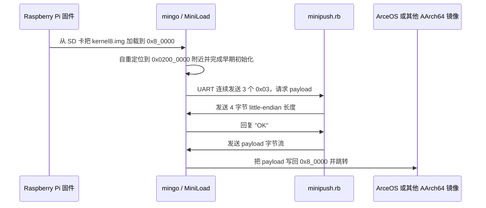
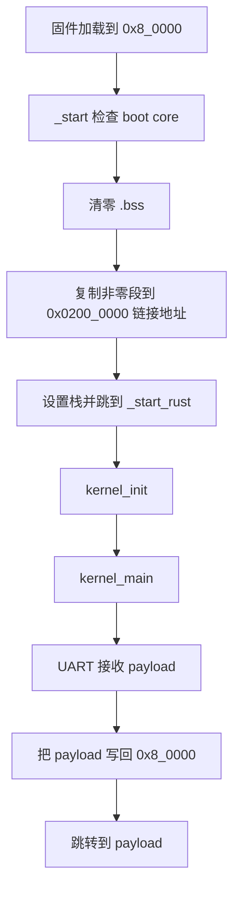

# `mingo` 技术文档

> 路径：`os/arceos/tools/raspi4/chainloader`
> crate 形态：独立二进制 crate，包名为 `mingo`，`[[bin]]` 名为 `kernel`
> 运行环境：`aarch64-unknown-none-softfloat`、`#![no_std]`、`#![no_main]`
> 实际角色：Raspberry Pi 3/4 板端 UART chainloader，ArceOS `chainboot` / `jtagboot` 工作流的第一阶段接收器
> 版本：`0.6.0`
> 文档依据：`Cargo.toml`、`README.md`、`README.CN.md`、`Makefile`、`build.rs`、`src/main.rs`、`src/console.rs`、`src/driver.rs`、`src/synchronization.rs`、`src/_arch/aarch64/cpu/boot.s`、`src/bsp/raspberrypi/driver.rs`、`src/bsp/raspberrypi/memory.rs`、`src/bsp/raspberrypi/kernel.ld`、`src/bsp/device_driver/bcm/bcm2xxx_pl011_uart.rs`、`src/bsp/device_driver/bcm/bcm2xxx_gpio.rs`、`tests/chainboot_test.rb`、`os/arceos/tools/raspi4/common/serial/minipush.rb`、`os/arceos/scripts/make/raspi4.mk`、`os/arceos/doc/platform_raspi4.md`、`os/arceos/doc/jtag_debug_in_raspi4.md`

`mingo` 的真实定位必须先讲清楚，否则整篇文档都会偏掉。它不是可以被别的 crate 依赖的库，也不是开发机上执行的串口发送命令；它是部署在树莓派板上的裸机小程序，先由树莓派固件从 SD 卡拉起，再通过 UART 向宿主机的 `minipush.rb` 请求下一级镜像，最后把 payload 写回固件默认加载地址 `0x8_0000` 并直接跳转。它位于 `tools/` 目录，源码又保留了上游 tutorial 风格，因此很容易被误写成“实验样例”或“宿主机辅助工具”；更准确的说法应是：**它是一个带教学来源色彩、但已经被 ArceOS 树莓派开发流程实际使用的板端链加载工具**。

## 1. 真实定位与边界

### 1.1 它是什么，不是什么

| 问题 | 结论 | 依据 |
| --- | --- | --- |
| 它是库 crate 吗 | 不是 | 没有公共 API，入口是 `src/main.rs`，目标产物是裸机可执行镜像 |
| 它是宿主机命令行工具吗 | 不是 | 真正运行时在 Raspberry Pi 板端，由固件从 `0x8_0000` 启动 |
| 它是板端工具吗 | 是 | 启动后初始化 UART/GPIO、接收 payload、跳转执行 |
| 它有实验/教学背景吗 | 有 | README 仍是 tutorial 体例，协议和错误处理都很极简 |
| 它在当前仓库里只是摆设吗 | 不是 | `os/arceos/scripts/make/raspi4.mk` 和实板文档都把它当成 `chainboot` / `jtagboot` 前提 |

因此，`mingo` 的最准确分类是：

- 形态上，它是一个独立的裸机二进制工具 crate。
- 部署上，它驻留在树莓派板端，而不是宿主机。
- 用途上，它服务于开发阶段的快速重载与调试，不是通用生产级 bootloader。
- 工程属性上，它比“可复用库”更专用，比“纯样例”更真实，因为 ArceOS 的树莓派工作流确实围绕它展开。

### 1.2 真实调用关系

源码和主工程脚本连起来看，实际链路如下：



这里最容易搞混的地方有两个：

- 宿主机侧发送器是 `os/arceos/tools/raspi4/common/serial/minipush.rb`，不是 `mingo`。
- `os/arceos/tools/raspi4/chainloader/Makefile` 里的 `chainboot` 发送的是教程自带的 `demo_payload_rpi4.img`；而 ArceOS 主工程 `os/arceos/scripts/make/raspi4.mk` 里的 `make chainboot` 才会发送当前构建出来的真实内核镜像。

## 2. 架构设计

### 2.1 启动与自重定位

`src/_arch/aarch64/cpu/boot.s` 与 `src/bsp/raspberrypi/kernel.ld` 共同定义了它最核心的结构：**加载地址与链接地址分离**。

- 树莓派固件把镜像放在 `0x8_0000`。
- 链接脚本把程序链接到 `0x0200_0000`。
- `_start` 只允许 boot core 继续运行，其余核心进入 `wfe` 停车。
- 启动代码清零 `.bss` 后，把 `__binary_nonzero_start..__binary_nonzero_end_exclusive` 从当前加载地址复制到链接地址。
- 栈顶取自 `__boot_core_stack_end_exclusive`，随后跳到重定位后的 `_start_rust`。

这个设计的目的非常直接：先把 `mingo` 自己挪开，空出 `0x8_0000`，这样收到的 payload 就可以按 Raspberry Pi 固件默认约定落回这个地址，并像“直接从 SD 卡启动”那样继续执行。



### 2.2 运行时骨架

`mingo` 没有引入 ArceOS 主线运行时，而是自己带着一套最小骨架：

| 模块 | 作用 | 真实职责 |
| --- | --- | --- |
| `cpu` / `_arch/aarch64` | 启动与 CPU 辅助 | 提供 `_start`、`nop()`、`wait_forever()` |
| `bsp` / `bsp/raspberrypi` | 板级封装 | 提供板名、MMIO 地址、默认加载地址、驱动实例 |
| `driver` | 极简驱动管理器 | 固定数组保存驱动描述符，顺序初始化并执行 post-init |
| `console` | 全局控制台抽象 | 默认是空控制台，UART 初始化后切换为真实控制台 |
| `synchronization` | `NullLock` 伪锁 | 依赖单核、无抢占、早期启动上下文 |
| `print` / `panic_wait` | 输出与 panic 处理 | 让裸机环境下仍可 `println!`，panic 后停机等待 |

`kernel_init()` 的执行顺序是：

1. `bsp::driver::init()` 注册驱动。
2. `driver::driver_manager().init_drivers()` 逐个初始化驱动。
3. UART 的 post-init 把 `PL011_UART` 注册成全局 console。
4. GPIO 的 post-init 把 PL011 映射到 GPIO 14/15。
5. 进入 `kernel_main()`，开始链加载协议。

当前真正被注册并初始化的设备只有两个：

- `PL011_UART`
- `GPIO`

这说明 `mingo` 的硬件依赖面非常窄，本质上就是“把串口 bring-up 到可收包，然后跳转”。

### 2.3 单核假设与并发边界

`synchronization::NullLock` 不是完整互斥锁，只是在“单核、无中断竞争、早期启动”前提下提供一个统一访问形式。再结合 `_start` 中“非 boot core 全部 `wfe`”的设计，可以看出 `mingo` 的并发模型非常保守：

- 它假设只有一个核心真正执行加载流程。
- 它没有面向中断、抢占、多线程设计同步原语。
- 它适合作为极早期板端工具，不适合作为通用运行时基础设施。

## 3. 核心功能

### 3.1 UART 链加载协议

`src/main.rs` 的 `kernel_main()` 完整体现了协议本体：

1. 打印 `MiniLoad` ASCII logo 与板名。
2. `console().clear_rx()`，清空串口残留输入。
3. 连续发送三个值为 `0x03` 的字符，请求宿主机发送 payload。
4. 从 UART 读取 4 字节 little-endian 长度。
5. 回复 `"OK"` 作为确认。
6. 把后续 `size` 字节逐字节写入 `bsp::memory::board_default_load_addr()`。
7. 打印“Loaded”，可选进入 JTAG 等待。
8. 通过 `core::mem::transmute()` 把起始地址转成函数指针并跳转。

与 `minipush.rb` 对照后，可以确认这是两端严格配套的一组最小协议：

- `minipush.rb` 先等待连续三个 `0x03`。
- 然后发送 `pack('L<')` 编码的 payload 长度。
- 收到 `"OK"` 后，按 512 字节块发送 payload。

### 3.2 为什么说它更像开发工具，而不是通用 bootloader

源码里一句 `Trust it's not too big.` 已经把设计目标写得很直白。当前协议刻意追求简单，代价是很多通用引导器应有的能力都不存在：

- 没有镜像头或版本协商。
- 没有长度上界检查。
- 没有校验和或签名验证。
- 没有失败回退、双镜像、恢复模式。
- 没有抽象出的可扩展协议层。

所以它更像“用于快速开发迭代的板端接收器”，而不是面向交付环境的安全 bootloader 框架。

### 3.3 feature 与板型差异

| feature | 作用 | 实际影响 |
| --- | --- | --- |
| `bsp_rpi3` | 选择 Raspberry Pi 3 BSP | 使用 `0x3F00_0000` MMIO 基址和 BCM2837 GPIO 配置路径 |
| `bsp_rpi4` | 选择 Raspberry Pi 4 BSP | 使用 `0xFE00_0000` MMIO 基址和 BCM2711 GPIO 配置路径 |
| `enable_jtag_debug` | 在跳转前停机等待调试 | 打印 OpenOCD/GDB 提示并进入 `wait_forever()` |

不同板型之间，共享的是整个加载模型；真正变化的主要是：

- GPIO 与 UART 的 MMIO 基址。
- GPIO 14/15 pull-up/down 配置方式。
- `Makefile` 中目标 CPU 选择，如 RPi4 默认 `cortex-a72`。

但下一级 payload 的落点不变，始终仍是 `0x8_0000`。

## 4. 依赖关系

### 4.1 Cargo 直接依赖

| 依赖 | 类型 | 作用 |
| --- | --- | --- |
| `aarch64-cpu` | 目标架构依赖 | 提供 AArch64 指令级辅助能力 |
| `tock-registers` | 可选依赖 | 为 PL011 与 GPIO MMIO 寄存器建模 |

这个依赖面非常说明问题：`mingo` 不依赖 `ax-runtime`、`ax-hal`、`ax-driver`、`ax-plat-aarch64-raspi` 等 ArceOS 主线部件，它不是内核体系中的一个可插拔模块，而是一个边缘位置很清晰的独立工具程序。

### 4.2 仓库内真实协作方

| 路径 | 角色 | 与 `mingo` 的关系 |
| --- | --- | --- |
| `os/arceos/tools/raspi4/common/serial/minipush.rb` | 宿主机发送器 | 与 `mingo` 的 UART 协议一一对应 |
| `os/arceos/tools/raspi4/chainloader/tests/chainboot_test.rb` | 协议测试脚本 | 用 PTY + QEMU 模拟板端请求和宿主机发送 |
| `os/arceos/scripts/make/raspi4.mk` | ArceOS 主工程实板脚本 | 调用 `minipush.rb` 把实际内核发送给已驻留的 `mingo` |
| `os/arceos/doc/platform_raspi4.md` | 平台文档 | 把 chainboot 作为树莓派 bring-up 正常路径介绍 |
| `os/arceos/doc/jtag_debug_in_raspi4.md` | 调试文档 | 把 `mingo` 的 JTAG 变种作为调试入口介绍 |

### 4.3 与下一级 payload 的关系

`mingo` 本身不关心 payload 来自哪个 crate，只要求它是一个可以从 `0x8_0000` 起跳的 AArch64 镜像。因此它与 `ax-plat-aarch64-raspi`、ArceOS 示例程序、甚至其他自制内核的关系都是“加载器与被加载物”的关系，而不是 Rust 级别的依赖关系。

也就是说：

- `mingo` 不链接 `ax-plat-aarch64-raspi`。
- 但 ArceOS 在 Raspberry Pi 上构建出的镜像，常常是由 `ax-plat-aarch64-raspi` 支撑的平台 payload。
- `mingo` 负责把这些 payload 搬到正确位置并交出控制权。

## 5. 开发指南

### 5.1 构建与部署

`mingo` 的典型使用方式不是被别的 crate 引用，而是直接构建镜像：

```bash
make
```

如果需要 Raspberry Pi 3 配置：

```bash
BSP=rpi3 make
```

如果需要生成 JTAG 调试版：

```bash
make JTAG=y
```

首次部署时，通常需要把生成的 `kernel8.img` 放到 SD 卡，让树莓派固件先启动 `mingo`。之后才在 ArceOS 主工程里执行类似如下命令，把真正要运行的系统镜像通过串口推送过去：

```bash
make A=examples/helloworld MYPLAT=ax-plat-aarch64-raspi chainboot
```

### 5.2 修改时必须同步关注的点

- 若改动 `boot.s`、`kernel.ld`、`bsp/raspberrypi/memory.rs` 中任一地址约定，必须整体核对加载地址、链接地址、栈位置和 payload 跳转地址。
- 若改动串口协议，必须同时检查 `minipush.rb` 与 `tests/chainboot_test.rb`，因为三者是硬绑定关系。
- 若改动 GPIO/UART bring-up，必须以“板上能否看到串口输出、能否收包”为最终标准，不能只看编译通过。
- `build.rs` 只负责在 `.ld` 文件变化时触发重编译，并不提供任何启动正确性的保障。

### 5.3 适合怎样扩展，不适合怎样扩展

适合的扩展方向：

- 为协议增加长度上界检查。
- 补充最小校验机制。
- 把错误输出做得更可诊断。
- 在 BSP 层补充更多明确的板级常量与差异化配置。

不适合直接在当前结构上硬堆的方向：

- 把它演变成通用多板 bootloader 框架。
- 在现有 `NullLock` 模型上直接引入复杂并发。
- 在没有重新设计协议和恢复逻辑的前提下宣称其具备“可靠升级”能力。

## 6. 测试策略

### 6.1 最可信的测试方式：实板链加载

结合主工程脚本与文档，当前最可信的验证路径仍然是 Raspberry Pi 实板：

1. 构建 `mingo`，把 `kernel8.img` 放到 SD 卡。
2. 接上 USB 串口。
3. 在 ArceOS 主工程执行 `make ... chainboot`。
4. 观察宿主机 `minipush.rb` 输出与板端 payload 输出是否连续成功。

如果改动涉及跳转前行为或低地址装载，`enable_jtag_debug` 也是重要测试面，因为它会在跳转前停住，便于使用 OpenOCD/GDB 检查状态。

### 6.2 脚本化测试的真实状态

仓库里确实有 `tests/chainboot_test.rb`，它会：

- 启动 `minipush.rb`
- 用 PTY 把它与 QEMU 串起来
- 等待 `mingo` 发出请求
- 再把 demo payload 推送进去

但需要特别澄清：**当前 `os/arceos/tools/raspi4/chainloader/Makefile` 默认把 `QEMU_MACHINE_TYPE` 设为空，因此 `qemu`、`qemuasm`、`test_boot` 在默认配置下都不是主路径。** README 保留了上游 tutorial 的说明，但在这个仓库里，真正优先级更高的是实板链加载。

### 6.3 风险点

- 自重定位区间计算错误会导致极早期失控，通常连日志都没有。
- `board_default_load_addr()` 与被加载镜像假设不一致，会直接跳到错误地址。
- 当前协议没有上界检查，超大或损坏 payload 可能破坏内存。
- UART/GPIO 初始化顺序或引脚映射错误，通常表现为“完全无串口输出”。

## 7. 跨项目定位

### 7.1 在 ArceOS 中的位置

`mingo` 只处在 ArceOS 的树莓派 bring-up 边缘：

- 它不属于 `ax-runtime` / `ax-hal` / `ax-driver` 主线层次。
- 它不参与正常的内核内部抽象。
- 它负责的是“把内核送上板并起跳”之前的那一步。

所以它与 ArceOS 主工程的关系是“开发链路前置工具”，不是“内核组成部分”。

### 7.2 与 `ax-plat-aarch64-raspi` 的关系

`ax-plat-aarch64-raspi` 解决的是“下一级系统在 Raspberry Pi 4 上如何启动和运行”的平台抽象问题；`mingo` 解决的是“下一级系统镜像如何更快地送到板上并开始执行”的装载问题。两者互补，但不相互依赖：

- `ax-plat-aarch64-raspi` 属于平台包。
- `mingo` 属于板端加载器。
- 一个是被跳转进入后的运行平台，一个是跳转之前的交付通道。

### 7.3 与 StarryOS、Axvisor 的关系

在当前仓库内搜索不到 StarryOS 或 Axvisor 对 `mingo` / `chainboot` / `minipush` 的直接接入关系，因此可以明确写成：

- StarryOS 当前没有复用这套链加载方案。
- Axvisor 当前也没有直接接入这套树莓派链加载路径。
- `mingo` 目前是 ArceOS 树莓派实板工作流的专用边缘工具，而不是整个仓库共享的底座组件。

## 8. 总结

`mingo` 的真实价值不在于“提供一个可复用 Rust 库”，而在于把 Raspberry Pi 实板上的快速重载过程压缩成一个极小、地址模型清楚、易于观察和调试的板端程序。它既不是宿主机串口工具，也不是通用 bootloader 框架；它是一个实际接入 ArceOS `chainboot` / `jtagboot` 流程的、带教学来源色彩的板端链加载器。最关键的边界是：**主机负责发送，`mingo` 负责接收和跳转；下一级系统才是它加载的真正目标。**
