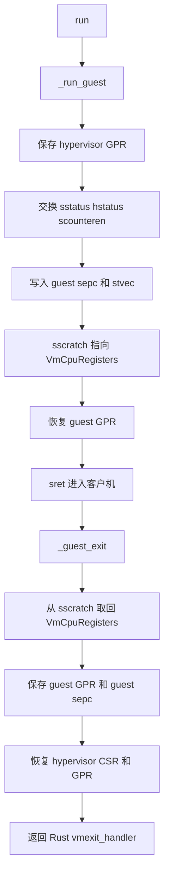
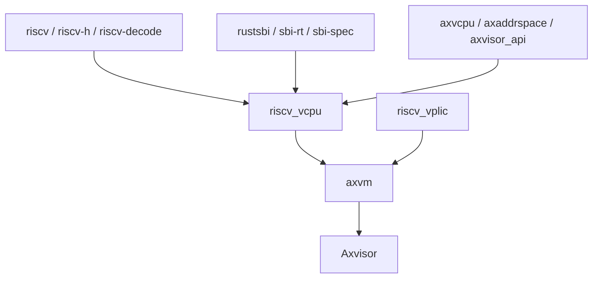

# `riscv_vcpu` 技术文档

> 路径：`components/riscv_vcpu`
> 类型：库 crate
> 分层：组件层 / RISC-V 虚拟 CPU 实现
> 版本：`0.2.2`
> 文档依据：当前仓库源码、`Cargo.toml`、`README.md`、`trap.S`、`guest_mem.rs` 及其在 `axvm` 中的接入方式

`riscv_vcpu` 是 Axvisor 在 RISC-V 架构上的 vCPU 后端实现。它围绕 RISC-V Hypervisor Extension 组织，负责完成四类核心工作：每核 H 扩展环境准备、vCPU 寄存器与 CSR 上下文保存恢复、客户机进入/退出虚拟化执行、以及把 SBI 调用、外部中断、timer 事件和 guest page fault 转译成统一的 `AxVCpuExitReason`。

## 1. 架构设计分析

### 1.1 设计定位

该 crate 在虚拟化栈中的定位非常明确：

- 向上实现 `axvcpu::AxArchVCpu` 与 `AxArchPerCpu`，供 `axvm` 统一驱动。
- 向下直接操作 `riscv` / `riscv-h` CSR、`trap.S` 汇编入口以及 SBI 调用接口。
- 向旁依赖 `axaddrspace`、`axvisor_api`、`riscv_vplic` 等组件完成地址、设备和中断协同。

与 x86 VMCS 或 ARM EL2/vCPU 模型不同，这个 crate 的所有语义都围绕 RISC-V H 扩展：

- Guest stage-2 根页表通过 `hgatp` 安装。
- VS 级 CSR 需要在 vCPU 绑定与解绑时手工保存恢复。
- 虚拟中断依赖 `hvip` 的 `vseip` / `vstip` / `vssip` 位。

因此，尽管泛型接口里保留了 `set_ept_root()` 这类跨架构命名，实际实现并非 EPT，而是写入 `hgatp`。

### 1.2 模块划分

| 模块 | 作用 | 关键内容 |
| --- | --- | --- |
| `lib.rs` | 对外导出与建模入口 | `RISCVVCpu`、`RISCVPerCpu`、`RISCVVCpuCreateConfig`、`EID_HVC` |
| `vcpu.rs` | vCPU 生命周期与 VM exit 处理 | `new/setup/bind/run/unbind`、SBI 分发、page fault 解码 |
| `percpu.rs` | 每核虚拟化环境初始化 | `setup_csrs()`、H 扩展启用前提检查 |
| `regs.rs` | 寄存器与 CSR 状态建模 | `VmCpuRegisters` 及其子结构 |
| `trap.rs` + `trap.S` | 进入/退出客户机执行的汇编与 trap 定义 | `_run_guest`、`_guest_exit`、异常枚举 |
| `guest_mem.rs` | 客户机内存读写辅助 | `copy_from_guest`、`copy_to_guest`、`fetch_guest_instruction` |
| `detect.rs` | H 扩展探测 | trap-and-return 非法指令探测 |
| `sbi_console.rs` | Debug Console Extension 辅助 | DBCN 写入、读取和字节输出 |
| `consts.rs` | trap/IRQ 常量 | 中断位图和异常位图 |

### 1.3 关键数据结构

#### `RISCVVCpuCreateConfig`

创建配置很轻量，只包含：

- `hart_id`
- `dtb_addr`

`new()` 会把它们分别写入 guest `a0` 和 `a1`，符合 RISC-V 常见引导约定。

#### `RISCVVCpu<H>`

vCPU 主体包含三部分：

- `regs: VmCpuRegisters`
- `sbi: RISCVVCpuSbi`
- `PhantomData<H>`

其中 `RISCVVCpuSbi` 通过 `#[derive(RustSBI)]` 聚合了 `console`、`pmu`、`fence`、`reset`、`info`、`hsm` 等前向能力，用于兜底转发标准 SBI 调用。

#### `VmCpuRegisters`

`regs.rs` 把上下文拆成四层：

- `hyp_regs`：Hypervisor 侧通用寄存器和共享 CSR。
- `guest_regs`：Guest 侧 GPR 与共享 CSR。
- `vs_csrs`：仅在 V=1 生效的 VS 级 CSR，如 `vsatp`、`vsstatus`、`vsie`、`vstvec`、`vsepc` 等。
- `virtual_hs_csrs`：对 guest 可见的虚拟 HS 级状态，如 `hie`、`hgeie`、`hgatp`。
- `trap_csrs`：`scause`、`stval`、`htval`、`htinst` 等退出诊断信息。

这种拆分非常关键，因为：

- `hyp_regs` 与 `guest_regs` 在进入和退出客户机时由汇编自动交换。
- `vs_csrs` 和 `virtual_hs_csrs` 不在 `_run_guest` 汇编里自动处理，需要 `bind()`/`unbind()` 手工保存恢复。
- `trap_csrs` 则是 VM exit 分类和页错误解析的基础。

### 1.4 进入客户机与退出客户机的汇编路径

`trap.S` 提供了整个 crate 最核心的硬件切换路径：



这里有几个设计重点：

- `sscratch` 被用来保存 `VmCpuRegisters` 指针，是汇编和 Rust 状态的桥梁。
- `stvec` 在进入 guest 前被改写为 `_guest_exit`，确保客户机 trap 后能回到 hypervisor。
- `_run_guest` 只处理共享状态交换，不负责 VS 级 CSR；这也是 `bind()`/`unbind()` 必须存在的原因。

### 1.5 每核初始化与 H 扩展探测

`RISCVPerCpu<H>` 实现 `AxArchPerCpu`，其核心工作是在 `new()` 时调用 `setup_csrs()`：

- `hedeleg` 委托一部分同步异常。
- `hideleg` 委托 VS 级 timer / external / software interrupt。
- 清空 `hvip` 中的 `vssip`、`vstip`、`vseip`。
- 直接写 CSR `0x606` 打开 `hcounteren`。
- 使能 `sie` 中的 `sext`、`ssoft`、`stimer`。

同时，`hardware_enable()` 会调用 `has_hardware_support()`，而后者通过 `detect_h_extension()` 用 trap-and-return 技术尝试读取 `hgatp`，若触发非法指令则判定当前 hart 不支持 H 扩展。

这套探测逻辑是本 crate 的一个亮点：它不依赖外部固件提供显式标记，而是用最小 trap handler 在运行时自证能力。

### 1.6 vCPU 生命周期

`RISCVVCpu` 实现 `AxArchVCpu` 的主要阶段如下：

1. `new()`：初始化 guest `a0`/`a1`，建立最小寄存器态。
2. `setup()`：准备 guest `sstatus` 与 `hstatus`，打开 `SPV`、`VSXL=64`、`SPVP`。
3. `set_entry()`：写 guest `sepc`。
4. `set_ept_root()`：把 stage-2 根页表地址编码到 `virtual_hs_csrs.hgatp`。
5. `bind()`：把 `vsatp`、`vstvec`、`vsepc`、`vscause`、`vsstatus`、`vsie`、`htimedelta` 等写入硬件，并安装 `hgatp`。
6. `run()`：临时调整 host `sie/sstatus`，调用 `_run_guest()` 进入客户机，返回后进入 `vmexit_handler()`。
7. `unbind()`：从硬件读回 VS 级 CSR 和 `hgatp`，清空硬件中的 `hgatp` 并执行 `hfence_gvma_all()`。

这个流程体现出一个重要事实：RISC-V vCPU 的“上下文切换”并不是单一函数完成的，而是由 Rust 和汇编共同拼成。

### 1.7 VM exit 分类与处理机制

`vmexit_handler()` 是整 crate 的语义中心，它将 `scause` 转换为统一退出原因：

#### VS 环境调用

当 trap 为 `VirtualSupervisorEnvCall` 时，crate 会解析 guest `a0..a7`，然后按 SBI 扩展 ID 分流：

- Legacy SBI：支持 `SET_TIMER`、`CONSOLE_PUTCHAR`、`CONSOLE_GETCHAR`、`SHUTDOWN`。
- HSM：把 `HART_START`、`HART_STOP`、`HART_SUSPEND` 转为 `CpuUp`、`CpuDown`、`Halt`。
- 自定义 `EID_HVC`：转为 `AxVCpuExitReason::Hypercall`。
- Debug Console Extension (`EID_DBCN`)：支持读写 guest 缓冲区和单字节输出。
- System Reset：对 shutdown 转为 `SystemDown`。
- 其余扩展：交给 `RISCVVCpuSbi` 的 `RustSBI` 前向器处理。

这使它既能处理 hypervisor 自定义调用，也能兼容普通 guest 的 SBI 行为。

#### 中断

- `SupervisorTimer`：设置 `hvip::set_vstip()`，表示向 guest 注入定时器事件，然后返回 `Nothing`。
- `SupervisorExternal`：转成 `ExternalInterrupt { vector: S_EXT }`，由上层设备路径继续处理。

#### Guest page fault

对 `LoadGuestPageFault` / `StoreGuestPageFault`，crate 会：

1. 从 `htval` 和 `stval` 组合出 fault GPA。
2. 解析 `sepc` 处指令，必要时回退到 `htinst`。
3. 若是 load/store，翻译成 `MmioRead` 或 `MmioWrite`。
4. 若不是可识别的访存指令，退化成 `NestedPageFault`。

这一设计非常关键，因为它把“RISC-V guest page fault”转译成了上层更容易消费的“MMIO 读写退出”。

### 1.8 guest 内存访问辅助

`guest_mem.rs` 通过内嵌汇编实现三个关键能力：

- 从 guest VA 拷贝到 host 缓冲区
- 从 host 缓冲区写回 guest VA
- 取 guest 指令字

对于 GPA 访问，它会暂时把 `vsatp` 清零，使 GVA=GPA，再利用相同路径完成访问。源码还保留了从 Salus 引入的异常表汇编，但当前并未完整启用异常处理，这意味着 guest memory helper 仍带有“未来补完整 trap recovery”的演进空间。

### 1.9 当前实现的明显边界

该 crate 已经可用，但仍存在几个明确空洞：

- `RISCVVCpu::inject_interrupt()` 未实现。
- `RISCVPerCpu::is_enabled()` 与 `hardware_disable()` 未实现。
- guest page fault 处理目前只覆盖典型 load/store 指令。
- `guest_mem` 的异常恢复尚未做完整实现。

这些边界应在文档中明确，而不应被 README 中泛化的“完整 vCPU 实现”表述掩盖。

## 2. 核心功能说明

### 2.1 主要能力

- 在支持 H 扩展的 RISC-V 平台上创建并运行 vCPU。
- 完成 VS 级 CSR 和共享寄存器上下文的保存与恢复。
- 处理 guest 的 SBI 调用，并支持 RustSBI 前向。
- 把 guest page fault 解析成 MMIO 读写退出。
- 把 HSM、reset、debug console 等 SBI 语义转为统一退出事件。
- 与 `riscv_vplic`、`axvm` 等上层组件协同完成外部中断和设备访问路径。

### 2.2 关键 API

最重要的外部接口包括：

- `RISCVVCpuCreateConfig`
- `RISCVVCpu::new()`
- `setup()`
- `set_entry()`
- `set_ept_root()`
- `bind()` / `run()` / `unbind()`
- `has_hardware_support()`
- `RISCVPerCpu::new()` / `hardware_enable()`

### 2.3 典型使用场景

在 `axvm` 中，该 crate 会被包装成架构相关的 `AxArchVCpuImpl`：

- 创建 VM 时根据配置构建 `RISCVVCpuCreateConfig`
- 每核先建立 `RISCVPerCpu`
- 每个 vCPU 安装 guest 入口和 `hgatp`
- `run_vcpu()` 循环中持续消费 `AxVCpuExitReason`

对调用者而言，`riscv_vcpu` 提供的是“RISC-V 版本的统一 vCPU 后端”，而不是一个直接面向应用的 API。

## 3. 依赖关系图谱

### 3.1 直接依赖

| 依赖 | 作用 |
| --- | --- |
| `riscv` / `riscv-h` | CSR 和 H 扩展寄存器访问 |
| `riscv-decode` | guest page fault 指令解码 |
| `rustsbi` / `sbi-rt` / `sbi-spec` | SBI 转发与调用语义 |
| `axvcpu` | 通用 vCPU 抽象接口 |
| `axaddrspace` | GPA/GVA 类型与访问宽度 |
| `axvisor_api` | 访存和宿主地址转换辅助 |
| `ax-errno` | 错误模型 |
| `ax-page-table-entry` / `memory_addr` | 页表相关辅助类型 |
| `memoffset` / `tock-registers` | 汇编偏移和寄存器组织辅助 |

### 3.2 主要消费者

- `components/axvm`：把它作为 RISC-V 架构后端重导出为 `AxArchVCpuImpl` 与 `AxVMArchPerCpuImpl`。
- `os/axvisor`：通过 `axvm` 间接使用，是当前仓库中的实际落地对象。

### 3.3 关系示意



## 4. 开发指南

### 4.1 接入步骤

1. 为每个物理核创建 `RISCVPerCpu`，并执行 `hardware_enable()` 检查 H 扩展。
2. 构造 `RISCVVCpuCreateConfig`，设置 `hart_id` 和 `dtb_addr`。
3. 调用 `new()` 和 `setup()` 初始化 guest 初始态。
4. 用 `set_entry()` 安装 guest 入口，用 `set_ept_root()` 安装 stage-2 根页表。
5. 在每次调度前 `bind()`，执行 `run()`，退出后 `unbind()`。
6. 根据返回的 `AxVCpuExitReason` 在 `axvm` 中继续处理设备、中断和 hypercall。

### 4.2 调试重点

调试该 crate 时最值得关注的信号包括：

- `scause`、`stval`、`htval`、`htinst`
- guest `sepc`
- `hvip` 中 `vstip/vseip/vssip` 的变化
- `hgatp` 是否正确安装和清空
- `bind()` / `unbind()` 前后 VS CSR 是否一致

若客户机无法启动，优先检查：

- H 扩展是否真的可用
- `setup_csrs()` 是否执行
- `trap.S` 是否与 `VmCpuRegisters` 布局匹配
- `set_entry()` 和 `dtb_addr` 是否正确

### 4.3 构建建议

该 crate 的目标是裸机 RISC-V：

```bash
cargo build -p riscv_vcpu --target riscv64gc-unknown-none-elf
```

真正的行为验证则需要在支持 H 扩展的 QEMU 或硬件平台上与 `axvm`/`Axvisor` 联合运行。

### 4.4 维护注意事项

- `trap.S` 与 `regs.rs` 的偏移关系非常紧，改动结构体字段顺序必须同步检查汇编偏移宏。
- `set_ept_root()` 这个名字来自通用抽象，但实现写的是 `hgatp`，文档和代码审查中应避免用 x86 语义误读。
- `guest_mem.rs` 通过清空 `vsatp` 访问 GPA，修改时要同步考虑 `hfence_vvma_all()` 语义。
- `vmexit_handler()` 集中承载了 SBI、timer、external IRQ 和 MMIO trap 语义，属于最敏感路径。

## 5. 测试策略

### 5.1 当前测试现状

源码中缺少系统化单元测试，现阶段主要依赖集成运行验证。考虑到其高度依赖 CSR、trap 和汇编路径，这是现实但也意味着回归门槛较高。

### 5.2 推荐测试分层

- 能力探测测试：验证 `has_hardware_support()` 对有无 H 扩展的行为。
- 生命周期测试：验证 `new/setup/bind/run/unbind` 的最小闭环。
- SBI 测试：覆盖 legacy timer、HSM、DBCN、reset 和默认 RustSBI forward 分支。
- MMIO 测试：构造 guest load/store 触发 page fault，确认能被解码为 `MmioRead/MmioWrite`。
- 中断测试：验证 timer interrupt 变成 `vstip`，external interrupt 变成 `ExternalInterrupt`。

### 5.3 风险点

- 该 crate 很多关键行为依赖汇编、CSR 和 trap 组合，普通主机侧单测难以充分覆盖。
- 一旦 `VmCpuRegisters` 布局与 `trap.S` 不匹配，故障通常会非常早且难定位。
- `inject_interrupt()` 尚未实现，意味着通用中断注入接口仍未闭环，当前更多依赖 `hvip` 直接操作和外围设备协同。

## 6. 跨项目定位分析

| 项目 | 位置 | 角色 | 核心作用 |
| --- | --- | --- | --- |
| ArceOS | 非通用内核组件 | 宿主虚拟化扩展的一部分 | ArceOS 本体不直接依赖 `riscv_vcpu`，但当 ArceOS 承载 Axvisor 时，它构成 RISC-V 虚拟化执行后端 |
| StarryOS | 当前仓库未见直接使用 | 非核心路径 | StarryOS 在本仓库中没有直接使用该 crate 的迹象，不应把它写成 StarryOS 通用组件 |
| Axvisor | RISC-V 虚拟化主线核心 | vCPU 架构后端 | 负责创建、运行和退出 RISC-V guest vCPU，是 `axvm` 在 RISC-V 上的实际执行引擎 |

## 7. 总结

`riscv_vcpu` 的本质不是一个“普通 Rust 对象库”，而是一层极其靠近硬件的虚拟化执行后端：汇编负责进入和退出 guest，Rust 负责维护 CSR 状态和解释 VM exit，SBI/中断/MMIO fault 被统一翻译成上层可消费的退出原因。对 Axvisor 的 RISC-V 路线而言，它就是客户机真正跑起来的那台“虚拟 CPU”。
