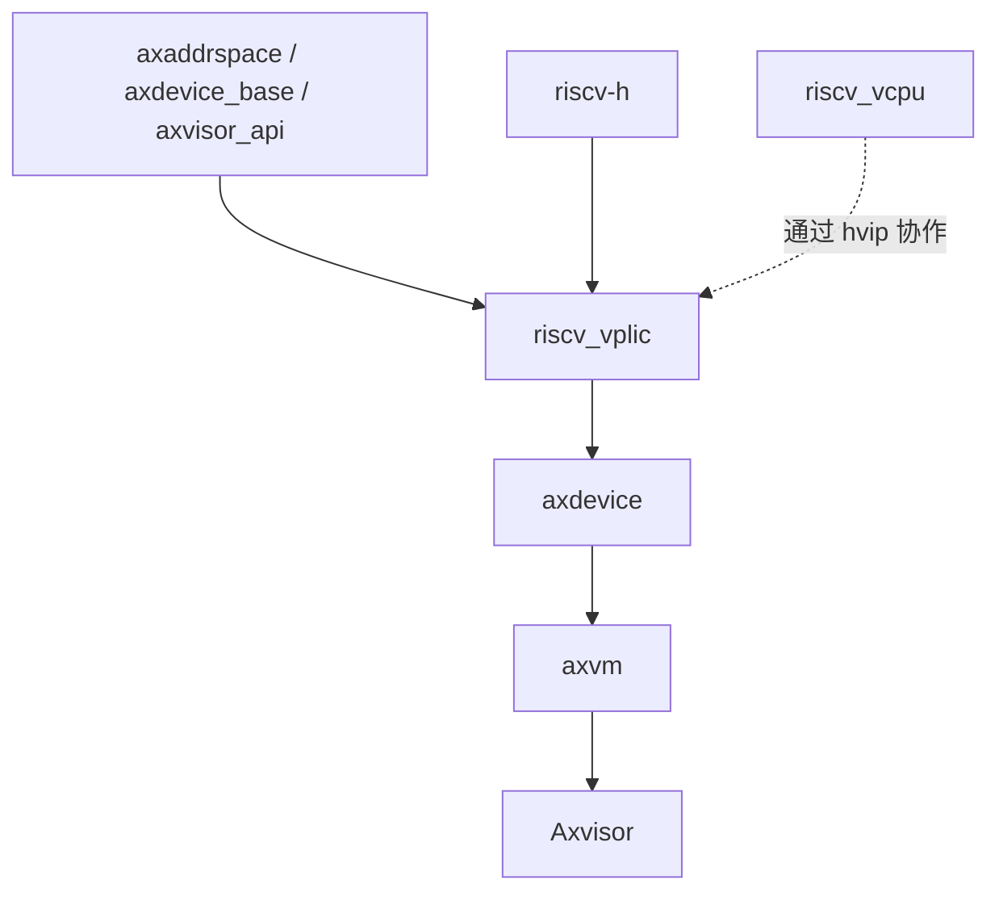

# `riscv_vplic` 技术文档

> 路径：`components/riscv_vplic`
> 类型：库 crate
> 分层：组件层 / RISC-V 虚拟中断控制器
> 版本：`0.2.1`
> 文档依据：当前仓库源码、`Cargo.toml`、`README.md`、`vplic.rs`、`devops_impl.rs` 与其在 `axdevice` 中的接入路径

`riscv_vplic` 实现的是面向 hypervisor 的 RISC-V 虚拟 PLIC。它并不是完全软件仿真的独立 PLIC，也不是简单的原样透传，而是采用一种“部分透传、部分软件建模”的折中策略：priority/enable/threshold 等寄存器多半透传到宿主 PLIC，pending 与 claim/complete 的关键语义由软件维护，并通过 `hvip::set_vseip()` / `clear_vseip()` 驱动 guest 感知 VS 级外部中断。

## 1. 架构设计分析

### 1.1 设计定位

该 crate 的设计目标是让 RISC-V guest 在 hypervisor 下看到一套近似 PLIC 1.0.0 的 MMIO 设备，同时又尽量复用宿主已有 PLIC 硬件能力。因此它的实现不是完全虚构一个独立中断控制器，而是采用 PPPT（PLIC Partial Passthrough）思路：

- 真实硬件寄存器尽可能透传访问。
- 与虚拟化直接相关的 pending、claim/complete、注入语义由软件接管。
- 最终通过 `hvip` 中的 `VSEIP` 位把“有外部中断待处理”的事实告诉 guest。

在当前仓库中，它是 `axdevice` 自动实例化的 RISC-V 中断设备后端，对应 `EmulatedDeviceType::PPPTGlobal`。

### 1.2 模块划分

| 模块 | 作用 | 关键内容 |
| --- | --- | --- |
| `consts.rs` | PLIC 内存布局常量 | `PLIC_NUM_SOURCES`、priority/pending/enable/context offsets 与 stride |
| `vplic.rs` | 核心状态对象 | `VPlicGlobal`、上下文数量、位图状态、构造期边界检查 |
| `devops_impl.rs` | 设备语义实现 | `BaseDeviceOps<GuestPhysAddrRange>` 的 MMIO 读写逻辑 |
| `utils.rs` | 宿主 MMIO 辅助 | `perform_mmio_read/write()`，通过 `axvisor_api::memory::phys_to_virt()` 做 volatile 访问 |
| `lib.rs` | 对外导出 | 导出常量和 `VPlicGlobal` |

### 1.3 关键数据结构

`VPlicGlobal` 是唯一核心对象，字段含义如下：

- `addr`：guest 物理地址空间中的 vPLIC 基址。
- `size`：映射区域大小。
- `contexts_num`：context 数量，通常与可见 hart 数密切相关。
- `assigned_irqs`：分配给该 vPLIC 的 IRQ 位图，当前源码尚未真正使用。
- `pending_irqs`：软件维护的 pending 位图。
- `active_irqs`：软件维护的 in-service 位图。
- `host_plic_addr`：宿主 PLIC 的物理基址。

这里最值得注意的是 `host_plic_addr` 的假设：当前实现直接把它设为与 guest vPLIC 地址数值相同，并在注释中明确写出“当前假定 host_plic_addr = guest_vplic_addr”。这意味着当前实现依赖宿主和 guest 在 PLIC 映射上的强假设，而不是做通用地址转换表。

### 1.4 构造期校验

`VPlicGlobal::new()` 会在初始化时进行两个关键检查：

- `size` 必须显式传入，不能省略。
- 区间长度必须足以覆盖最后一个 context 的 claim/complete 寄存器，否则直接 `assert!` 失败。

这保证了最基本的 PLIC MMIO 布局完整性，不会在运行期才暴露明显越界。

### 1.5 PLIC 内存模型

`consts.rs` 基本按 PLIC 1.0.0 组织了地址布局：

- `PLIC_PRIORITY_OFFSET = 0x000000`
- `PLIC_PENDING_OFFSET = 0x001000`
- `PLIC_ENABLE_OFFSET = 0x002000`
- `PLIC_CONTEXT_CTRL_OFFSET = 0x200000`
- `PLIC_CONTEXT_STRIDE = 0x1000`
- `PLIC_CONTEXT_CLAIM_COMPLETE_OFFSET = 0x04`

源码还明确记录：

- `PLIC_NUM_SOURCES = 1024`
- source 0 保留不用

因此这个 crate 至少在“地址模型”和“寄存器区段划分”上是强对齐 PLIC 规范的。

### 1.6 读路径：透传与软件建模的分界

`handle_read()` 只支持 `AccessWidth::Dword`，所有非 32 位访问都会触发断言。其读路径分为三类：

#### 直接透传宿主 PLIC

- priority 区
- enable 区
- threshold 区

这些区域都通过 `perform_mmio_read()` 走宿主物理地址，再由 `axvisor_api::memory::phys_to_virt()` 转为线性映射做 volatile 访问。

#### 软件维护 pending

pending 区不会直接读宿主寄存器，而是根据 `pending_irqs` 位图，按 32 位一组重新拼装返回值。这样 guest 看到的 pending 状态来自 hypervisor 维护的虚拟状态，而不是宿主硬件原始状态。

#### 软件处理 claim/complete 的 claim 阶段

读 claim/complete 寄存器时，crate 会：

1. 检查 context 编号是否合法。
2. 从 `pending_irqs.first_index()` 找出第一个待处理中断。
3. 若不存在 pending 中断，则返回 `0`。
4. 若存在，则清除 pending 位、设置 active 位，并把 IRQ ID 返回给 guest。

当前实现的关键限制是：

- 没有检查 enable 位。
- 没有检查 priority 与 threshold。
- 默认取 pending 位图里的第一个 IRQ，而不是严格按照 PLIC 仲裁规则选择。

所以它是“能工作”的最小 claim 语义，而不是完整的 PLIC 仲裁模拟器。

### 1.7 写路径：注入与完成

`handle_write()` 同样只接受 32 位访问。其写路径更能体现 PPPT 的本质：

#### 直接透传

- priority
- enable
- threshold

这些都直接写宿主 PLIC。

#### pending 区写入被复用为“注入接口”

这部分是当前实现最值得特别说明的设计：

- pending 区写入不是按规范意义上的“guest 修改 pending”，而是被 hypervisor 复用为“向虚拟 PLIC 注入 pending IRQ”的内部路径。
- 写入逻辑采用 append/OR 语义，而非覆盖。
- 对每个置位 bit，软件在 `pending_irqs` 中置位相应 IRQ。
- 只要 pending 位图非空，就调用 `hvip::set_vseip()`，让 guest 感知 VS external interrupt。

源码中已经写明 TODO：未来更合理的做法是把这条注入路径拆成独立接口，而不是继续占用 pending MMIO 写语义。

#### claim/complete 的 complete 阶段

向 claim/complete 寄存器写入 IRQ ID 时，crate 会：

1. 校验 context 编号。
2. 若当前已无 pending IRQ，则清除 `hvip::VSEIP`。
3. 在 `active_irqs` 中清除该 IRQ 的 active 位。
4. 再把 IRQ ID 写回宿主 PLIC 的 claim/complete 寄存器，完成宿主侧通知。

这表明 complete 是一条“软件状态收尾 + 宿主硬件完成通知”的混合路径。

### 1.8 与 `riscv_vcpu` 和宿主 PLIC 的关系

#### 与 `riscv_vcpu`

二者没有直接的类型耦合，但通过 `hvip` 明确协作：

- `riscv_vcpu` 在每核初始化时清空 `vseip`。
- `riscv_vplic` 在需要向 guest 注入外部中断时设置 `vseip`。
- guest 接收并处理后，`riscv_vplic` 在合适时机清除 `vseip`。

换言之，`riscv_vcpu` 负责“vCPU 如何看见 VS external interrupt”，`riscv_vplic` 负责“何时应当把这个 pending 位拉高”。

#### 与宿主 PLIC

`riscv_vplic` 并没有完全隐藏宿主 PLIC，而是保留了大量透传路径：

- priority/enable/threshold 透传读写
- complete 最终仍回写宿主 claim/complete

因此它更像是在宿主 PLIC 外面包了一层“虚拟化语义适配器”，而不是重写了一套独立 PLIC。

## 2. 核心功能说明

### 2.1 主要能力

- 暴露符合 PLIC 1.0.0 布局的虚拟 MMIO 设备。
- 用软件位图维护 guest 可见的 pending 和 active 状态。
- 将部分寄存器访问透传到宿主 PLIC。
- 通过 `hvip::set_vseip()` / `clear_vseip()` 驱动 VS 外部中断注入。
- 作为 `axdevice` 体系中的 MMIO 设备，服务于 RISC-V guest。

### 2.2 关键 API

对外 API 极小：

- `VPlicGlobal::new()`
- `BaseDeviceOps<GuestPhysAddrRange>` 提供的 `handle_read()` / `handle_write()`

因此它通常不会被业务代码直接调用，而是由 `axdevice` 在配置驱动下构造并托管。

### 2.3 典型使用场景

当前仓库中的典型接入路径是：

1. `axvmconfig` 用 `PPPTGlobal` 描述 vPLIC 配置。
2. `axdevice` 在 RISC-V 下遇到该类型时，实例化 `VPlicGlobal`。
3. guest 访问 vPLIC GPA 窗口时，`axdevice` 调用本 crate 的 `handle_read()` / `handle_write()`。
4. 当 hypervisor 需要注入外部中断时，通过 pending 写路径把 IRQ 标记为 pending，并拉起 `VSEIP`。

## 3. 依赖关系图谱

### 3.1 直接依赖

| 依赖 | 作用 |
| --- | --- |
| `axdevice_base` | 统一设备抽象 trait |
| `axaddrspace` | GPA/HPA 类型与访问宽度 |
| `axvisor_api` | 宿主物理地址转虚拟地址，用于真实 MMIO 访问 |
| `bitmaps` | pending/active/assigned 位图状态 |
| `spin` | 位图锁保护 |
| `riscv-h` | `hvip::set_vseip()` / `clear_vseip()` |
| `ax-errno` | 错误模型 |

### 3.2 主要消费者

- `axdevice`：在 `EmulatedDeviceType::PPPTGlobal` 分支中自动实例化。
- `axvm`：通过 `axdevice` 间接触发其 MMIO 访问路径。
- `Axvisor`：RISC-V guest 虚拟中断链路的最终使用方。

### 3.3 关系示意



## 4. 开发指南

### 4.1 接入方式

在当前栈中，推荐接入方式不是手工直接操作 `VPlicGlobal`，而是通过配置驱动：

1. 在 `axvmconfig` 中为 VM 配置 `PPPTGlobal` 设备。
2. 保证 `cfg_list[0]` 提供正确的 `context_num`。
3. 由 `axdevice` 自动创建 `VPlicGlobal`。
4. 上层 VM exit 路径通过 `axdevice` 分发到该设备。

### 4.2 构建与验证

可以先做目标构建：

```bash
cargo build -p riscv_vplic --target riscv64gc-unknown-none-elf
```

更有意义的验证应放在带有 `axdevice`、`axvm`、`riscv_vcpu` 的整机路径中，例如：

- guest 读取 claim 寄存器后能拿到正确 IRQ
- guest 完成中断后 complete 能清 active 位
- hypervisor 注入 pending 后 guest 能看到 VS external interrupt

### 4.3 维护注意事项

- 当前实现强假设 `host_plic_addr == guest_vplic_addr`，若宿主/guest 映射布局不同，需要先改造地址模型。
- claim 阶段尚未检查 enable/priority/threshold，若要提升规范一致性，应首先补全仲裁逻辑。
- pending 写被复用为注入接口，这个设计高效但语义不纯，后续最好拆成独立 hypervisor API。
- `assigned_irqs` 当前未参与主要逻辑，若要实现更精细的 IRQ 归属控制，需要把它纳入 claim 与注入流程。

## 5. 测试策略

### 5.1 当前测试现状

crate 内缺少系统化单元测试，现阶段更多依赖架构集成验证。由于其行为强依赖 `hvip` 和真实/映射宿主 PLIC，纯主机环境下完整覆盖并不容易。

### 5.2 推荐测试分层

- 构造期测试：验证 `size` 不足、context 数不合理时 `new()` 会拒绝非法布局。
- 逻辑测试：验证 pending 写的 OR 语义、claim 对 pending/active 的位图迁移、complete 对 active 和 `VSEIP` 的清理。
- 协议一致性测试：补充 enable/priority/threshold 仲裁相关测试，为后续功能增强做基线。
- 集成测试：在 Axvisor + RISC-V guest 环境中验证注入、claim/complete 和宿主 PLIC 透传的整体闭环。

### 5.3 风险点

- 当前实现对 PLIC 规范的仲裁语义只做了最小覆盖，复杂优先级场景未完整实现。
- 对宿主 PLIC 地址布局的强假设降低了可移植性。
- `VSEIP` 是全局可见的重要信号，若 pending/complete 逻辑出错，guest 会出现外部中断丢失或重复注入。

## 6. 跨项目定位分析

| 项目 | 位置 | 角色 | 核心作用 |
| --- | --- | --- | --- |
| ArceOS | 非通用内核模块 | 宿主虚拟化组件的一部分 | ArceOS 本体不直接消费 `riscv_vplic`，但若作为 Axvisor 的宿主环境，其上运行的 hypervisor 会依赖该 crate 提供 RISC-V 虚拟中断控制能力 |
| StarryOS | 当前仓库未见直接接入 | 非核心路径 | 当前没有证据表明 StarryOS 在本仓库中直接使用该 crate |
| Axvisor | RISC-V 虚拟化中断主线 | 虚拟 PLIC 后端 | 与 `riscv_vcpu`、`axdevice`、`axvm` 协同构成 guest 外部中断投递闭环 |

## 7. 总结

`riscv_vplic` 不是“完整重写一份 PLIC”，而是一层兼顾规范布局、宿主透传与虚拟化注入语义的折中实现。它把宿主 PLIC 能做的事情继续交给宿主，把 pending/claim/complete 和 `VSEIP` 注入这些与 guest 相关的语义收回软件控制，从而在当前 Axvisor 栈里提供一套可工作的 RISC-V 虚拟中断控制器后端。
