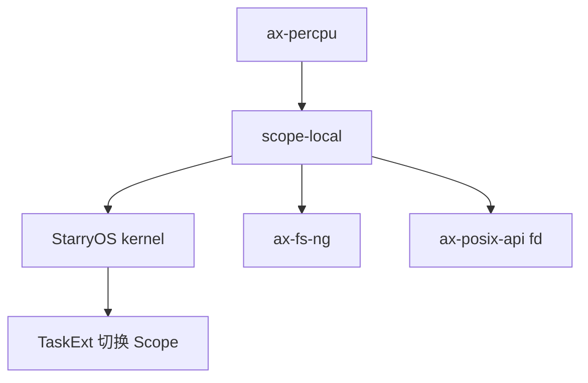

# `scope-local` 技术文档

> 路径：`components/scope-local`
> 类型：库 crate
> 分层：组件层 / 可切换局部存储层
> 版本：`0.1.2`
> 文档依据：当前仓库源码、`Cargo.toml`、`src/lib.rs`、`src/item.rs`、`src/scope.rs`、`src/boxed.rs` 以及 StarryOS 集成代码

`scope-local` 提供的是一种“可切换 scope 的局部存储”，而不是语言级 TLS。它把若干 `scope_local!` 声明的静态项注册进同一个 registry，再为每个 `Scope` 分配一组对应的数据槽位；运行时通过当前 CPU 的一个 per-CPU 指针决定“当前激活的是哪一个 scope”。这样一来，代码访问 `LocalItem<T>` 时，看到的不是全局唯一对象，而是“当前 scope 中的那一份值”。

## 1. 架构设计分析

### 1.1 设计定位

`scope-local` 解决的问题与 TLS 类似但不相同：

- 需要一组“当前上下文局部”的数据
- 但这个“当前上下文”不一定是线程，也可能是进程、任务域或某个显式切换的执行环境

因此它采用的不是编译器 TLS，而是：

- 链接期收集静态注册项
- 运行时分配 `Scope`
- 通过 per-CPU 指针显式切换当前 scope

### 1.2 顶层模块划分

| 模块 | 作用 |
| --- | --- |
| `item.rs` | 注册项、registry、`LocalItem` 与 `scope_local!` 宏 |
| `scope.rs` | `Scope`、`ActiveScope`、全局默认 scope |
| `boxed.rs` | 单个 registry 项的堆上存储盒 `ItemBox` |

### 1.3 核心数据模型

#### `Item`

每个 `scope_local!` 静态项在链接后都会变成一个注册项，放进 `scope_local` 段中。`Registry` 会通过链接符号遍历这些项，并为每个项分配一个稳定下标。

#### `Scope`

`Scope` 本质上是一组 `ItemBox` 的集合，每个下标对应一个注册项。也就是说，一个 `Scope` 表示“当前这组局部变量的完整实例化集合”。

#### `ItemBox`

负责单个注册项的实际堆分配、初始化和 drop。它把类型 `T` 的构造/析构逻辑与 `Scope` 的整体布局解耦开来。

#### `ActiveScope`

负责决定“当前 CPU 正在使用哪个 `Scope`”。其内部状态并不保存在 TLS，而是保存在一个 per-CPU 静态槽位里。

### 1.4 当前 scope 的获取机制

当前 scope 选择逻辑的关键是：

- `ACTIVE_SCOPE_PTR` 是 per-CPU 变量
- 若它为 0，则回退到惰性初始化的 `GLOBAL_SCOPE`
- 若不为 0，则把它解释为当前 `Scope` 的数据起始位置

这说明 `scope-local` 不是“每线程永远固定一个局部对象”，而是“当前 CPU 可以切换正在使用的 scope”。

### 1.5 `scope_local!` 宏的语义

该宏声明的不是普通静态变量，而是一个注册项。真正访问时：

- 通过 `LocalItem<T>::Deref`
- 找到当前激活的 scope
- 再按 registry 下标取出对应的 `ItemBox`

因此 `*FD_TABLE` 这样的调用背后，其实隐含了一次“按当前 scope 解析”的过程。

### 1.6 一个关键边界：不是 TLS

必须明确：

- 它不依赖编译器线程局部存储
- 它不自动跟随线程生命周期
- 它需要显式调用 `ActiveScope::set()` / `set_global()`

所以它更接近“scope-based local storage”，而不是语言级线程局部变量。

## 2. 核心功能说明

### 2.1 主要能力

- 声明 scope-local 注册项
- 构造新的 `Scope`
- 切换当前 CPU 的激活 scope
- 在默认 scope 和显式 scope 之间访问同一组局部项

### 2.2 典型使用场景

| 场景 | 用法 |
| --- | --- |
| 进程级文件描述符表 | 每个进程持有自己的 `Scope`，切入任务时切换 |
| 文件系统上下文 | 当前任务/进程拥有自己的 FS 视图 |
| 可切换资源域 | 一次切换整组逻辑相关的局部状态 |

### 2.3 StarryOS 中的典型主线

StarryOS 当前的集成模式很典型：

1. 进程创建时分配一个 `Scope`
2. 任务进入运行前，在 `TaskExt::on_enter` 中调用 `ActiveScope::set`
3. 任务离开时调用 `ActiveScope::set_global`
4. `scope_local!` 声明的如 `FD_TABLE` 等对象在运行期自然解析到当前进程对应的 scope

这说明 `scope-local` 非常适合“以调度钩子切换一整组局部资源”的场景。

## 3. 依赖关系图谱

### 3.1 直接依赖

| 依赖 | 作用 |
| --- | --- |
| `ax-percpu` | 保存当前激活 scope 指针 |
| `spin` | 惰性初始化全局默认 scope |

### 3.2 主要消费者

仓库内已知直接使用方包括：

- `os/StarryOS/kernel`
- `os/arceos/modules/axfs-ng`
- `os/arceos/api/arceos_posix_api`（按 feature 启用）

`os/axvisor` 当前没有直接依赖它。

### 3.3 关系示意

## 4. 开发指南

### 4.1 新增一个 scope-local 项

标准方式是：

1. 用 `scope_local!` 声明静态项
2. 需要隔离时为上下文分配新的 `Scope`
3. 在进入该上下文时调用 `ActiveScope::set`
4. 离开时调用 `set_global` 或切到另一个 scope

### 4.2 维护时需要关注的点

- registry 依赖链接段顺序和边界符号，链接脚本必须配合
- 若没有任何调度/上下文钩子切换 `ActiveScope`，访问将始终落到 `GLOBAL_SCOPE`
- `Scope` 生命周期必须与使用它的执行上下文一致，否则 `ACTIVE_SCOPE_PTR` 会悬空

### 4.3 与 `ax-percpu` / `ax-task` 的职责分工

- `ax-percpu`：只负责“当前 CPU 有一个当前 scope 指针”
- `scope-local`：负责“如何根据当前 scope 指针解析局部项”
- `ax-task`/Starry 调度层：决定“何时切换当前 scope”

不要把调度策略写回 `scope-local`，否则它会失去通用性。

## 5. 测试策略

### 5.1 当前已有测试面

该 crate 已经包含比较有代表性的测试，主要覆盖：

- 默认值访问
- 显式 `Scope` 访问
- `ActiveScope::set` / `set_global`
- `Scope` drop 行为
- 配合 `ax-percpu` 的多线程/多 CPU 模拟

这套测试对于一个链接段 + per-CPU + 堆分配混合实现的库来说已经比较关键。

### 5.2 推荐继续补充的测试

- 与 `TaskExt`/调度钩子整合的集成测试
- `GLOBAL_SCOPE` 回退语义在多任务环境下的验证
- 链接脚本缺失 `scope_local` 段时的失败模式验证

### 5.3 风险点

- 它依赖链接段、per-CPU 指针和外部调度时机三者同时正确
- 若 `ActiveScope` 切换与任务生命周期不匹配，很容易出现隐蔽错误
- 容易被误解成 TLS，从而在错误的抽象层使用

## 6. 跨项目定位分析

| 项目 | 位置 | 角色 | 核心作用 |
| --- | --- | --- | --- |
| ArceOS | 可选局部资源视图基础件 | scope 级局部存储库 | 为 `ax-fs-ng`、POSIX fd 等场景提供可切换的局部状态承载方式 |
| StarryOS | 进程/任务资源域基础件 | 进程级局部存储核心件 | 通过 `TaskExt` 与 `ActiveScope` 把 FD 表等资源自然绑定到当前进程 |
| Axvisor | 当前仓库中无直接使用主线 | 潜在可复用基础件 | 若未来 Hypervisor 需要按 VM 或 vCPU 切换一组局部状态，可复用这套 scope 模型 |

## 7. 总结

`scope-local` 的独特之处，在于它把“局部状态”从线程语义中解放出来，改为由显式 `Scope` 和 per-CPU 当前指针驱动。这让它非常适合内核里那些按进程、任务域或调度上下文切换的一整组资源视图。对 StarryOS 来说，它已经是进程级局部资源的重要基础件；对更广的 ArceOS/Axvisor 生态，它则提供了一种比 TLS 更贴合内核运行时的局部状态组织方式。
