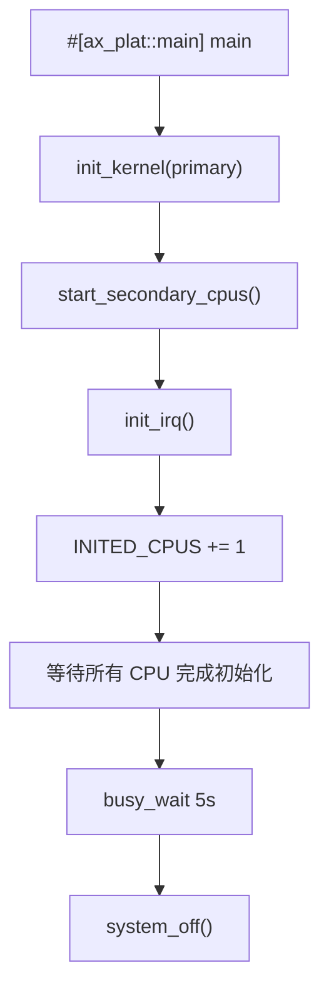
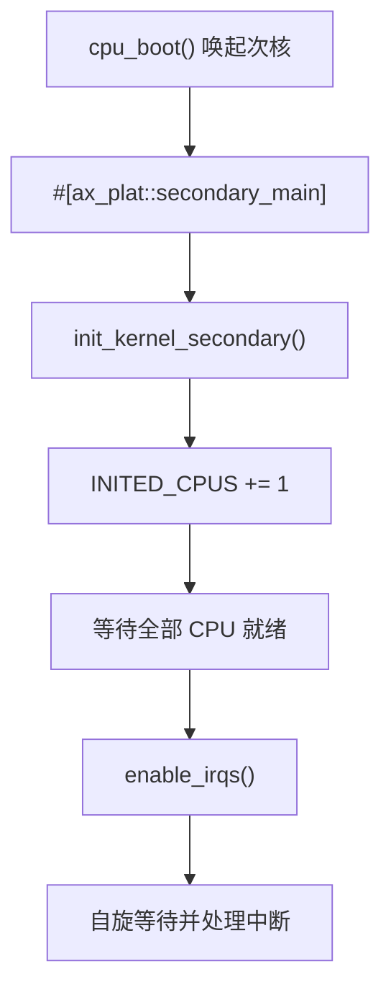
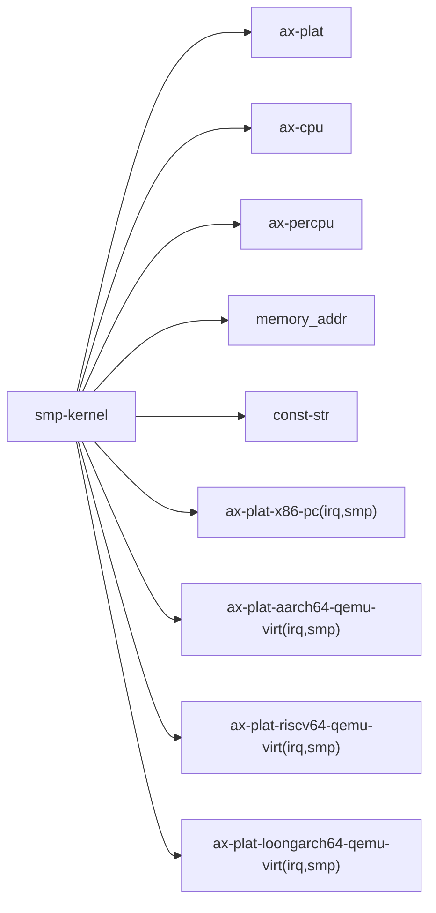

# `smp-kernel` 技术文档

> 路径：`components/axplat_crates/examples/smp-kernel`
> 类型：平台样例内核 crate
> 分层：组件层 / `axplat` 多核与中断示例
> 版本：`0.1.0`
> 文档依据：`Cargo.toml`、`src/main.rs`、`src/init.rs`、`src/mp.rs`、`src/irq.rs`、`Makefile`、`README.md`

`smp-kernel` 是 `axplat` 示例里最完整的一条 bring-up 样例。它不只验证主核启动，还验证次核 boot、`#[ax_plat::secondary_main]` 入口、per-CPU 数据、中断在多核上的工作方式，以及所有 CPU 完成初始化后的同步收敛。

因此必须先把边界说透：**它不是可复用 SMP 框架，也不是 ArceOS `ax-runtime` 的替代实现；它只是把 `axplat` 的多核启动链用最小内核样例形式跑通。**

## 1. 架构设计分析
### 1.1 模块划分
与前两个样例不同，这个 crate 已经拆成了三个明确模块：

- `init.rs`：主核/次核的初始化共性与 `INITED_CPUS` 同步计数
- `mp.rs`：次核栈、`cpu_boot()` 和 `#[ax_plat::secondary_main]`
- `irq.rs`：多核场景下的定时器中断注册与 per-CPU 下一次到期时间

这说明它的关注点已经从“最小启动”扩展到“多核 bring-up 协同”。

### 1.2 主核与次核主线
主核路径大致是：



次核路径则是：



### 1.3 关键同步点
这个样例里有两个非常关键的同步设计：

1. `start_secondary_cpus()` 在逐个启动 AP 后，等待 `INITED_CPUS` 增长，确保主核知道 AP 至少已进入初始化完成点。
2. 主核和次核都调用 `init_smp_ok()`，等到 `INITED_CPUS == CPU_NUM` 后才进入下一阶段。

因此它验证的不是“能 boot 第二个核”这么简单，而是“多核初始化能否有序收敛”。

## 2. 核心功能说明
### 2.1 `CPU_NUM` 与运行规模
`CPU_NUM` 不是写死在源码里，而是：

- 优先取环境变量 `AX_CPU_NUM`
- 否则退回平台配置里的 `MAX_CPU_NUM`

而 `Makefile` 又会把 `SMP=<n>` 导出为 `AX_CPU_NUM`。这让样例可以直接通过：

```bash
make ARCH=riscv64 run SMP=4
```

在不同核数下复用同一份代码。

### 2.2 `mp.rs` 的启动责任
`start_secondary_cpus()` 里做了三件真实而关键的事情：

- 为每个 AP 分配独立 boot stack
- 把该栈顶虚拟地址转成物理地址
- 调用 `ax_plat::power::cpu_boot(i, stack_top_paddr)`

这条链是 `axplat` 平台支持多核的核心契约之一。

### 2.3 `irq.rs` 的 per-CPU 定时器逻辑
与 `irq-kernel` 不同，这里用的是：

- `#[ax_percpu::def_percpu] static NEXT_DEADLINE: u64 = 0;`

这说明在多核场景下，每个 CPU 都维护自己下一次 one-shot timer 的到期时间。它不是全局共享一个 deadline，而是显式验证 per-CPU 数据和多核 timer IRQ 是否能共存。

### 2.4 边界澄清
这个样例不负责：

- 提供通用的 SMP runtime
- 管理任务调度
- 作为上层 OS 多核框架直接复用

它只是最小内核级的多核 bring-up 演示。

## 3. 依赖关系图谱


### 3.1 直接依赖
- `axplat`：统一平台抽象入口。
- `ax-cpu`：IRQ/trap 与 CPU 辅助。
- `ax-percpu`：多核定时器中的 per-CPU 状态。
- `memory_addr`：次核启动栈地址转换。
- `const-str`：解析 `AX_CPU_NUM`。
- 各平台包的 `irq` + `smp` feature：真正提供 AP boot 与多核 IRQ 能力。

### 3.2 关键间接依赖
- `ax_plat::power::cpu_boot`
- `ax_plat::call_secondary_main`
- `ax_plat::init::{init_early_secondary, init_later_secondary}`
- `ax_plat::time::set_oneshot_timer`

### 3.3 主要消费者
- 平台包 SMP 能力 bring-up。
- 在接入更高层 `ax-runtime` 前验证多核基础链路。

## 4. 开发指南
### 4.1 推荐运行方式
```bash
cd components/axplat_crates/examples/smp-kernel
make ARCH=<x86_64|aarch64|riscv64|loongarch64> run SMP=4
```

不带 `SMP` 时默认为 1 核，此时它仍能验证主核路径，但多核价值会明显降低。

### 4.2 修改时的注意点
1. 所有主核初始化改动，都要同时考虑次核对应路径。
2. 任何与启动栈、物理地址转换相关的改动都属于高风险。
3. 不要把任务调度或复杂内存管理逻辑堆进这里；那已经超出 `axplat` 样例的边界。

### 4.3 适合新增的方向
- 更多 CPU 数组合测试
- 平台特定 AP boot 差异验证
- 多核 IPI 或更复杂 IRQ 但仍保持“最小内核”定位

## 5. 测试策略
### 5.1 当前测试形态
README 已给出两类典型输出：

- 单核：验证主核启动与 timer IRQ
- 多核：验证次核初始化消息与多 CPU 的 timer IRQ 输出

### 5.2 成功标准
- 主核打印 `Primary CPU 0 started.`
- 次核在多核场景下打印 `Secondary CPU <id> init OK.`
- 各 CPU 都能处理中断并打印时间推进
- 主核最终正常关机

### 5.3 风险点
- `cpu_boot()` 不通时，次核永远起不来。
- `INITED_CPUS` 同步不正确时，主核和次核会卡在等待屏障。
- per-CPU `NEXT_DEADLINE` 有问题时，多核定时器行为会异常。

## 6. 跨项目定位分析
### 6.1 ArceOS
ArceOS 不直接依赖这个样例，但 `ax-runtime` 的 SMP bring-up 与它验证的是同一类底层平台契约。先跑通它，通常能更快判断问题在平台层还是运行时层。

### 6.2 StarryOS
StarryOS 也不会直接运行它。这个样例的价值在于提前验证共享平台包的多核 boot 与中断基础能力。

### 6.3 Axvisor
Axvisor 同样不直接消费它；不过 Hypervisor 对多核启动路径更敏感，因此在平台层改动后，先用 `smp-kernel` 做最小多核 smoke test 往往非常有用。
