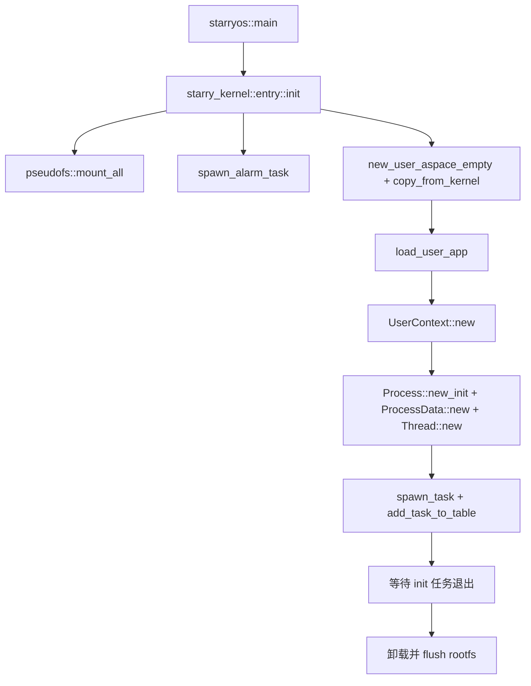
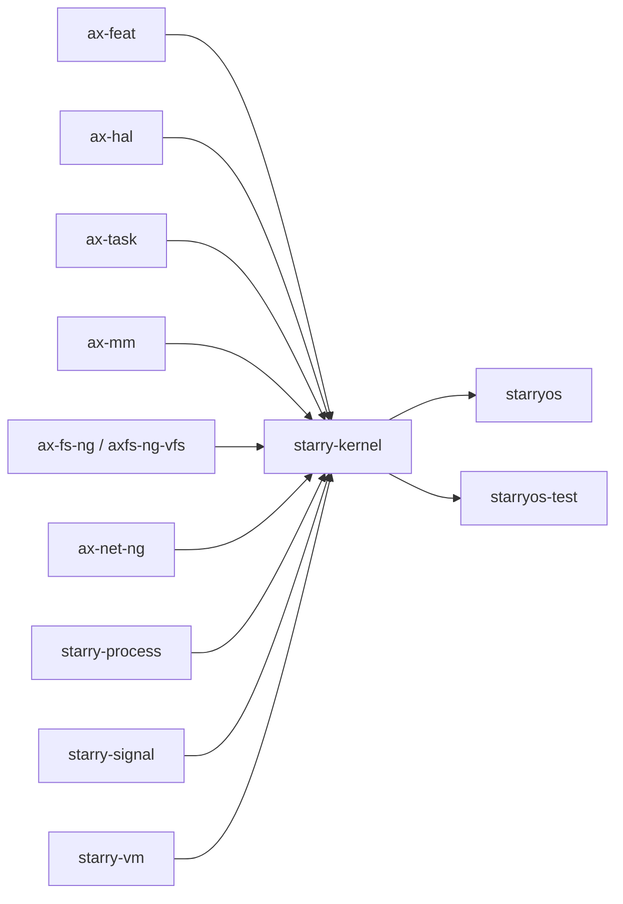

# `starry-kernel` 技术文档

> 路径：`os/StarryOS/kernel`
> 类型：库 crate
> 分层：StarryOS 层 / StarryOS 内核核心
> 版本：`0.2.0-preview.2`
> 文档依据：`Cargo.toml`、`src/lib.rs`、`src/entry.rs`、`src/syscall/*`、`src/task/*`、`src/mm/*`、`src/file/*`、`src/pseudofs/*`

`starry-kernel` 是 StarryOS 的内核核心 crate。它以 ArceOS 的 `ax*` 模块为底座，叠加 `starry-process`、`starry-signal`、`starry-vm` 等组件，最终形成一个具备 Linux 风格进程、线程、syscall、用户态装载与伪文件系统能力的宏内核。

## 1. 架构设计分析
### 1.1 总体定位
与 ArceOS 直接面向 unikernel 应用不同，`starry-kernel` 的任务是组织一个“完整的用户态世界”：

- 负责构造 init 进程。
- 负责管理进程/线程、地址空间和 FD 表。
- 负责把 trap/用户态切换变成 syscall 语义。
- 负责提供 `/proc`、`/dev`、`/tmp` 等伪文件系统。

因此，它是一个“建立在 ArceOS 之上的系统内核”，而不是单纯的模块集合。

### 1.2 模块划分
- `src/entry.rs`：系统启动主线。挂载伪文件系统、创建初始用户地址空间、加载第一个用户程序、创建 init 任务并等待其退出。
- `src/syscall/`：系统调用总入口及各子系统分发实现，包含 `fs`、`mm`、`task`、`net`、`ipc`、`signal`、`time`、`resources`、`io_mpx` 等。
- `src/task/`：进程/线程核心逻辑，包含 `Thread`、`ProcessData`、PID/TID 表、futex、资源限制、信号与时间统计。
- `src/mm/`：用户地址空间、ELF 装载、用户内存访问、I/O 映射等，核心路径在 `loader.rs` 与 `aspace/`。
- `src/file/`：文件对象、文件描述符表、socket/pipe/epoll 等内核文件抽象。
- `src/pseudofs/`：伪文件系统挂载逻辑，如 `/proc`、`/dev`、`/tmp`、`/sys`。
- `src/config/`：按架构组织的用户空间布局、trampoline 地址、栈大小等配置。
- `src/time.rs`：时间相关内核支持。

### 1.3 关键数据结构
- `ProcessData`：进程共享状态，包含 `Process`、可执行路径、命令行、地址空间、scope、资源限制、信号管理器、futex 表、umask 等。
- `Thread`：线程私有状态，包含线程级信号、退出标志、`clear_child_tid`、`robust_list_head`、线程时间统计等。
- `Process`：来自 `starry-process`，承载 PID、父子关系、进程组/会话等更高层的进程语义。
- `FileDescriptor`：文件描述符对象，绑定 `Arc<dyn FileLike>` 和 `cloexec` 状态。
- `FD_TABLE`：按 `scope_local` 组织的进程级 FD 表，是 fork/clone/execve 行为的重要语义基础。
- `AddrSpace`：用户地址空间对象，内部持有 `MemorySet<Backend>` 与页表对象。
- `Backend`：表示不同的映射后端，如线性映射、共享映射、文件映射、COW 等。

### 1.4 启动与 init 主线
`starry-kernel` 的启动路径非常清晰：



从 `src/entry.rs` 可见，系统的 bring-up 不是“直接进入某个 shell”，而是先把用户态可执行环境完整搭起来，再把 init 作为真正的用户任务启动。

### 1.5 syscall 分发主线
`handle_syscall()` 是整个系统的控制中枢：

1. 从 `UserContext` 读取 syscall 号和参数。
2. 尝试把编号转成 `Sysno`。
3. 按 `fs/mm/task/net/ipc/signal/time/...` 分发。
4. 把结果转换为 Linux 风格错误码并写回用户上下文。

这意味着：

- syscall 兼容性主要体现为 `syscall/*` 的实现质量。
- 如果行为不符合 Linux 预期，优先检查的是 syscall 子模块，而不是启动包。

### 1.6 进程/线程与地址空间主线
`starry-kernel` 的内部设计强调“进程共享态”和“线程私有态”分离：

- `ProcessData` 管理地址空间、信号组、资源限制、共享文件表作用域等。
- `Thread` 管理线程级退出、信号、时间统计与用户态恢复相关状态。
- `clone`、`execve`、`wait`、`futex` 等复杂语义都围绕这两层展开。

这种设计使 StarryOS 可以在复用 `ax-task` 线程调度能力的同时，补齐 Linux 风格进程模型。

## 2. 核心功能说明
### 2.1 主要功能
- 系统启动与 init 进程构造。
- syscall 分发与 Linux 风格错误码映射。
- 用户态程序装载与地址空间重建。
- 进程/线程、futex、信号、资源限制等进程管理语义。
- 文件描述符表、pipe、socket、epoll 等文件/网络对象管理。
- 伪文件系统挂载与系统目录组织。

### 2.2 关键入口
- `entry::init(args, envs)`：系统 bring-up 入口。
- `syscall::handle_syscall(uctx)`：系统调用总入口。
- `pseudofs::mount_all()`：伪文件系统挂载。
- `mm::load_user_app()`：用户程序与 ELF 装载。
- `task::new_user_task()`、`spawn_task()`：用户线程建立与调度接入。
- `file::add_stdio()`：初始标准输入输出接入。

### 2.3 关键 API 使用示例
对于启动包，最典型的接入方式来自 `os/StarryOS/starryos/src/main.rs`：

```rust
let args = /* init 命令行 */;
let envs = /* 环境变量 */;
starry_kernel::entry::init(&args, &envs);
```

对于内核内部路径，`handle_syscall()` 是所有用户态系统调用的统一落点：

```rust
// trap 返回用户态前
starry_kernel::syscall::handle_syscall(&mut uctx);
```

## 3. 依赖关系图谱


### 3.1 关键直接依赖
- `ax-feat`：把 `uspace`、`multitask`、`sched-rr`、`fs-ng-ext4`、`net-ng` 等能力一次性装配到内核。
- `ax-hal`：用户态上下文、页表、trap、时间与控制台基础能力。
- `ax-task`：底层线程调度、`TaskExt` 和阻塞/唤醒机制。
- `ax-fs-ng`、`axfs-ng-vfs`：文件系统与路径解析。
- `ax-net-ng`：网络与 socket 路径的底层支撑。
- `starry-process`、`starry-signal`、`starry-vm`：分别承接进程模型、信号模型和用户内存安全访问。

### 3.2 关键直接消费者
- `os/StarryOS/starryos`：启动镜像包，最终调用 `entry::init()`。
- `test-suit/starryos`：StarryOS 侧的系统级测试入口。

## 4. 开发指南
### 4.1 依赖与接线
```toml
[dependencies]
starry-kernel = { workspace = true }
```

但在实际开发中，`starry-kernel` 很少被当成普通库独立嵌入。更常见的接入方式是由 `starryos` 启动包调用 `entry::init()`。

### 4.2 初始化与调试入口
1. 先准备 rootfs 和用户程序。
2. 由 `starryos` 构造 `args/envs` 进入 `entry::init()`。
3. 观察 init 进程是否成功装载、syscall 是否正常进入 `handle_syscall()`。
4. 若问题落在用户态装载，优先检查 `mm/loader.rs` 与 `task/user.rs`。
5. 若问题落在 Linux 语义，优先检查 `syscall/*`、`task/*` 和 `file/*`。

### 4.3 开发重点建议
- 修改 `entry.rs` 时，要把它视为系统 bring-up 代码，优先考虑 init 进程和文件系统挂载顺序。
- 修改 `task/*` 时，要同时检查 `ProcessData`、`Thread`、`TaskExt` 和 PID/TID 表是否仍然一致。
- 修改 `execve`、`clone`、`wait` 等路径时，要以 Linux 语义为准而不是只看本地实现是否“能跑”。
- 修改 `file/*` 时，要同步验证 `FD_TABLE`、`CLOEXEC`、pipe/socket/epoll 等行为。

## 5. 测试策略
### 5.1 单元测试
`starry-kernel` 当前以系统级验证为主，crate 内没有大量独立 `tests/`。若补充单元测试，建议优先覆盖：

- syscall 分发表与错误码映射。
- `ProcessData` / `Thread` 的关键状态转换。
- `execve`、`clone`、`waitpid`、`futex` 等复杂内核语义。
- `FD_TABLE` 与 `CLOEXEC` 路径。

### 5.2 集成测试
StarryOS 的主验证方式是端到端系统运行：

- `test-suit/starryos`
- rootfs + QEMU 启动
- 用户态程序执行 syscall、文件、网络、进程管理路径

这类测试比普通单元测试更能反映 `starry-kernel` 的真实质量。

### 5.3 覆盖率要求
- 关键 syscall 的正常/异常路径应保持高覆盖。
- `execve`、`clone`、`waitpid`、`futex`、`epoll` 等复杂路径至少应有场景级验证。
- 所有涉及用户态恢复、地址空间切换和 init 进程构造的改动都应跑系统级回归。

## 6. 跨项目定位分析
### 6.1 ArceOS
`starry-kernel` 并不是 ArceOS 的被复用组件，而是构建在 ArceOS `ax*` 模块之上的更高层系统。它消费 `ax-hal`、`ax-task`、`ax-mm`、`ax-fs`、`ax-net` 等能力，把它们重组为 Linux 风格宏内核语义。

### 6.2 StarryOS
这是 `starry-kernel` 的主战场。`starryos` 包本身只负责启动入口和参数准备，而真正的内核逻辑几乎都集中在 `starry-kernel` 中，因此它就是 StarryOS 的核心内核实现。

### 6.3 Axvisor
在当前仓库中，Axvisor 并不直接依赖 `starry-kernel`。两者更准确的关系是：Axvisor 可以在生态层面支持 StarryOS 作为 guest，但不会把 `starry-kernel` 链接进 Hypervisor 本体。因此，`starry-kernel` 与 Axvisor 的关系是“guest 兼容性”，不是“代码直接依赖”。
