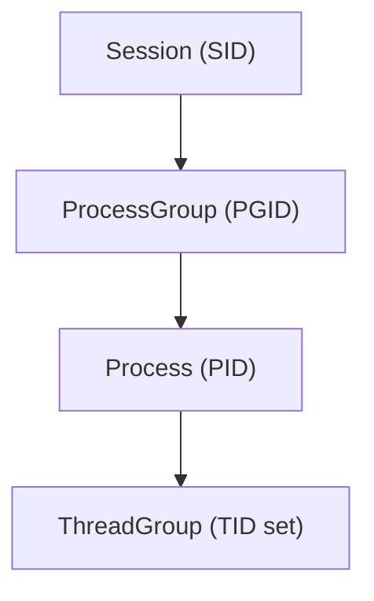
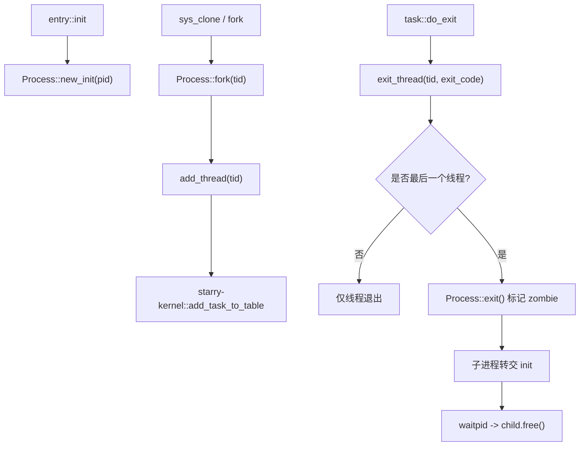
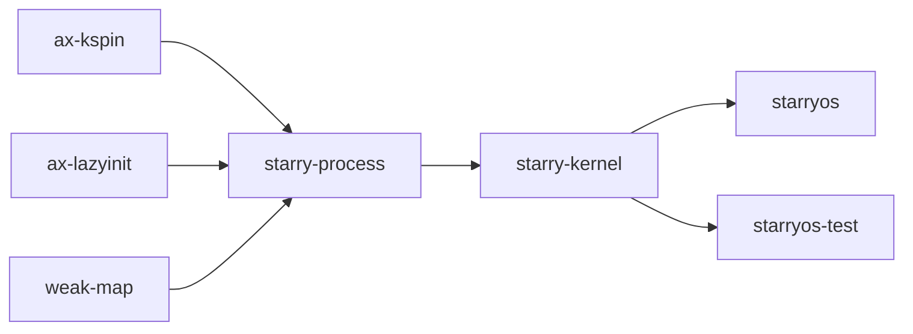

# `starry-process` 技术文档

> 路径：`components/starry-process`
> 类型：库 crate
> 分层：组件层 / StarryOS 进程关系模型
> 版本：`0.2.0`
> 文档依据：`Cargo.toml`、`README.md`、`src/lib.rs`、`src/process.rs`、`src/process_group.rs`、`src/session.rs`、`tests/*`、`os/StarryOS/kernel/src/task/{mod.rs,ops.rs}`、`os/StarryOS/kernel/src/syscall/task/{clone.rs,job.rs,wait.rs}`、`os/StarryOS/kernel/src/pseudofs/{proc.rs,dev/tty/terminal/job.rs}`

`starry-process` 是 StarryOS 的“进程身份与关系层”。它负责维护 PID、父子层级、线程组成员、进程组、会话以及控制终端挂接点等结构化关系，为 `clone`、`setsid`、`setpgid`、`waitpid`、`/proc` 和 TTY 作业控制提供统一的数据骨架。

需要特别澄清的是：它并不直接保存 StarryOS 的地址空间、FD 表、资源限制或信号动作表。这些“进程资源实体”在 `starry-kernel::task::ProcessData` 中；`starry-process` 提供的是这些资源所依附的“进程身份对象”和层级关系。

## 1. 架构设计分析
### 1.1 总体定位
从源码和真实调用链看，`starry-process` 只做三件事：

- 定义进程及其父子关系。
- 定义进程组与会话层级。
- 定义线程组级退出状态与回收语义。

也就是说，它是 StarryOS 里“谁是谁、谁属于谁、谁退出后由谁回收”的那一层，而不是 `fork/exec/wait` 的完整实现体。真正把地址空间、文件表、信号管理器和调度上下文装进进程的是 `starry-kernel`。

### 1.2 模块划分
- `src/lib.rs`：导出 `Pid`、`Process`、`ProcessGroup`、`Session` 和 `init_proc()`。
- `src/process.rs`：`Process` 主体，实现父子关系、线程组、zombie 状态、reap 语义、进程组切换入口。
- `src/process_group.rs`：`ProcessGroup` 定义，维护 PGID、所属 `Session` 和成员进程集合。
- `src/session.rs`：`Session` 定义，维护 SID、所含进程组以及控制终端槽位。

### 1.3 关键数据结构
- `Pid`：统一的标识类型，同时承担 PID、PGID、SID 和 TID。
- `Process`：核心进程对象，内部持有 `pid`、`is_zombie`、`ThreadGroup`、`children`、`parent`、`group`。
- `ThreadGroup`：记录当前进程包含的线程 ID 集、最后退出码，以及是否发生了组退出。
- `ProcessGroup`：按 PGID 组织多个 `Process`，并关联一个 `Session`。
- `Session`：按 SID 组织多个 `ProcessGroup`，并持有 `terminal: Option<Arc<dyn Any + Send + Sync>>`。
- `INIT_PROC`：由 `LazyInit<Arc<Process>>` 保存的 init 进程，全局收养孤儿进程。

这几层对象之间的关系是清晰分层的：



### 1.4 创建、退出与回收主线
`starry-process` 的主线并不复杂，但它决定了 StarryOS 里大量高层行为是否成立：



其中有几个与 Linux 语义直接相关的实现细节：

- `fork()` 会继承父进程当前的 `ProcessGroup`。
- `exit_thread()` 只在进程尚未 `group_exit` 时更新组退出码。
- `Process::exit()` 当前总是把孤儿进程交给 init 进程，`subreaper` 仍是 TODO。
- `Process::free()` 只允许回收 zombie 进程，并从父进程的 `children` 中移除。
- 源码注释写着 `exit()` 会 panic 于 init 进程，但真实实现是检测到 init 后直接返回，不会 panic。

### 1.5 进程组、会话与作业控制
StarryOS 的作业控制并不写在本 crate 内，但强依赖它提供的结构：

- `sys_setsid()` 通过 `Process::create_session()` 创建新会话和同 PID 的新进程组。
- `sys_setpgid()` 通过 `create_group()` 或 `move_to_group()` 调整作业控制分组。
- `pseudofs/dev/tty/terminal/job.rs` 用 `Session` 和 `ProcessGroup` 判断前台进程组是否合法。
- `Session::set_terminal_with()` / `unset_terminal()` 为控制终端绑定预留了通用槽位。

因此，`starry-process` 实际上是 StarryOS job control 的数据底座，而不是一个仅供测试的轻量模型。

### 1.6 与 `ProcessData` 的边界
在 `starry-kernel::task::ProcessData` 中，`proc: Arc<Process>` 只是其中一个字段。`ProcessData` 还额外持有：

- `aspace`：用户地址空间。
- `scope`：FD 表、FS 上下文等作用域资源。
- `rlim`：资源限制。
- `signal`：进程级信号管理器。
- `futex_table`、`umask`、`cmdline`、`exe_path` 等。

这说明 `starry-process` 负责的是“进程资源的组织关系”，不是“进程资源的内容本身”。

## 2. 核心功能说明
### 2.1 主要功能
- 初始化 init 进程并提供全局 `init_proc()`。
- 创建子进程、维护父子层级和孤儿进程收养。
- 维护线程组成员列表与进程退出码。
- 维护进程组和会话层级。
- 为控制终端和前台进程组管理提供会话语义支撑。

### 2.2 StarryOS 中的关键使用点
- `os/StarryOS/kernel/src/entry.rs`：`Process::new_init(pid)` 创建系统第一个用户进程。
- `os/StarryOS/kernel/src/syscall/task/clone.rs`：`old_proc_data.proc.fork(tid)` 为新进程建立身份对象。
- `os/StarryOS/kernel/src/syscall/task/job.rs`：`create_session()`、`create_group()`、`move_to_group()` 承接 `setsid/setpgid`。
- `os/StarryOS/kernel/src/syscall/task/wait.rs`：通过 `children()`、`is_zombie()`、`free()` 实现回收。
- `os/StarryOS/kernel/src/pseudofs/proc.rs`：通过 `threads()`、`parent()`、`group()`、`session()` 拼装 `/proc` 视图。
- `os/StarryOS/kernel/src/pseudofs/dev/tty/terminal/job.rs`：通过 `Session` / `ProcessGroup` 实现前台作业控制。

### 2.3 关键 API 使用示例
对 StarryOS 内核来说，最典型的使用方式是把 `Process` 嵌入到更大的 `ProcessData` 中：

```rust
let proc = Process::new_init(pid);
proc.add_thread(pid);

let child = proc.fork(child_pid);
child.add_thread(child_tid);

if let Some((session, group)) = child.create_session() {
    let _sid = session.sid();
    let _pgid = group.pgid();
}
```

## 3. 依赖关系图谱


### 3.1 关键直接依赖
- `ax-kspin`：为 `Process`、`ProcessGroup`、`Session` 内部的可变状态提供自旋锁保护。
- `ax-lazyinit`：用于全局 init 进程的惰性初始化。
- `weak-map`：用于子进程表、进程组表、会话内进程组表的弱引用管理，避免对象清理后残留强引用。

### 3.2 关键直接消费者
- `starry-kernel`：唯一的核心直接消费者，负责把 `Process` 嵌入 `ProcessData` 并暴露给 syscall、TTY、`/proc`、调度器。

### 3.3 间接消费者
- `os/StarryOS/starryos`：通过 `starry-kernel` 间接使用。
- `test-suit/starryos`：通过 `starry-kernel` 间接使用。

## 4. 开发指南
### 4.1 依赖接入
```toml
[dependencies]
starry-process = { workspace = true }
```

它通常不会单独承担系统功能，而是作为 `starry-kernel::task::ProcessData` 的一个内嵌部分使用。

### 4.2 修改这层语义时要联动检查什么
1. 修改父子关系或 zombie 语义时，必须同时检查 `sys_waitpid()` 与 `task::do_exit()`。
2. 修改进程组或会话逻辑时，必须同时检查 `sys_setsid()`、`sys_setpgid()` 和 TTY 作业控制。
3. 修改线程组成员管理时，必须同时检查 `/proc/[pid]/task`、`TaskStat::from_thread()` 和 `clone` 路径。
4. 修改 init 收养逻辑时，必须明确当前是否仍然没有 `subreaper` 支持。

### 4.3 常见开发误区
- 不要把 `Process` 当成完整的“进程资源容器”；地址空间、文件表、信号动作表都不在这里。
- 不要在这个 crate 里实现 syscall 级权限检查；这里应该只维护关系结构。
- 不要忽略 `WeakMap` 清理语义；进程组和会话的自动清理依赖最后一个强引用释放。

## 5. 测试策略
### 5.1 现有测试覆盖
当前 crate 自带的 host 侧测试已经比较贴近真实语义：

- `tests/process.rs`：父子关系、zombie、reap、线程组退出码、孤儿收养。
- `tests/group.rs`：进程组创建、迁移、清理、跨组移动。
- `tests/session.rs`：会话创建、跨会话限制、终端绑定、会话/进程组清理。

### 5.2 建议重点验证的系统路径
- `clone/fork` 后的父子关系与线程组成员是否正确。
- `setsid/setpgid` 后 `pgid/sid` 是否在 `/proc/[pid]/stat` 中正确反映。
- `waitpid` 是否只回收 zombie 子进程，并正确保留 `WNOWAIT` 语义。
- TTY 前台进程组切换时是否拒绝跨会话的 `ProcessGroup`。

### 5.3 覆盖率要求
- `Process::exit()`、`free()`、`fork()`、`create_session()`、`move_to_group()` 应保持高覆盖。
- 需要同时覆盖“对象仍被引用”和“最后强引用释放后自动清理”两种情况。
- 所有改动都建议至少跑一轮 StarryOS 系统启动与 `waitpid/job control` 回归。

## 6. 跨项目定位分析
### 6.1 ArceOS
ArceOS 原生更偏向 unikernel 任务模型，不直接依赖 `starry-process`。这个 crate 是 StarryOS 为 Linux 风格进程层额外补上的关系模型。

### 6.2 StarryOS
这是 `starry-process` 的主战场。StarryOS 用它承接 PID、父子、进程组、会话和线程组关系，再把地址空间、FD 表、信号管理器等内容挂到 `ProcessData` 上，形成完整的用户进程抽象。

### 6.3 Axvisor
当前仓库中 Axvisor 不直接依赖 `starry-process`。两者没有代码级直接关系。
