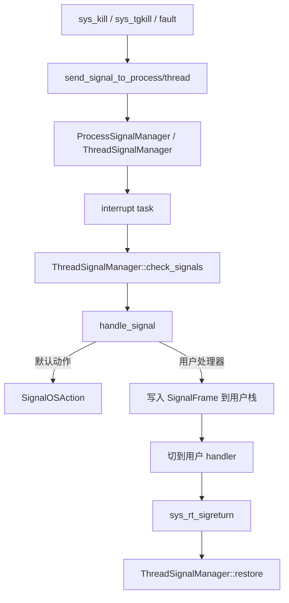
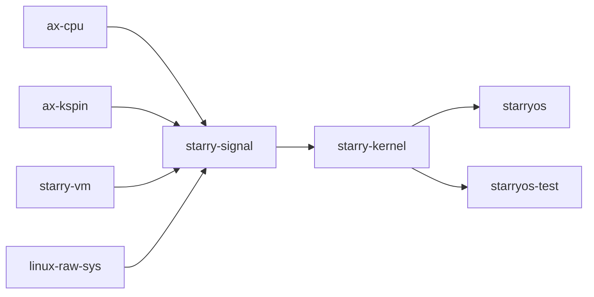

# `starry-signal` 技术文档

> 路径：`components/starry-signal`
> 类型：库 crate
> 分层：组件层 / StarryOS 信号语义组件
> 版本：`0.3.0`
> 文档依据：`Cargo.toml`、`src/lib.rs`、`src/{types.rs,action.rs,pending.rs}`、`src/api/{process.rs,thread.rs}`、`src/arch/*`、`tests/*`、`os/StarryOS/kernel/src/{task/{mod.rs,signal.rs,user.rs},syscall/signal.rs,mm/loader.rs,file/signalfd.rs,syscall/io_mpx/select.rs}`

`starry-signal` 是 StarryOS 的信号语义引擎。它定义了信号编号、默认动作、`sigaction` 状态、pending 队列、线程级/进程级信号管理器，以及把信号处理器压入用户栈并通过 `rt_sigreturn` 恢复上下文所需的架构细节。

它负责的是“信号应当怎样投递、屏蔽、排队、进入用户处理器”，而不是“谁有权发信号”“收到信号后内核最终怎样终止进程”。后者由 `starry-kernel` 的 syscall 层和任务层在消费 `SignalOSAction` 时决定。

## 1. 架构设计分析
### 1.1 总体定位
从真实调用关系看，`starry-signal` 位于三层之间：

- 向上承接 `sys_kill`、`sys_rt_sigaction`、`sys_rt_sigprocmask`、`sys_rt_sigreturn` 等系统调用语义。
- 向内与 `Thread` / `ProcessData` 结合，决定某个信号应落到哪个线程。
- 向下依赖 `ax-cpu::uspace::UserContext` 和 `starry-vm`，把信号帧压到用户栈并恢复上下文。

因此它不是简单的常量定义 crate，而是 StarryOS 用户态信号路径的核心组件。

### 1.2 模块划分
- `src/types.rs`：定义 `Signo`、`SignalSet`、`SignalInfo`、`SignalStack`。
- `src/action.rs`：定义 `SignalActionFlags`、`SignalDisposition`、`SignalAction`、`SignalOSAction`、`k_sigaction` 兼容层。
- `src/pending.rs`：定义 `PendingSignals`，管理标准信号与实时信号的排队策略。
- `src/api/process.rs`：`ProcessSignalManager` 和 `SignalActions`，承载进程级共享信号状态。
- `src/api/thread.rs`：`ThreadSignalManager`，负责线程级 pending、blocked mask、signal frame 构造和 `sigreturn` 恢复。
- `src/arch/*`：每个架构各自的 `signal_trampoline` 汇编、`UContext` 和 `MContext` 布局。

### 1.3 关键数据结构
- `Signo`：1 到 64 的信号编号枚举，并直接编码默认动作。
- `SignalSet`：64 位位图，兼容 Linux `sigset_t` 传递格式。
- `SignalInfo`：对 Linux `siginfo_t` 的透明包装。
- `SignalAction`：用户态可见的 `sigaction` 语义，包括 handler、mask、flags、restorer。
- `PendingSignals`：真正的待处理队列。
- `ProcessSignalManager`：进程级共享 pending 队列、动作表和线程列表。
- `ThreadSignalManager`：线程级 pending 队列、blocked mask、signal stack 和 frame 处理逻辑。
- `arch::UContext` / `MContext`：保存/恢复用户态寄存器现场。

这里最容易被误解的点是 `PendingSignals` 的“pending”定义。源码已经明确说明，它表示“已投递但尚未处理”的信号，不完全等价于 Linux 文档里“已投递但因屏蔽而待决”的狭义 pending。

### 1.4 投递与处理主线
完整路径如下：



StarryOS 内核中的对应接线点非常明确：

- `syscall/signal.rs` 负责把 syscall 参数转换成 `SignalInfo`、`SignalSet` 和 `SignalAction`。
- `task/signal.rs` 负责把 `SignalOSAction` 转换成“终止当前进程”“中断线程”等内核动作。
- `task/user.rs` 在每次从用户态返回内核后调用 `check_signals()`，决定是否立刻处理 pending 信号。

### 1.5 真实实现中的关键语义
- 标准信号只保留一个 pending 实例：`PendingSignals::put_signal()` 对 1 到 31 号信号会去重。
- 实时信号按信号编号分桶排队：同一信号号 FIFO，不同信号号仍按最小 signal number 优先出队。
- `ProcessSignalManager::send_signal()` 会遍历已注册线程，返回第一个未屏蔽该信号的 TID，用于唤醒。
- `ThreadSignalManager::set_blocked()` 会强制去掉 `SIGKILL` 和 `SIGSTOP`，与 Linux 规则一致。
- `handle_signal()` 会根据 `SA_ONSTACK` 选择当前栈或备用信号栈，根据 `SA_NODEFER` / `SA_RESETHAND` / `SA_RESTART` 调整后续行为。
- 如果向用户栈写入 `SignalFrame` 失败，`handle_signal()` 会退化为 `CoreDump` 动作，而不是静默忽略。
- `check_signals()` 有 `possibly_has_signal` 快路径，避免每次用户态切换都扫描队列。

### 1.6 架构相关实现
`src/arch/*` 并不只是放常量，而是完成两件关键工作：

- 定义一页对齐的 `signal_trampoline` 汇编入口，供用户处理器返回时触发 `rt_sigreturn`。
- 定义每个架构的 `UContext` / `MContext` 布局，把 `UserContext` 精确保存到用户栈。

当前实现中：

- RISC-V、AArch64、LoongArch64 的 trampoline 直接发起 syscall 号 `139`。
- x86_64 的 trampoline 发起 syscall 号 `15`。
- `starry-kernel::mm::loader::map_trampoline()` 会把这段 trampoline 映射到固定的 `SIGNAL_TRAMPOLINE` 地址。

### 1.7 与 `starry-kernel` 的边界
`starry-signal` 只返回“OS 应该做什么”，并不亲自修改任务状态机。比如：

- `SignalOSAction::Terminate` / `CoreDump` / `Stop` / `Continue` 的最终执行在 `starry-kernel::task::signal::check_signals()`。
- 当前 StarryOS 内核里 `Stop` 仍被临时映射成 `do_exit(1, true)`，`Continue` 也还是 TODO。
- `kill/tgkill/sigqueue` 的权限判断、`waitpid` 退出码传播、页故障后是否转成 `SIGSEGV`，都在内核层完成。

所以本 crate 定义的是信号语义模型，而不是完整的进程生命周期策略。

## 2. 核心功能说明
### 2.1 主要功能
- 定义 Linux 风格信号编号、默认动作和掩码表示。
- 管理标准信号与实时信号的 pending 队列。
- 管理进程级共享 `sigaction` 表。
- 管理线程级 blocked mask、altstack 和 handler frame。
- 提供跨架构 `rt_sigreturn` trampoline 与上下文恢复能力。

### 2.2 StarryOS 中的关键使用点
- `task/mod.rs`：`ProcessData::new()` 创建 `ProcessSignalManager`，`Thread::new()` 创建 `ThreadSignalManager`。
- `task/signal.rs`：通过 `send_signal_to_process()`、`send_signal_to_thread()`、`raise_signal_fatal()` 驱动投递。
- `syscall/signal.rs`：实现 `rt_sigprocmask`、`rt_sigaction`、`rt_sigpending`、`kill`、`tgkill`、`rt_sigreturn`、`sigtimedwait`、`sigaltstack`。
- `task/user.rs`：在用户态返回内核后循环 `check_signals()`。
- `mm/loader.rs`：映射 `signal_trampoline`。
- `file/signalfd.rs`：把 `SignalInfo` 转换为 `signalfd_siginfo`，对接文件描述符语义。
- `syscall/io_mpx/select.rs`：复用 `SignalSet` 支持 `pselect6` 的临时 mask。

### 2.3 关键 API 使用示例
StarryOS 内核侧最典型的初始化方式如下：

```rust
let actions = Arc::new(SpinNoIrq::new(SignalActions::default()));
let proc_signal = Arc::new(ProcessSignalManager::new(actions, SIGNAL_TRAMPOLINE));
let thr_signal = ThreadSignalManager::new(tid, proc_signal.clone());

let sig = SignalInfo::new_kernel(Signo::SIGTERM);
let wake_tid = proc_signal.send_signal(sig);
```

## 3. 依赖关系图谱


### 3.1 关键直接依赖
- `ax-cpu`：提供 `UserContext` 及寄存器定义，是保存/恢复信号现场的基础。
- `starry-vm`：用于把 `SignalFrame` 写入用户栈，以及读写用户空间中的 signal 相关对象。
- `ax-kspin`：保护动作表、mask、pending 队列等可变状态。
- `linux-raw-sys`：提供 `siginfo_t`、`kernel_sigaction`、`SA_*`、`sigset_t` 等兼容定义。

### 3.2 关键直接消费者
- `starry-kernel`：信号 syscall、任务中断、fault 转信号、signalfd、pselect 等路径都直接消费此 crate。

## 4. 开发指南
### 4.1 依赖接入
```toml
[dependencies]
starry-signal = { workspace = true }
```

在 StarryOS 中，它通常不是单独接入，而是通过 `ProcessData` 和 `Thread` 生命周期一起创建。

### 4.2 修改信号语义时的联动检查
1. 改 `SignalAction`、`k_sigaction` 或 `SignalSet` 布局时，必须检查 `sys_rt_sigaction`、`sys_rt_sigprocmask` 和用户态 ABI 兼容性。
2. 改 `PendingSignals` 的排队策略时，必须同时检查 `signalfd`、`sigtimedwait` 和 `pselect6` 的行为。
3. 改 `handle_signal()` 或 `restore()` 时，必须同时检查各架构 `arch/*` 的 `UContext/MContext` 和 loader 中的 trampoline 映射。
4. 改默认动作表时，必须同时确认 `starry-kernel::task::signal` 是否仍能正确消费对应的 `SignalOSAction`。

### 4.3 开发重点建议
- 把“标准信号去重”和“实时信号排队”视为两个完全不同的语义层，不要混写。
- 不要在这个 crate 里实现 syscall 权限校验或 `waitpid` 语义；那是内核层职责。
- 若修改 `SA_ONSTACK` / `restorer` / `sigreturn` 路径，优先做跨架构核对，因为这些代码最容易在 ABI 细节处失配。

## 5. 测试策略
### 5.1 现有测试覆盖
当前 crate 自带的 host 侧测试已经覆盖了关键语义：

- `tests/action.rs`：`sigaction` flags 与 disposition 转换。
- `tests/pending.rs`：标准信号去重、实时信号队列顺序、mask 出队。
- `tests/types.rs`：`SignalInfo`、`SignalSet`、默认动作等基础类型。
- `tests/api_process.rs`：进程级投递、忽略规则、`SA_RESTART` 判断。
- `tests/api_thread.rs`：handler frame、blocked mask、`check_signals()`、`restore()`。
- `tests/concurrent.rs`：并发投递下的线程级行为。

### 5.2 建议重点验证的系统路径
- `kill` / `tgkill` / `rt_sigqueueinfo` 是否能投递到正确线程。
- `sigaction + 用户 handler + rt_sigreturn` 是否能恢复现场。
- 页故障、非法指令、断点异常是否正确转成 `SIGSEGV` / `SIGILL` / `SIGTRAP`。
- `signalfd`、`sigtimedwait`、`sigsuspend`、`pselect6` 是否和 pending/mask 语义一致。
- `sigaltstack` 是否真正使用备用栈。

### 5.3 覆盖率要求
- `PendingSignals::put_signal()` / `dequeue_signal()` 必须保持高覆盖。
- `ThreadSignalManager::handle_signal()` / `restore()` 必须覆盖正常和失败路径。
- 所有涉及 `arch/*` 布局、`SignalActionFlags` 和 `SignalInfo` ABI 的改动都应做系统级回归。

## 6. 跨项目定位分析
### 6.1 ArceOS
ArceOS 本体不直接依赖 `starry-signal`。这是 StarryOS 为 Linux 风格用户态信号补上的专门组件。

### 6.2 StarryOS
这是 `starry-signal` 的主战场。StarryOS 用它定义“信号是什么、如何排队、何时切入用户 handler”，再由 `starry-kernel` 负责 syscall 入口、任务中断和进程终结策略。

### 6.3 Axvisor
当前仓库中 Axvisor 不直接依赖 `starry-signal`。两者没有代码级直接关系。
