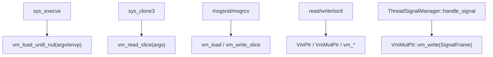
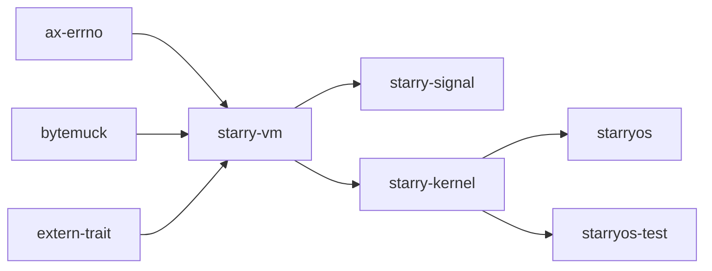

# `starry-vm` 技术文档

> 路径：`components/starry-vm`
> 类型：库 crate
> 分层：组件层 / StarryOS 用户虚拟内存访问组件
> 版本：`0.3.0`
> 文档依据：`Cargo.toml`、`src/lib.rs`、`src/thin.rs`、`src/alloc.rs`、`tests/test.rs`、`os/StarryOS/kernel/src/mm/access.rs`、`os/StarryOS/kernel/src/syscall/task/execve.rs`、`os/StarryOS/kernel/src/syscall/task/clone3.rs`、`os/StarryOS/kernel/src/mm/io.rs`、`os/StarryOS/kernel/src/syscall/ipc/msg.rs`

`starry-vm` 是 StarryOS 的“用户虚拟内存访问层”。它定义了一套与具体地址空间实现解耦的读写接口，使 syscall 实现可以安全地把用户态指针解释成 Rust 值、切片和字符串，而不必把用户态地址直接当普通内核指针使用。

名字里虽然带 `vm`，但它并不管理页表、VMA、`mmap`、ELF 装载或缺页策略。那些真正的“虚拟内存管理”职责在 `starry-kernel::mm`，尤其是 `AddrSpace`、`loader.rs` 和 `access.rs` 中。

## 1. 架构设计分析
### 1.1 总体定位
从 StarryOS 的真实调用关系看，`starry-vm` 位于 syscall 层和用户地址空间之间：

- syscall 参数进入内核后，常先通过 `VmPtr` / `VmMutPtr` / `vm_load*()` 做指针编组。
- 真正的地址检查、`user_copy` 和缺页协作由消费者实现 `VmIo`。
- 同一套 API 既能被内核实现使用，也能在 host 侧测试里用假内存池替身实现。

这使它更像“用户内存 I/O 抽象层”，而不是“地址空间对象模型”。

### 1.2 模块划分
- `src/lib.rs`：定义 `VmError`、`VmResult`、`VmIo`、`vm_read_slice()`、`vm_write_slice()`。
- `src/thin.rs`：定义 `VmPtr` / `VmMutPtr` 两个轻量指针 trait，支持原始指针和 `NonNull<T>`。
- `src/alloc.rs`：在启用 `alloc` feature 时提供 `vm_load_any()`、`vm_load()`、`vm_load_until_nul()`。

### 1.3 核心抽象
- `VmIo`：唯一需要由外部实现的 unsafe trait，提供 `new()`、`read()`、`write()`。
- `VmError`：只暴露三类错误，`BadAddress`、`AccessDenied`、`TooLong`。
- `VmPtr`：提供 `nullable()`、`vm_read_uninit()`、`vm_read()`。
- `VmMutPtr`：在 `VmPtr` 基础上增加 `vm_write()`。
- `vm_read_slice()` / `vm_write_slice()`：面向切片的批量拷贝入口。
- `vm_load_until_nul()`：按块扫描 C 风格 NUL 终止数组，并限制总长度上限。

其中有两个很重要的实现特征：

- 所有入口都会先检查对齐要求，未对齐直接返回 `VmError::BadAddress`。
- `vm_load_until_nul()` 的最大扫描字节数是 `131072`，也就是 128 KiB，避免对坏指针进行无界扫描。

### 1.4 `VmIo` 的外部实现机制
`starry-vm` 最关键的设计点，是用 `#[extern_trait(VmImpl)]` 把“当前环境下的实际 VM 访问后端”留给外部实现。

在 StarryOS 内核中，这个实现位于 `os/StarryOS/kernel/src/mm/access.rs`：

- `struct Vm(IrqSave)` 作为具体实现体，读写期间持有中断保护。
- `check_access()` 先检查地址是否位于用户空间窗口内。
- `access_user_memory()` 标记当前线程处于用户内存访问区间，允许 page fault 在内核中安全发生。
- `VmIo::read()` / `write()` 通过 `ax-hal::asm::user_copy()` 真正完成跨地址空间拷贝。
- 注册的 page fault handler 再转给 `AddrSpace::handle_page_fault()` 补页。

也就是说，`starry-vm` 自身不知道“当前地址空间”是什么，但 StarryOS 通过外部实现把它和当前线程的 `AddrSpace` 绑定了起来。

### 1.5 真实调用主线
在 StarryOS 里，它的使用面非常广：



这说明它承担的是“用户态参数与缓冲区编组”这一整段，而不是个别 syscall 的附属工具。

### 1.6 与地址空间管理的边界
下面这些职责都不在 `starry-vm` 内部：

- `AddrSpace` 的创建、克隆和销毁。
- `mmap/brk/mprotect/mincore` 等地址空间布局调整。
- ELF 装载、用户栈和堆映射。
- 文件后端、COW、线性映射、缺页策略。

这些职责在 `starry-kernel::mm::{aspace,loader,access}`。`starry-vm` 只负责“已经给你一个用户地址，现在安全地把它读出来或写回去”。

## 2. 核心功能说明
### 2.1 主要功能
- 对用户态原始指针进行对齐检查和安全读写。
- 把用户空间数组加载为内核侧 `Vec<T>`。
- 读取 NUL 终止数组，为 `argv`、`envp`、路径字符串等场景服务。
- 为信号栈 frame、futex 地址、时间结构体、消息队列缓冲区等提供统一编组接口。

### 2.2 StarryOS 中的关键使用点
- `syscall/task/execve.rs`：用 `vm_load_until_nul()` 读取 `argv` / `envp` 指针数组。
- `mm/access.rs`：实现 `VmIo` 并扩展出 `VmBytes` / `VmBytesMut` 等 I/O 视图。
- `syscall/task/clone3.rs`：用 `vm_read_slice()` 读取 `clone_args`。
- `syscall/ipc/msg.rs`：用 `vm_load()` / `vm_write_slice()` 复制消息正文。
- `syscall/mm/mmap.rs`：在 `mremap` 风格路径中复制用户数据。
- `task/ops.rs`、`syscall/sync/futex.rs`：通过 `VmPtr` / `VmMutPtr` 读写 futex 相关用户地址。
- `starry-signal`：用 `VmMutPtr::vm_write()` 把 `SignalFrame` 压入用户栈。

### 2.3 关键 API 使用示例
典型使用方式如下：

```rust
let head = head_ptr.vm_read()?;
let argv = vm_load_until_nul(argv_ptr)?;
user_ptr.vm_write(value)?;

let data = vm_load(buf_ptr, len)?;
vm_write_slice(out_ptr, &data)?;
```

## 3. 依赖关系图谱


### 3.1 关键直接依赖
- `ax-errno`：把 `VmError` 映射到 StarryOS/ArceOS 统一错误模型。
- `bytemuck`：为 `vm_read()`、`vm_load()`、`vm_load_until_nul()` 提供按位可解释类型约束。
- `extern-trait`：让 `VmIo` 的具体实现留给外部环境注入。

### 3.2 关键直接消费者
- `starry-kernel`：几乎所有需要读写用户缓冲区的 syscall 路径都直接依赖它。
- `starry-signal`：利用它写入用户信号栈 frame。

## 4. 开发指南
### 4.1 依赖接入
```toml
[dependencies]
starry-vm = { workspace = true }
```

如果只是新增一个 syscall 的用户参数编组，通常不需要扩展 `starry-vm` 本身，只需在内核里直接调用现有 API。

### 4.2 何时该用哪个 API
1. 读取单个 POD 或按位可解释对象时，优先用 `ptr.vm_read()`。
2. 写回单个对象时，优先用 `ptr.vm_write(value)`。
3. 复制定长缓冲区时，优先用 `vm_read_slice()` / `vm_write_slice()`。
4. 读取 `argv`、`envp`、C 字符串或 NUL 终止数组时，优先用 `vm_load_until_nul()`。

### 4.3 修改这层逻辑时要联动检查什么
1. 改 `VmError` 到 `AxError` 的映射时，必须核对 syscall 返回值是否仍符合 Linux 预期。
2. 改 `vm_load_until_nul()` 的扫描策略时，必须同时检查 `execve()`、路径解析和字符串载入逻辑。
3. 改 `VmPtr` / `VmMutPtr` trait 行为时，必须同时检查 `starry-signal`、futex、时间结构体和 IPC 路径。
4. 改 `VmIo` 语义时，必须同时检查 `mm/access.rs` 的 page fault 协作是否仍成立。

### 4.4 常见开发误区
- 不要把这个 crate 当作地址空间管理器；它不创建也不维护页表。
- 不要在这里实现具体架构的 page fault 策略；那是 `starry-kernel::mm` 的职责。
- 不要绕过它直接把用户指针转换成普通引用；那会破坏用户态边界检查。

## 5. 测试策略
### 5.1 现有测试覆盖
`tests/test.rs` 使用一个 1 MiB 的假内存池实现 `VmIo`，已经覆盖：

- `vm_write_slice()` / `vm_read_slice()` 的基本读写。
- 受保护地址上的 `AccessDenied`。
- `VmPtr` / `VmMutPtr` 的类型化访问。
- `vm_load()` 和 `vm_load_until_nul()` 的分配式加载。

### 5.2 建议重点验证的系统路径
- `execve()` 的 `argv/envp` 读取。
- `clone3()` 结构体读取与对齐要求。
- `futex`、`clear_child_tid`、`robust_list` 等用户地址回写场景。
- System V 消息队列、`readv/writev`、`ioctl/stat` 等缓冲区复制路径。
- 信号处理器 frame 压栈与 `sigreturn` 恢复。

### 5.3 覆盖率要求
- `vm_read_slice()`、`vm_write_slice()`、`vm_load_until_nul()` 应保持高覆盖。
- 需要同时覆盖未对齐、越界、只读区域和过长字符串四类失败路径。
- 涉及 `VmIo` 语义变化的改动，建议至少跑一轮 `execve + clone3 + futex + signal` 回归。

## 6. 跨项目定位分析
### 6.1 ArceOS
ArceOS 本体不直接消费 `starry-vm`。这个 crate 更像是 StarryOS 为 Linux 风格用户态接口补上的“用户指针访问层”。

### 6.2 StarryOS
这是 `starry-vm` 的主战场。StarryOS 把它放在 syscall 和 `AddrSpace` 之间，统一处理用户态参数编组、缓冲区复制和字符串加载。

### 6.3 Axvisor
当前仓库中 Axvisor 不直接依赖 `starry-vm`。从真实依赖关系看，它并不是虚拟化栈组件，而是 StarryOS 用户内存访问组件。
