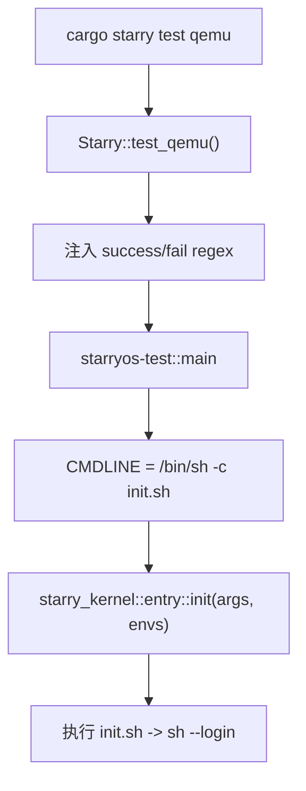
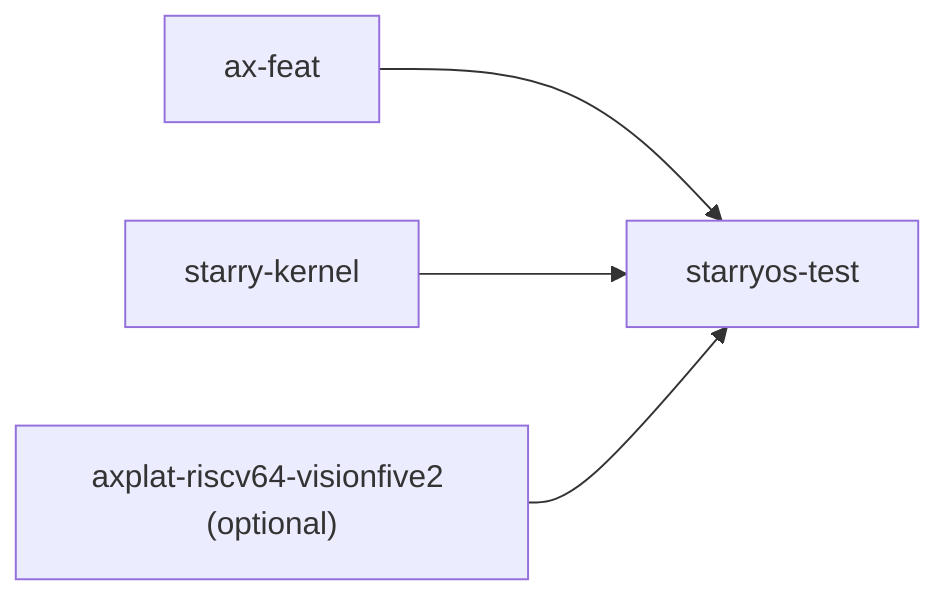

# `starryos-test` 技术文档

> 路径：`test-suit/starryos`
> 类型：二进制 crate
> 分层：测试层 / StarryOS 系统回归入口
> 版本：`0.3.0-preview.3`
> 文档依据：`Cargo.toml`、`src/main.rs`、`src/init.sh`、`xtask/src/starry/{mod.rs,run.rs,config.rs,build.rs}`、`os/StarryOS/kernel/src/entry.rs`

`starryos-test` 是 StarryOS 的专用测试入口包。它的运行时代码当前几乎与 `starryos` 相同，同样会构造 `/bin/sh -c init.sh` 并调用 `starry_kernel::entry::init()`；但它在构建和运行流程中的“包身份”完全不同，因为 `cargo starry test qemu` 默认选择的就是它。

因此，`starryos-test` 不是另一套内核实现，而是“被测试系统的入口包”。它把 StarryOS 的真实启动主线放进了专门的自动化回归通道里。

## 1. 架构设计分析
### 1.1 总体定位
这个包的职责可以概括为三点：

- 作为 `cargo starry test qemu` 的默认目标包。
- 复用与 `starryos` 基本一致的启动路径，确保测试跑在真实系统 bring-up 之上。
- 让 xtask 能为测试场景注入专门的成功/失败判据和目标产物目录。

从 CI 和本地测试视角看，它就是 StarryOS 的“系统测试镜像入口”。

### 1.2 为什么必须单独做成一个包
真实差异不在 `src/main.rs`，而在 xtask 的选择逻辑：

- `xtask/src/starry/build.rs` 把测试包名固定为 `STARRY_TEST_PACKAGE = "starryos-test"`。
- `scripts/axbuild/src/starry/mod.rs::Starry::test_qemu()` 会构造测试请求并强制 `package = "starryos-test"`。
- `xtask/src/starry/run.rs` 在包名等于 `starryos-test` 时使用 `RunScope::PackageRoot`。
- `xtask/src/starry/config.rs` 通过 `cargo build -p starryos-test --target ... --features qemu` 解析测试产物目录和 `rootfs-<arch>.img` 位置。

也就是说，测试入口之所以独立，不是为了换一套运行时代码，而是为了换一条受控的测试构建/运行通道。

### 1.3 当前运行时代码主线
`src/main.rs` 与 `os/StarryOS/starryos/src/main.rs` 当前几乎一致：



这里还有一个容易忽略但很关键的细节：

- package 名是 `starryos-test`。
- `[[bin]]` 名依旧是 `starryos`。

这意味着测试运行的仍然是“StarryOS 这份系统镜像”，只是由另一个包名进入测试流水线。

### 1.4 当前测试判据
`xtask/src/starry/run.rs` 为该包默认注入：

- `success_regex = ["starry:~#"]`
- `fail_regex = ["(?i)\\bpanic(?:ked)?\\b"]`

再结合 `src/init.sh` 当前内容与 `starryos` 相同，可以看出现在这条测试主线的实际意义是：

- 让系统完整启动。
- 跑完默认初始化脚本。
- 成功进入 shell 提示符。
- 只要出现 panic 关键字就判失败。

也就是说，当前它更偏“系统 smoke/regression 入口”，而不是“脚本化功能测试总控程序”。

### 1.5 与 `starryos` 的边界
`starryos-test` 和 `starryos` 当前共享同一内核入口、同一默认 init 脚本逻辑，但边界仍然很明确：

- `starryos`：默认人工运行入口，带本地 `.axconfig.toml` / `.qemu.toml`。
- `starryos-test`：默认自动化回归入口，依赖 xtask 注入 run scope、rootfs 准备和 QEMU 正则判据。

`test-suit/starryos` 目录当前没有自己的 `.axconfig.toml` 或 `.qemu.toml`，这也进一步说明它的测试配置主要来自 xtask，而不是包内静态 dotfile。

## 2. 核心功能说明
### 2.1 主要功能
- 作为 `cargo starry test qemu` 的目标包。
- 复用真实的 StarryOS 启动主线进行系统级回归。
- 为 xtask 提供稳定的包标识和产物根目录。
- 通过 success/fail regex 把 QEMU 输出转成可自动判定的测试结果。

### 2.2 关键入口
- `src/main.rs`：把 `init.sh` 组装成命令行并调用 `starry_kernel::entry::init()`。
- `src/init.sh`：定义测试入口当前会执行的用户态初始化脚本。
- `scripts/axbuild/src/starry/mod.rs::Starry::test_qemu()`：把这个包接入统一测试入口。
- `xtask/src/starry/run.rs::run_with_qemu_regex()`：注入正则并以 `PackageRoot` 范围运行。
- `xtask/src/starry/config.rs`：解析该包的 target 产物目录并准备 rootfs。

### 2.3 关键使用示例
最常用的使用方式不是直接 `cargo run`，而是通过统一测试命令：

```bash
cargo starry test qemu --target riscv64
```

如果需要单独调试这个包，也可以显式运行：

```bash
cargo xtask starry run --arch riscv64 --package starryos-test
```

## 3. 依赖关系图谱


### 3.1 关键直接依赖
- `ax-feat`：提供底层平台、驱动和运行时装配。
- `starry-kernel`：真正执行系统 bring-up。
- `axplat-riscv64-visionfive2`：在 `vf2` feature 下可选引入。

### 3.2 关键外部驱动者
- `tg-xtask`：不是 Cargo 依赖，但是真正让这个包进入测试流水线的上层驱动者。

## 4. 开发指南
### 4.1 常用运行方式
```bash
cargo starry test qemu --target riscv64
```

需要单包调试时再退回：

```bash
cargo xtask starry run --arch riscv64 --package starryos-test
```

### 4.2 修改这个包时最应注意什么
1. 如果你改了 `src/init.sh` 的输出或 shell 提示符，要同步检查 `xtask/src/starry/run.rs` 中的 success regex。
2. 如果你改了启动主线但并非测试专属差异，通常也应该同步考虑 `starryos`。
3. 如果你想增加测试专属行为，优先放在这个包里，而不是污染默认人工运行入口。

### 4.3 常见开发误区
- 不要把它当成另一套内核；它复用的还是 `starry-kernel`。
- 不要以为它当前已经有独立的脚本化测试程序；目前主要判据仍是“能否进入 shell 提示符”。
- 不要忘记 package 名和 bin 名不同：xtask 认的是 package `starryos-test`，运行出来的二进制仍叫 `starryos`。

## 5. 测试策略
### 5.1 当前测试形态
这个 crate 自己就是系统测试入口，因此它的价值主要来自端到端运行：

- QEMU 能否成功启动镜像。
- rootfs 是否正确准备并挂载。
- 内核能否 bring-up 到用户态 shell。
- 输出中是否出现 panic。

### 5.2 建议重点验证的场景
- `cargo starry test qemu` 是否仍能稳定进入成功正则。
- rootfs 产物目录解析是否仍正确。
- `qemu` / `smp` / `vf2` 组合下是否仍能完成 bring-up。
- 若引入测试专属初始化脚本，是否与普通 `starryos` 入口形成清晰边界。

### 5.3 覆盖率要求
- 这里的覆盖率应按“场景覆盖”理解，而不是 host 侧代码覆盖率。
- 至少应覆盖正常启动、panic 失败、rootfs 准备和目标架构切换几类核心路径。

## 6. 跨项目定位分析
### 6.1 ArceOS
ArceOS 本体不直接依赖 `starryos-test`。这是 StarryOS 在根工作区中单独建立的系统测试入口包。

### 6.2 StarryOS
这是 StarryOS 的自动化回归入口。仓库里执行 `cargo starry test qemu` 时，真正被构建和运行的是它，而不是普通的 `starryos` 包。

### 6.3 Axvisor
当前仓库中 Axvisor 不直接依赖 `starryos-test`。两者没有代码级直接关系。
