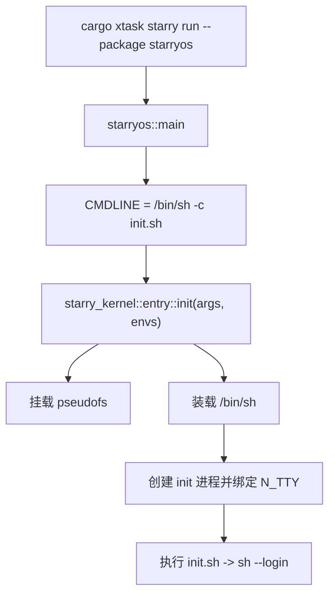
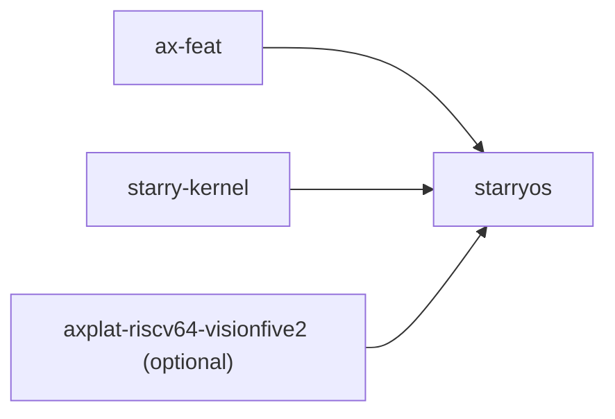

# `starryos` 技术文档

> 路径：`os/StarryOS/starryos`
> 类型：二进制 crate
> 分层：StarryOS 层 / 启动镜像入口
> 版本：`0.2.0-preview.2`
> 文档依据：`Cargo.toml`、`src/main.rs`、`src/init.sh`、`.axconfig.toml`、`.qemu.toml`、`os/StarryOS/README.md`、`os/StarryOS/kernel/src/entry.rs`、`xtask/src/starry/{build.rs,run.rs}`

`starryos` 是 StarryOS 的默认启动镜像包。它不实现 syscall、进程管理或虚拟内存，而是负责把 `ax-feat`、平台配置、`starry-kernel` 和默认 init 命令线装配成一个可启动、可进入交互 shell 的系统镜像。

换句话说，`starryos` 负责的是“把内核打包成一个能启动的 StarryOS 镜像”，而不是“内核本体”。真正的系统核心仍在 `starry-kernel`。

## 1. 架构设计分析
### 1.1 总体定位
从源码和构建链看，`starryos` 是一个非常薄的入口包，但它承担了 StarryOS 对外最直接的一层职责：

- 选择默认 feature 组合。
- 绑定平台配置与 QEMU 配置。
- 指定默认 init 命令行为。
- 调用 `starry_kernel::entry::init()` 启动真正的内核主线。

因此它更接近“镜像入口”和“系统装配层”，而不是普通应用的 `main()`。

### 1.2 feature 与装配关系
`Cargo.toml` 里的 feature 设计直接决定镜像长什么样：

- `qemu`：二进制 `[[bin]]` 的必需 feature，同时启用 `ax-feat/defplat`、`ax-feat/bus-pci`、`ax-feat/display`、`ax-feat/fs-ng-times`，以及 `starry-kernel` 的 `input`、`vsock`、`dev-log`。
- `smp`：启用 `ax-feat/smp`，并在 VisionFive2 平台上联动开启 SMP。
- `vf2`：引入可选依赖 `axplat-riscv64-visionfive2`，并额外打开 `ax-feat/driver-sdmmc`。

这意味着 `starryos` 的主要复杂度不在运行时逻辑，而在于“生成哪一类镜像”。

### 1.3 启动主线
`src/main.rs` 的逻辑非常短，但它决定了系统如何进入第一个用户进程：



真实代码路径是：

1. `CMDLINE` 固定为 `["/bin/sh", "-c", include_str!("init.sh")]`。
2. `main()` 把这组静态字符串转成 `Vec<String>`。
3. 环境变量数组当前为空。
4. 调用 `starry_kernel::entry::init(&args, &envs)`，后续工作全部交给 `starry-kernel`。

### 1.4 默认 init 行为
`src/init.sh` 明确了这个包的“默认系统人格”：

- 设定 `HOME=/root`。
- 打印欢迎语和当前环境变量。
- 提示可使用 `apk` 安装软件。
- `cd ~` 后执行 `sh --login`。

这说明 `starryos` 的默认目标是“启动到交互 shell”，而不是跑一组专用测试脚本。

### 1.5 包级配置文件的作用
这个包目录下除了 `main.rs` 以外，还有两个重要配置文件：

- `.axconfig.toml`：描述平台和硬件布局，当前默认是 `riscv64-qemu-virt`。
- `.qemu.toml`：描述包级 QEMU 参数，当前不带 success/fail 正则。

这与 `test-suit/starryos` 不同。`starryos` 是带着本地平台配置和运行配置一起存在的“镜像包”。

### 1.6 与 `starry-kernel` 的边界
`starryos` 不负责下面这些事情：

- syscall 分发和 Linux 错误码。
- 进程/线程、信号、地址空间、文件系统语义。
- 用户程序装载、缺页处理、`fork/exec/wait`。

这些都在 `starry-kernel`。`starryos` 提供的是入口参数、feature 组合和平台配置。

## 2. 核心功能说明
### 2.1 主要功能
- 定义 StarryOS 的默认可启动包。
- 组织 feature 与平台配置，生成对应镜像。
- 指定默认 init 命令行为 `/bin/sh -c init.sh`。
- 调用 `starry_kernel::entry::init()` 启动内核主线。

### 2.2 关键入口
- `src/main.rs`：构造 `args/envs` 并转交给 `starry-kernel`。
- `src/init.sh`：定义默认启动后进入的 shell 行为。
- `.axconfig.toml`：定义默认平台配置。
- `.qemu.toml`：定义包级 QEMU 运行参数。

### 2.3 关键使用示例
这个包通常不作为库被依赖，而是通过构建/运行命令直接触发：

```bash
cargo xtask starry rootfs --arch riscv64
cargo xtask starry run --arch riscv64 --package starryos
```

## 3. 依赖关系图谱


### 3.1 关键直接依赖
- `ax-feat`：把底层 ArceOS 运行时、驱动和平台 feature 接到镜像入口包上。
- `starry-kernel`：真正的内核实现，`starryos` 只在 `main()` 里调用其入口。
- `axplat-riscv64-visionfive2`：仅在 `vf2` feature 下引入，用于板级适配。

### 3.2 关键运行时外部条件
- rootfs / `rootfs-<arch>.img`：由 `cargo xtask starry rootfs` 或 `run` 路径自动准备。
- 平台配置：由 `.axconfig.toml` 和 `ArceosConfigOverride` 共同决定。
- QEMU 参数：由 `.qemu.toml` 和 xtask 运行参数共同决定。

## 4. 开发指南
### 4.1 常用运行方式
```bash
cargo xtask starry rootfs --arch riscv64
cargo xtask starry run --arch riscv64 --package starryos
```

如果只想从 `os/StarryOS` 子工作区本地调试，也可以走其 README/Makefile 路径。

### 4.2 适合在这个包里改什么
1. 默认启动命令、登录 shell 和欢迎信息。
2. 镜像 feature 组合与平台开关。
3. 包级 `.axconfig.toml` / `.qemu.toml`。

### 4.3 不适合在这个包里改什么
1. syscall 语义问题应改 `starry-kernel`。
2. 进程资源、信号、用户虚拟内存问题应改对应 `starry-*` 组件或 `starry-kernel`。
3. 自动化回归入口问题应优先检查 `starryos-test` 和 xtask 测试路径。

## 5. 测试策略
### 5.1 当前测试形态
这个 crate 本身没有独立的 `tests/`。它的验证方式主要是系统级启动：

- 是否能成功生成镜像。
- 是否能挂载 rootfs。
- 是否能进入 `/bin/sh` 并执行 `init.sh`。

### 5.2 建议重点验证的场景
- 默认命令线是否仍能进入交互 shell。
- `qemu` / `smp` / `vf2` feature 组合是否仍能成功构建。
- `.axconfig.toml` 修改后平台是否仍能正常 bring-up。
- rootfs 自动准备、磁盘挂载和标准输入输出是否正常。

### 5.3 与 `starryos-test` 的关系
人工运行和日常镜像调试更适合用 `starryos`。

自动化回归则应优先用 `starryos-test`，因为 `cargo starry test qemu` 默认跑的是测试入口包，而不是这里。

## 6. 跨项目定位分析
### 6.1 ArceOS
`starryos` 建立在 ArceOS 的 `ax-feat`/平台/运行时能力之上，但不是 ArceOS 本体的一部分。它消费的是 ArceOS 的底座能力。

### 6.2 StarryOS
这是 StarryOS 的默认启动镜像入口。用户平时执行 `cargo xtask starry run --package starryos`，真正启动的就是这个包。

### 6.3 Axvisor
当前仓库中 Axvisor 不直接依赖 `starryos`。两者没有代码级直接关系。
