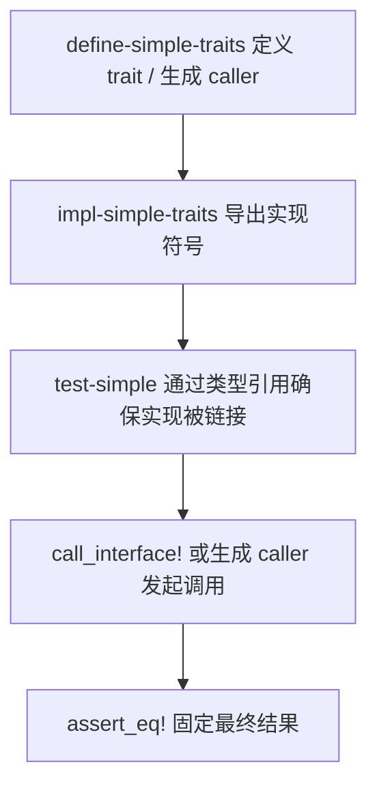
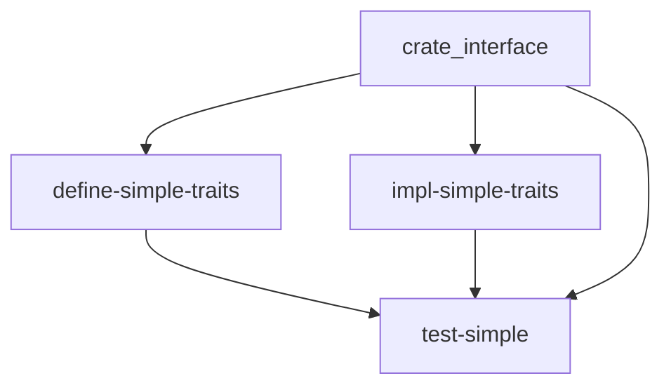

# `test-simple` 技术文档

> 路径：`components/crate_interface/test_crates/test-simple`
> 类型：二进制 crate（独立测试工作区成员，`publish = false`）
> 分层：组件层 / `crate_interface` 多 crate 测试矩阵 / 最终链接验证端
> Rust 要求：stable
> 文档依据：`components/crate_interface/test_crates/test-simple/Cargo.toml`、`components/crate_interface/test_crates/test-simple/src/main.rs`、`components/crate_interface/test_crates/Cargo.toml`、`components/crate_interface/test_crates/run_tests.sh`、`components/crate_interface/README.md`、`components/crate_interface/tests/test_crate_interface.rs`、`components/crate_interface/crate_interface_lite/tests/test_crate_interface.rs`、`components/crate_interface/Cargo.toml`、`Cargo.toml`

`test-simple` 是 `crate_interface` stable 路径里的“最终链接/验证端”测试资产。它自己既不定义接口，也不承载正式实现，而是把 `define-simple-traits` 的定义侧、`impl-simple-traits` 的实现侧和调用侧验证逻辑真正收束到同一个可执行文件中，再用 `assert_eq!` 把结果钉死。与 `components/crate_interface/tests/test_crate_interface.rs` 这类同 crate 测试相比，它验证的是更接近真实使用方式的三 crate 闭环：接口定义、符号导出、最终调用必须在真正完成链接之后仍然成立。

## 1. 架构设计分析

### 1.1 在测试矩阵中的真实定位

`test-simple` 不属于仓库主工作区的正式运行时组件：

- 仓库顶层 `Cargo.toml` 显式排除了 `components/crate_interface/test_crates`
- `components/crate_interface/Cargo.toml` 也把 `test_crates` 排除在自己的工作区之外
- `components/crate_interface/test_crates/Cargo.toml` 将整组测试资产标记为 `publish = false`

这说明它的目标非常明确：不是提供可复用产品能力，而是作为 `crate_interface` 多 crate 测试矩阵里的终端可执行体，证明 stable 路径在真实链接场景下可用。

### 1.2 最终验证端的执行模型

这个二进制承担的是测试链路中的第三段：

1. `define-simple-traits` 定义接口与可选 caller
2. `impl-simple-traits` 用 `#[impl_interface]` 导出统一符号
3. `test-simple` 把两者一起链接进最终程序并发起断言

因此它验证的重点不是“宏能否展开”，而是“拆到不同 crate 后，最终程序能否真正命中正确符号并得到预期结果”。

### 1.3 链接锚点设计

`src/main.rs` 有一个看似不起眼、但决定测试是否成立的匿名常量块：它通过 `std::any::type_name::<...>()` 显式引用 `SimpleImpl`、`NamespacedImpl`、`CallerImpl` 和 `AdvancedImpl`。

这一步不是业务逻辑，也不是为了实例化对象，而是为了把实现侧类型稳定地带进最终链接结果。少了这层“链接锚点”，测试很容易退化成“调用侧代码存在，但实现侧未真正进入可执行文件”的伪闭环。

### 1.4 覆盖场景矩阵

`test-simple` 的 `main()` 依次运行 5 个测试函数，对应 `define-simple-traits` 中 stable 分支的完整样本集：

| 测试函数 | 覆盖对象 | 关注点 |
| --- | --- | --- |
| `test_simple_interface()` | `SimpleIf` | 基本跨 crate 绑定、参数传递、返回值断言 |
| `test_namespaced_interface()` | `NamespacedIf` | `namespace = SimpleNs` 的符号隔离 |
| `test_caller_interface()` | `CallerIf` | `call_interface!` 与 `gen_caller` 生成函数的一致性 |
| `test_advanced_interface()` | `AdvancedIf` | `namespace + gen_caller` 组合路径 |
| `test_multiple_calls()` | `SimpleIf::compute` | 重复调用的稳定性与可重复性 |

这里没有运行时状态机、初始化协议或复杂业务分支；测试函数的全部价值都在于让链接结果具备可观测性。

### 1.5 与其它测试的关系

`crate_interface` 仓库里已经有同 crate 的测试用例，例如：

- `components/crate_interface/tests/test_crate_interface.rs`
- `components/crate_interface/crate_interface_lite/tests/test_crate_interface.rs`

这些测试更偏向“宏展开后的基本调用语义是否成立”。`test-simple` 则再向前迈一步，专门证明当定义侧、实现侧、调用侧分别位于不同 crate 时，最终二进制仍然能正确完成符号绑定。

## 2. 核心功能说明

### 2.1 主要能力

- 把 stable 定义侧与实现侧真实链接进同一可执行文件
- 同时验证 `call_interface!`、`namespace`、`gen_caller` 三条主要能力
- 用简单且可区分的断言值快速判断是否命中了预期实现
- 作为 stable 多 crate 测试矩阵的最终观察点，为上游宏能力提供端到端证据

### 2.2 真实调用链



### 2.3 为什么它必须是二进制

只有二进制 crate 才能把“最终链接行为”完整暴露出来。若只停留在库内单测或宏展开检查，很多问题会被隐藏在“尚未进入最终链接单元”这一步之前，无法证明真实程序也能成立。

## 3. 依赖关系图谱

### 3.1 直接依赖

| 依赖 | 作用 |
| --- | --- |
| `crate_interface` | 提供 `call_interface!` 调用入口 |
| `define-simple-traits` | 提供接口定义与生成 caller |
| `impl-simple-traits` | 提供最终应被命中的实现符号 |

### 3.2 在测试矩阵中的上下游

- 上游定义侧：`define-simple-traits`
- 上游实现侧：`impl-simple-traits`
- 同层验证脚本：`components/crate_interface/test_crates/run_tests.sh`
- 参照测试：`components/crate_interface/tests/test_crate_interface.rs`

`test-simple` 没有面向产品代码的下游消费者；它的消费方是测试流程本身。

### 3.3 关系示意



## 4. 开发指南

### 4.1 什么时候应该修改它

只有当你要扩展 `crate_interface` 的 stable 多 crate 测试面时，才应该改 `test-simple`。典型场景包括：

- `define-simple-traits` 新增了 stable 可用的接口样例
- 需要为现有 `namespace` 或 `gen_caller` 分支补更明确的终端断言
- 需要提升断言值的可辨识度，便于快速定位链接错误

### 4.2 修改时的关键约束

- 定义侧新增接口后，必须同步补 `impl-simple-traits` 与 `test-simple`
- 不要删除实现类型的显式类型引用；它们是链接锚点的一部分
- 断言值应简单、稳定、彼此区分明显，优先服务“看出命中了谁”
- 需要 nightly 或 `weak_default` 的场景不应继续塞进这里，而应放到 `test-weak` / `test-weak-partial`

### 4.3 运行方式

由于 `test_crates` 是独立工作区，建议显式指定 manifest：

```bash
cargo run --manifest-path components/crate_interface/test_crates/Cargo.toml --bin test-simple
```

或直接调用工作区脚本：

```bash
components/crate_interface/test_crates/run_tests.sh simple
```

### 4.4 什么不应该放在这里

以下场景更适合放到别处：

- 同 crate 级别的宏行为回归：放到 `components/crate_interface/tests/test_crate_interface.rs`
- `ax-crate-interface-lite` 的轻量语法覆盖：放到 `components/crate_interface/crate_interface_lite/tests/test_crate_interface.rs`
- `weak_default`、弱符号优先级、默认回退：放到 `test-weak` 与 `test-weak-partial`

## 5. 测试策略

### 5.1 当前测试目标

`test-simple` 重点验证以下几点：

- 定义侧、实现侧、调用侧拆成三个 crate 后仍能在最终二进制中闭环
- `namespace` 是否真正参与符号隔离，而不仅是语法层标注
- `gen_caller` 生成的包装函数是否与 `call_interface!` 命中同一实现
- 重复调用时是否持续稳定地命中同一链接结果

### 5.2 与其它测试层的分工

可以把整个 stable 测试面理解为两层：

- 同 crate 测试：证明宏展开和基本调用语义正确
- `test-simple`：证明跨 crate 拆分后，最终链接结果仍然正确

只有第二层成立，`crate_interface` 才算真正满足 README 中“在一个 crate 定义、另一个 crate 实现、任意 crate 调用”的目标模型。

### 5.3 高风险点

- 若移除实现类型的显式引用，链接器可能不再把实现侧稳定带入最终程序
- 若对同一接口引入第二份实现，测试可能从断言失败升级为重复符号问题
- 若断言值与默认值或其他 case 不够区分，定位会明显变慢

## 6. 跨项目定位分析

| 项目 | 位置 | 角色 | 核心作用 |
| --- | --- | --- | --- |
| ArceOS | 无主线直接依赖 | 间接保护测试资产 | 间接保护 `ax-log`、`ax-runtime`、`ax-task` 等真实使用 `crate_interface` 的路径 |
| StarryOS | 无主线直接依赖 | 间接保护测试资产 | 通过复用 ArceOS 公共基础设施，间接受益于 stable 链接语义回归 |
| Axvisor | 无主线直接依赖 | 间接保护测试资产 | `axvisor_api` 等组件使用 `crate_interface`，但不会直接消费这个测试二进制 |

## 7. 最关键的边界澄清

`test-simple` 不是正式运行时组件，也不是通用集成测试框架；它只是 `crate_interface` stable 多 crate 测试矩阵中的最终链接验证可执行体，职责到“证明定义侧、实现侧、调用侧能在真实二进制里闭环”为止。
