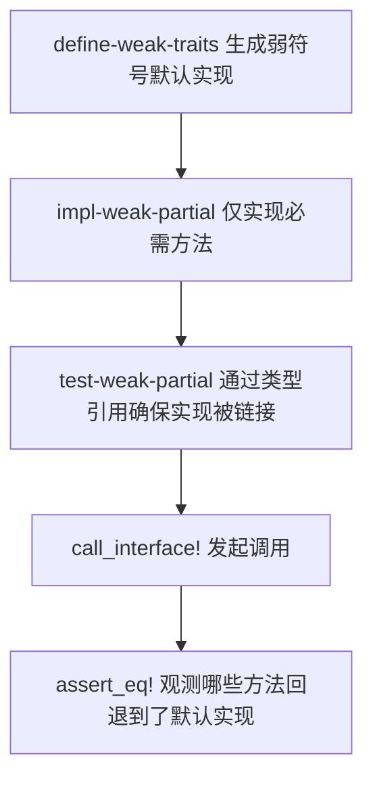
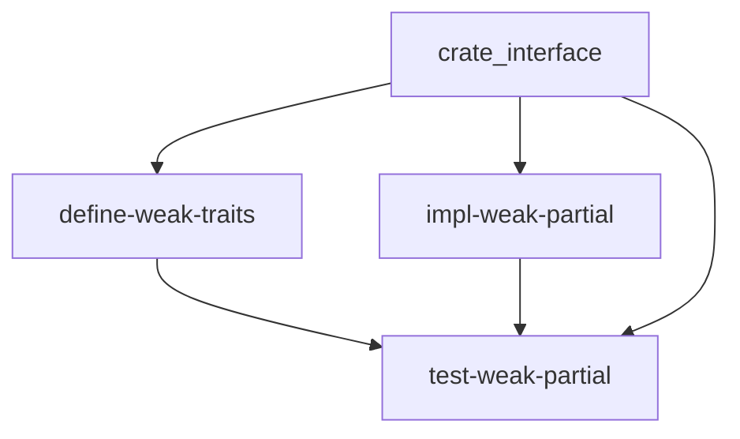

# `test-weak-partial` 技术文档

> 路径：`components/crate_interface/test_crates/test-weak-partial`
> 类型：二进制 crate（独立测试工作区成员，`publish = false`）
> 分层：组件层 / `crate_interface` 多 crate 测试矩阵 / 最终链接验证端
> Rust 要求：nightly（依赖 `#![feature(linkage)]`）
> 文档依据：`components/crate_interface/test_crates/test-weak-partial/Cargo.toml`、`components/crate_interface/test_crates/test-weak-partial/src/main.rs`、`components/crate_interface/test_crates/Cargo.toml`、`components/crate_interface/test_crates/run_tests.sh`、`components/crate_interface/README.md`、`components/crate_interface/tests/test_weak_default.rs`、`components/crate_interface/Cargo.toml`、`Cargo.toml`

`test-weak-partial` 是 `crate_interface` `weak_default` 测试矩阵中负责“默认回退路径”的最终链接/验证端。它只链接 `define-weak-traits` 和 `impl-weak-partial`，并且刻意不把 `impl-weak-traits` 带入最终二进制，从而观察当实现侧只补齐必需方法时，弱符号默认实现是否会在真实程序里接管剩余方法。它不是“功能不完整的运行时组件”，而是专门为链接期默认回退语义准备的终端测试资产。

## 1. 架构设计分析

### 1.1 在测试矩阵中的真实定位

`test-weak-partial` 与 `test-weak` 共同组成 `weak_default` 的最终验证矩阵，但两者承担的职责相反：

- `test-weak`：观察“有覆盖时，强符号如何优先”
- `test-weak-partial`：观察“无覆盖时，弱符号如何接管”

它同样位于独立测试工作区中，而不是仓库正式产品路径的一部分：

- 仓库顶层 `Cargo.toml` 将 `components/crate_interface/test_crates` 排除在主工作区之外
- `components/crate_interface/Cargo.toml` 也排除了 `test_crates`
- `components/crate_interface/test_crates/Cargo.toml` 统一设置为 `publish = false`

这表明它的价值不在于对外提供功能，而在于给 `crate_interface` 的默认回退语义提供最终证据。

### 1.2 隔离性就是它的架构核心

`test-weak-partial` 最重要的设计不是“做了什么”，而是“刻意不链接什么”：

- 只引入 `PartialOnlyImpl` 与 `SelfRefPartialImpl`
- 不引入 `impl-weak-traits` 中那些会产生强覆盖的实现类型

如果完整实现 crate 也被带进最终二进制，那么本来应该回退到默认实现的方法就可能被强符号抢走，整个测试将失去意义。换句话说，`test-weak-partial` 的核心架构特征就是“隔离回退路径”。

### 1.3 链接锚点设计

`src/main.rs` 用匿名常量块通过 `std::any::type_name::<...>()` 显式引用了：

- `PartialOnlyImpl`
- `SelfRefPartialImpl`

这些引用不是为了实例化对象，而是为了稳定地把“部分实现”带进最终链接单元，并把观测对象限定在这组实现上。

### 1.4 覆盖场景矩阵

`main()` 依次运行 5 个测试函数，专门观测默认回退路径：

| 测试函数 | 覆盖对象 | 关注点 |
| --- | --- | --- |
| `test_required_methods()` | `WeakDefaultIf` | 必需方法是否仍命中部分实现导出的强符号 |
| `test_weak_default_methods()` | `WeakDefaultIf` | `default_value`、`default_add`、`default_greeting` 是否回退到弱默认 |
| `test_weak_default_multiple_calls()` | `WeakDefaultIf` | 默认回退在重复调用下是否稳定 |
| `test_mixed_required_and_default()` | `WeakDefaultIf` | 同一接口中必需方法与默认方法能否并存 |
| `test_self_ref_partial()` | `SelfRefIf` | 默认实现内部 `Self::` 直接调用与函数引用是否都回到默认路径 |

这里最关键的观察维度不是“方法能不能运行”，而是“没有覆写时，最终到底会落到哪里”。

### 1.5 与其它测试的关系

`components/crate_interface/tests/test_weak_default.rs` 提供了 `weak_default` 的最小功能确认，但它不负责完整描述跨 crate 的最终链接行为。`test-weak-partial` 则补上真正贴近使用场景的第三段验证：

1. 定义侧在一个 crate 中生成弱符号默认实现
2. 实现侧在另一个 crate 中故意只实现必需方法
3. 最终二进制在第三个 crate 中确认默认回退确实生效

这也是 README 中“定义、实现、调用可拆到不同 crate”的模型在默认回退场景下的真正落地证明。

## 2. 核心功能说明

### 2.1 主要能力

- 在真实二进制中验证弱符号默认实现的回退路径
- 验证“部分实现 + 默认实现”可以在同一接口上稳定协作
- 验证默认实现中的 `Self::` 直接调用与函数引用在无覆盖时仍能正确工作
- 作为 `impl-weak-partial` 的最终观测点，为默认回退语义提供端到端证据

### 2.2 真实调用链



### 2.3 为什么它必须单独存在

默认回退这件事只有在“覆盖型实现完全缺席”的最终链接单元里才可验证。因此 `test-weak-partial` 不是 `test-weak` 的精简版，也不是冗余副本，而是 `weak_default` 测试矩阵不可替代的一半。

## 3. 依赖关系图谱

### 3.1 直接依赖

| 依赖 | 作用 |
| --- | --- |
| `crate_interface` | 提供 `call_interface!` 调用入口 |
| `define-weak-traits` | 提供带弱默认实现的接口定义 |
| `impl-weak-partial` | 提供只实现必需方法的部分实现样本 |

### 3.2 在测试矩阵中的上下游

- 上游定义侧：`define-weak-traits`
- 上游实现侧：`impl-weak-partial`
- 互补验证端：`test-weak`
- 参照测试：`components/crate_interface/tests/test_weak_default.rs`

`test-weak-partial` 同样没有产品代码下游，它的消费方是测试流程本身。

### 3.3 关系示意



## 4. 开发指南

### 4.1 什么时候应该修改它

只有当你要扩展 `crate_interface` 的默认回退测试面时，才应该修改 `test-weak-partial`。典型场景包括：

- `define-weak-traits` 新增了默认方法，并需要验证“未覆写时是否会回退”
- 需要补一个默认实现内部包含 `Self::foo()` 或函数引用的未覆写样例
- 需要提高回退值与覆盖值之间的可辨识度

### 4.2 修改时的关键约束

- 不要把本应测试“回退”的方法意外实现掉，否则测试语义会消失
- 不要把 `impl-weak-traits` 相关实现混入本二进制
- 保留实现类型的显式类型引用，它们是链接锚点的一部分
- `SelfRefIf` 相关改动必须同时覆盖直接调用与函数引用两条路径

### 4.3 运行方式

由于 `test_crates` 是独立工作区，建议显式指定 manifest，并使用 nightly：

```bash
cargo +nightly run --manifest-path components/crate_interface/test_crates/Cargo.toml --bin test-weak-partial
```

或直接调用工作区脚本：

```bash
components/crate_interface/test_crates/run_tests.sh weak
```

脚本会顺序执行 `test-weak` 与 `test-weak-partial`，但它们是两个独立二进制，各自形成自己的最终链接单元，因此不会互相污染链接结果。

### 4.4 什么不应该放在这里

以下场景更适合放到别处：

- 强符号优先级验证：放到 `test-weak`
- 最小 `weak_default` 功能检查：放到 `components/crate_interface/tests/test_weak_default.rs`
- stable 路径回归：放到 `test-simple`

## 5. 测试策略

### 5.1 当前测试目标

`test-weak-partial` 重点验证以下几点：

- 未覆写方法是否稳定回退到弱符号默认实现
- 必需方法的强符号与默认方法的弱符号是否可在同一接口中共存
- 默认回退在多次调用中是否保持稳定
- 默认实现内部的 `Self::` 直接调用与函数引用是否都走默认路径

### 5.2 与 `test-weak` 的分工

可以把 `weak_default` 最终验证理解为两个终端可执行体共同完成：

- `test-weak` 证明覆盖路径成立
- `test-weak-partial` 证明回退路径成立

只有两边都成立，`weak_default` 的设计语义才算完整闭环。

### 5.3 高风险点

- 一旦覆盖型实现被意外带入最终二进制，默认回退结论就会被污染
- 若默认值与覆盖值设计得不够分明，测试可观测性会明显下降
- 若只验证普通默认方法，不验证 `SelfRefIf` 的代理路径，会漏掉更复杂也更关键的问题

## 6. 跨项目定位分析

| 项目 | 位置 | 角色 | 核心作用 |
| --- | --- | --- | --- |
| ArceOS | 无主线直接依赖 | 间接保护测试资产 | 间接保护 `ax-log`、`ax-runtime`、`ax-task` 等真实使用 `crate_interface` 的默认回退语义 |
| StarryOS | 无主线直接依赖 | 间接保护测试资产 | 通过复用公共基础设施，间接受益于弱默认回退路径的回归验证 |
| Axvisor | 无主线直接依赖 | 间接保护测试资产 | `axvisor_api` 等组件使用 `crate_interface`，但不会直接消费该测试二进制 |

## 7. 最关键的边界澄清

`test-weak-partial` 不是“不完整的正式实现”，也不是给运行时兜底的默认组件；它只是 `crate_interface` `weak_default` 测试矩阵中专门验证默认回退路径的最终链接验证端，用来证明当覆盖实现刻意缺席时，弱符号默认实现会在真实程序里接管剩余方法。
