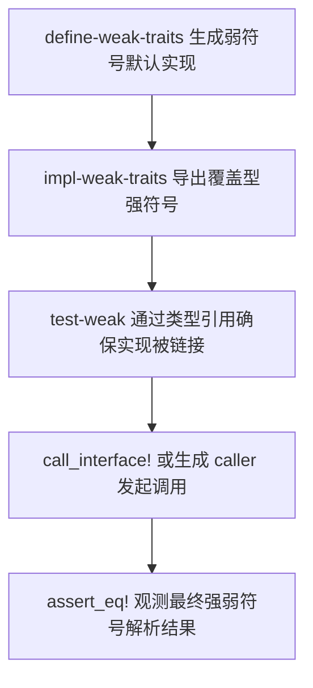
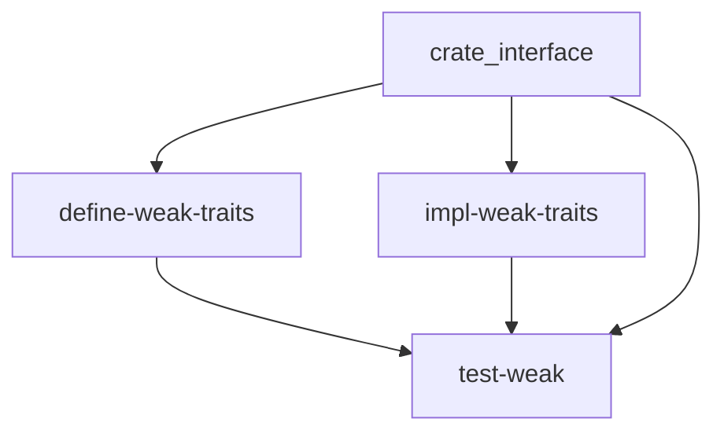

# `test-weak` 技术文档

> 路径：`components/crate_interface/test_crates/test-weak`
> 类型：二进制 crate（独立测试工作区成员，`publish = false`）
> 分层：组件层 / `crate_interface` 多 crate 测试矩阵 / 最终链接验证端
> Rust 要求：nightly（依赖 `#![feature(linkage)]`）
> 文档依据：`components/crate_interface/test_crates/test-weak/Cargo.toml`、`components/crate_interface/test_crates/test-weak/src/main.rs`、`components/crate_interface/test_crates/Cargo.toml`、`components/crate_interface/test_crates/run_tests.sh`、`components/crate_interface/README.md`、`components/crate_interface/tests/test_weak_default.rs`、`components/crate_interface/Cargo.toml`、`Cargo.toml`

`test-weak` 是 `crate_interface` `weak_default` 测试矩阵中负责“强覆盖优先级与混合解析”的最终链接/验证端。它把 `define-weak-traits` 提供的弱符号默认实现、`impl-weak-traits` 提供的覆盖型实现，以及调用侧断言逻辑真正收束到同一个 nightly 可执行文件里，借此观察链接器最终到底选择了强符号还是弱符号。与 `components/crate_interface/tests/test_weak_default.rs` 这样的最小功能测试相比，`test-weak` 验证的是更接近真实使用方式的跨 crate 链接结果。

## 1. 架构设计分析

### 1.1 在测试矩阵中的真实定位

`test-weak` 与 `test-simple` 一样，都是独立测试工作区里的资产，而不是正式产品组件：

- 仓库顶层 `Cargo.toml` 将 `components/crate_interface/test_crates` 排除在主工作区之外
- `components/crate_interface/Cargo.toml` 也把 `test_crates` 排除在 `crate_interface` 自身工作区之外
- `components/crate_interface/test_crates/Cargo.toml` 把整组测试 crate 统一设为 `publish = false`

它的存在目的不是提供某种“运行时默认实现服务”，而是作为 `weak_default` 测试矩阵中的终端可执行体，验证强符号优先级、弱符号回退以及二者混合共存是否符合设计。

### 1.2 为什么它不是“纯完整实现测试”

虽然 `test-weak` 链接的是 `impl-weak-traits`，但这个二进制并不意味着“所有方法、所有接口都走强符号”：

- `FullImpl` 会完整覆盖 `WeakDefaultIf`
- `AllDefaultImpl` 只覆写 `method_a()`，保留 `method_b()` 与 `method_c()` 的默认实现
- `NamespacedWeakImpl` 只实现必需的 `get_id()`
- `CallerWeakImpl` 只实现 `compute()`
- `SelfRefFullImpl` 只覆写 `base_value()` 与 `transform()`，其余衍生逻辑继续使用默认实现

因此，`test-weak` 的真实价值不是“证明某个 crate 能完全实现 trait”，而是证明在一个最终二进制里，强符号覆盖、弱符号保留与默认实现内部代理可以同时成立。

### 1.3 链接锚点设计

`src/main.rs` 用匿名常量块通过 `std::any::type_name::<...>()` 显式引用了：

- `FullImpl`
- `AllDefaultImpl`
- `NamespacedWeakImpl`
- `CallerWeakImpl`
- `SelfRefFullImpl`

这些类型引用的作用不是实例化对象，而是确保实现侧符号稳定进入最终链接单元。没有这一步，测试可能会退化成“调用代码存在，但实现侧并未真实参与最终程序”。

### 1.4 覆盖场景矩阵

`main()` 依次运行 7 个测试函数，对应 `define-weak-traits` 中最重要的 nightly 风险面：

| 测试函数 | 覆盖对象 | 关注点 |
| --- | --- | --- |
| `test_full_impl_required_methods()` | `WeakDefaultIf` | 必需方法是否命中强符号实现 |
| `test_full_impl_overridden_defaults()` | `WeakDefaultIf` | 默认方法被覆写后，强符号是否压过弱符号 |
| `test_all_default_interface()` | `AllDefaultIf` | 同一接口里强弱符号能否混合共存 |
| `test_namespaced_weak_interface()` | `NamespacedWeakIf` | `namespace = WeakNs` 与弱默认机制能否并存 |
| `test_caller_weak_interface()` | `CallerWeakIf` | `gen_caller` 与默认回退是否一致工作 |
| `test_mixed_strong_and_weak()` | `AllDefaultIf` | 混合解析在循环调用下是否稳定 |
| `test_self_ref_full()` | `SelfRefIf` | 默认实现内部 `Self::` 直接调用和函数引用是否正确转向强符号 |

其中 `test_self_ref_full()` 的技术含量最高，因为它不只验证“有没有覆盖”，还验证 `Self::base_value()` 与 `let f = Self::transform` 这两种代理路径在最终链接后是否都命中正确实现。

### 1.5 与其它测试的关系

`components/crate_interface/tests/test_weak_default.rs` 已经提供了一个最小的 `weak_default` 功能检查，但它的目的更接近“确认该 feature 能工作”。`test-weak` 则是下一层验证：

- 定义侧在一个 crate 中生成弱符号默认实现
- 实现侧在另一个 crate 中导出覆盖型强符号
- 最终二进制在第三个 crate 中观测强弱符号的解析结果

也就是说，它是 README 所描述的“跨 crate 定义/实现/调用模型”在 `weak_default` 场景下的最终证明。

## 2. 核心功能说明

### 2.1 主要能力

- 验证强符号在存在覆盖时能优先于弱符号默认实现
- 验证未覆写的方法仍可在同一二进制中回退到默认实现
- 验证 `namespace` 与 `gen_caller` 不会破坏弱符号解析语义
- 验证默认实现内部 `Self::` 直接调用与函数引用都能正确命中强覆盖版本

### 2.2 真实调用链



### 2.3 为什么它必须作为终端可执行体存在

很多 `weak_default` 问题不是宏展开阶段能看出来的，而是要等到“最终链接完成以后”才会暴露，例如：

- 强符号是否真的压过弱符号
- 默认实现中的 `Self::` 代理是否真的跳到了覆盖版本
- `namespace` 与 `gen_caller` 是否改变了导出的符号选择

因此它必须作为最终二进制存在，才能承担验证职责。

## 3. 依赖关系图谱

### 3.1 直接依赖

| 依赖 | 作用 |
| --- | --- |
| `crate_interface` | 提供 `call_interface!` 调用入口 |
| `define-weak-traits` | 提供带弱默认实现的接口定义 |
| `impl-weak-traits` | 提供覆盖型实现和部分保留默认的混合样本 |

### 3.2 在测试矩阵中的上下游

- 上游定义侧：`define-weak-traits`
- 上游实现侧：`impl-weak-traits`
- 互补验证端：`test-weak-partial`
- 参照测试：`components/crate_interface/tests/test_weak_default.rs`

`test-weak` 的下游不是运行时代码，而是测试流程本身。

### 3.3 关系示意



## 4. 开发指南

### 4.1 什么时候应该修改它

只有在你要扩展 `crate_interface` 的 `weak_default` 覆盖侧测试面时，才应该修改 `test-weak`。典型场景包括：

- 新增一个默认方法，并需要验证“覆写后强符号优先”
- 新增一个 `namespace` 或 `gen_caller` 与弱默认并存的样例
- 新增一个默认实现内部包含 `Self::foo()` 或函数引用的复杂代理场景

### 4.2 修改时的关键约束

- 定义侧默认方法变更后，必须同步更新 `impl-weak-traits` 与 `test-weak`
- 不要删除实现类型的显式类型引用；它们承担链接锚点职责
- 若目标是验证“纯默认回退”，不要放在这里，应放到 `test-weak-partial`
- 强覆盖值要与默认值明显区分，便于快速判断最终命中了谁

### 4.3 运行方式

由于 `test_crates` 是独立工作区，建议显式指定 manifest，并使用 nightly：

```bash
cargo +nightly run --manifest-path components/crate_interface/test_crates/Cargo.toml --bin test-weak
```

或直接调用工作区脚本：

```bash
components/crate_interface/test_crates/run_tests.sh weak
```

### 4.4 什么不应该放在这里

以下场景更适合放到别处：

- 最小 `weak_default` 功能检查：放到 `components/crate_interface/tests/test_weak_default.rs`
- 纯默认回退路径：放到 `test-weak-partial`
- stable 路径回归：放到 `test-simple`

## 5. 测试策略

### 5.1 当前测试目标

`test-weak` 重点验证以下几点：

- 有强覆盖时，链接器是否优先选择强符号
- 未覆写的方法是否仍能在同一程序中回退到默认实现
- `namespace`、`gen_caller` 与弱符号机制能否协同工作
- 默认实现中的 `Self::` 直接调用和函数引用是否都能跳到正确实现

### 5.2 与 `test-weak-partial` 的分工

这两个二进制组成完整的 `weak_default` 终端验证矩阵：

- `test-weak`：验证“有覆盖时怎样解析”
- `test-weak-partial`：验证“无覆盖时怎样回退”

两者都必不可少，且不能相互替代。

### 5.3 高风险点

- 若把 `impl-weak-partial` 也混入本二进制，会污染原本要观察的覆盖路径
- 若覆盖值与默认值过于接近，断言即便失败也很难快速定位
- 若只验证普通默认方法，不验证 `SelfRefIf` 的代理路径，会遗漏最复杂的真实风险点

## 6. 跨项目定位分析

| 项目 | 位置 | 角色 | 核心作用 |
| --- | --- | --- | --- |
| ArceOS | 无主线直接依赖 | 间接保护测试资产 | 间接保护 `ax-log`、`ax-runtime`、`ax-task` 等真实使用 `crate_interface` 的覆盖语义 |
| StarryOS | 无主线直接依赖 | 间接保护测试资产 | 通过复用公共基础设施，间接受益于弱默认覆盖路径的回归验证 |
| Axvisor | 无主线直接依赖 | 间接保护测试资产 | `axvisor_api` 等组件使用 `crate_interface`，但不会直接消费该测试二进制 |

## 7. 最关键的边界澄清

`test-weak` 不是正式运行时组件，也不是“给系统提供默认实现”的二进制；它只是 `crate_interface` `weak_default` 测试矩阵中面向强符号优先级与混合解析的最终链接验证端，用来证明链接器在真实程序里做出了正确选择。
