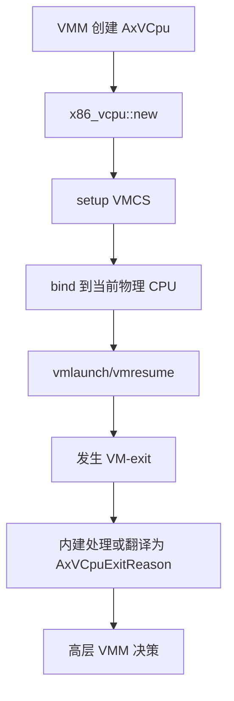
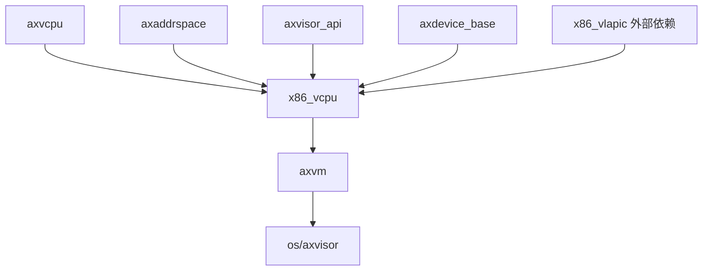

# `x86_vcpu` 技术文档

> 路径：`components/x86_vcpu`
> 类型：库 crate
> 分层：组件层 / x86 虚拟 CPU 后端
> 版本：`0.2.2`
> 文档依据：当前仓库源码、`Cargo.toml`、`README.md`、`src/lib.rs`、`src/vmx/*`、`src/regs/*`

`x86_vcpu` 是 Axvisor 所依赖的 ArceOS Hypervisor 体系中面向 x86_64 的架构后端，实现了基于 Intel VT-x/VMX 的 vCPU 执行引擎。它负责把 `axvcpu` 给出的抽象接口落到 x86 硬件虚拟化机制上，包括 VMXON、VMCS 初始化、vCPU 运行、VM-exit 解析、x2APIC 相关 MSR 拦截以及中断注入等。它不是完整的虚拟机管理器，但它是 x86 虚拟化执行面最核心的那一层。

## 1. 架构设计分析

### 1.1 设计定位

该 crate 的职责可以概括为三点：

- 实现 x86_64 架构下的 `AxArchVCpu`
- 实现每物理 CPU 的 VMX 启停逻辑
- 将 VMX exit 原因翻译成 `axvcpu::AxVCpuExitReason`

它不承担：

- VM 生命周期管理
- 访客内存布局组织
- 通用设备模型管理
- 调度多个 VM/vCPU 的系统级策略

这些职责分别位于 `axvm`、`axaddrspace`、`axdevice`、`os/axvisor` 等更高层。

### 1.2 模块划分

| 模块 | 作用 | 关键内容 |
| --- | --- | --- |
| `lib.rs` | feature 入口和公共导出 | 选择 `vmx` 路径、导出 `VmxArchVCpu`、`has_hardware_support` |
| `vmx/vcpu.rs` | vCPU 主实现 | `VmxVcpu`、setup、run、vmexit、注入事件 |
| `vmx/percpu.rs` | 每核 VMX 状态 | `VmxPerCpuState`、`vmxon` / `vmxoff` |
| `vmx/vmcs.rs` | VMCS 访问封装 | 字段读写、控制域配置、exit 信息解析 |
| `vmx/structs.rs` | VMX 内存结构 | `VmxRegion`、I/O bitmap、MSR bitmap、EPT pointer |
| `vmx/definitions.rs` | 常量与枚举 | exit reason、控制位、事件信息等 |
| `vmx/instructions.rs` | 特权指令辅助 | `invept` 等 |
| `regs/` | 通用寄存器布局与保存恢复 | `GeneralRegisters` 和汇编辅助 |
| `msr.rs` | MSR 常量与访问 | VMX 能力和常见寄存器读写 |
| `ept.rs` | EPT 相关辅助 | `GuestPageWalkInfo` 等辅助结构 |

### 1.3 `VmxVcpu`：核心状态载体

`VmxVcpu<H>` 是整个 crate 的中心结构。它内部聚合了：

- 客户机通用寄存器
- host 栈顶指针
- `launched` 状态
- `vmcs`
- I/O bitmap
- MSR bitmap
- `pending_events`
- `vlapic`
- `xstate`

其中几个字段的语义特别重要：

#### `vmcs`

每个 vCPU 一份 VMCS 区，负责保存：

- guest state
- host state
- execution controls
- exit/entry controls
- EPT pointer

#### `pending_events`

用于软件排队待注入的中断/异常事件。真正写入 VM-entry 注入字段发生在运行前的 `inject_pending_events()` 阶段。

#### `vlapic`

类型来自外部依赖 `x86_vlapic::EmulatedLocalApic`。这说明 LAPIC 虚拟化并不内嵌在本仓库内的独立 crate 中，而是作为外部组件由 `x86_vcpu` 调用。

#### `xstate`

负责 guest/host 间 XSAVE 相关上下文切换，保证启用扩展状态时客户机和宿主机的 XCR0/IA32_XSS 等状态不会互相污染。

### 1.4 `VmxPerCpuState`：每核硬件虚拟化开关

`VmxPerCpuState` 对应 `axvcpu::AxArchPerCpu`。它负责：

- 打开 CR4.VMXE
- 检查 VMX 能力 MSR
- 执行 `vmxon`
- 在退出时 `vmxoff`

这层设计说明：

- vCPU 是每个虚拟 CPU 的运行实体
- VMX 开关状态是每个物理 CPU 的宿主状态

两者被清晰分离。

### 1.5 VMCS 配置主线

`setup()` 的核心就是构建一个可运行的 VMCS。流程大致是：

1. 清理和装载 VMCS
2. 写 host state
3. 写 guest state
4. 配置 pin-based / primary / secondary controls
5. 安装 I/O bitmap 与 MSR bitmap
6. 写入 EPT pointer
7. 解绑并保留可供后续运行的状态

这里最关键的控制面包括：

- 使用 I/O bitmap
- 使用 MSR bitmap
- 开启 secondary controls
- 开启 EPT
- 开启 unrestricted guest

它们基本决定了该 vCPU 是一个可运行的现代 VMX 虚拟 CPU，而不是仅做极简演示。

### 1.6 VM-exit 处理分层

`x86_vcpu` 的 VM-exit 处理分成两层：

#### 内建处理层

先由 `builtin_vmexit_handler()` 消化一部分 exit，例如：

- interrupt window
- preemption timer
- `XSETBV`
- 某些 `CR_ACCESS`
- `CPUID`
- x2APIC 范围内的 MSR 读写

这一层的目标是把“已知且本后端自己能完全解决的 exit”在架构层内消化掉。

#### 协议翻译层

如果 exit 不能在本地完全处理，就继续翻译成 `AxVCpuExitReason` 上抛给 `axvm`/VMM，例如：

- `Hypercall`
- `IoRead` / `IoWrite`
- `SysRegRead` / `SysRegWrite`
- `ExternalInterrupt`
- `SystemDown`

这种两层结构有助于减少高层 VMM 需要理解的 x86/VMX 细节。

### 1.7 当前实现中的重要边界

有两点需要在文档里明确：

#### 仅 VMX 路径成熟

虽然 `Cargo.toml` 中声明了：

- `vmx`
- `svm`

但当前源码的完整实现只覆盖 Intel VMX。`svm` 更像占位 feature，而不是可用的 AMD SVM 后端。

#### EPT violation 尚未完整上抛

源码中已经有解析 EPT 相关信息的辅助逻辑，但 `run()` 并没有系统性地把 EPT violation 转换成统一的 `NestedPageFault` 风格退出。这意味着 x86 嵌套页错误路径在当前版本里还没有像 ARM/RISC-V 那样完全收束到统一协议层。

## 2. 核心功能说明

### 2.1 主要能力

- 检测 x86 VMX 硬件支持
- 启用和关闭每核 VMX 状态
- 创建与配置 VMCS
- 运行 vCPU 并处理 VM-exit
- 拦截和转发 I/O、MSR、x2APIC 相关访问
- 注入中断和异常事件
- 维护 guest/host 扩展状态切换

### 2.2 关键 API 语义

作为 `AxArchVCpu` 实现，它最关键的接口包括：

- `new()`
- `set_entry()`
- `set_ept_root()`
- `setup()`
- `run()`
- `bind()`
- `unbind()`
- `inject_interrupt()`
- `set_return_value()`

这些接口共同构成高层 `axvcpu` 调用架构后端的最小协议。

### 2.3 典型运行路径

### 2.4 与设备虚拟化的连接点

`x86_vcpu` 自己并不管理完整设备树，但它是若干设备模拟路径的重要入口：

- x2APIC MSR 访问会进入 `vlapic`
- I/O 端口访问会变成 `IoRead` / `IoWrite`
- 某些 MSR 访问会变成 `SysRegRead` / `SysRegWrite`

因此它扮演的是“CPU exit 解码与设备层之间的桥”。

## 3. 依赖关系图谱

### 3.1 直接依赖

| 依赖 | 作用 |
| --- | --- |
| `axvcpu` | 提供架构无关的 vCPU 抽象与退出协议 |
| `axaddrspace` | EPT 相关地址空间基础类型 |
| `ax-page-table-entry` | `MappingFlags` 等页表权限语义 |
| `memory_addr` | 地址类型基础 |
| `axdevice_base` | 设备读写抽象接口 |
| `axvisor_api` | VM/VCpu 标识与宿主侧接口 |
| `x86_vlapic` | 外部 LAPIC 模拟组件 |
| `x86` / `x86_64` / `raw-cpuid` | x86 硬件能力与寄存器操作 |

### 3.2 主要消费者

- `axvm`
- `os/axvisor`

当前仓库内，ArceOS 内核和 StarryOS 内核并不直接把它作为常规运行时依赖；它主要存在于 hypervisor 链路。

### 3.3 关系示意

## 4. 开发指南

### 4.1 集成前提

要在系统中启用 `x86_vcpu`，至少需要具备：

1. x86_64 平台
2. 硬件支持 VMX
3. 上层实现 `AxVCpuHal` / 相关物理内存接口
4. 能为 VMCS、bitmap、EPT 等对象提供可用的宿主资源

### 4.2 新增一个 VM-exit 处理路径

建议遵循如下顺序：

1. 先在 `vmcs.rs` / `definitions.rs` 中确认 exit 信息解析无误
2. 判断该 exit 应在内建层处理还是上抛高层
3. 若上抛，映射为现有 `AxVCpuExitReason`
4. 若现有协议不足，再考虑扩展 `axvcpu` 层统一退出类型

### 4.3 维护时的重点

- VMCS 控制位变更必须与 Intel VMX 能力 MSR 兼容
- I/O bitmap 和 MSR bitmap 的默认策略会直接影响客户机可见行为
- 涉及 `launched`、bind/unbind、host/guest xstate 切换的修改需要极其谨慎
- 若补全 EPT violation 的上抛逻辑，应同步校对 `axvm` 对 x86 退出原因的处理能力

## 5. 测试策略

### 5.1 当前测试面

源码内已经有一批不依赖真实 VMX 运行的单元测试，主要覆盖：

- 位定义
- 结构体布局
- 一些辅助对象与寄存器逻辑
- `MockMmHal` 支撑下的部分 VMX 状态初始化路径

### 5.2 需要集成测试覆盖的部分

以下内容很难靠纯单测保证：

- `vmxon` / `vmxoff`
- `vmlaunch` / `vmresume`
- 真正的 VM-exit 行为
- EPT 与中断注入的硬件交互

这些更适合在支持嵌套虚拟化的 QEMU/真机环境中进行集成测试。

### 5.3 当前文档应显式提示的风险

- `svm` 目前不是成熟实现
- `APIC_ACCESS` 等部分路径仍未完全实现
- EPT violation 的统一退出语义还不完整
- `x86_vlapic` 为外部依赖，不在本仓库源码中，排查 LAPIC 相关行为时需要跨仓库联动

## 6. 跨项目定位分析

| 项目 | 位置 | 角色 | 核心作用 |
| --- | --- | --- | --- |
| ArceOS | Hypervisor 扩展链中的 x86 后端 | x86 架构虚拟 CPU 执行层 | 当 ArceOS 作为 Axvisor 宿主时，为 x86 VM 提供 VMX 级执行能力 |
| StarryOS | 当前仓库中无直接常规依赖 | 间接相关基础件 | StarryOS 若未来接入同一 hypervisor 栈，可通过 `axvm`/`axvcpu` 间接使用它 |
| Axvisor | x86 虚拟化执行核心 | x86 vCPU 后端实现 | 与 `axvm`、`axaddrspace`、`axdevice` 等共同组成 x86 客户机执行面 |

## 7. 总结

`x86_vcpu` 是整个虚拟化栈里最“贴硬件”的组件之一。它把 `axvcpu` 的统一抽象落实为 Intel VMX 的实际执行流程，并把大量 x86 专有的 VMCS、MSR、x2APIC、EPT 细节收拢在架构后端内部。对 Axvisor 而言，它不是可选增强件，而是 x86 客户机能否真正跑起来的关键执行引擎。
