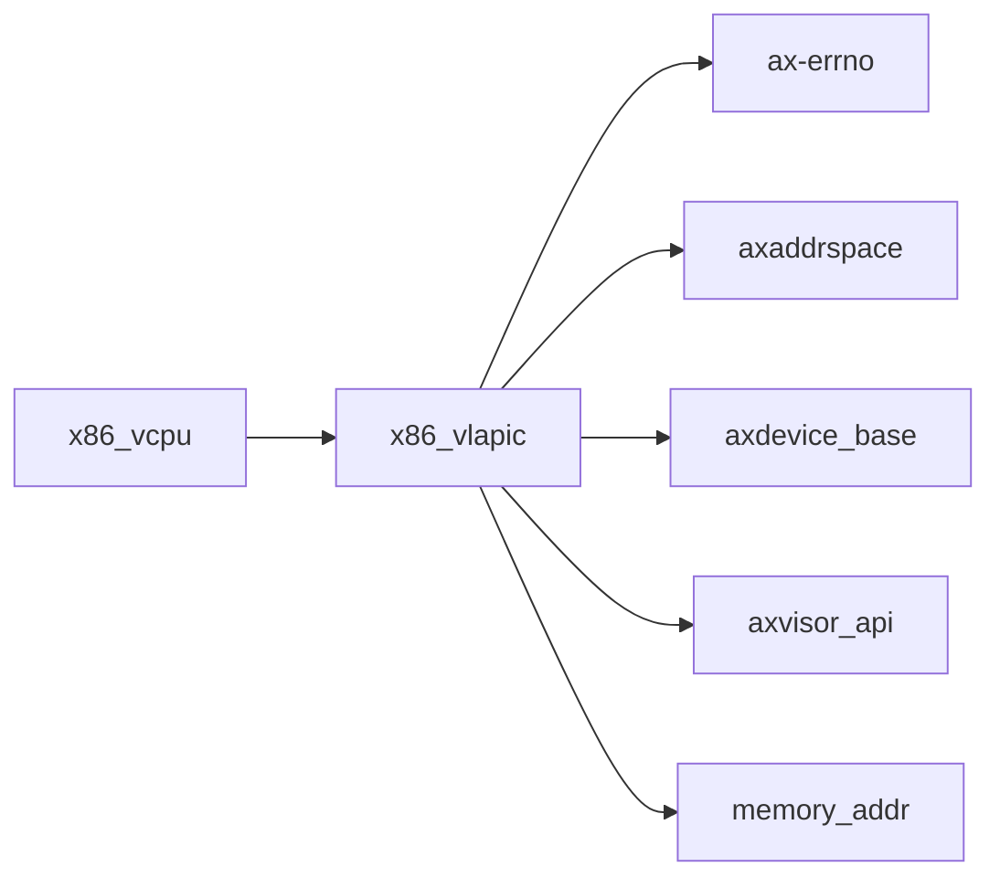

# `x86_vlapic` 技术文档

> 路径：`components/x86_vlapic`
> 类型：库 crate
> 分层：组件层 / 可复用基础组件
> 版本：`0.4.2`
> 文档依据：当前仓库源码、`Cargo.toml` 与 `components/x86_vlapic/README.md`

`x86_vlapic` 的核心定位是：x86 Virtual Local APIC

## 1. 架构设计分析
- 目录角色：可复用基础组件
- crate 形态：库 crate
- 工作区位置：根工作区
- feature 视角：该 crate 没有显式声明额外 Cargo feature，功能边界主要由模块本身决定。
- 关键数据结构：可直接观察到的关键数据结构/对象包括 `APICAccessPage`、`EmulatedLocalApic`、`ApicTimer`、`VirtualApicRegs`、`ApicRegOffset`、`ReadOnly`、`ReadWrite`、`WriteOnly`、`VIRTUAL_APIC_ACCESS_PAGE`、`APIC_LVT_M` 等（另有 1 个关键类型/对象）。
- 设计重心：该 crate 多数是寄存器级或设备级薄封装，复杂度集中在 MMIO 语义、安全假设和被上层平台/驱动整合的方式。

### 1.1 内部模块划分
- `consts`：内部子模块
- `regs`：内部子模块
- `timer`：定时器队列和超时唤醒路径
- `utils`：Find the last (most significant) bit set in a 32-bit value. Bits are numbered starting at 0 (the least significant bit). A return value of INVALID_BIT_INDEX indicates that the inp…
- `vlapic`：内部子模块

### 1.2 核心算法/机制
- 定时器触发、截止时间维护和延迟队列

## 2. 核心功能说明
- 功能定位：x86 Virtual Local APIC
- 对外接口：从源码可见的主要公开入口包括 `new`、`virtual_apic_access_addr`、`virtual_apic_page_addr`、`as_usize`、`read_lvt`、`write_lvt`、`read_icr`、`write_icr`、`APICAccessPage`、`EmulatedLocalApic` 等（另有 3 个公开入口）。
- 典型使用场景：提供寄存器定义、MMIO 访问或设备级操作原语，通常被平台 crate、驱动聚合层或更高层子系统进一步封装。
- 关键调用链示例：按当前源码布局，常见入口/初始化链可概括为 `new()` -> `start_timer()` -> `test_lvt_register_operations()` -> `test_divide_configuration_register()`。

## 3. 依赖关系图谱


### 3.1 直接与间接依赖
- `ax-errno`
- `axaddrspace`
- `axdevice_base`
- `axvisor_api`
- `memory_addr`

### 3.2 间接本地依赖
- `ax-cpumask`
- `ax-crate-interface`
- `ax-memory-set`
- `ax-page-table-entry`
- `ax-page-table-multiarch`
- `axvisor_api_proc`
- `axvmconfig`
- `lazyinit`

### 3.3 被依赖情况
- `x86_vcpu`

### 3.4 间接被依赖情况
- `axvisor`
- `axvm`

### 3.5 关键外部依赖
- `bit`
- `log`
- `paste`
- `tock-registers`

## 4. 开发指南
### 4.1 依赖配置
```toml
[dependencies]
x86_vlapic = { workspace = true }

# 如果在仓库外独立验证，也可以显式绑定本地路径：
# x86_vlapic = { path = "components/x86_vlapic" }
```

### 4.2 初始化流程
1. 先明确该设备/寄存器组件的调用上下文，是被平台 crate 直接使用还是被驱动聚合层再次封装。
2. 修改寄存器位域、初始化顺序或中断相关逻辑时，应同步检查 `unsafe` 访问、访问宽度和副作用语义。
3. 尽量通过最小平台集成路径验证真实设备行为，而不要只依赖静态接口检查。

### 4.3 关键 API 使用提示
- 优先关注函数入口：`new`、`virtual_apic_access_addr`、`virtual_apic_page_addr`、`as_usize`、`read_lvt`、`write_lvt`、`read_icr`、`write_icr` 等（另有 17 项）。
- 上下文/对象类型通常从 `APICAccessPage`、`EmulatedLocalApic`、`ApicTimer`、`VirtualApicRegs` 等结构开始。

## 5. 测试策略
### 5.1 当前仓库内的测试形态
- 存在单元测试/`#[cfg(test)]` 场景：`src/timer.rs`、`src/utils.rs`。

### 5.2 单元测试重点
- 建议覆盖寄存器位域、设备状态转换、边界参数和 `unsafe` 访问前提。

### 5.3 集成测试重点
- 建议结合最小平台或驱动集成路径验证真实设备行为，重点检查初始化、中断和收发等主线。

### 5.4 覆盖率要求
- 覆盖率建议：寄存器访问辅助函数和关键状态机保持高覆盖；真实硬件语义以集成验证补齐。

## 6. 跨项目定位分析
### 6.1 ArceOS
当前未检测到 ArceOS 工程本体对 `x86_vlapic` 的显式本地依赖，若参与该系统，通常经外部工具链、配置或更底层生态间接体现。

### 6.2 StarryOS
当前未检测到 StarryOS 工程本体对 `x86_vlapic` 的显式本地依赖，若参与该系统，通常经外部工具链、配置或更底层生态间接体现。

### 6.3 Axvisor
`x86_vlapic` 主要通过 `axvisor` 等上层 crate 被 Axvisor 间接复用，通常处于更底层的公共依赖层。
