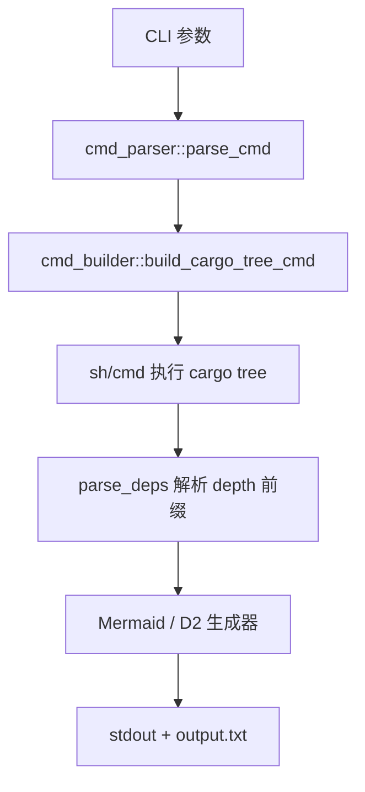

# `deptool` 技术文档

> 路径：`os/arceos/tools/deptool`
> 类型：库 + 二进制混合 crate
> 分层：ArceOS 层 / 宿主侧依赖图辅助工具
> 版本：`0.1.0`
> 文档依据：`Cargo.toml`、`src/lib.rs`、`src/main.rs`、`src/cmd_parser.rs`、`src/cmd_builder.rs`、`src/mermaid_generator.rs`、`src/d2_generator.rs`、`README.md`

`deptool` 是一个很轻量的 ArceOS 依赖图辅助工具。它的真实工作方式并不复杂：先根据目标名称拼出 `cargo tree` 命令，再解析 `--prefix depth` 的输出，最后把 ArceOS 内部节点整理成 Mermaid 或 D2 文本。它不是构建系统，也不是工作区级依赖分析框架，而是一个围绕 `cargo tree` 的后处理脚本型工具。

## 1. 架构设计分析
### 1.1 设计定位
从源码结构看，`deptool` 的职责非常聚焦：

- 解析命令行参数
- 生成 `cargo tree` 调用命令
- 运行外部命令获取依赖树
- 过滤 ArceOS 内部节点
- 输出 Mermaid 或 D2 图描述

它没有自己的依赖解析器，也不读取 Cargo metadata；真正的依赖求解仍然交给 Cargo。

### 1.2 模块分工
当前实现只包含四个核心模块：

- `cmd_parser`：解析命令行、判断目标位置、构造 `Config`
- `cmd_builder`：拼接 `cargo tree` 命令字符串
- `mermaid_generator`：把层级依赖树转换为 Mermaid 边列表
- `d2_generator`：把层级依赖树转换为 D2 边列表

`lib.rs` 则负责把这几部分串起来：

1. 执行命令
2. 解析输出
3. 生成图文本
4. 打印并写入文件

### 1.3 真实执行链路
`deptool` 当前的执行流程可以概括为：



### 1.4 依赖图生成算法
图生成逻辑本身比较朴素，但是真实实现里有两个关键点：

- `cargo tree` 使用 `--format {p} --prefix depth` 输出，每行前缀中自带层级深度。
- 生成器用 `lastest_dep_map` 记录每个深度上的最近父节点，用 `parsed_crates` 避免对已展开节点重复深入。

这意味着它输出的不是 Cargo 完整原始树，而是“裁剪过重复子树后的 ArceOS 内部依赖边”。

### 1.5 当前实现对目录结构的假设
`cmd_parser.rs` 里把目标根目录硬编码为：

- `../../apps/`
- `../../crates/`
- `../../modules/`
- `../../ulib/`

并通过这些相对路径判断目标名称属于 app、crate、module 还是 ulib。这个设计说明：

- 它面向的是特定目录布局的 ArceOS 源树
- 不是根工作区通用工具
- 也不是通过 Cargo workspace 元数据自动发现目标

在当前 TGOSKits 树形中，`modules/` 和 `ulib/` 仍然存在，但 `apps/`、`crates/` 相关逻辑保留了较强的历史布局假设。

## 2. 核心功能说明
### 2.1 主要功能
- 根据给定目标生成 `cargo tree` 查询命令。
- 过滤出 ArceOS 内部依赖节点。
- 输出 Mermaid 或 D2 格式的依赖图文本。
- 既可作为二进制执行，也可作为简单库调用。

### 2.2 命令行接口
根据 `cmd_parser.rs`，当前 CLI 主要支持：

- `-t, --target`：目标 crate/module/app/lib 名称
- `-o, --format`：`mermaid` 或 `d2`
- `-f, --name`：附加 features
- `-d, --no-default`：关闭默认 feature
- `-s, --save-path`：保存路径

其中最真实的细节有两个：

- `build_cargo_tree_cmd()` 实际拼出的命令是  
  `cargo tree -e normal,build --format {p} --prefix depth`
- `features` 最终被拼成 `-F feature1 feature2 ...`

### 2.3 当前输出行为
虽然 `Config` 中保存了 `output_loc`，但 `output_deps_graph()` 当前实际固定写入 `output.txt`。也就是说，保存路径参数在当前实现里还没有真正传递到最终输出函数。

### 2.4 与构建工具的边界
`deptool` 只做“依赖图可视化文本生成”，并不：

- 生成配置文件
- 执行构建
- 启动 QEMU
- 管理镜像

它和 `axbuild`、`tg-xtask` 完全不是同一类工具。

## 3. 依赖关系图谱
```mermaid
graph LR
    user["开发者"] --> deptool["deptool"]
    deptool --> cargo_tree["cargo tree"]
    cargo_tree --> graph["Mermaid / D2 文本"]
```

### 3.1 关键直接依赖
- `clap`：CLI 参数解析。

### 3.2 关键外部依赖
- `cargo tree`：真正的依赖树求解器。
- shell（`sh` 或 `cmd`）：执行命令的宿主环境。

### 3.3 关键直接消费者
`deptool` 的主要消费者是开发者本人，而不是其他 crate。库接口虽然存在，但设计上仍以命令行使用为主。

## 4. 开发指南
### 4.1 适合在这里修改的内容
- 目标路径解析规则
- `cargo tree` 命令拼装
- Mermaid / D2 生成格式
- 输出文件策略

### 4.2 修改时的关键约束
1. 先确认目录布局假设是否仍和目标仓库一致。
2. 若要支持新的目录层级，优先修改 `cmd_parser` 的根路径与目标识别逻辑。
3. 若要改图结构，先理解 `parsed_crates` 与 `lastest_dep_map` 的去重/父子关系维护方式。
4. 若要真正支持自定义输出路径，需要同时修改 `Config` 与 `output_deps_graph()`。
5. 不要把构建编排逻辑塞进 `deptool`，它应保持为依赖可视化辅助工具。

### 4.3 推荐验证路径
- 先直接看拼出的 `cargo tree` 命令是否正确。
- 再用一个简单 module 或 ulib 目标生成 Mermaid 文本。
- 最后确认输出文件内容与 stdout 一致。

## 5. 测试策略
### 5.1 当前测试形态
当前 crate 没有显式单元测试或集成测试。

### 5.2 建议重点验证
- 目录存在/不存在时的目标解析
- `cargo tree` 输出解析的层级正确性
- 重复子树裁剪逻辑
- Mermaid 与 D2 两种输出格式
- 保存路径行为是否符合预期

### 5.3 集成测试建议
- 选一个 `module` 目标验证最小路径
- 选一个 `ulib` 目标验证 feature 传参路径
- 若修复目录布局假设，还应增加 app/crate 路径的真实回归

### 5.4 高风险改动
- 硬编码目录路径
- `cargo tree` 输出格式假设
- 去重与父节点映射逻辑
- 输出文件路径处理

## 6. 跨项目定位分析
### 6.1 ArceOS
`deptool` 明确服务于 ArceOS 目录树本身，用于快速观察模块或库之间的依赖关系，是开发辅助工具而不是构建基础设施。

### 6.2 StarryOS
当前实现并不面向 StarryOS 根目录或工作区全局结构设计，因此它不是 StarryOS 的通用工具。

### 6.3 Axvisor
同样地，`deptool` 也不是 Axvisor 工具链的一部分；它既不理解 Axvisor 的配置模型，也不参与其构建与测试流程。
