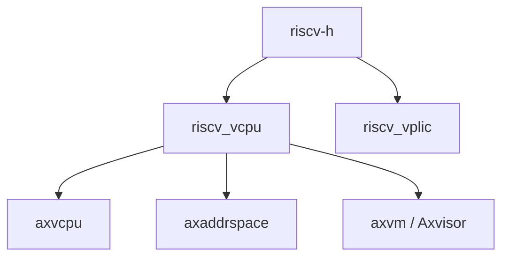

# `riscv-h` 技术文档

> 路径：`components/riscv-h`
> 类型：库 crate
> 分层：组件层 / RISC-V H 扩展寄存器封装层
> 版本：`0.2.0`
> 文档依据：当前仓库源码、`Cargo.toml`、`README.md`、`src/lib.rs`、`src/register/mod.rs`、`src/register/hypervisorx64/*`

`riscv-h` 是 RISC-V 虚拟化栈最底层的 CSR 封装库，专门负责 Hypervisor Extension 相关寄存器的类型化访问。它不实现 vCPU，不实现中断控制器，不实现页表，也不参与 VM 生命周期管理；它只把 H 扩展和 VS 级 CSR 的位语义、读写接口和辅助方法收拢为一个独立 crate，供 `riscv_vcpu`、`riscv_vplic` 等上层组件调用。

## 1. 架构设计分析

### 1.1 设计定位

如果把 RISC-V 虚拟化栈分层，可以大致理解为：

- `riscv-h`：CSR 寄存器定义层
- `riscv_vcpu`：vCPU 执行与退出处理层
- `riscv_vplic`：虚拟中断控制器层
- `axaddrspace`：访客地址空间与嵌套页表层

`riscv-h` 位于最底部，属于典型的“硬件寄存器语言层”。

### 1.2 模块划分

| 模块 | 作用 | 关键内容 |
| --- | --- | --- |
| `lib.rs` | 顶层入口 | 导出 `register` 子模块 |
| `register/mod.rs` | H 扩展寄存器总入口 | 汇总 hypervisor 与 VS 级寄存器模块 |
| `register/hypervisorx64/mod.rs` | RV64 H 扩展寄存器集合 | 按 CSR 划分的独立模块 |
| `register/hypervisorx64/*.rs` | 单寄存器实现 | 位字段、读写函数、辅助枚举 |

当前实现集中在 `hypervisorx64` 目录，也就是面向 RV64 的 H 扩展语义。

### 1.3 实现模式

本 crate 的实现模式高度统一：

- 为某个 CSR 定义一个 `usize` 封装结构或直接暴露 `usize` 读写函数
- 用 `bit_field` 做位提取和写入
- 用 `riscv` crate 提供的宏生成 `read` / `write` / `set` / `clear`
- 对较复杂的 CSR 再补充枚举和值语义包装

这种模式带来的好处是：

- 各 CSR 模块风格一致
- 上层代码可直接按寄存器语义调用，而不是手写位运算
- 更容易补齐新 CSR 或对照规范核查实现

### 1.4 关键寄存器类别

#### 运行模式与权限类

- `hstatus`
- `vsstatus`
- `hcounteren`

它们负责描述 hypervisor/virtual supervisor 运行级别、权限和部分执行上下文。

#### 地址翻译类

- `hgatp`
- `vsatp`

其中 `hgatp` 尤其关键，因为它决定了 guest physical address 到 host physical address 的二阶段翻译根指针与模式。

#### 陷阱与委托类

- `hedeleg`
- `hideleg`
- `htval`
- `htinst`
- `vscause`
- `vstval`

这些寄存器是 vCPU trap/exit 路径的重要原始信息来源。

#### 虚拟中断类

- `hip`
- `hie`
- `hvip`
- `hgeie`

其中 `hvip` 是软件向 guest 注入 VS 级 pending 中断的重要寄存器接口。

### 1.5 `hstatus` 与 `hgatp` 的代表性意义

#### `hstatus`

`hstatus` 负责描述 hypervisor 运行上下文的一组核心状态位，包括：

- 虚拟 supervisor 执行宽度
- 虚拟化陷阱控制
- 一些权限与访存相关位

它通常出现在 vCPU 上下文保存恢复和特权级切换路径中。

#### `hgatp`

`hgatp` 是 H 扩展页表路径中最关键的寄存器之一，编码内容包括：

- 模式
- VMID
- 根页表物理页号

它决定 hypervisor 侧的二阶段地址翻译是否启用以及启用方式，因此与 `axaddrspace`、`riscv_vcpu` 的内存路径直接相关。

### 1.6 设计边界

需要明确：

- `riscv-h` 不负责保存完整 vCPU 状态对象
- 不负责 trap 分发
- 不负责页表项或地址空间组织
- 不负责虚拟中断控制器逻辑

它只是提供“这些 CSR 应该怎样安全、清晰地访问”的基础语义。

## 2. 核心功能说明

### 2.1 主要能力

- 封装 RISC-V H 扩展和 VS 级 CSR
- 为关键 CSR 提供位字段访问接口
- 提供 `read` / `write` / `set_*` / `clear_*`
- 为部分 CSR 提供枚举化模式和值语义

### 2.2 典型使用场景

| 场景 | 使用方式 |
| --- | --- |
| vCPU 上下文保存恢复 | 读取或写回 `hstatus`、`vsstatus`、`vsatp` 等 |
| 二阶段页表切换 | 写 `hgatp` |
| trap 原因提取 | 读取 `htval`、`htinst`、`vscause`、`vstval` |
| 虚拟中断注入 | 设置或清除 `hvip` 对应位 |
| 委托初始化 | 初始化 `hedeleg`、`hideleg` |

### 2.3 与上层的调用主线

最典型的两条调用链是：

#### `riscv_vcpu`

- 启动每核虚拟化环境时配置 `hedeleg`、`hideleg`、`hvip`
- 运行 guest 前后保存恢复 `hstatus`、`vs*` CSR
- trap 后读取 `htval` / `htinst` / `vscause` 等信息
- 切换或临时改写 `vsatp` / `hgatp`

#### `riscv_vplic`

- 在虚拟 PLIC 注入外部中断时，通过 `hvip::set_vseip()` / `clear_vseip()` 控制 guest 可见的 VS 外部中断 pending 状态

## 3. 依赖关系图谱

### 3.1 直接依赖

| 依赖 | 作用 |
| --- | --- |
| `riscv` | CSR 读写宏和底层寄存器支持 |
| `bit_field` | 位字段访问 |
| `bitflags` | 某些寄存器位语义表达 |
| `bare-metal` | 底层寄存器辅助能力 |
| `log` | 调试与日志 |

### 3.2 主要消费者

- `riscv_vcpu`
- `riscv_vplic`

### 3.3 关系示意

### 3.4 集成注意点

当前仓库内消费者对 `riscv-h` 的版本约束并不完全一致：

- `riscv_vcpu` 依赖 `0.2`
- `riscv_vplic` 依赖 `0.1`

在 workspace/path 覆盖存在时问题通常不大，但从文档角度看，这说明依赖链版本演进并非完全同步，后续若单独拆分发布或升级时应重点关注。

## 4. 开发指南

### 4.1 新增一个 CSR 封装

推荐遵循现有模式：

1. 新建对应 CSR 模块
2. 选择是定义 `usize` 封装结构，还是仅提供原始读写函数
3. 用 `riscv` 宏生成 `read` / `write`
4. 用 `bit_field` 实现字段访问
5. 若寄存器有明确枚举值，再补充语义枚举

### 4.2 维护时的关注点

- CSR 编号必须与规范保持一致
- 字段位宽和位偏移必须严格核对
- `unsafe write()` 的调用约束要保持清晰
- 若 README 示例与源码 API 命名不一致，应优先以源码为准并及时修正文档

### 4.3 与上层协作时的边界

- vCPU 状态保存恢复逻辑应留在 `riscv_vcpu`
- 二阶段页表组织应留在 `axaddrspace`
- 中断控制器状态机应留在 `riscv_vplic`

不要把上层行为塞回 CSR 封装层，否则这个 crate 会失去清晰边界。

## 5. 测试策略

### 5.1 当前测试覆盖

源码中已经存在一批围绕位字段和 `from_bits` 行为的测试，主要验证：

- 某些 CSR 的字段提取与写回
- 枚举值解析
- Debug/格式化等基础语义

这类测试适合该 crate 的定位，因为它本质上是寄存器包装库。

### 5.2 推荐继续补充的测试

- 更多 CSR 的位边界测试
- `hvip`、`hip`、`hideleg` 等常用虚拟化寄存器的行为测试
- `htimedelta` 这类复合 CSR 的读写一致性测试
- README 示例与真实 API 的编译一致性检查

### 5.3 风险点

- CSR 位定义错一位，就会在上层表现为非常隐蔽的 trap 或中断异常
- 该 crate 太底层，很多错误不会在本层显式暴露，而是在 `riscv_vcpu` 或 guest 运行时才体现
- 一旦规范版本变化，寄存器语义可能需要成批更新

## 6. 跨项目定位分析

| 项目 | 位置 | 角色 | 核心作用 |
| --- | --- | --- | --- |
| ArceOS | RISC-V hypervisor 扩展链底层 | H 扩展 CSR 语言层 | 当 ArceOS 承载 Axvisor/分区虚拟化能力时，为 RISC-V 虚拟化提供寄存器基础语义 |
| StarryOS | 当前仓库中无直接主线依赖 | 潜在复用底件 | 若未来 StarryOS 接入 RISC-V H 扩展虚拟化，可直接复用该 CSR 封装层 |
| Axvisor | RISC-V 虚拟化最底层公共件 | CSR 封装基础库 | `riscv_vcpu`、`riscv_vplic` 等更高层组件都依赖它表达 H 扩展寄存器语义 |

## 7. 总结

`riscv-h` 的价值不在于“它做了多少逻辑”，而在于它把最底层、最脆弱、最不适合分散实现的 H 扩展 CSR 语义集中封装起来。对 RISC-V 虚拟化栈来说，它是寄存器级公共词汇表；没有它，`riscv_vcpu` 和 `riscv_vplic` 这类组件将不得不重复处理大量裸位运算和 CSR 细节。
