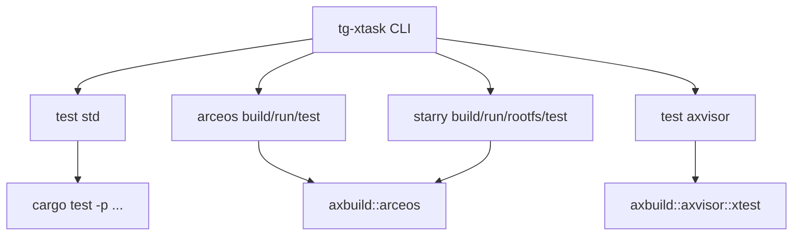
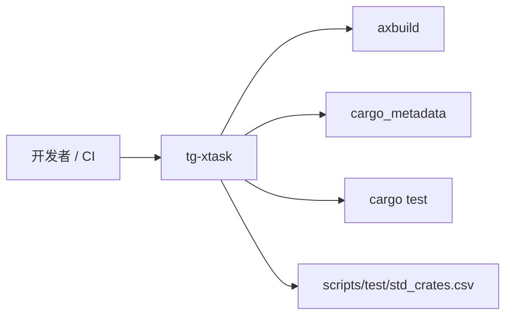

# `tg-xtask` 技术文档

> 路径：`xtask`
> 类型：二进制 crate
> 分层：工具层 / 根工作区统一命令入口
> 版本：`0.3.0-preview.3`
> 文档依据：`Cargo.toml`、`src/main.rs`、`src/arceos/mod.rs`、`src/arceos/build.rs`、`src/arceos/run.rs`、`src/starry/mod.rs`、`src/starry/build.rs`、`src/starry/run.rs`、`src/axvisor/mod.rs`

`tg-xtask` 是整个 TGOSKits 根工作区的宿主侧命令入口。它不负责底层构建实现，也不属于任何目标镜像；它的核心职责是把 ArceOS、StarryOS、Axvisor 的常用构建/运行/测试操作收敛成统一 CLI，并把实际执行委托给 `axbuild` 或少量工作区内辅助逻辑。

## 1. 架构设计分析
### 1.1 设计定位
从 `src/main.rs` 可以看出，`tg-xtask` 是一个非常典型的“命令分发器”：

- 负责解析 CLI
- 负责发现工作区包和测试包
- 负责组装各子系统需要的参数
- 负责把真正构建执行交给 `axbuild` 或子模块

因此它更接近“统一前台入口”，而不是“构建后端”。

### 1.2 顶层命令结构
当前 CLI 只有三个顶层动作族：

- `test`
  - `std`
  - `axvisor`
  - `starry`
  - `arceos`
- `arceos`
  - `build`
  - `run`
- `starry`
  - `build`
  - `run`
  - `rootfs`
  - `img`（已废弃，转发到 `rootfs`）

可以看到，`tg-xtask` 主要覆盖“根工作区统一维护任务”和“ArceOS/StarryOS 的用户常用动作”；Axvisor 目前只在 `test axvisor` 上接入。

### 1.3 真实执行链路
不同子命令背后的真实实现路径并不相同：

这张图说明了一个关键事实：`tg-xtask` 本身并不直接处理构建细节，除了 `std` 测试这类非常简单的循环调用。

### 1.4 `test std` 的真实行为
`run_std_test_command()` 的实现非常具体：

1. 通过 `cargo_metadata` 获取当前工作区成员
2. 读取 `scripts/test/std_crates.csv`
3. 校验 CSV 中的包名是否都属于当前工作区，且没有重复
4. 对每个包顺序执行 `cargo test -p <package>`
5. 汇总失败列表并最终返回错误

这说明 `test std` 不是“跑所有支持 `std` 的 crate”，而是“跑 CSV 白名单中的 crate”。

### 1.5 `test arceos` 的真实行为
`run_arceos_test_command()` 会：

- 通过 `cargo_metadata` 自动发现 `test-suit/arceos` 下的工作区包
- 可选按 target triple 解析目标架构
- 为每个包构造 `arceos::RunArgs`
- 对 AArch64 测试自动倾向启用 `plat_dyn`
- 使用 `RunScope::PackageRoot` 逐个执行 QEMU 测试

这意味着 ArceOS 测试不是写死的包列表，而是“目录发现 + 统一运行模板”。

### 1.6 StarryOS 路径的特殊性
StarryOS 子命令在复用 `axbuild` 的同时，增加了两层 Starry 专属逻辑：

- `rootfs`：根据架构准备默认磁盘镜像
- `Starry::test_qemu()`：为 `starryos-test` 注入默认 success/fail 正则，并在必要时自动准备 rootfs

所以 `tg-xtask` 在 StarryOS 侧并不是简单转发，而是做了少量系统特定编排。

## 2. 核心功能说明
### 2.1 主要功能
- 作为根工作区统一 CLI 入口
- 统一封装 ArceOS 的构建、运行和测试动作
- 统一封装 StarryOS 的构建、运行、rootfs 准备和测试动作
- 驱动 Axvisor 的标准 QEMU 测试入口
- 维护 `std` crate 白名单测试流程

### 2.2 与 `axbuild` 的关系
`tg-xtask` 和 `axbuild` 容易一起提，但二者职责完全不同：

- `tg-xtask`：命令行入口、参数解析、目录发现、工作区级调度
- `axbuild`：真正的宿主侧构建库、QEMU 编排库、配置生成后端

一般来说：

- 要改 CLI 体验，优先看 `tg-xtask`
- 要改底层构建与 QEMU 行为，优先看 `axbuild`

### 2.3 构建期与运行期边界
`tg-xtask` 是纯宿主侧工具：

- 只在开发机/CI 上运行
- 不会被编入 ArceOS、StarryOS、Axvisor 目标镜像
- 不参与运行时初始化和系统服务提供

这是理解它定位的最关键一点。

## 3. 依赖关系图谱

### 3.1 关键直接依赖
- `axbuild`：绝大多数构建/运行能力都委托给它。
- `cargo_metadata`：工作区包发现与验证。
- `clap`：CLI 参数解析。
- `tokio`：异步主入口，用于执行异步构建/测试路径。

### 3.2 关键直接消费者
`tg-xtask` 是终端入口，本身通常不作为其他 crate 的库依赖；它的消费者是开发者、脚本和 CI。

### 3.3 关键外部资源
- `scripts/test/std_crates.csv`：`test std` 的数据源
- `test-suit/arceos`：`test arceos` 的包发现范围
- `os/axvisor`：Axvisor 测试的工作目录

## 4. 开发指南
### 4.1 适合在这里修改的内容
- CLI 子命令结构
- 参数解析与默认值
- 工作区包/测试包发现逻辑
- 与 `axbuild` 之间的参数拼装
- `std` 测试白名单读取与校验

### 4.2 修改时的关键约束
1. 不要把真正的构建细节下沉到 `tg-xtask`，这会和 `axbuild` 职责重叠。
2. 涉及 `test std` 时，要同时考虑 CSV 解析、工作区成员校验和失败汇总行为。
3. 涉及 `test arceos` 时，要保留基于 `test-suit/arceos` 的自动发现能力。
4. 涉及 StarryOS 时，要一并考虑 rootfs 准备和 success/fail regex 逻辑。
5. 新增顶层命令时，要先判断它是根工作区通用动作，还是某个子系统私有工具。

### 4.3 推荐验证路径
- 纯参数级改动：先跑对应子命令的帮助和最小路径。
- `test std` 改动：至少验证 CSV 合法和非法两种情况。
- `arceos` / `starry` 改动：至少做一次构建和一次运行或测试。
- Axvisor 路径改动：至少确认能把控制权正确交给 `axbuild::axvisor::xtest`。

## 5. 测试策略
### 5.1 当前测试形态
当前 `xtask/src` 下没有独立单元测试；验证主要依赖命令自身的实际执行。

### 5.2 建议重点验证
- `std` CSV 解析错误处理
- ArceOS 测试包自动发现
- target triple 到架构的转换
- StarryOS rootfs 默认路径和测试正则
- Axvisor 测试入口是否能正确切换工作目录

### 5.3 集成测试建议
- `cargo xtask test`
- `cargo xtask arceos build -p <pkg>`
- `cargo xtask arceos run -p <pkg>`
- `cargo xtask starry rootfs`
- `cargo arceos test qemu --target <triple>`

### 5.4 高风险改动
- 白名单测试机制
- 自动发现测试包的目录规则
- StarryOS rootfs 和测试逻辑
- 向 `axbuild` 传递参数的适配层

## 6. 跨项目定位分析
### 6.1 ArceOS
对 ArceOS 来说，`tg-xtask` 是根工作区最常用的构建与测试前台入口，负责把日常开发动作收敛成统一命令。

### 6.2 StarryOS
对 StarryOS 来说，`tg-xtask` 在统一命令之外还承担了 rootfs 准备和测试包装职责，因此比 ArceOS 路径多了一层系统特定编排。

### 6.3 Axvisor
当前 `tg-xtask` 对 Axvisor 的支持主要体现在测试入口统一化：它把根工作区的 `test axvisor` 动作接到 `axbuild::axvisor::xtest`，但不会替代 Axvisor 自己更完整的宿主工具体系。
