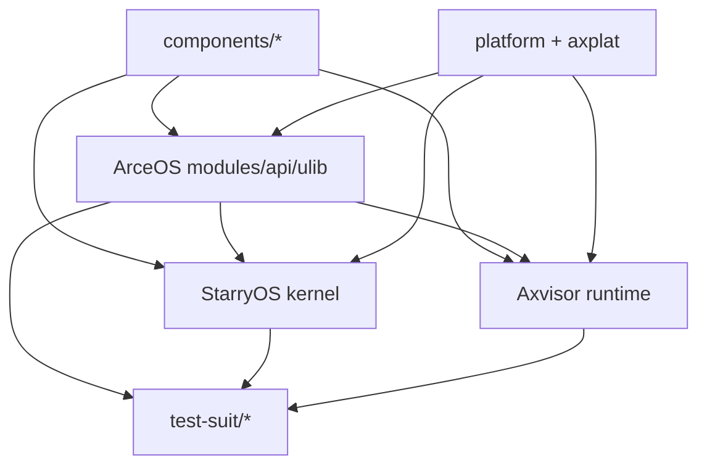

# 架构与组件层次

当前仓库最重要的设计事实：**组件如何沿着三套系统传播**。

## 六类核心层次

| 路径 | 角色 | 典型内容 |
|------|------|---------|
| `components/` | 独立可复用 crate | 锁、页表、虚拟化组件、工具库（140+） |
| `os/arceos/modules/` | ArceOS 内核模块 | `ax-hal`、`ax-task`、`ax-net`、`ax-fs` |
| `os/arceos/api/` | feature 与 API 聚合 | `ax-feat`、`ax-api` |
| `os/arceos/ulib/` | 用户侧库 | `ax-std`、`ax-libc` |
| `os/StarryOS/kernel/` | StarryOS 内核逻辑 | syscall、进程、信号、内存管理 |
| `os/axvisor/` | Hypervisor 运行时与配置 | `src/`、`configs/board/`、`configs/vms/` |

辅助层：

- `platform/` 与 `components/axplat_crates/*` — 平台实现
- `test-suit/*` — 系统级测试入口

## 依赖流向

## 开发者判断规则

| 改动位置 | 影响范围 | 验证策略 |
|----------|---------|---------|
| `components/` | 跨系统基础设施 | 优先按"三套系统都可能受影响"处理 |
| `os/arceos/modules/` | ArceOS + 上游系统 | 不要只测 ArceOS |
| `os/StarryOS/kernel/` | StarryOS | 重点关注 rootfs 和 Linux 兼容行为 |
| `os/axvisor/` | Axvisor | 代码、配置和镜像要一起验证 |

## 相关文档

- [组件开发指南](/docs/design/reference/components) — 组件修改与验证的完整说明
- [依赖图全量分析](/docs/design/reference/tgoskits-dependency) — 149 个 crate 的依赖关系
- [系统关系](../../introduction/guest) — 三套系统的关系说明
