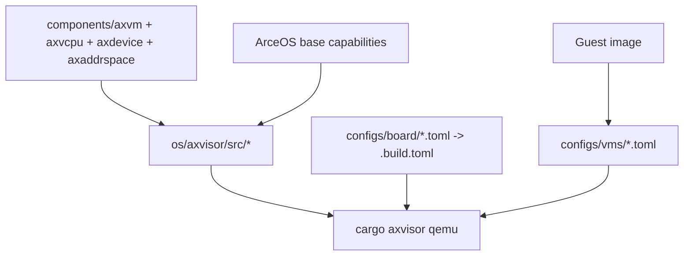

# Axvisor 开发指南

Axvisor 在 TGOSKits 里是一条和 ArceOS / StarryOS 并列的系统路径，但它的开发体验和前两者最大的不同是：除了代码，还必须把板级配置、VM 配置和 Guest 镜像一起看。

## 1. Axvisor 在仓库里的位置

| 路径 | 角色 | 什么时候会改到 |
| --- | --- | --- |
| `os/axvisor/src/` | Hypervisor 运行时 | VM 生命周期、调度、设备管理、异常处理 |
| `os/axvisor/configs/board/` | 板级配置 | 目标架构、target、feature、默认 VM 列表 |
| `os/axvisor/configs/vms/` | Guest VM 配置 | kernel 路径、入口地址、内存布局、设备直通 |
| `components/axvm`、`components/axvcpu`、`components/axdevice`、`components/axaddrspace` | 虚拟化核心组件 | VM、vCPU、虚拟设备、地址空间 |
| `components/axvisor_api` | Hypervisor 对外接口 | Guest / Hypervisor 交互接口 |
| `platform/x86-qemu-q35` | x86_64 QEMU Q35 平台实现 | x86_64 板级能力 |

此外，Axvisor 运行时依然大量复用了 ArceOS 能力。

## 2. 先记住命令入口

Axvisor 当前由根目录 `tg-xtask` 统一提供入口。也就是说：

- `cargo axvisor ...` 等价于 `cargo xtask axvisor ...`
- `os/axvisor/xtask` 在这个 workspace 里当前只是占位实现，不应继续当作主入口

当前真实子命令只有：

- `build`
- `qemu`
- `uboot`
- `defconfig`
- `config`
- `image`

推荐写法：

```bash
cargo axvisor defconfig qemu-aarch64
cargo axvisor build --config os/axvisor/.build.toml
cargo axvisor qemu --config os/axvisor/.build.toml --vmconfigs os/axvisor/tmp/vmconfigs/arceos-aarch64-qemu-smp1.generated.toml
```

## 3. 第一条成功路径：QEMU AArch64

第一次上手建议从 `qemu-aarch64` 开始。

### 3.1 推荐方式：使用官方 `setup_qemu.sh`

不要直接从 `defconfig/build/qemu` 开始。  
当前默认 QEMU 模板会引用 `tmp/rootfs.img`，而这个文件不会由 `defconfig` 或 `build` 自动生成。

推荐流程是：

```bash
cargo axvisor defconfig qemu-aarch64
(cd os/axvisor && ./scripts/setup_qemu.sh arceos)
```

这个脚本会自动完成：

1. 下载并解压 Guest 镜像到 `/tmp/.axvisor-images/qemu_aarch64_arceos`
2. 从 `configs/vms/arceos-aarch64-qemu-smp1.toml` 生成 `os/axvisor/tmp/vmconfigs/arceos-aarch64-qemu-smp1.generated.toml`
3. 自动修正 VM 配置中的 `kernel_path`
4. 复制 `rootfs.img` 到 `os/axvisor/tmp/rootfs.img`

### 3.2 正确的启动命令

```bash
cargo axvisor qemu \
  --config os/axvisor/.build.toml \
  --qemu-config .github/workflows/qemu-aarch64.toml \
  --vmconfigs os/axvisor/tmp/vmconfigs/arceos-aarch64-qemu-smp1.generated.toml
```

如果一切正常，ArceOS Guest 会输出 `Hello, world!`。

### 3.3 为什么直接 `cargo axvisor qemu` 会失败

原因通常有两个：

1. 默认板级配置里的 `vm_configs` 可能是空的
2. 默认 QEMU 配置模板会引用 `os/axvisor/tmp/rootfs.img`

所以仅执行：

```bash
cargo axvisor defconfig qemu-aarch64
cargo axvisor build --config os/axvisor/.build.toml
cargo axvisor qemu --config os/axvisor/.build.toml
```

通常还不够。你还需要准备：

- `.build.toml`
- 可用的 `vmconfigs`
- `os/axvisor/tmp/rootfs.img`

另外，`cargo axvisor build` 和 `cargo axvisor qemu` 支持重复的 `--vmconfigs`。这些路径会被转换成 `AXVISOR_VM_CONFIGS` 环境变量，供 Axvisor 的构建流程在编译期嵌入客户机配置。

## 4. 组件、运行时和配置是怎样连起来的



## 5. 常见开发动作

### 5.1 修改虚拟化核心组件

如果你改的是：

- `components/axvm`
- `components/axvcpu`
- `components/axdevice`
- `components/axaddrspace`

通常先做 build-only 验证：

```bash
cargo axvisor defconfig qemu-aarch64
cargo axvisor build --config os/axvisor/.build.toml
```

只有在 Guest 镜像和 VM 配置都已准备好的前提下，再跑：

```bash
cargo axvisor qemu --config os/axvisor/.build.toml
```

### 5.2 修改 Hypervisor 运行时

`os/axvisor/src/*` 更偏系统整合层。  
这类改动常常会同时依赖：

- 板级 feature 是否启用正确
- Guest 的 `kernel_path` 是否正确
- 设备直通或内存区域配置是否一致

### 5.3 新增板级支持

新增板级支持往往需要两部分一起落地：

- `os/axvisor/configs/board/<board>.toml`
- 对应的平台 crate，例如 `components/axplat_crates/platforms/*` 或 `platform/x86-qemu-q35`

当前仓库里现成的板级配置包括：

- `qemu-aarch64.toml`
- `qemu-x86_64.toml`
- `orangepi-5-plus.toml`
- `phytiumpi.toml`
- `roc-rk3568-pc.toml`

### 5.4 调整 VM 配置

如果你只是想切换 Guest 或修改 Guest 资源分配，最常见的入口就是 `configs/vms/*.toml`：

- `kernel_path`
- `entry_point`
- `cpu_num`
- `memory_regions`
- `passthrough_devices`
- `excluded_devices`

## 6. 最常用的验证入口

### build-only 验证

```bash
cargo axvisor defconfig qemu-aarch64
cargo axvisor build --config os/axvisor/.build.toml
```

### 运行 QEMU 验证

```bash
(cd os/axvisor && ./scripts/setup_qemu.sh arceos)
cargo axvisor qemu \
  --config os/axvisor/.build.toml \
  --qemu-config .github/workflows/qemu-aarch64.toml \
  --vmconfigs os/axvisor/tmp/vmconfigs/arceos-aarch64-qemu-smp1.generated.toml
```

### 根工作区测试入口

```bash
cargo axvisor test qemu --target aarch64
```

这条命令属于根工作区测试矩阵，不等价于手工启动 ArceOS guest 的本地路径。

### x86_64 路径

```bash
cargo axvisor defconfig qemu-x86_64
cargo axvisor build --config os/axvisor/.build.toml
```

## 7. 调试建议

### 先看配置，再看代码

Axvisor 启动失败时，最常见的问题不是 Rust 代码编译失败，而是下面四件事没对齐：

1. `.build.toml` 是不是当前想要的板级配置
2. `vm_configs` 是不是空的
3. `configs/vms/*.toml` 里的 `kernel_path` 是否真实存在
4. Guest 镜像的入口地址、加载地址、内存布局是否匹配

### 哪些命令适合排错

```bash
# 重新生成当前配置
cargo axvisor defconfig qemu-aarch64

# 查看可用板级配置
cargo axvisor config ls

# 只做构建，先排除编译问题
cargo axvisor build --config os/axvisor/.build.toml

# 使用官方脚本准备镜像和 rootfs
(cd os/axvisor && ./scripts/setup_qemu.sh arceos)

# 明确指定 VM 配置运行
cargo axvisor qemu \
  --config os/axvisor/.build.toml \
  --qemu-config .github/workflows/qemu-aarch64.toml \
  --vmconfigs os/axvisor/tmp/vmconfigs/arceos-aarch64-qemu-smp1.generated.toml
```

## 8. 继续往哪里读

- [axvisor-internals.md](/docs/design/architecture/axvisor-internals): 系统理解 Axvisor 的五层架构、VMM 启动链、vCPU 任务模型与 `axvisor_api`
- [components.md](/docs/design/reference/components): 从组件角度看 Axvisor 与 ArceOS / StarryOS 的共享依赖
- [build-system.md](/docs/design/reference/build-system): 理解 `cargo axvisor`、辅助脚本和统一测试入口的边界
- [quick-start.md](/docs/design/reference/quick-start): 如果你只是想先把第一条 QEMU 路径跑通
