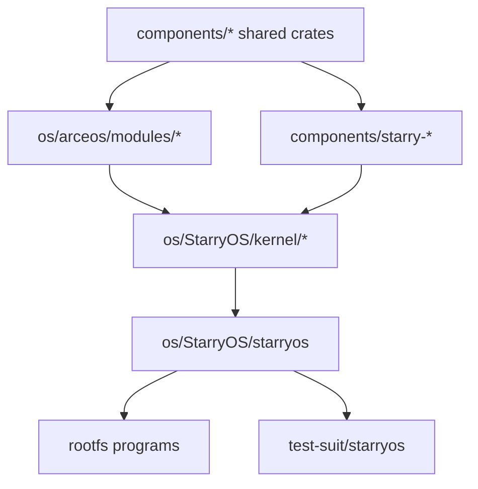

# StarryOS 开发指南

在 TGOSKits 里，StarryOS 不是一套完全孤立的内核，而是建立在 ArceOS 模块层之上的 Linux 兼容系统。

## 1. StarryOS 在仓库里的位置

| 路径 | 角色 | 什么时候会改到 |
| --- | --- | --- |
| `os/StarryOS/kernel/` | StarryOS 内核实现 | syscall、进程、内存、文件系统、驱动接入 |
| `os/StarryOS/starryos/` | 启动包与 feature 组合 | 改启动入口、包级 feature、平台筛选 |
| `components/starry-*` | Starry 专用复用组件 | `starry-process`、`starry-signal`、`starry-vm` 等 |
| `components/axpoll`、`components/rsext4` 等 | Starry 常用共享组件 | I/O 多路复用、文件系统等 |
| `os/arceos/modules/*` | StarryOS 复用的底层能力 | HAL、任务、驱动、网络、内存 |
| `test-suit/starryos/` | 系统测试数据目录 | 维护 `normal` / `stress` 两组 StarryOS 回归测例与运行判据 |

## 2. 最短运行路径

### 仓库根目录的推荐入口

```bash
cargo xtask starry rootfs --arch riscv64
cargo starry qemu --arch riscv64
```

根目录入口的特点：

- `rootfs` 会把镜像准备到 Starry 的目标产物目录
- `qemu` 在发现磁盘镜像缺失时也会自动补准备
- 默认包固定就是 `starryos`
- CLI 不需要也不接受 `--package`
- 默认架构是 `aarch64`

如果你已经熟悉流程，也可以尝试：

```bash
cargo starry qemu --arch loongarch64
```

### `os/StarryOS/` 里的本地入口

```bash
cd os/StarryOS
make rootfs ARCH=riscv64
make ARCH=riscv64 run
```

常用快捷命令：

```bash
make rv
make la
```

本地 Makefile 路径的特点是：

- rootfs 固定复制到 `os/StarryOS/make/disk.img`
- 更适合调试 StarryOS 自己的 `make/` 行为

## 3. StarryOS 如何复用 ArceOS 和组件



## 4. 常见开发动作

### 4.1 修改共享基础能力

如果你改的是：

- `components/axerrno`、`components/kspin` 这类基础 crate
- 或 `os/arceos/modules/axhal`、`ax-task`、`ax-driver`、`ax-net`

建议先确认 ArceOS 最小路径仍然工作，再回到 StarryOS：

```bash
cargo arceos qemu --package ax-helloworld --target riscv64gc-unknown-none-elf
cargo starry qemu --arch riscv64
```

### 4.2 修改 Starry 专用组件或内核逻辑

如果你改的是：

- `components/starry-process`
- `components/starry-signal`
- `components/starry-vm`
- `os/StarryOS/kernel/*`

那就直接从 StarryOS 路径开始验证：

```bash
cargo xtask starry rootfs --arch riscv64
cargo starry qemu --arch riscv64
```

### 4.3 增加 syscall 或用户可见行为

常见闭环是：

1. 先在内核里完成实现
2. 准备一个最小用户态程序去触发它
3. 把程序放入 rootfs
4. 启动 StarryOS 验证行为

### 4.4 修改启动包和 feature 组合

`os/StarryOS/starryos/Cargo.toml` 里定义了包级 feature，例如 `qemu`、`smp`、`vf2`。  
如果你的改动更像“启动形态”而不是“内核算法”，先看这里而不是直接进 kernel。

## 5. 最常用的验证入口

### 日常运行

```bash
cargo xtask starry rootfs --arch riscv64
cargo starry qemu --arch riscv64
```

### 系统测试

```bash
cargo starry test qemu --target riscv64
cargo starry test qemu --stress -t riscv64
cargo starry test qemu --stress -t riscv64 -c stress-ng-0
cargo starry test board -t smoke-orangepi-5-plus --server <ip> --port <port>
```

这里直接构建并运行的是 `starryos` 包本体；`test-suit/starryos/normal/<case>/` 和 `test-suit/starryos/stress/<case>/` 负责提供 Starry 测试配置。

- QEMU 测试使用 `qemu-<arch>.toml`
- 远程板测使用 `board-<name>.toml`
- `board-<name>.toml` 只保存板测运行判据，实际构建配置仍映射到 `os/StarryOS/configs/board/<name>.toml`

默认 `test qemu` 只跑 `normal` 组，传 `--stress` 后只跑 `stress` 组，`-c/--test-case` 只在当前组内按目录名精确筛选单个 case。批量模式会扫描当前组下所有一级子目录，只执行存在 `qemu-<arch>.toml` 的 case；没有当前架构 QEMU 配置的目录会被直接跳过。`test board` 当前只发现 `normal` 组里的 `board-*.toml`，并把 group 名生成为 `<case>-<board>`，例如 `smoke-orangepi-5-plus`。

Starry QEMU case 还支持可选的 `c/` 子目录约定：

- `test-suit/starryos/<group>/<case>/c/CMakeLists.txt`：必需，作为该 case 的 CMake 项目入口
- `test-suit/starryos/<group>/<case>/c/prebuild.sh`：可选，若存在则会在 CMake 配置前通过 guest `/bin/sh` 执行
- `prebuild.sh` 只负责准备 staging rootfs 内的构建环境，不会自动把副作用同步回最终 rootfs
- 需要进入 guest rootfs 的文件，必须通过 `install()` 输出，并由 `axbuild` 通过 `cmake --install` 生成 overlay 后回写到 case rootfs

QEMU 测试会先自动准备共享 rootfs，再为每个 case 复制出独立的 per-case rootfs；如果 case 下存在 `c/`，还会按顺序执行 `prebuild.sh`、`cmake --build`、`cmake --install`，然后把 overlay 写回该 case 的 rootfs，最后再把对应 case 的 `qemu-<arch>.toml` 交给 `ostool` 处理。每轮批量执行结束后都会统一打印成功列表、失败列表以及每个 case 的运行时间。板测则直接把对应 `board-<name>.toml` 作为 `ostool` 的 board run config。

### 本地 Makefile 路径

```bash
cd os/StarryOS
make rootfs ARCH=riscv64
make ARCH=riscv64 run
make ARCH=riscv64 debug
```

## 6. rootfs 相关的几个关键事实

### 根目录 xtask 路径和本地 Makefile 路径不共享默认镜像位置

- 根目录 `cargo xtask starry rootfs` / `cargo starry qemu` 使用目标产物目录下的 `rootfs-<arch>.img`
- `os/StarryOS/Makefile` 使用 `os/StarryOS/make/disk.img`

这意味着：

- 你在根目录下载过 rootfs，不代表 `make rootfs` 一定会省略复制
- 你在本地 Makefile 路径准备过 rootfs，也不代表根目录 xtask 一定会直接复用

### 如何查看 rootfs 内容

如果你使用的是本地 Makefile 路径：

```bash
mkdir -p /mnt/rootfs
sudo mount -o loop os/StarryOS/make/disk.img /mnt/rootfs
ls /mnt/rootfs
sudo umount /mnt/rootfs
```

如果你使用的是根目录 xtask 路径，请先确认实际生成的 `rootfs-<arch>.img` 位于哪个 target 目录，再按同样方式挂载。

## 7. 调试建议

### 看更详细的日志

```bash
cd os/StarryOS
make ARCH=riscv64 LOG=debug run
```

### 使用 GDB

```bash
cd os/StarryOS
make ARCH=riscv64 debug
```

### 常见排查顺序

如果 StarryOS 没有按预期启动，优先检查：

1. rootfs 是否存在
2. 当前使用的是根目录 xtask 路径还是本地 Makefile 路径
3. 最近的改动到底在共享组件、ArceOS 模块还是 StarryOS 内核

## 8. 继续往哪里读

- [starryos-internals.md](/docs/design/architecture/starryos-internals): 系统理解 StarryOS 的叠层架构、syscall 分发、进程与地址空间机制
- [components.md](/docs/design/reference/components): 从组件视角理解共享依赖如何落到 StarryOS
- [build-system.md](/docs/design/reference/build-system): 理解 rootfs 位置、xtask 和 Makefile 的边界
- [arceos-guide.md](/docs/design/systems/arceos-guide): 当你的改动落在 ArceOS 共享模块层时
