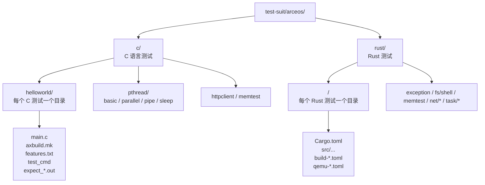

# ArceOS 测试套件设计

ArceOS 测试在 OS 级别按语言分为 `c/` 和 `rust/` 两个目录。每个测试用例占一个子目录，C 测试包含 `.c` 源文件及可选的构建辅助文件，Rust 测试则是标准的 Cargo 项目。两类测试均通过**硬编码列表**注册在 xtask 中，由 xtask 分别调度构建与 QEMU 运行。

## 1. 入口

当前 ArceOS 测试的权威实现入口主要在：

- `scripts/axbuild/src/arceos/mod.rs`
- `scripts/axbuild/src/test_qemu.rs`

其中：

- `mod.rs` 负责 Rust / C 测试分流、C 测试目录发现、运行顺序和失败汇总
- `test_qemu.rs` 负责 ArceOS Rust QEMU 测试支持的目标架构与包白名单



## 2. 接口

```text
cargo xtask arceos test qemu --target <arch> [--package <pkg>] [--only-rust] [--only-c]
```

| 参数 | 说明 |
|------|------|
| `--target` | 目标架构或完整 target triple（如 `x86_64` 或 `x86_64-unknown-none`） |
| `--package` / `-p` | 仅运行指定的 Rust 测试包（可多次使用） |
| `--only-rust` | 仅运行 Rust 测试 |
| `--only-c` | 仅运行 C 测试 |

默认行为（不带筛选参数）时，先运行所有 Rust 测试，再运行所有 C 测试。

## 3. C 用例

C 测试通过硬编码目录列表 (`C_TEST_NAMES`) 发现，每个目录必须包含至少一个 `.c` 源文件。

### 3.1 用例清单

| 目录名 | 说明 |
|--------|------|
| `helloworld` | 基础 Hello World |
| `memtest` | 内存分配/释放测试 |
| `httpclient` | HTTP 客户端（需 `alloc`、`paging`、`net` feature） |
| `pthread/basic` | 线程创建、join、mutex 基础测试 |
| `pthread/parallel` | 多线程并行测试 |
| `pthread/pipe` | 管道通信测试 |
| `pthread/sleep` | 线程睡眠测试 |

### 3.2 文件结构

| 文件 | 必需 | 说明 |
|------|------|------|
| `*.c` | 是 | C 源码，目录内必须存在至少一个 |
| `axbuild.mk` | 否 | 指定 `app-objs`，缺省默认取目录内所有 `.c` 编译 |
| `features.txt` | 否 | 每行一个 feature flag（如 `alloc`、`paging`、`net`），构建时传入 |
| `test_cmd` | 否 | 定义 `test_one "MAKE_VARS" "EXPECT_OUTPUT"` 调用序列，控制多组测试变体 |
| `expect_*.out` | 否 | 预期输出文件，用于与实际 QEMU 输出做文本对比 |

### 3.3 `test_cmd`

`test_cmd` 文件中每行定义一次测试调用：

```bash
test_one "MAKE_VARS" "expect_output_file"
```

- `MAKE_VARS`：传递给 `make` 的变量赋值（如 `LOG=info`、`SMP=4 LOG=info`）
- `expect_output_file`：可选，预期输出文件名（相对于当前测试目录）

**示例** — `helloworld/test_cmd`：

```bash
test_one "LOG=info" "expect_info.out"
test_one "SMP=4 LOG=info" "expect_info_smp4.out"
rm -f $APP/*.o
```

该文件定义了两组测试：单核 `LOG=info` 和四核 `SMP=4 LOG=info`，每组分别对比对应的预期输出。

### 3.4 执行流程

1. 解析 `features.txt` → 提取 feature flags
2. 解析 `test_cmd` → 提取 `test_one` 调用序列
3. 对每组调用：
   - 运行 `make defconfig` 并传入 features
   - 运行 `make build` 构建镜像
   - 运行 `make justrun` 在 QEMU 中启动并捕获输出
   - 若指定了 `expect_output_file`，将实际输出与预期输出对比

### 3.5 实现补充

当前 ArceOS C 测试并不是“扫描所有目录自动纳入”，而是：

1. 先由 `C_TEST_NAMES` 提供**允许的目录白名单**
2. 再检查这些目录是否实际存在且包含 `.c` 文件
3. 最终只运行“在白名单内且目录有效”的测试

文档中的 C 测试清单需要与 `scripts/axbuild/src/arceos/mod.rs` 中的 `C_TEST_NAMES` 保持同步。

## 4. Rust 用例

Rust 测试通过硬编码包列表 (`ARCEOS_TEST_PACKAGES`) 发现，每个包是一个标准 Cargo 项目。

### 4.1 用例清单

以下清单直接对应 `scripts/axbuild/src/test_qemu.rs` 中的 `ARCEOS_TEST_PACKAGES`：

| 包名 | 分类 | 说明 |
|------|------|------|
| `arceos-memtest` | 内存 | 内存分配测试 |
| `arceos-exception` | 异常 | 异常处理测试 |
| `arceos-affinity` | 任务 | CPU 亲和性测试 |
| `arceos-ipi` | 任务 | 核间中断（IPI）测试 |
| `arceos-irq` | 任务 | 中断状态测试 |
| `arceos-parallel` | 任务 | 并行任务测试 |
| `arceos-priority` | 任务 | 任务优先级调度测试 |
| `arceos-sleep` | 任务 | 任务睡眠测试 |
| `arceos-tls` | 任务 | 线程本地存储测试 |
| `arceos-wait-queue` | 任务 | 等待队列测试 |
| `arceos-yield` | 任务 | 任务让出测试 |
| `arceos-fs-shell` | 文件系统 | 交互式 FS Shell 测试 |
| `arceos-net-echoserver` | 网络 | TCP Echo 服务器测试 |
| `arceos-net-httpclient` | 网络 | HTTP 客户端测试 |
| `arceos-net-httpserver` | 网络 | HTTP 服务器测试 |
| `arceos-net-udpserver` | 网络 | UDP 服务器测试 |

### 4.2 文件结构

| 文件 | 必需 | 说明 |
|------|------|------|
| `Cargo.toml` | 是 | 包定义，通常依赖 `ax-std`（optional feature） |
| `src/main.rs` | 是 | 入口源码 |
| `build-{target}.toml` | 视情况 | 构建配置（features、log 级别、环境变量、CPU 数量） |
| `.axconfig.toml` | 否 | Axconfig 运行时配置（部分用例使用） |
| `qemu-{arch}.toml` | 视情况 | QEMU 运行配置 |

### 4.3 执行流程

1. 从 `ARCEOS_TEST_PACKAGES` 中按 `--package` 参数过滤
2. 定位包目录：`test-suit/arceos/rust/<package-name>/`
3. 加载构建配置 `build-{target}.toml`
4. 执行 `cargo build --release --target <target> --features <features>`
5. 加载 QEMU 配置 `qemu-{arch}.toml`
6. 启动 QEMU 运行镜像，通过正则判定成功/失败

### 4.4 分流

`cargo xtask arceos test qemu ...` 在实现上有一条固定的分流规则：

- 默认：先跑 Rust 测试，再跑 C 测试
- `--only-rust`：只跑 Rust
- `--only-c`：只跑 C
- 指定 `--package`：只跑 Rust 包过滤结果，不再进入 C 测试流

这一行为定义在 `scripts/axbuild/src/arceos/mod.rs` 的 `planned_qemu_test_flows(...)` 中，是当前 ArceOS 测试入口的关键语义之一。

## 5. 构建配置 (`build-{target}.toml`)

定义 ArceOS Rust 测试的构建参数。文件名中的 `target` 需与编译目标匹配。

**示例** — `task/affinity/build-x86_64-unknown-none.toml`：

```toml
features = ["ax-std"]
log = "Warn"
max_cpu_num = 4

[env]
AX_GW = "10.0.2.2"
AX_IP = "10.0.2.15"
```

**示例** — `net/httpclient/build-x86_64-unknown-none.toml`：

```toml
features = ["ax-std", "net"]
log = "Warn"
max_cpu_num = 4

[env]
AX_GW = "10.0.2.2"
AX_IP = "10.0.2.15"
```

**字段说明：**

| 字段 | 类型 | 必需 | 说明 |
|------|------|------|------|
| `features` | `[String]` | 否 | 启用的 Cargo features，通常包含 `"ax-std"` |
| `log` | `String` | 否 | 日志级别（如 `"Warn"`、`"Info"`） |
| `max_cpu_num` | `u32` | 否 | 最大 CPU 数量 |
| `[env]` | Table | 否 | 构建时环境变量，如 `AX_GW`、`AX_IP` |

## 6. QEMU 运行配置 (`qemu-{arch}.toml`)

与 StarryOS 格式相同。部分测试通过源码中的 `println!("All tests passed!")` 输出判定，无需 shell 交互。

**示例** — `task/affinity/qemu-x86_64.toml`（无 shell 交互）：

```toml
args = [
    "-machine", "q35",
    "-cpu", "max",
    "-m", "128M",
    "-smp", "4",
    "-nographic",
    "-serial", "mon:stdio",
]
uefi = false
to_bin = false
success_regex = ["All tests passed!"]
fail_regex = ['(?i)\bpanic(?:ked)?\b']
```

**示例** — `fs/shell/qemu-x86_64.toml`（有 shell 交互）：

```toml
args = [
    "-machine", "q35",
    "-cpu", "max",
    "-m", "128M",
    "-smp", "4",
    "-nographic",
    "-device", "virtio-blk-pci,drive=disk0",
    "-drive", "id=disk0,if=none,format=raw,file=${workspace}/test-suit/arceos/rust/fs/shell/disk.img",
    "-serial", "mon:stdio",
]
uefi = false
to_bin = false
shell_prefix = "arceos:"
shell_init_cmd = "pwd && echo 'FS shell tests passed!'"
success_regex = ["FS shell tests passed!"]
fail_regex = ["(?i)\\bpanic(?:ked)?\\b"]
timeout = 3
```

**示例** — `net/httpclient/qemu-x86_64.toml`（需要网络设备）：

```toml
args = [
    "-machine", "q35",
    "-cpu", "max",
    "-m", "128M",
    "-smp", "4",
    "-nographic",
    "-device", "virtio-net-pci,netdev=net0",
    "-netdev", "user,id=net0",
    "-serial", "mon:stdio",
]
uefi = false
to_bin = false
success_regex = ["HTTP client tests run OK!"]
fail_regex = ["(?i)\\bpanic(?:ked)?\\b"]
```

## 7. 限制

- ArceOS Rust 测试目前不是扫描 `test-suit/arceos/rust/` 下所有 Cargo 包自动纳入，而是严格受 `ARCEOS_TEST_PACKAGES` 白名单控制。
- ArceOS C 测试同样不是“目录即测试”，而是严格受 `C_TEST_NAMES` 白名单控制。
- `test uboot` 在 ArceOS 当前仍是预留入口，实际会返回“不支持”的错误。
- 文档中的运行配置与构建配置示例描述的是当前主流实现，但底层运行仍依赖 `ostool` 的 QEMU 配置解析行为。

## 8. 新增用例

### 8.1 新增 Rust 测试

1. 在 `test-suit/arceos/rust/` 下创建包目录，包含 `Cargo.toml` 和 `src/main.rs`
2. `Cargo.toml` 中将 `ax-std` 设为 optional 依赖，并声明所需的 features
3. 为每个支持的架构创建 `qemu-{arch}.toml`
4. 如需自定义构建参数，创建 `build-{target}.toml`
5. 在 `scripts/axbuild/src/test_qemu.rs` 的 `ARCEOS_TEST_PACKAGES` 中注册包名

### 8.2 新增 C 测试

1. 在 `test-suit/arceos/c/` 下创建目录，包含 `.c` 源文件
2. 可选添加 `features.txt`（每行一个 feature）
3. 可选添加 `test_cmd`（定义测试变体）
4. 可选添加 `axbuild.mk`（指定编译对象）
5. 在 `scripts/axbuild/src/arceos/mod.rs` 的 `C_TEST_NAMES` 中注册目录名
